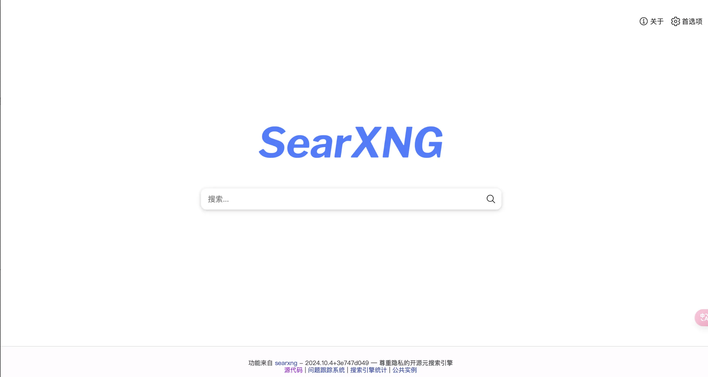
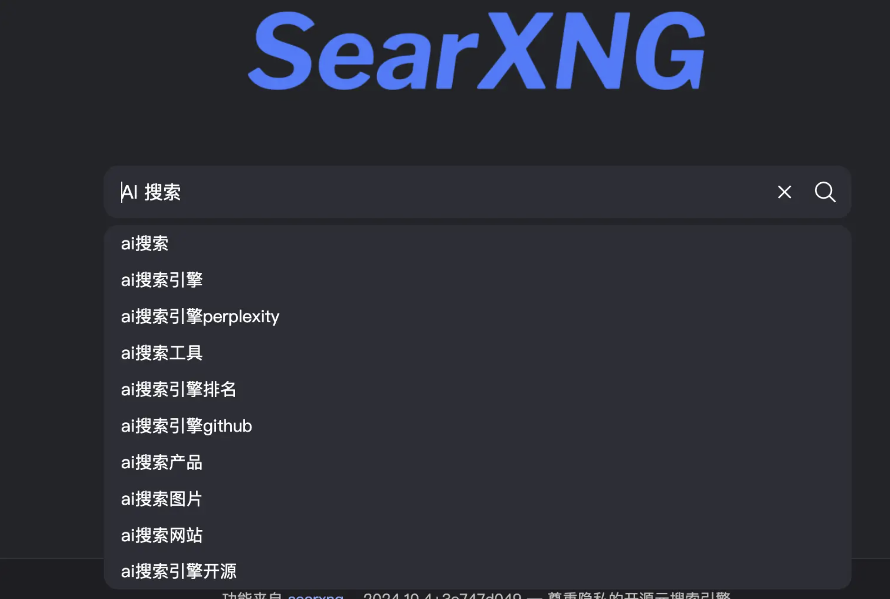
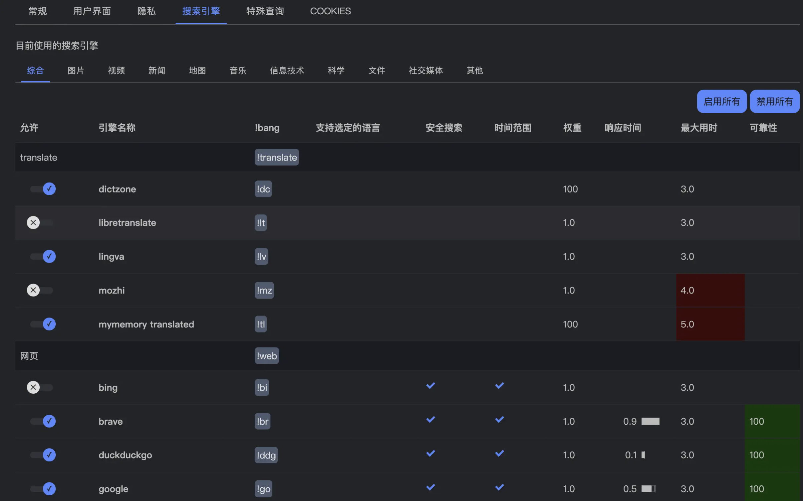
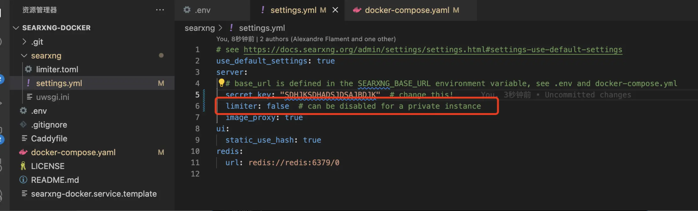
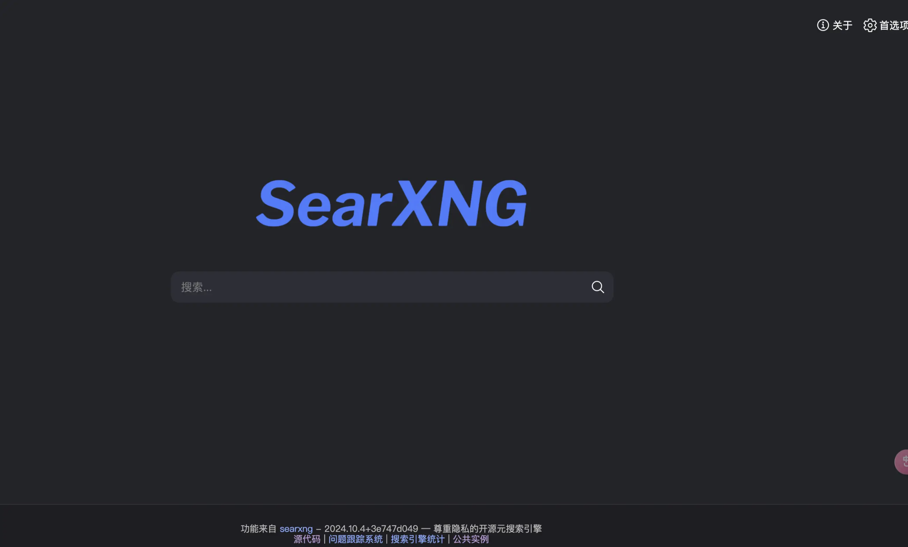
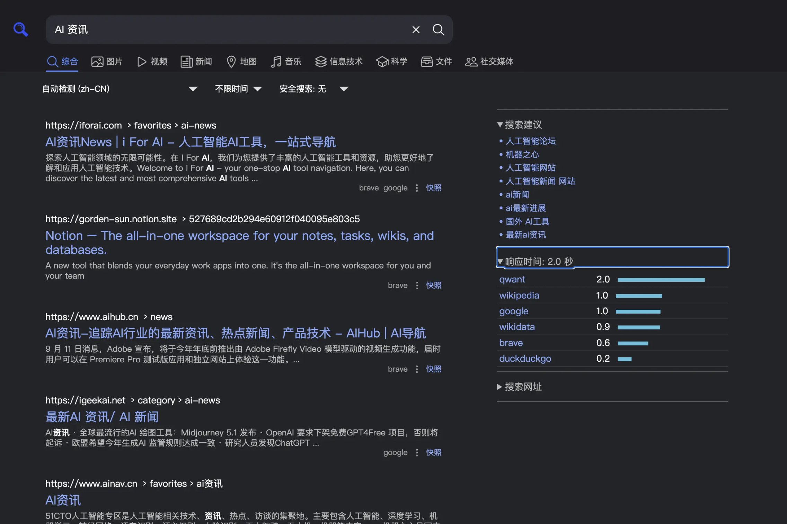
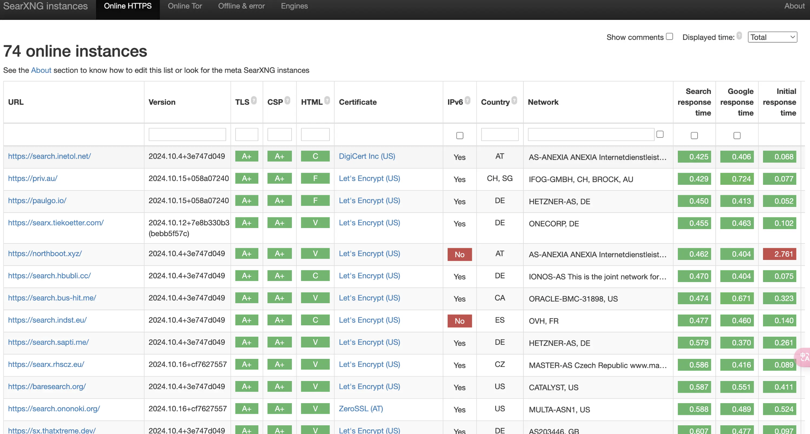

小伙伴们大家好，我是三金～

本来想直接写本地 AI 搜索应用的，不过想了想还是决定先介绍一下这款超棒的开源本地搜索应用——SearXNG。

#### 介绍

那 SearXNG 是什么呢？

> SearXNG 是一个免费的互联网元搜索引擎，汇集了 70 多种搜索服务的结果。不会跟踪用户访问记录，更不会分析用户。

对于国内用户而言，大多数情况下只能选择百度搜索。但众所周知的是，百度搜索的前几条结果都是广告赞助，用户一不小心就误入广告中去，无法准确获取想要得到的信息。

而想要使用谷歌，又苦于网络原因无法访问。SearXNG 可以完美解决这个问题，只需要使用 Docker 将其部署在一台非国内的云服务器上即可享用 70 多种搜索服务，其中就包括了谷歌、Bing 等知名搜索引擎。

> 部署在国内也 OK，但是可以用的搜索引擎会减少那么几个，当然也无法使用谷歌。

SearXNG 支持以下特性：

*   自适应 PC、平板和手机的尺寸
    
*   可以设置搜索时的自动补全功能（也就是输入时会提示一些可能会搜索的问题）
    

*   设置主题样式
    
*   设置想要使用的搜索引擎
    

> [Github 地址](https://github.com/searxng/searxng) [文档地址](https://docs.searxng.org/)

接下来我们一起来部署一下～

#### 部署

我们还是使用 Docker 的方式进行部署，方便快捷～

*   首先进入到 usr 目录下的 local 目录中（当然，你也可以将其部署在其他目录，这里只是举例）
    
*   然后克隆项目到该目录下，克隆好项目之后进入到项目目录中。
    
*   到这里我们需要将 `searxng` 目录下的 `settings.yml` 里的 `limiter` 配置项改为 false，否则可能触发 `too many requests` 的问题；
    

*   第一次运行时，必须从 `docker-compose.yaml` 文件中删除 `cap_drop: - ALL` 才能使 `searxng` 服务成功创建 `/etc/searxng/uwsgi.ini`。这是必要的，因为 `cap_drop: - ALL` 指令会删除所有功能，包括创建 `uwsgi.ini` 文件所需的功能。首次运行后，出于安全考虑，应将 `cap_drop: - ALL` 重新添加到 `docker-compose.yaml` 文件中。
    

*   除此之外，还需要将 `docker-compose` 文件中的 `127.0.0.1:8080:8080` 改为 `8080:8080`
    

做好上述步骤之后，我们就可以执行 `docker compose up -d` 命令启动服务了。

访问 `IP 地址:8080` 即可：

### 使用

测试一下搜索功能，以「AI 资讯」为例：

搜索速度还挺快的，而且也没有广告，由多个搜素引擎一起抓取得到，很实用！

这里再推荐一下他们官方提供的 demo，里面都是一些已经部署好的 SearXNG，可以直接使用：[官方 demo](https://searx.space/)

感兴趣的小伙伴快去试试吧～