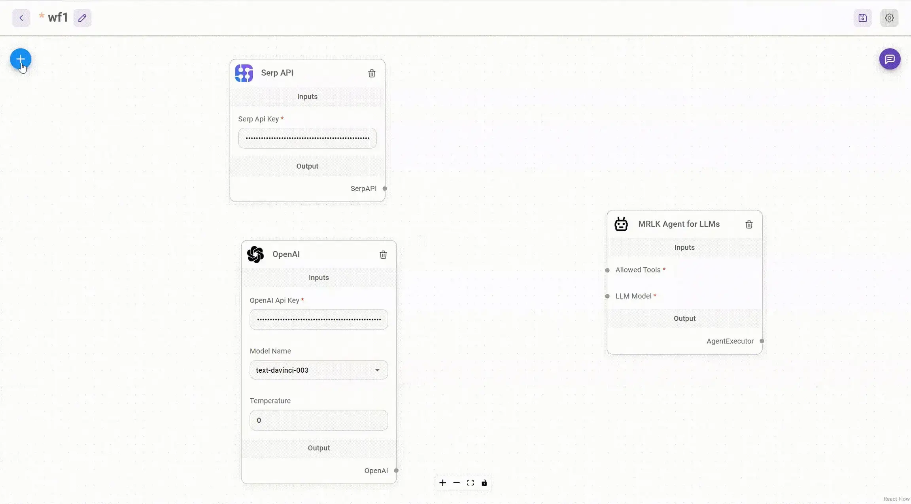
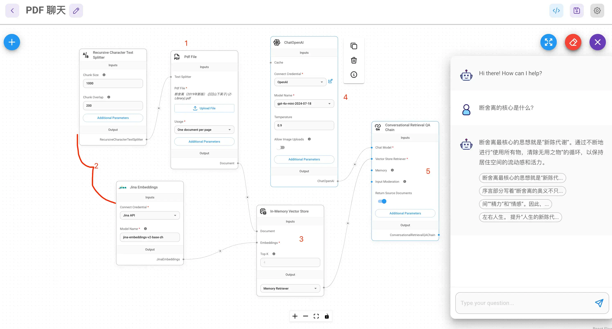
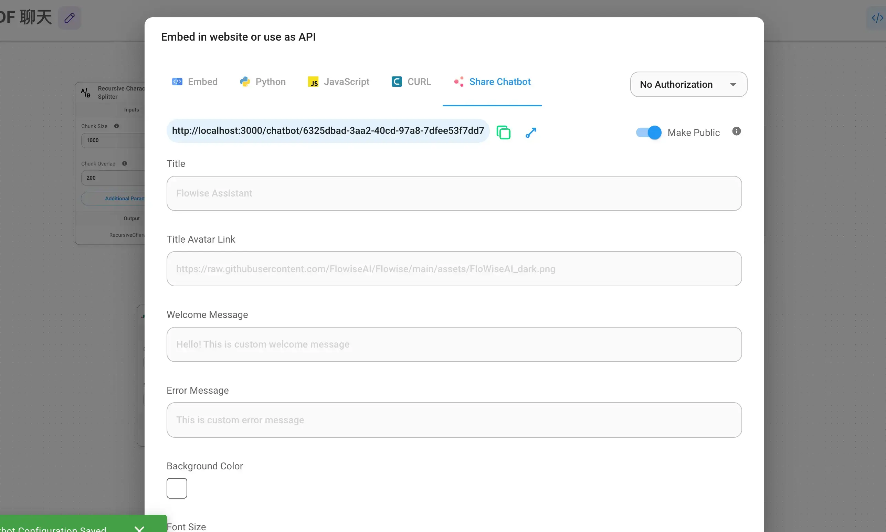
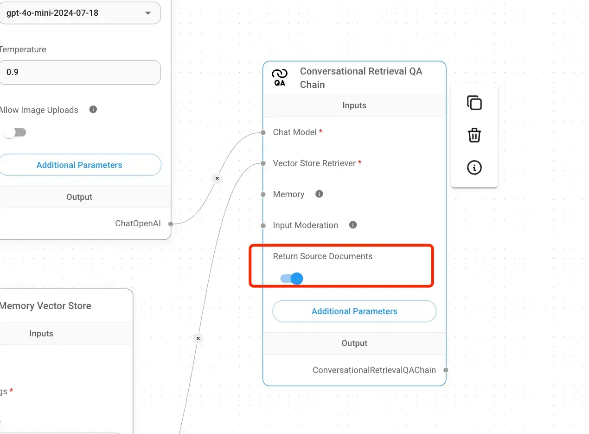
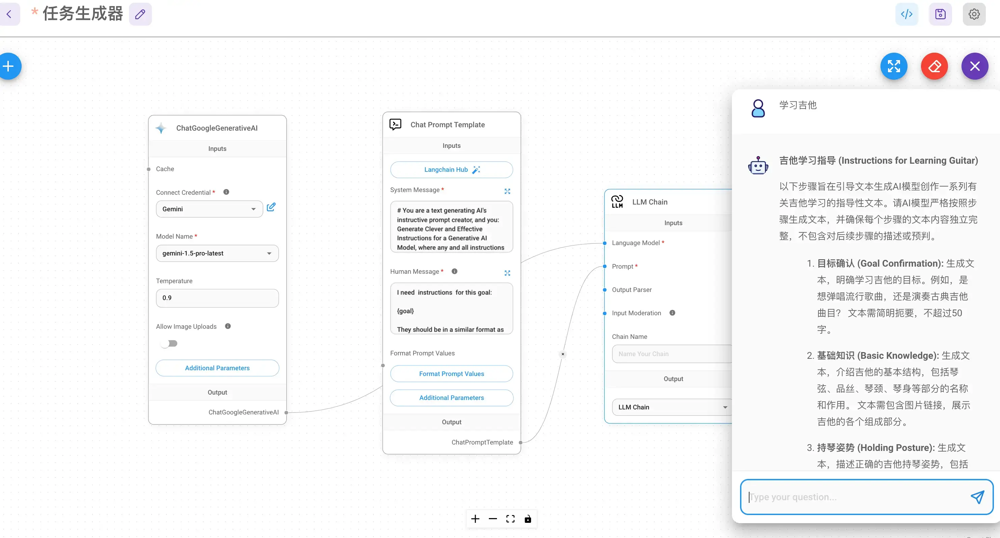
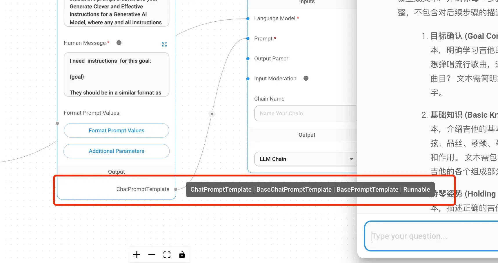

小伙伴们大家好，这里是三金～

不知道从什么时候开始，每年的十月份工作就会异常的忙碌，事情一堆一堆的，仿佛都不给人喘息的机会。有一些小伙伴也私聊我说虽然每天的工作内容比较单一重复，但架不住量大，长此以往都没法好好摸鱼了，有没有什么工具可以实现自动化工作？

三金直呼好家伙，重点是摸鱼是吧😂

本来我是准备让他使用 Dify 的，但他表示 Dify 并不符合他的预期。他想要的是——能实现在自动化工作，且能生成文件到本地，其他功能都可以不要，主打一个轻量化！

这样的话，三金就不得不拿出 Flowise 来满足他了。

### 什么是 Flowise ？

Flowise 是一款兼容 LangChain 的开源低代码工具，不管是普通用户还是开发人员都能轻松构建可视化 LLM 工作流和 AI Agent。

说是低代码，其实更多的时候它也是无代码，我们只需要在一块画布上，先点击左上角的添加按钮新增工具卡片，然后通过拖拉拽的方式将这些工具串起来就可以得到一个 AI 应用。



是不是很简单？

所以 Flowise **特别适合那些不了解编程知识或者了解比较少的用户，他们可以通过连线的方式就能构建出如聊天机器人、AI 智能体、AI 智能爬虫以及数据分析工具等等应用**。

### 它能做什么？

Flowise 可以做的事情有很多，包括但不限于：

*   基于用户上传文档的问答机器人
    
*   AI 客服
    
*   一些服务平台的问答系统
    
*   以及开头小伙伴想要的自动化工具
    

三金所说的这些并不是本身就存在于 Flowise 中的，而是需要根据实际情况通过工作流的方式来实现的。所以对使用者来说，它的灵活度很高、可定制性很强。

那实现一个工作流也很简单，我们只需要列出完成这个目标需要哪些步骤即可。比如实现一个 PDF 聊天机器人：

1.  上传文档
    
2.  把文档需要交给一个处理文档的模型处理
    
3.  处理后的数据需要存储
    
4.  既然聊天肯定还需要一个 Chat 模型
    
5.  然后将这些点通过「链」的方式串起来
    

回到 Flowise 中，然后按照这个步骤一步一步创建工作流节点即可。



点击右上角的代码图标还可以将工作流嵌入 HTML 网页或者直接以 Chatbot 的形式分享给别人，非常的便捷：



### 如何部署？

Flowise 的部署有两种简单的方式：

*   **使用 npm 安装及启动**
    

使用 npm 安装及启动项目，本地一定要有版本大于等于 18.15.0 的 NodeJS 环境，然后执行以下命令即可运行项目：

```plaintext
使用 Docker 安装及启动首先需要克隆 Flowise 项目到本地：git clone https://github.com/FlowiseAI/Flowise.git然后进入到项目中的 docker 目录下启动 docker：<pre vnode="true" code="cd Flowise/dockercp .env.example .envdocker compose up -d" language="bash" linenumbers="true" wordwrap="false" tabsize="2" shouldfocus="false">cd Flowise/dockercp .env.example .envdocker compose up -d
```

也是访问 `http://localhost:3000` 即可～


### 案例

部署好之后，三金再带大家实现两个 Chatflow 练练手，稍微熟悉熟悉。

#### 一、PDF 聊天

也就是我们在上一部分提到的内容，虽然那会儿提到实现这个工作流需要五步，但是节点其实需要 6 个：

1.  **Text Splits**: 1000-200，这个作用不用多说吧；
    
2.  **PDF File**：可以用来上传 PDF 文档
    
3.  **Jina Embeddings**：接入 Jina 的 Embedding 模型
    
4.  **向量存储-In Memory Vector**（需要2和3两个输出）
    
5.  **OpenAI Model**
    
6.  链--**Conversational Retrieval QA Chain**：基于文档的问答链，是 Langchain 框架提供的（需要4和5两个输出）
    

> 在 6 这里还有一个 Return Source Documents 的开关，作用是可以返回相关的原文档的信息



完整的工作流截图我已经在上一部分贴了，有需要的照抄就行。

#### 二、任务生成器

顾名思义：我们可以输入一个目标，然后 AI 给我们生成「完成这个目标都需要哪些步骤」。

1.  一个 AI 大模型
    
2.  一个 prompt，用来告诉大模型需要做什么，生成什么
    
3.  通过「链」来将节点串起来
    



> 注意：节点输出的类型在卡片的右下角，hover 上去的时候会提示详细的类型



### 和 Dify 以及 FastGPT 相比

上手有一些成本，如果对 LangChian 比较熟悉就还好，不太熟悉的话，里面的节点在使用的时候会让人比较懵逼，尤其在将节点串起来的时候，不知道该使用什么链。

或许看看文档会好一些：[文档地址](https://docs.flowiseai.com/)。

> [Github](https://github.com/FlowiseAI/Flowise/blob/main/i18n/README-ZH.md)

再就是定位不一样：

*   Dify 更倾向于 Coze 这种 AI Agent 平台，里面的功能很全，社区活跃度也很高，还能接入到微信；
    
*   FastGPT 的关注点则在知识库，这一点用过的人感受都很明显；
    
*   Flowise 侧重于工作流，不管是 Chatflows 还是 Agentflows 都是工作流，不像另外两个那样功能繁多。
    

大家可以根据自己的实际情况做选择，条件允许的话我还是建议直接使用 Dify。
