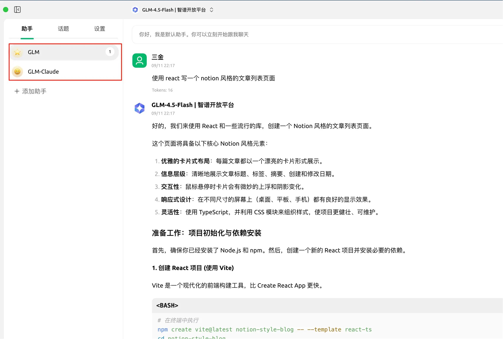
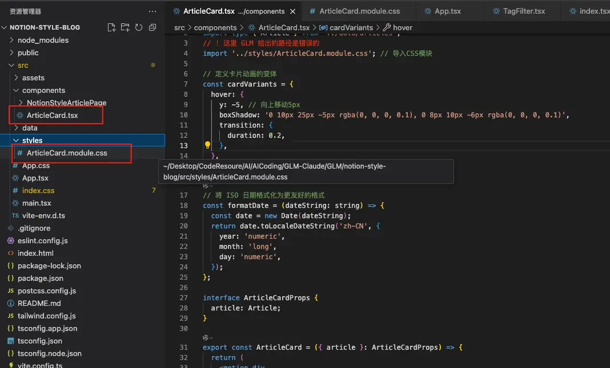
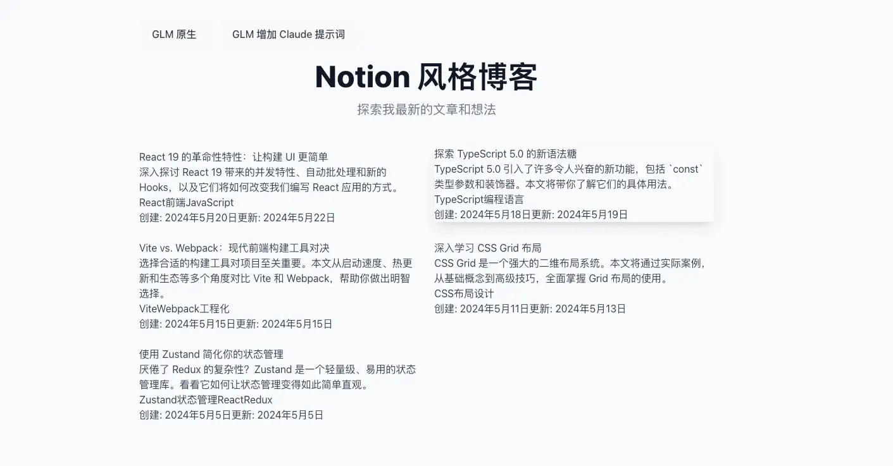
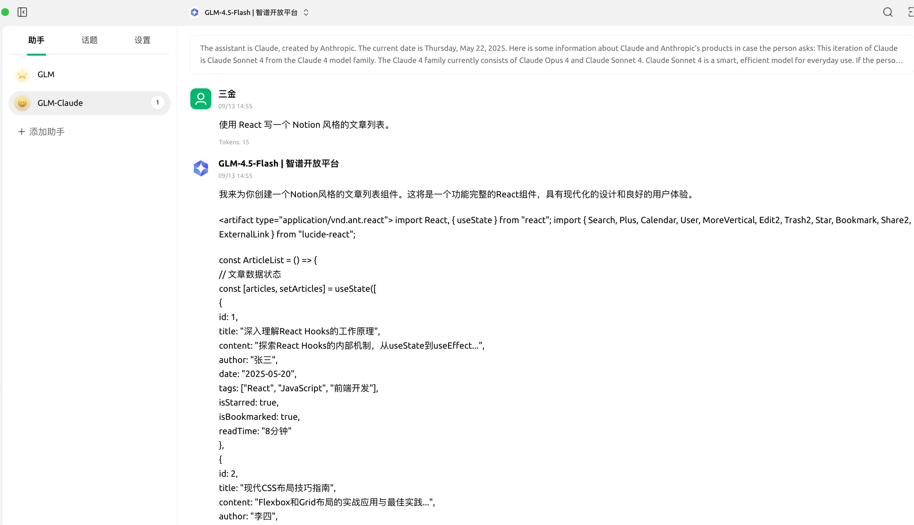
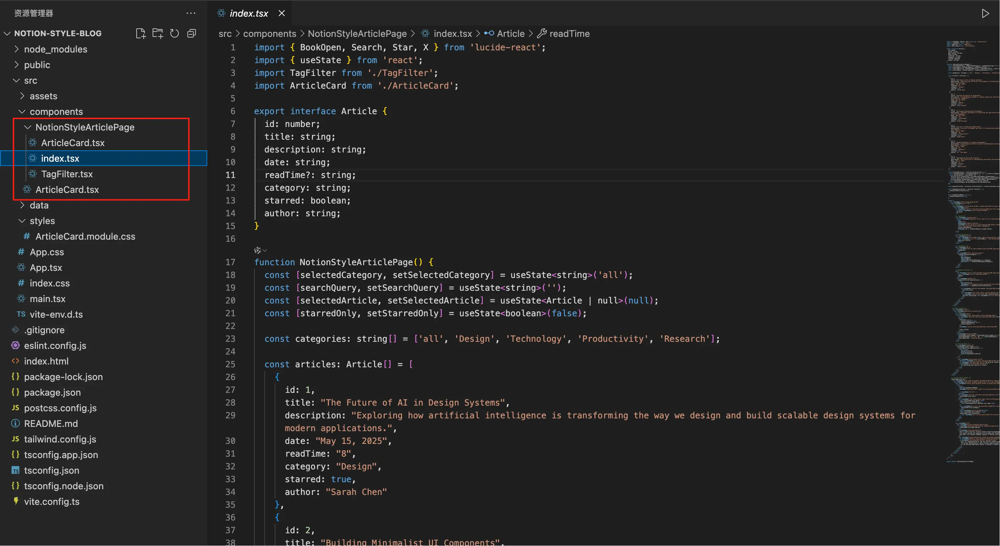
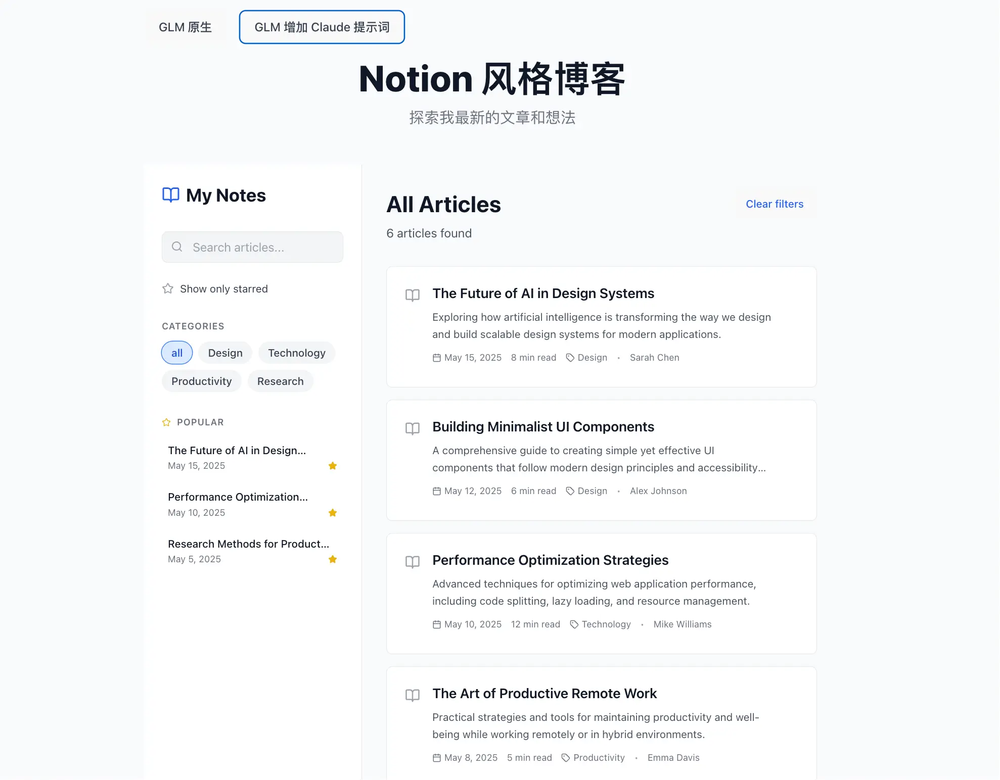
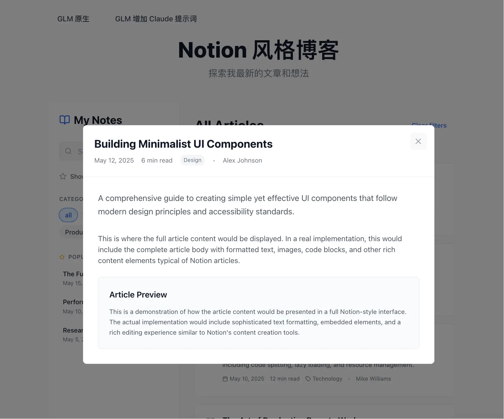
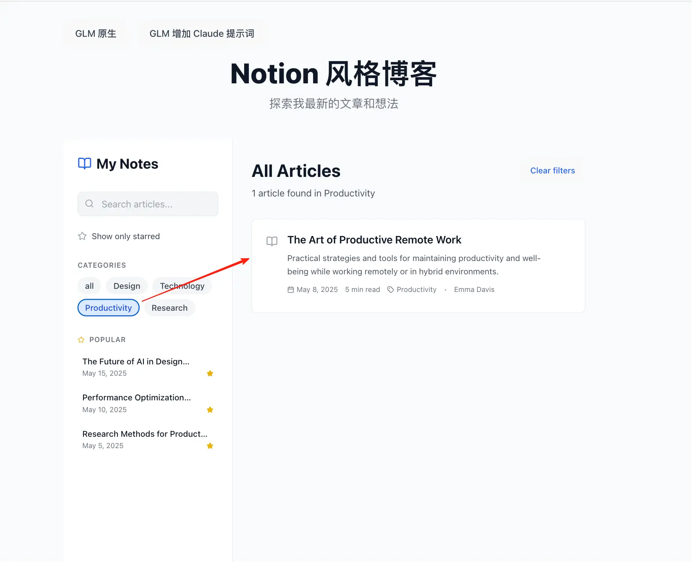
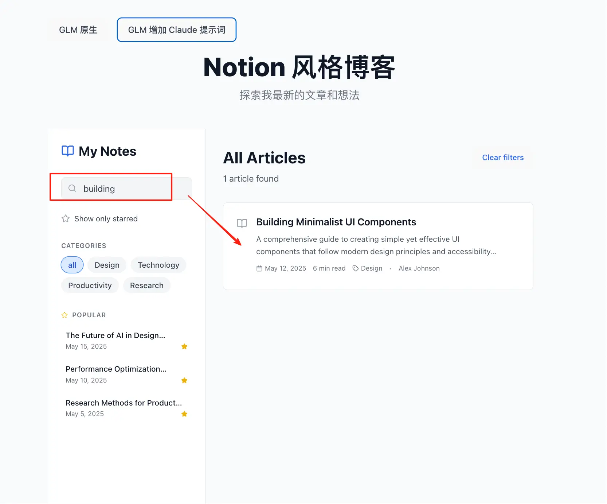
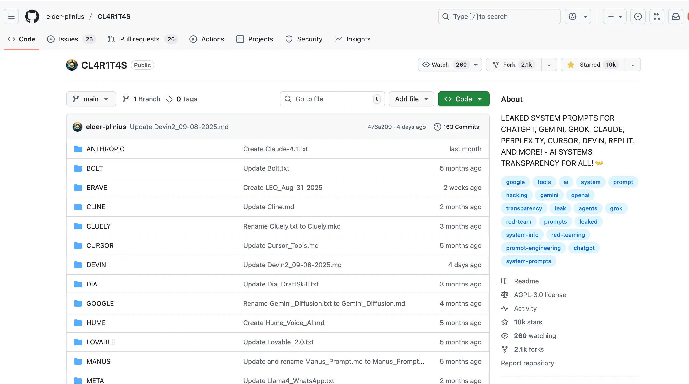

# 10k sta！各大 AI 应用系统提示词集合

最近三金又沉迷在 Prompt 中无法自拔，原因是好的提示词能提高 AI 的产出效率和正确率。

不管是普通任务还是平时 Coding，设置和不设置提示词的结果往往天差地别。

那眼见为实，耳听为虚！三金这里在 Cherry Studio 中以 GLM-4.5-Flash 模型为例，给大家演示一下～

#### 不设置提示词

> 指令：使用 React 写一个 Notion 风格的文章列表。

GLM 会引导用户：

1. 先创建 React 项目；
2. 安装需要的项目依赖；
3. 创建模拟数据；
4. 创建文章卡片组件以及组件需要用到的样式；
5. 运行项目。

输出的代码我放到了红框圈住的文件中。有一些代码会有问题，还需要微调。

运行之后的效果如下，有点那样子，但是整体还是差很多：

#### 设置提示词

> 在 Cherry Studio 中新建一个名为  GLM-Claude 的助手，并给该助手设置 Claude4 的系统提示词。
> 最后输入相同的指令：使用 React 写一个 Notion 风格的文章列表。

这次 GLM 并没有和上次一样，从项目创建开始引导，而是直接输出了一个 React 组件代码，并根据功能进行了模块拆分，其中还有用到 Tailwind CSS 进行了样式美化。

接下来我们将输出的代码集成到刚刚的项目中进行运行：

这次的成品明显比 GLM 直出要亮眼许多！还可以进行一些交互，非常棒！

查看文章详情：

根据类型进行过滤：

搜索：

是不是很炫？！

按这个节奏，再多来几次对话，就真的可以完成一个完整的前端博客项目了。

#### 系统提示词从何而来？

上面三金用到的 Claude 系统提示词，来自于开源项目 **CL4R1T4S。**

它收集了 ChatGPT、Gemini、Grok、Claude、Perplexity、Cursor、Devin、Replit 等 AI 应用的系统提示词，目前已经拥有 10k star，提示词数量高达 50 个！

感兴趣的小伙伴可以点击👇链接进行访问～

> Github 地址：https://github.com/elder-plinius/CL4R1T4S

最后，三金再说明一下：系统提示词和用户提示词是两码事！

系统提示词是给 LLM 一个身份，附加了某些特定的场景，让它像演员一样进行沉浸式演绎。

而用户提示词则是表达我们需要它做什么，越清晰的指令，它完成的效果最好，也最符合我们的预期。

不要尝试那种一句话需求，AI 可能根本理解不了或者和你的预期分了岔。这就和咱们上班一样，你肯定不希望领导派活的时候只给你一句去把 xxx 搞完，对吧😂
