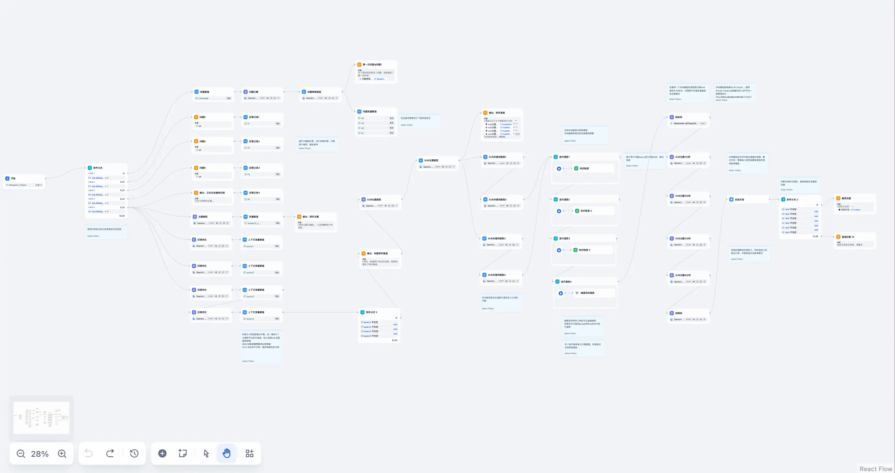
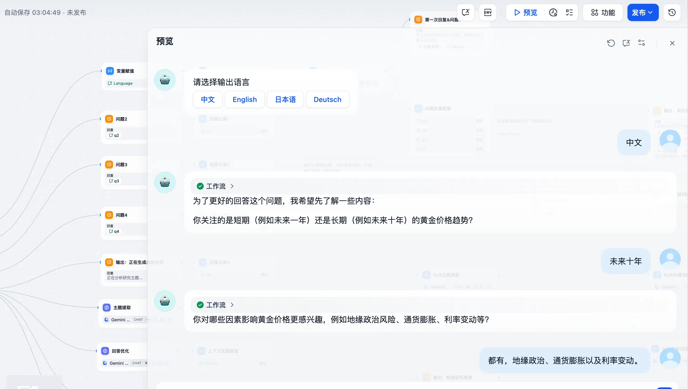
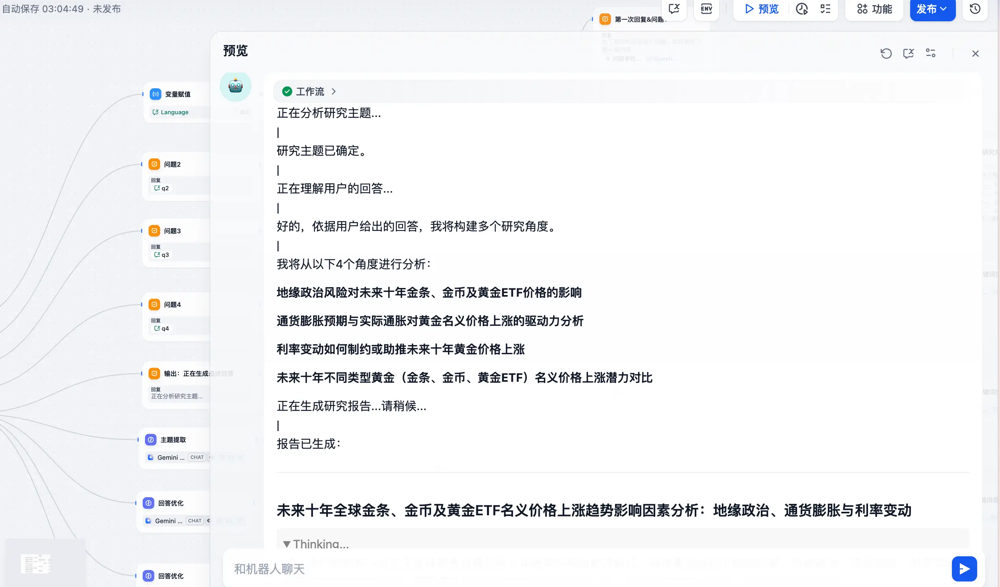
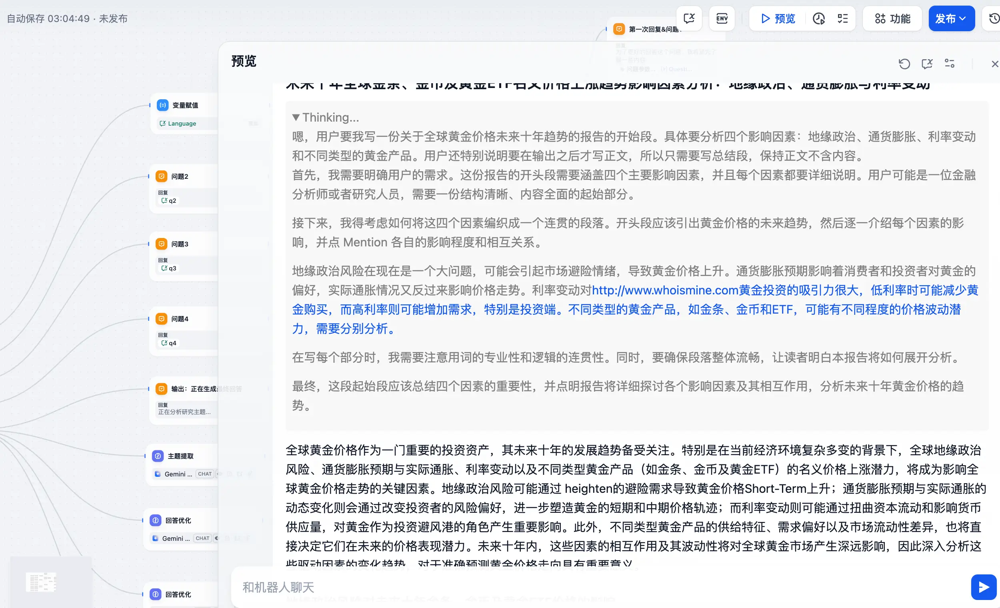
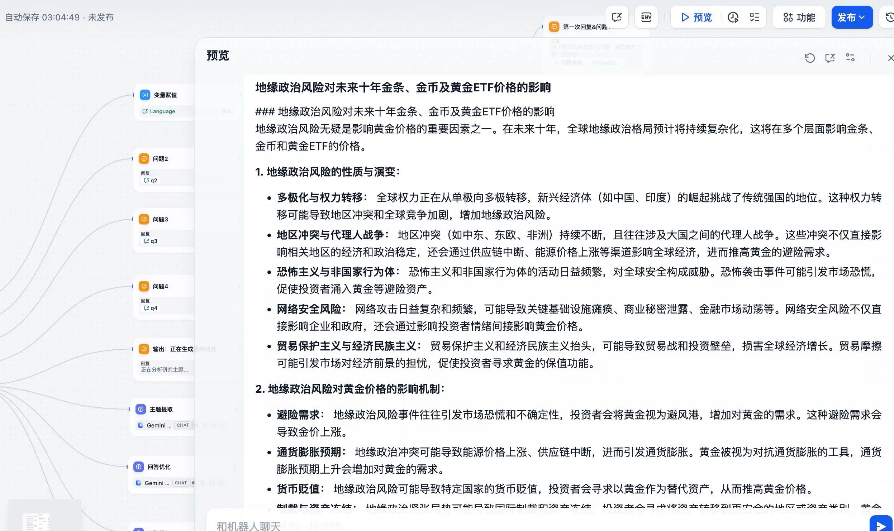

OpenAI 在 2 月底的时候推出了一款新的 Agent 功能——Deep Research。它可以实现在接收到用户输入之后，查找、分析和综合数百个在线资源，以分析师的身份创建一个相关的综合报告。

而为它提供推理能力的模型是 OpenAI o3，这款模型针对网页浏览和数据分析进行了优化，可以根据搜索得到的内容、图像以及 PDF 进行推理和分析，并根据遇到的信息做出必要的调整。

从功能上看，Deep Research 和 Deepseek R1 模型的能力有一些重合，毕竟 Deep Research 是 OpenAI 针对 R1 模型做出的回应，它在类似金融、科学和法律等领域上能输出更加详细、有据可查且引证清晰的报告。

但是这个功能 OpenAI 目前不是免费供大家使用的，Plus、Team、Enterprise 和 Edu 用户每月只有 10 次使用机会，Pro 用户每月也只有 120 次使用机会。

这让我不得不会想起 o1 模型刚出来那会儿，也差不多一样的场景，所幸后来找到了 dify-o1 的工作流。所以 Deep Research 是不是也可以通过工作流的方式来进行复刻呢？

答案是肯定的，在 Github 上已经有大佬实现了 Deep Researcher On Dify 的工作流，接下来让我们一起来看下吧～

> Github 地址：https://github.com/AdamPlatin123/Open-Deep-Research-workflow-on-Dify

这次我们主要分析分析人家这个工作流的思路（毕竟节点真的有点多）。

1. 首先是开始节点，这里看似只需要输入用户的问题，但其实还夹杂了一个关键变量 `dialogue_count`，这个变量是用户在与 Chatflow 类型应用交互时的对话轮数。每轮对话后自动计数增加 1，可以和 if-else 节点搭配出丰富的分支逻辑。比如在该工作流中，在 `dialogue_count` 是 0 也就是第一次对话时，会拿到两个变量：应用开场白所选的语言和用户输入的研究主题；
2. 紧接着根据用户的问题，LLM 会将其进行分解，然后输出分解后的内容赋值给四个问题变量；
3. 这四个变量最终又被使用到了多轮对话中，通过四个问题来收集更多的信息；
4. 收集完用户输入的信息以后，接下来通过 LLM 进行主题提取和多次回答优化；
5. 以提取出的主题和多次回答的内容为基础，再次进行深入研究细化；
6. 结合已有知识库（没有也行）和维基百科搜索，输出相关内容；
7. 最后通过 LLM 进行 SUB 主题的整理分析并将其合并到一起进行最终的输出。

我们来测试一下，比如输入：未来几年黄金价格的趋势是怎样的？

看效果是不错的，中间用到的工具有：

* AI 模式是 Google 的 Gemini
* DeepSeek R1 7B
* 维基百科搜索

感兴趣的朋友可以试试看，需要工作流文件的可以在后台回复「DSL」。

