#### 前言

众所周知，在 Dify 中如果要将应用分享给其他小伙伴使用，需要将对应的应用链接复制粘贴出来发送给对方。这样的**方式比较单一**，假如我想将部分应用对外开放，总不能将应用链接以列表的形式发到朋友圈吧😓

所幸在 Github 上找到了这么一款项目——**dify-chat**，它可以集成不同的 Dify API 到一个 AI Web 应用上，并对外公开。

* **适配 Agent、工作流等应用类型**；
* 支持**单应用、多应用**等多种模式；
* 支持 React SPA 和 Next.js 两种技术栈；
* 提供开箱即用的应用配置管理；
* 适配移动端；
* 适配**深度思考、思维链、图表**等多种形式输出。

> Github 地址：[https://github.com/lexmin0412/dify-chat
> ](https://github.com/lexmin0412/dify-chat)官网地址：https://docs.dify-chat.lexmin.cn/

#### 概念解释

###### 单应用

适合个人用户或小型团队，**专注于单一 AI 应用的深度使用**。你可以配置一个聊天机器人、知识问答助手或创意写作工具，享受专注的 AI 交互体验。

###### **多应用**

专为企业级用户设计，支持同时管理多个 Dify 应用。无论是客服系统、内容创作、数据分析还是代码助手，你都可以在一个界面中无缝切换，实现工作流程的统一管理。这种模式特别适合需要多 AI 能力协同的企业场景，让团队成员能够根据具体需求选择合适的 AI 助手。

#### Demo 演示

##### 单应用

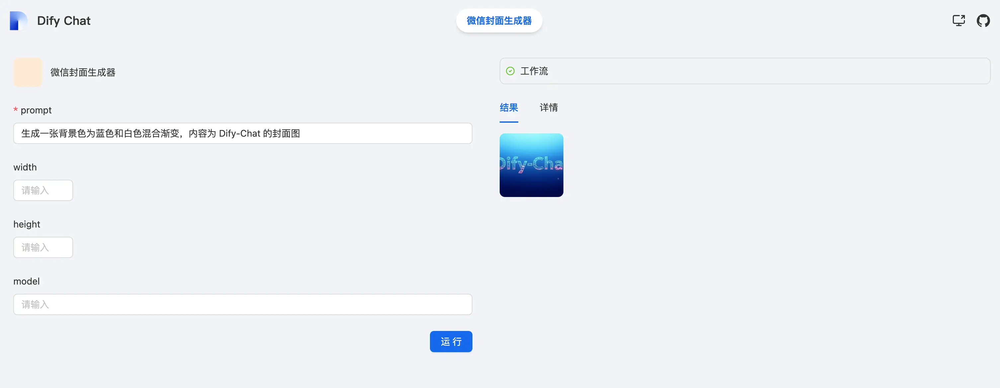

##### 多应用

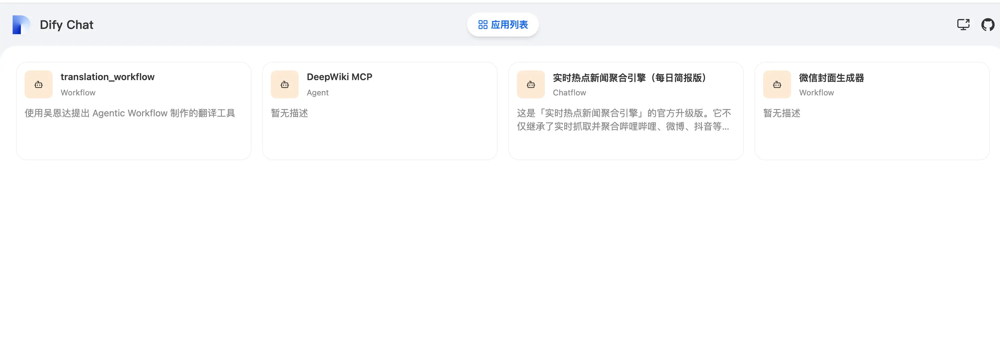

Next.js 在展示上，会比 SPA 单页应用多一个「新增应用配置」。

> 至于单页应用的配置在哪里，不要急。下面会讲～

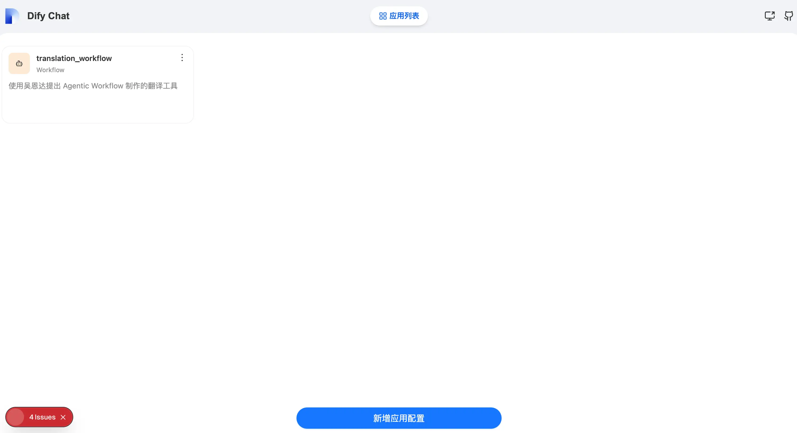

#### 启动项目

目前该项目还没有 100% 支持容器化部署，不过已经有提供 Dockerfile 文件了，如果大家有需要可以本地自行构建镜像。

要开发/生产构建 dify-chat 项目，需要满足以下条件：

* Node.js^22.5.1
* pnpm^10.8.1

因为该项目使用 pnpm workspace 来实现 Monorepo 管理，其他包管理工具可能无法正常进行工作，因此在启动项目前请确保您已满足该环境要求。

###### 拉取项目代码

```shellscript
git clone https://github.com/lexmin0412/dify-chat.git
```

###### 安装依赖

```shellscript
pnpm install
```

###### 构建其他依赖包

因为不管是 SPA 还是 Next.js 技术栈，都需要依赖到 dify-chat 子包，所以我们需要先 build 一下子包：

```shellscript
pnpm run build:pkgs
```

###### 启动 SPA 项目后台

在 SPA 单页应用中，是需要先启动后台管理项目的，因为需要在后台管理中配置对外的 Dify 应用：

```shellscript
pnpm run dev:platform
```

启动后访问 `http://localhost:3000/app-management` 即可：

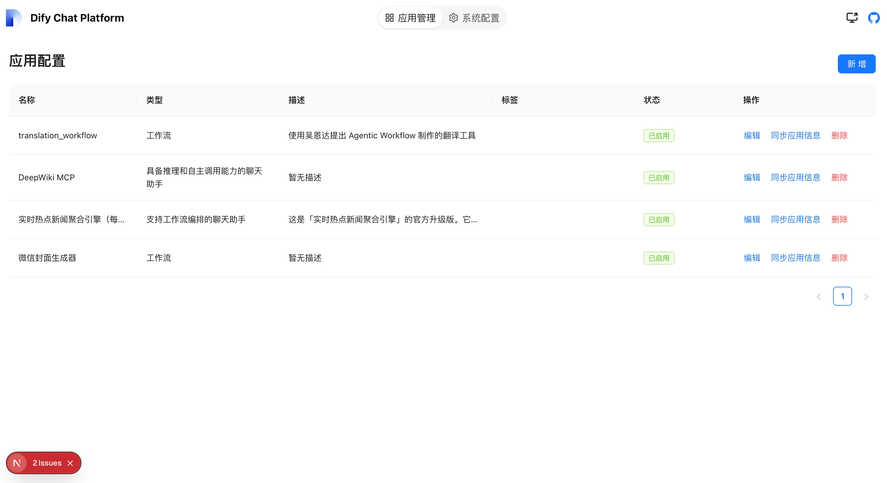

点击右上角的「新增」按钮就可以增加 Dify 应用了：

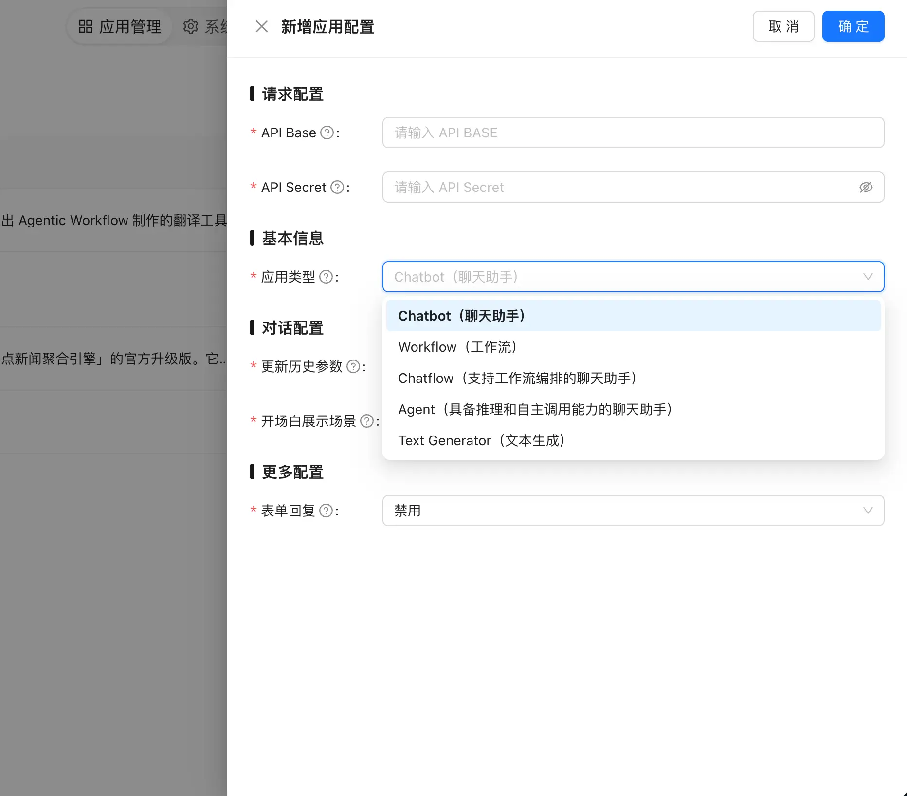

* 在 API Base 上填写自部署的 dify 地址或者官方地址；
* 在 API Sercret 上填入 Dify 应用的密钥；
* 选择好你的应用类型，Dify 的几种应用类型这里都是支持的。

###### 启动 SPA 单页应用

**多应用模式**

```shellscript
pnpm run dev
```

启动后，默认就是多应用模式。我们直接访问 `http://localhost:5200` 即可：

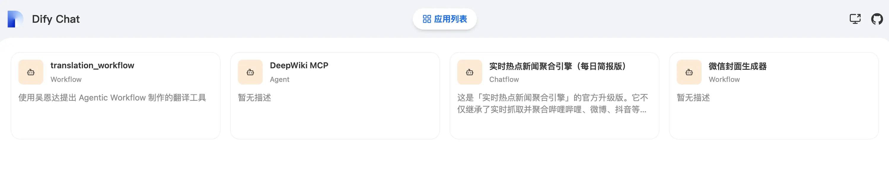

测试一下前两天搞得「实时热点新闻聚合」：

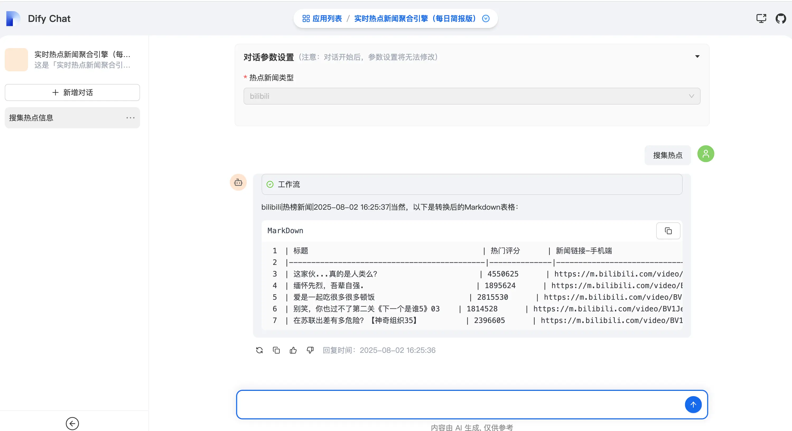

功能正常，邮箱也收到了对应的简报邮件：

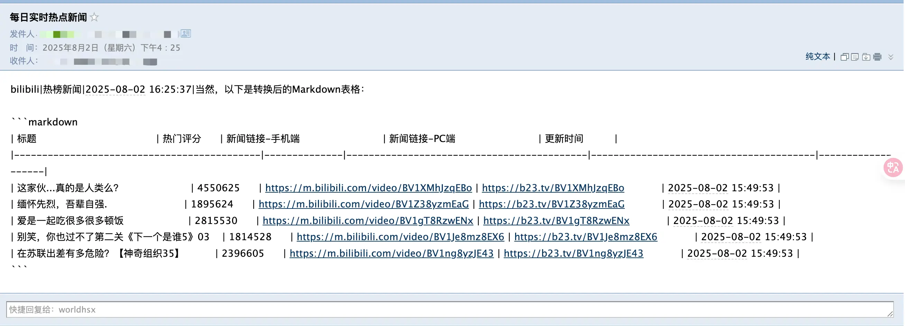

**单应用模式**

要测试单应用模式，需要修改 `packages/react-app/src/App.tsx` 里的代码：

```typescript
// 将 multiApp 改为 singleApp
difyChatRuntimeConfig.init('multiApp')
```

这样，在 dify-chat 的前端页面中就只会展示后台配置列表里的第一个应用了：

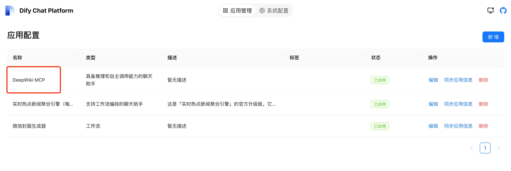

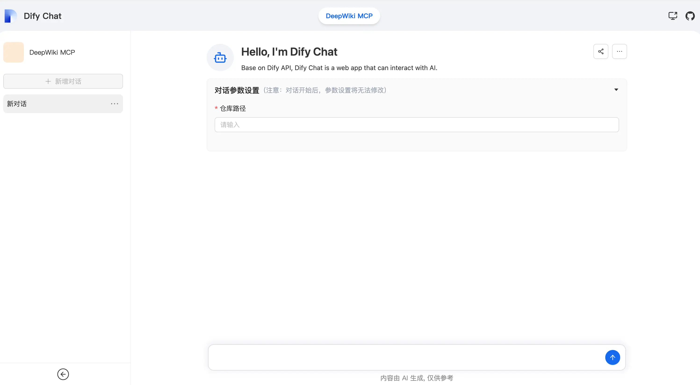

###### 使用 Next.js 技术栈

> ⚠️注意！Next.js 应用比较吃内存，**丐版配置的机器不要使用该技术栈启动，容易把机器搞挂**。

执行以下命令来启动 Next.js 应用模式：

```shellscript
pnpm run dev:next
```

访问 `http://localhost:5300`：

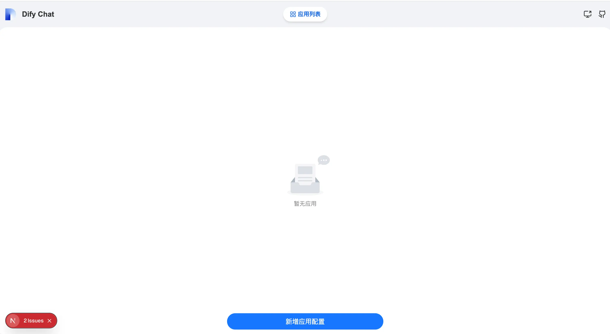

相比 SPA 版本，**使用 Next.js 版本的优势在于不用再启动一个后台来管理应用配置**，我们直接通过页面下方提供的「新增应用配置」来增加 Dify 应用：

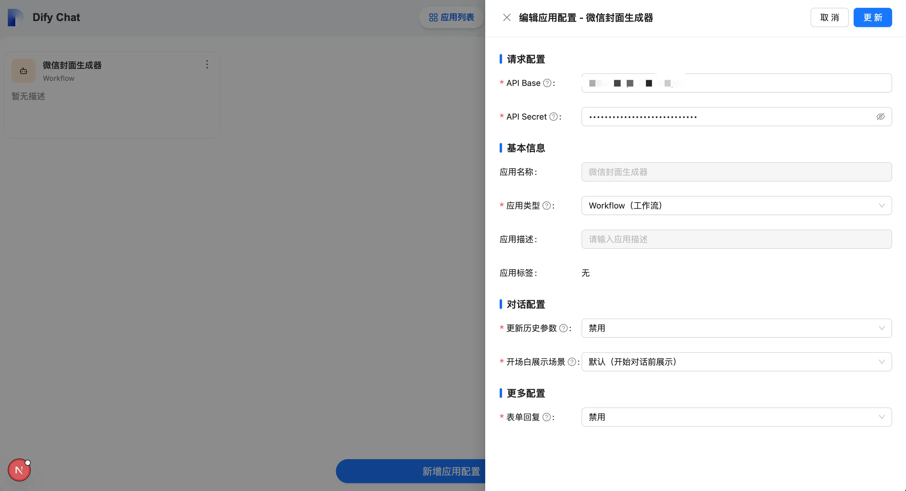

完成之后，我们就可以进入到新增的应用中进行测试了（这块好像会延迟卡顿几秒，起初我以为点不进去）：

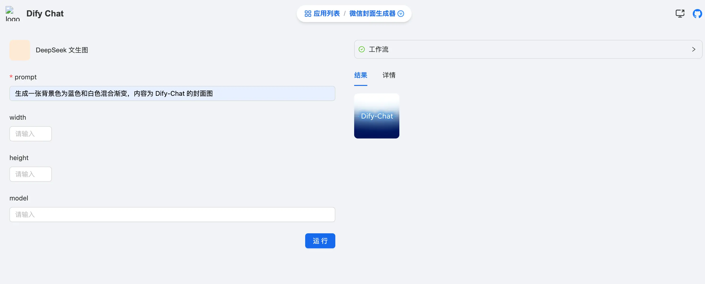


OK，今天的分享就到这里。

再次给小伙伴们提醒：机器配置一般的话就不要使用 Next.js 启动了，三金的电脑之前只在跑本地模型的时候发烫过，今天跑 Next.js 时也烫了，内存飙升得厉害。
