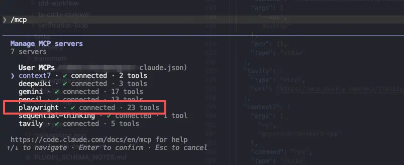
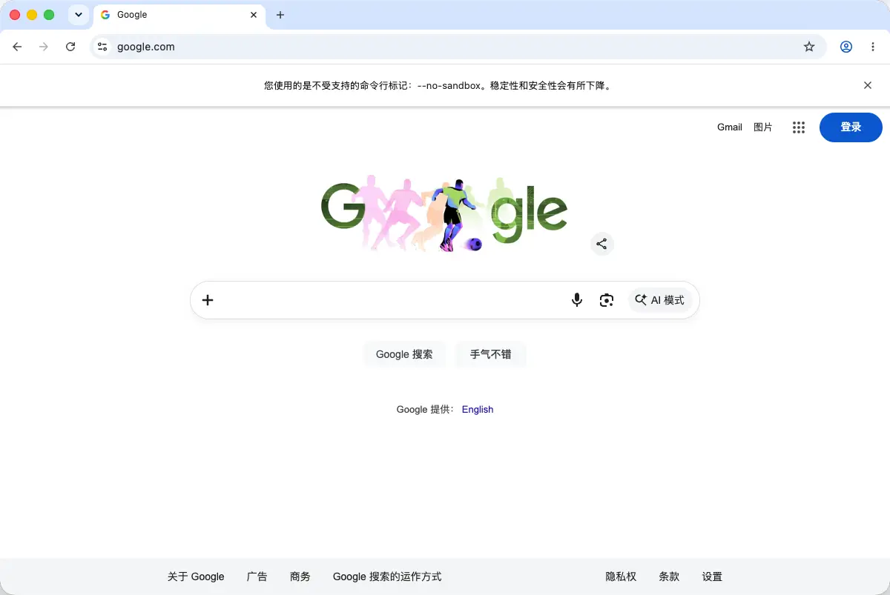
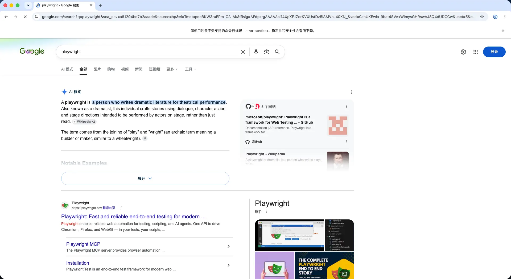
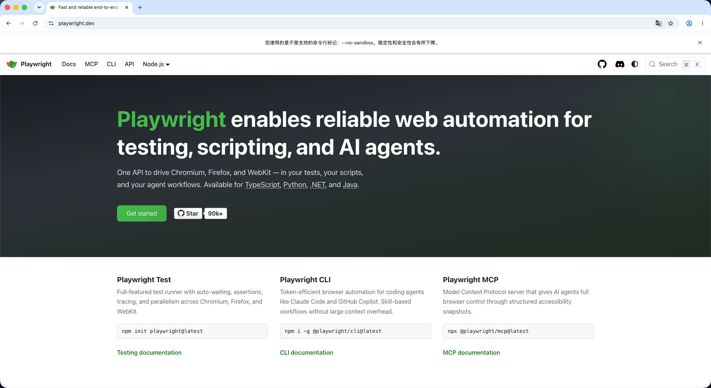
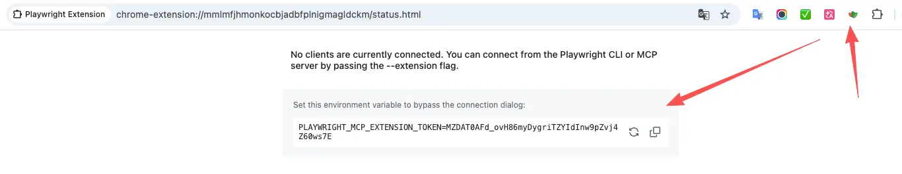
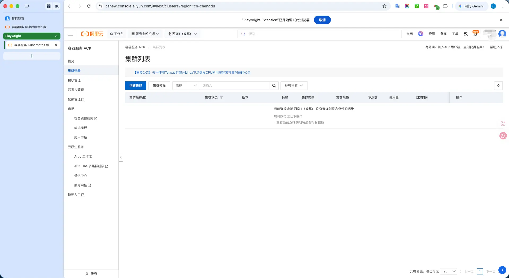
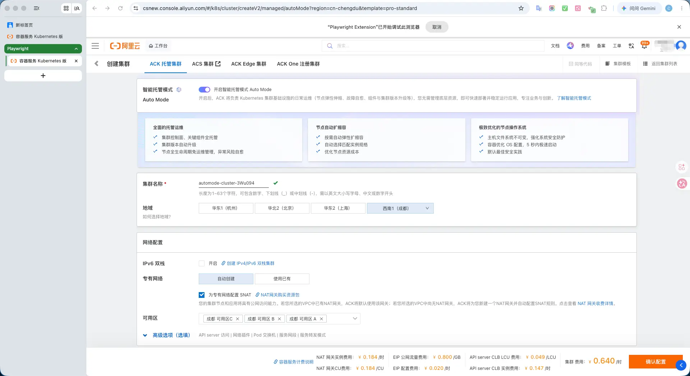

# AI 自动化测试探索（一）：Playwright MCP

Hi\~这里是三金。

众所周知，Playwright 是一款非常流行的开源 E2E 框架，随着 AI 时代的到来，它还提供了配套的 Playwright MCP，可以直接集成在编辑器或者 AI CLI 中，通过给 AI 大模型下发自然语言指令，自动进行浏览器自动化测试。

本次探索使用 Claude Code 搭配 GLM 5.1 进行实际操作。

### 安装

MCP 的安装分项目级和用户级，因为 Playwright MCP 属于比较通用的工具，所以我直接安装在了用户级：

```shellscript
claude mcp add -s user playwright npx @playwright/mcp@latest
```

安装好之后，我们可以打开 Claude Code，并输入斜杠命令 `/mcp` 进行查看：



可以看到在 Claude Code 列表中已经有了 playwright mcp，状态是 connected。

### 使用

使用很简单，我们直接告诉 AI 使用 playwright mcp 打开指定网址，做指定操作即可。

比如：

```
使用 playwright mcp 打开浏览器：
1. 访问 https://google.com
2. 在搜索框中输入 playwright mcp，并点击搜索
3. 在搜索结果页面，点击第一个搜索结果
```

它会新打开一个浏览器实例，然后按步骤进行执行。







但是这在需要进行登录态测试的场景下，就比较尴尬，总不能直接把用户名密码一起交给 AI 吧。庆幸的是，Playwright MCP 提供了一个配套的浏览器插件，可以复用已打开且登录了的账号的浏览器实例，从而实现“免登”。

### 直接访问已打开的浏览器实例

插件安装地址：https://chromewebstore.google.com/detail/playwright-extension/mmlmfjhmonkocbjadbfplnigmagldckm?hl=zh-CN\&utm\_source=ext\_sidebar

添加好浏览器插件之后，我们点击对应的插件图标，以此来获取 Token：



获取到 token 之后，我们通过修改 MCP Server 配置来使 Playwright MCP 能正常复用已打开的浏览器。

```shellscript
vim ~/.claude.json
```

找到 playwright 的 mcp 配置，并按照下面的例子进行修改：

```json
"mcpServers": {
  "playwright": {
    "type": "stdio",
    "command": "npx",
    "args": [
      "@playwright/mcp@latest",
      "--extension"
    ],
    "env": {
      "PLAYWRIGHT_MCP_EXTENSION_TOKEN": "your token"
    }
  }
}
```

修改好之后，重启 Claude Code，然后找一个需要进行登录的场景进行测试，比如以阿里云 ACK 为例（注意需要是已经登录的状态）：

```
使用 playwright mcp 打开浏览器：
1. 访问 https://csnew.console.aliyun.com/
2. 点击创建集群
3. 在专有网络上点击使用已有
```

可以看到它会直接访问已登录的 ACK 控制台并进行操作！






### 优势

体验下来，感觉后面可以抛开代码层，直接以自然语言的方式来指挥 AI 进行自动化测试。只要确保测试用例准确的情况下，可以节省一部分人工测试的工作，从而腾出更多的时间和精力投入到更具价值的事情当中。

### 缺陷

当然使用的过程中也不是那么一帆风顺！

首先，非常吃 token，这就导致用 AI 大模型来做自动化测试的成本不可能低。


> 就走了三步，吃了这么多，一套完整的 E2E 跑下来感觉有点收不住

其次，也比较吃模型能力，GLM 4.7 和 GLM 5.1 的结果差距还是挺大的。用御三家做自动化测试，钱包会扛不住。

最后，很吃内存。本来 Chrome 浏览器就比较吃内存，而 playwright mcp 在开始工作之后，内存消耗逐步上升，会有卡顿的情况出现。

综上来看，可能还得要看看其他相同类型的工具，比如 chrome-devtools 以及 browser agent 等等，选择一个性价比最高的方案。

> 看官老爷们如果有推荐，请在评论区畅谈～
