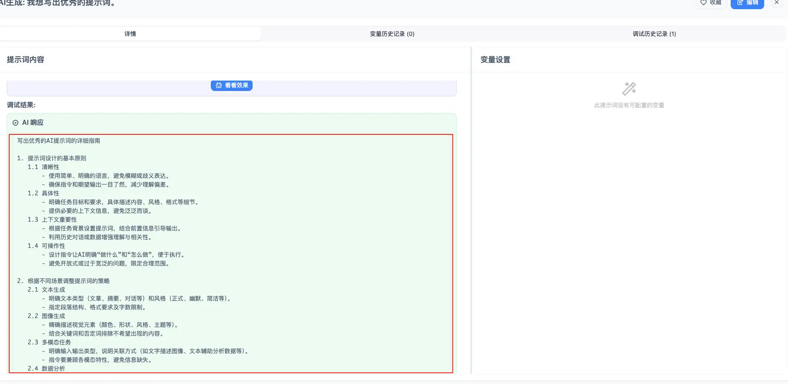

#### 引言

看到超牛的提示词只知道收藏到收藏夹吃灰？

刚用过的绝版提示词转眼就不知所踪？

我想你应该拥有一款可私人部署、本地快捷管理 AI 提示词的工具——AI Gist。它具有以下特点：

* 多平台支持（Windows、MacOS、Linux），开箱即用；
* 在 Jinja 模板模式下，支持动态变量填充，结构清晰灵活；
* 历史追踪功能便于对多次进行修改调整的提示词进行事后回溯，找出效果最好的 prompt，并持续进行优化；
* 多视图管理：集中管理提示词模板，支持卡片视图、表格视图和分类视图；
* 筛选分类：可快速筛选、查找提示词，支持标签、分类、评分和收藏等功能；
* 支持多种 AI 模型：包括本地模型 Ollama、LM Studio，以及 OpenAI 等多种常见在线模型；
* AI 生成与调优：可以选择 AI 快捷生成提示词，也可以选择使用 AI 对已有提示词进行优化；
* 数据隐私与安全：所有数据都存储在本地，支持导入和导出，也支持云备份功能（WebDAV、iCloud）。


#### 安装

可以通过访问官网 https://getaigist.com/#download 来安装 AI Gist：


对于 MacOS 用户来说，由于 AI-Gist 并未在 Apple 进行签名，所以在安装的时候大概率会看到“应用已损坏”的提示。

请按照以下步骤操作以绕过系统限制：

* 打开“终端”应用
* 复制并粘贴以下命令，按回车键运行

```shellscript
xattr -cr /Applications/AI\ Gist.app
```

* 然后打开应用，即可正常使用

#### 使用

打开 AI Gist 之后，我们第一件要做的事情就是配置 AI 模型（左侧第二个菜单）：


可以配置官方模型、第三方中转，也可以配置本地模型，我们以接入 chatanywhere 为例：


当然使用 Ollama 和 LM Studio 也都是可以的：


接下来我们就可以添加提示词了～


**手动添加**

先添加一个李继刚大佬的提示词进去：


点击右下角的更新之后，我们就完成了第一个 AI 提示词的录入。

> **Tip**: 提示词多了之后，可以通过标签或者分类的方式，将提示词按照不同维度进行划分，方便管理和查找。


**AI 生成**

点击「AI 生成」，在「要求」的输入框中输入你想要的提示词：


生成的提示词内容如下：


我们可以在提示词详情页面中点击「看看效果」来检查一下：



整体来说，还是相当不错的～

**云端备份**

如果要做多设备数据共享或者防数据丢失，也可以在设置页面，通过云端备份功能将数据存储在远端。

目前支持 WebDAV 和 iCloude 两种形式：


还有一些基础功能，比如高级筛选、分类、收藏、布局切换、主题等等，就不在此一一赘述了，感兴趣的小伙伴可以在安装之后自行尝试。

Github 地址：https://github.com/yarin-zhang/AI-Gist
