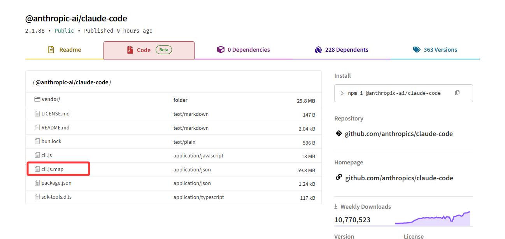
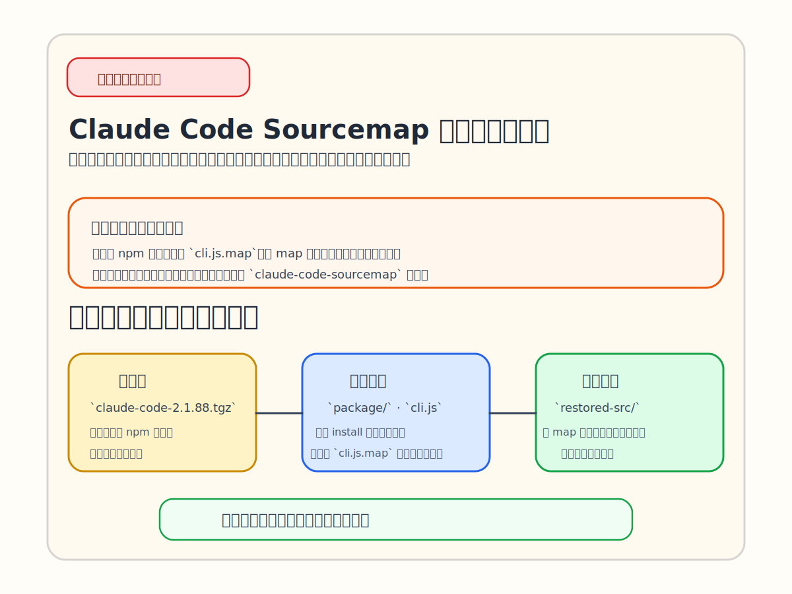
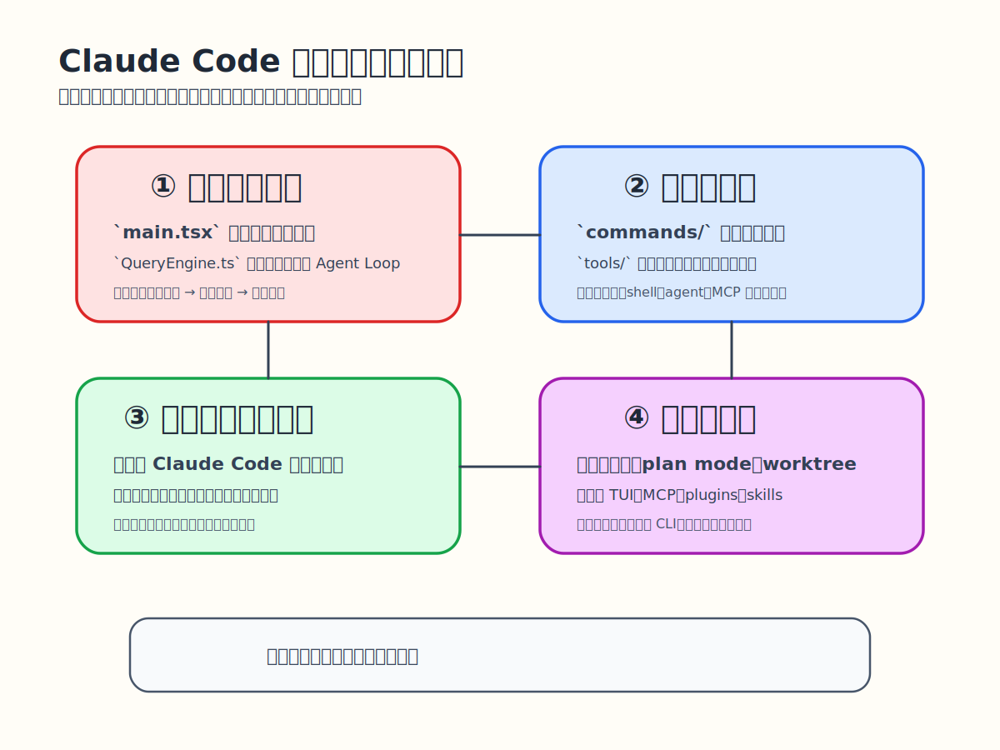
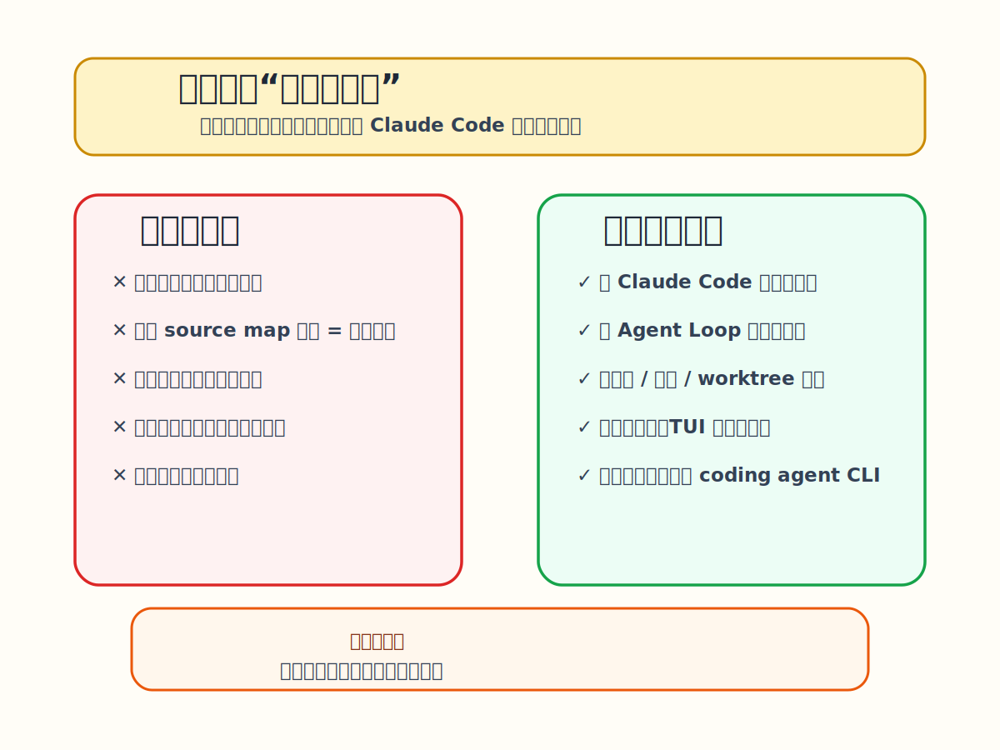

Hi，大家好，我是三金～

今天冒出来一个挺有意思的信息：在 Claude Code 最新版本 2.1.88 npm 包中，上传了一个 `cli.js.map` 文件。这类文件通常用在调试中，用于 Source Map 源码映射，也就是说可以通过它看到源码。

难道是卧底发力了？

先不管了，已经有大佬把相关代码上传到了 Github 上，让我们我们一睹为快。

> 项目地址：[https://github.com/ChinaSiro/claude-code-sourcemap
> ](https://github.com/ChinaSiro/claude-code-sourcemap)需要注意的是，这个不是官方源码仓库，准确的说它是一份**基于公开发布包和 source map 还原出来的学习材料**。

我们可以从以下三点来看 CC 的 SourceMap 源码：

1. 有什么
2. 怎么组织起来的
3. **能不能基于它做出一个自己的 Claude Code**。

> OpenCC 就在眼前，各位大佬发力吧～

## 里面都有什么

从仓库顶层往下看，结构其实很直白，核心就几样东西：

* `claude-code-2.1.88.tgz`
* `package/`
* `extract-sources.js`
* `restored-src/`
* `README.md`

这几样东西我们可以归为三类，分别是：

* **原始发布包**，也就是 `claude-code-2.1.88.tgz`，是 Claude Code 这个版本的 npm 发布包。
* **发布包解包后的运行产物**：`package/` 目录里能看到 `cli.js`、`cli.js.map`、`package.json` 这些内容。map 文件是这场事故的核心😂
* **从 source map 还原出来的源码视图**：`extract-sources.js` 做的事情并不神秘：它读取 `package/cli.js.map`，遍历其中的 `sources` 和 `sourcesContent`，然后把这些内容清洗路径后写入 `restored-src/`。 

在 README 文件中透露一个非常有信息量的数据：

* 当前还原版本是 `2.1.88`
* 总共还原出 **4756 个文件**
* 其中有 **1884 个 \`.ts\` / \`.tsx\` 文件**。

这个数字本身就说明，Claude Code 根本不是一个“小工具”，而是一套规模已经相当大的终端 Agent 应用。

## 如何组织起来的

如果只看 `restored-src/src/` 的顶层目录，其实已经能看出很多门道。

里面除了有 `main.tsx`、`QueryEngine.ts`、`commands/`、`tools/`、`services/`、`state/`、`context/` 这些比较常规的目录，还有：

* `assistant/`
* `buddy/`
* `coordinator/`
* `remote/`
* `plugins/`
* `skills/`
* `voice/`
* `vim/`
* `server/`

我们可以将这份学习资料大概分成四个层次：

**第一层，是入口和主循环。** `main.tsx` 负责把整套东西拉起来，`QueryEngine.ts` 则像大脑一样把用户输入、模型判断和工具调用串成一个持续运行的 Agent Loop。这么来看的话，Claude Code 的核心不是聊天，而是 ask loop。

**第二层，是命令和工具。**`commands/` 是用户入口，`tools/` 是模型真正能调度的能力池。把这两层分开，产品入口和执行能力就不会全挤在一起，后面也更容易继续长。

**第三层，是服务、状态和会话。** `services/`、`state/`、`context/` 这些目录，处理的都是长期运行才会遇到的难题：**会话怎么续、状态怎么管、上下文怎么收、外围能力怎么接**。模型只是入口，真正难的是把它稳定地跑起来。

**第四层，是边界和交互。** 权限、审批、plan mode、worktree 决定它能不能安全地进真实开发环境；`ink`、`components`、`screens` 再加上 MCP、plugins、skills，则说明它已经不是单一 CLI，而是在往平台化走。

把它再串一串：**用户输入 → Query Engine 组装上下文和工具 → 模型决定要不要调用工具 → 工具执行 → 结果回流到会话和 UI → 下一轮继续。**

> 有兴趣的佬可以再往深研究一下，内容还是挺多的，这里只是做一个概括。

## 能不能拿它做一个自己的 Claude Code

看到这里，一个自然而然的想法是：既然它这么像一套完整系统，那能不能直接拿来做一个自己的 Claude Code？

我觉得如果**只是做一套自己的 Claude Code 类产品**，应该不是特别难。因为这仓库已经把主循环、工具、权限、状态、TUI 这些关键结构摆出来了，万事开头难的开头问题已经不存在了。

如果真想自己做，个人理解可以按照以下四个步骤进行：

* 先把主循环跑起来；
* 再补文件、搜索、shell 这几个最小工具；
* 再加权限确认和会话管理；
* 最后再补 TUI、MCP、插件这些增强能力。

具体实操就看各位看官大佬们的了😄，感兴趣的大佬们赶紧 fork 或者 download 下代码吧！

2.1.88 版本已在 npm 网站上不可见了，这些代码仓库还能存在多久也不好说，赶紧行动起来。
