你是否还在为手动配置 Claude Code 代理和 Codex 代理而头疼？如果是，那今天三金介绍的这块软件你必须得看看！

**CC Switch** —— 一款可以快速切换 AI CLI 配置的应用。它支持：

* 通过**可视化方式**快速配置 Claude Code、Codex 和 Gemini CLI 的 API 供应商，摆脱终端操作的烦恼；
* 预设了 Claude 官方、DeepSeek、智谱 GLM、Kimi K2、Mini Max 等 **17 个热门 AI 厂商配置途径**，且支持**自定义配置**；
* 支持在 **Windows、MacOS、Linux 和 ArchLinux 系统**上进行安装；
* **MCP 管理、Skills 管理、Prompt 管理**；
* 可借助 Dropbox、OneDrive、坚果云等实现**云同步**。

### 安装

CC Switch 的安装针对不同的操作系统存在一些版本要求，具体如下：

* **Windows**: Windows 10 及以上
* **macOS**: macOS 10.15 (Catalina) **及以上**
* **Linux**: Ubuntu 22.04+ / Debian 11+ / Fedora 34+ 等主流发行版

具体安装途径：

* **Windows 和 Linux 系统**：在 [Github Releases](https://github.com/farion1231/cc-switch/releases) 页面下载对应系统的最新版本的安装包或者绿色版安装包；
* **MacOS** 系统有两种安装方式：
  * 和 Windows 系统一样，在 Github Releases 页面下载 MacOS zip 包解压使用。（*PS：首次打开可能出现"未知开发者"警告，请先关闭，然后前往"系统设置" → "隐私与安全性" → 点击"仍要打开"，之后便可以正常打开*）；
  * 使用 Homebrew 进行安装：

```bash
# brew 安装
brew tap farion1231/ccswitch
brew install --cask cc-switch

# 更新
brew upgrade --cask cc-switch
```

* **ArchLinux** 系统：

```bash
# 通过 paru 进行安装
paru -S cc-switch-bin
```

安装打开之后的界面如下：

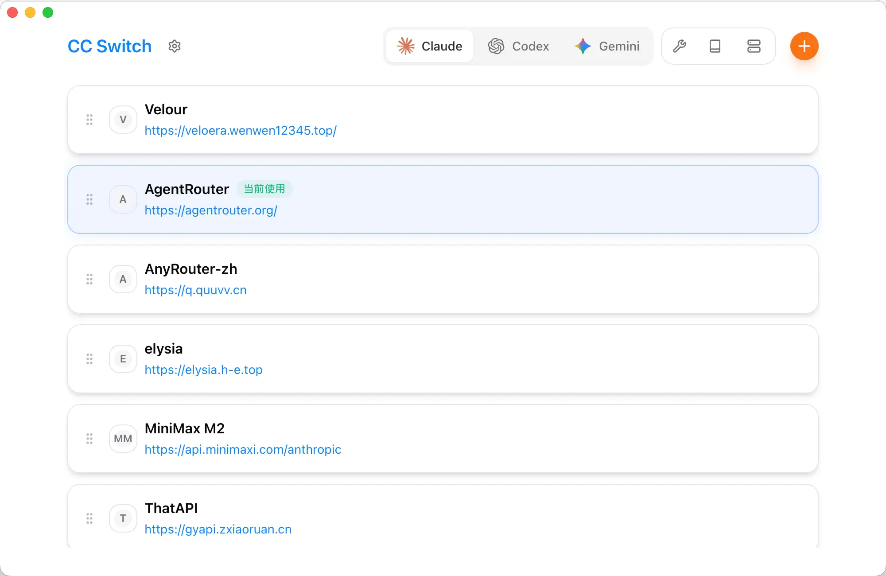

### 使用

先选中要使用的工具，再点击右上角的橙色 + 号，即可进行 API 配置。我们以 Codex 为例：

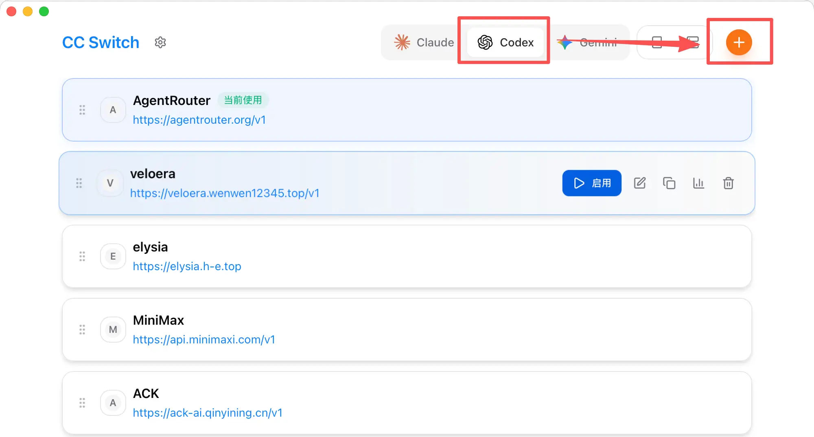

进入配置窗口：


默认是自定义配置，我们可以添加一些第三方的中转站，以 CherryIn 为例：

1. 先到 CherryIn 上创建一个令牌并复制；
2. 再回到 CC Switch 上，在 API Key 上填入复制好的令牌，在 API 请求地址上填入 `https://open.cherryin.ai/v1`；
3. 滚动窗口到最下方的 `config.toml` 部分，修改 model 为最近大火的 `openai/gpt-5.2`，model\_reasoning\_effort 配置可以改成 low 或者 medium（默认是 high，不但慢还费 token）；
4. 最后点击右下角的添加即可。

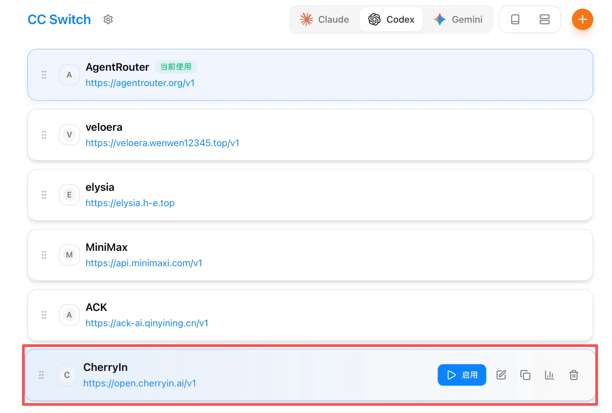

点击启用后，让我们打开 codex 来测试一下：

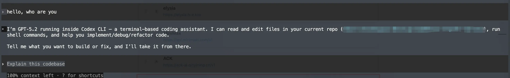

已经正常运行了， 我们再切换到 AgentRouter 上试试（切换之后要重启 CLI 工具）：

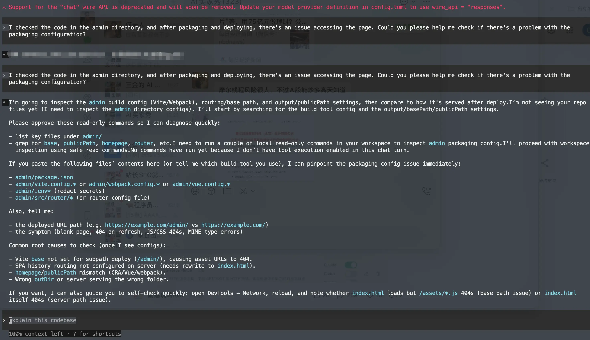

也正常输出了（不过中途输出了一个类似广告的东西，但毕竟是免费的，能用上已经很棒了～）

### MCP 管理

在如下图所示的入口进入 MCP 管理窗口：

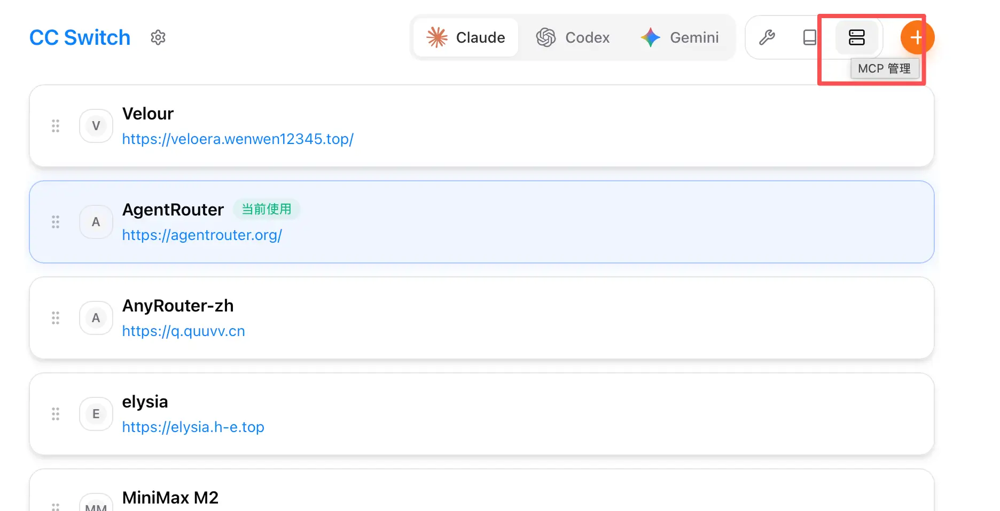

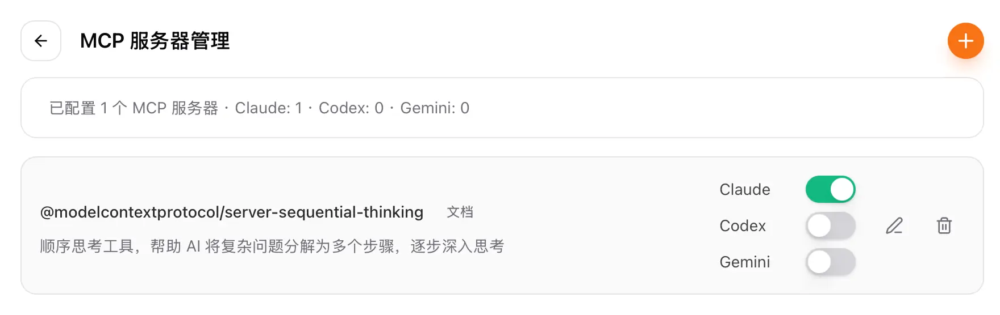

点击右上角的 + 号，让我们添加一个 context 的 MCP 进来：

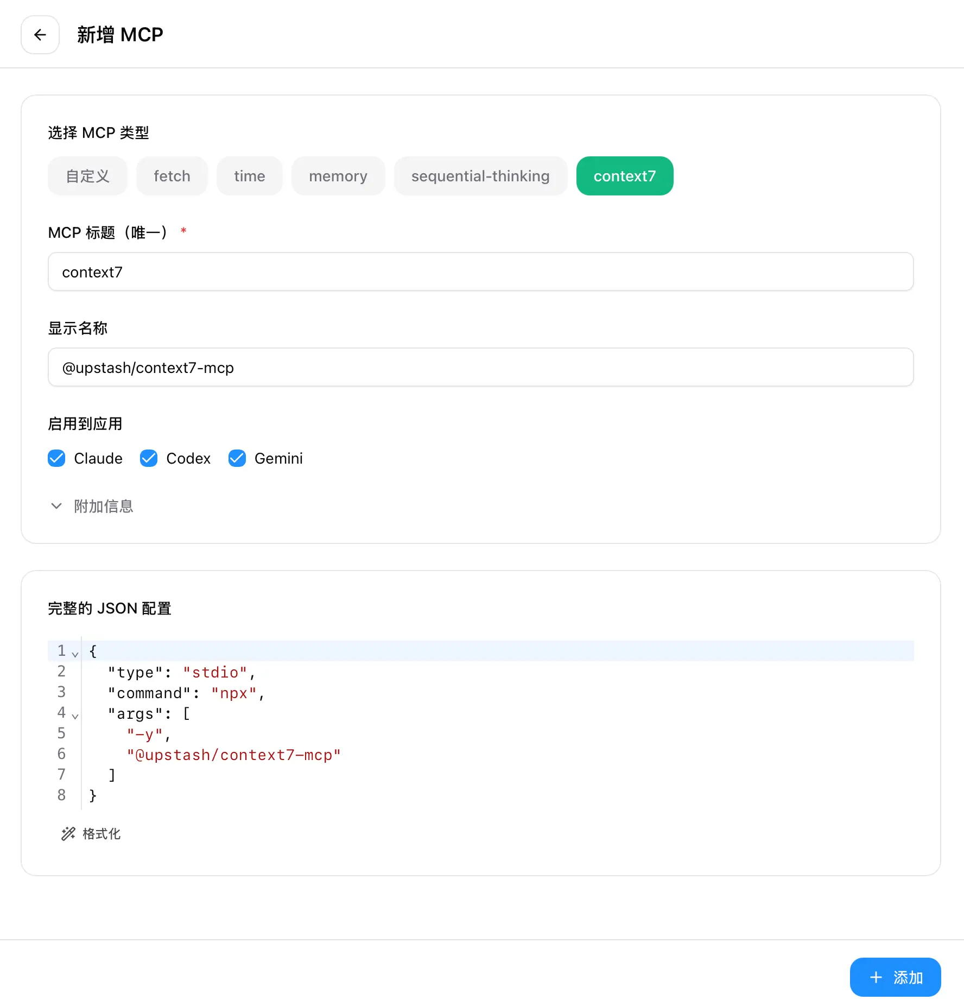

点击添加以后即可看到 context 已经在 MCP 列表中了：

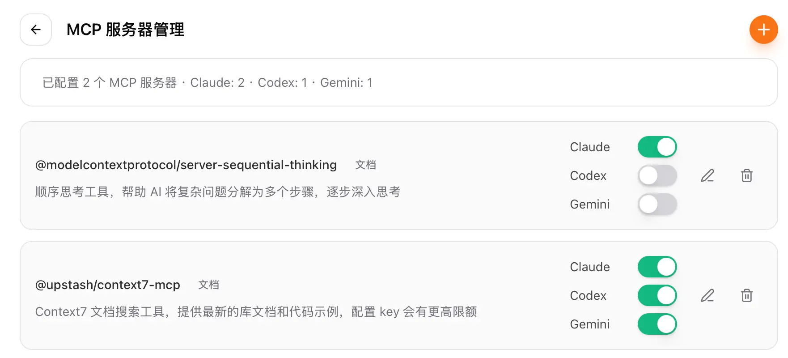

我们在 codex 中看下 MCP 是否可以正常工作：

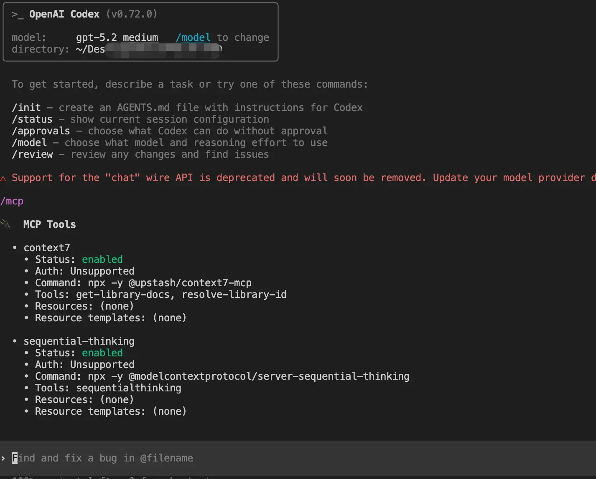

### 提示词管理

在如下图所示的入口进入提示词管理窗口：

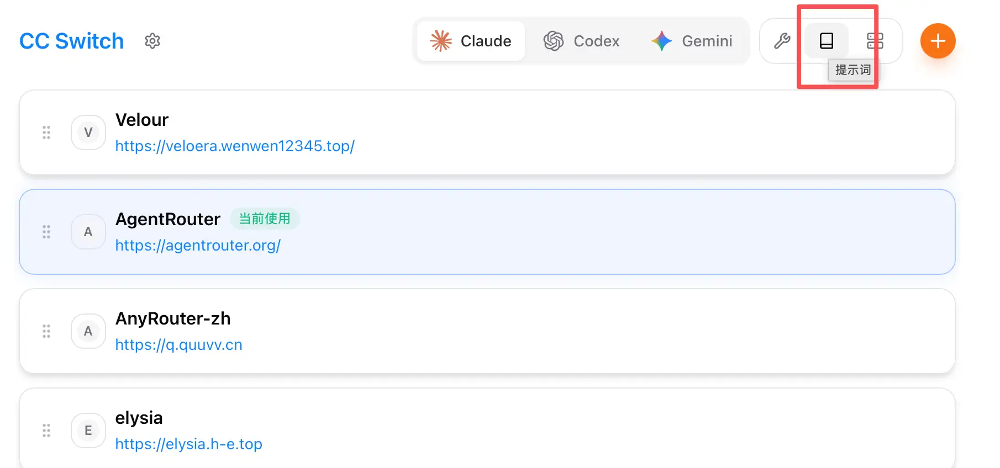

同样的操作，我们点击右上角的 + 号直接进行添加即可。

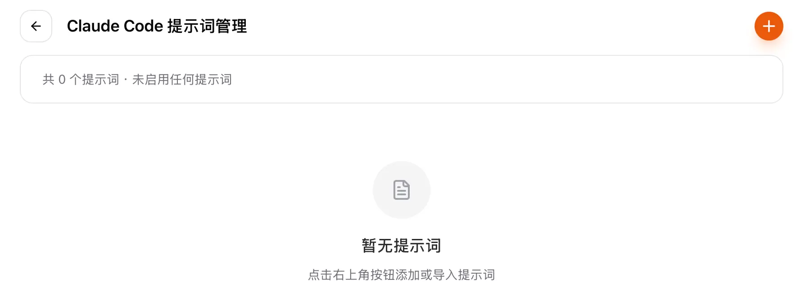

点击左侧的 switch 按钮启用之后，就可以使用该提示词了：

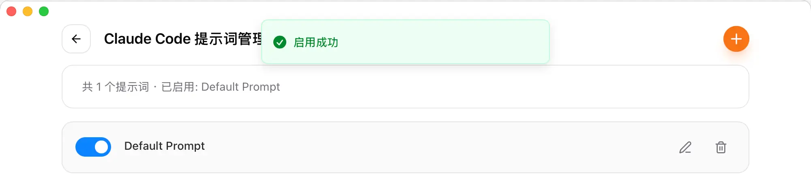

### Skills 管理（Claude Code 专属）

Codex 和 Gemini CLI 并没有 Skills 的能力，所以只有在选中 Claude 的时候，我们才能看到配置 Skills 的入口：

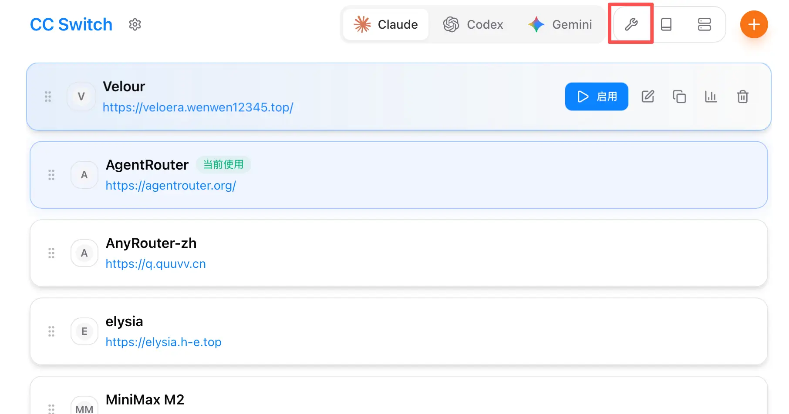

进入 Skills 窗口后，我们可以点击仓库管理配置技能仓库连接来添加配置 Claude Skills：


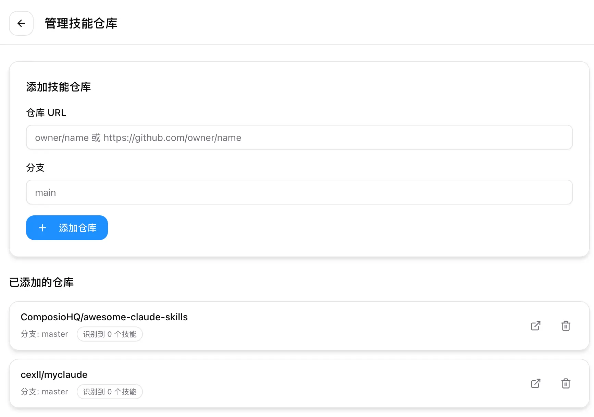

回到 Skills 列表，点击刷新让工具自动进行技能扫描，这个过程可能需要一段时间：

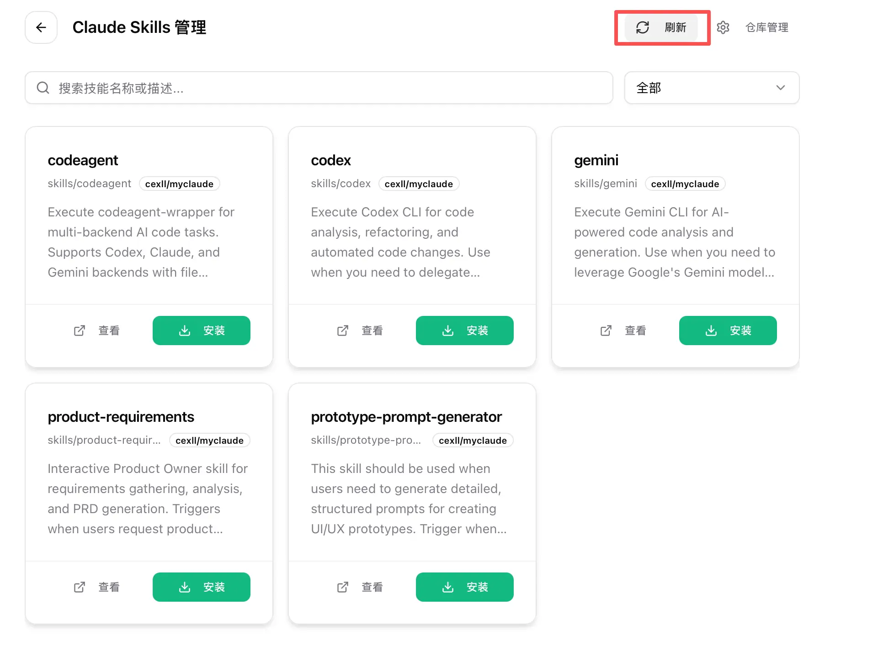

选择你感兴趣的 skills 点击安装即可～

> 测试不是那么稳定，应该和网络有关系，有时候扫不出来内容或在扫出来内容但是安装不了。在 issue 中也有 skills 连接超时的提问。

最后献上Github 地址：https://github.com/farion1231/cc-switch
