上周三金部署的几个 Web 应用的 **SSL 证书都过期了**。

之前呢，都是使用的付费产品来做的自动续期，省事倒是省事，就是得花钱。

这次想了想，觉得自己本来就是干这行的，怎么搞个自动续期还要给别人掏钱，Github 上啥没有！

折（bai）腾（piao）！必须折（bai）腾（piao）！

#### 开源三大应用

在 Github 上逛了一圈，发现开源的 SSL 证书管理工具还不少，比较出名的有：

* **Certimate**：Github 有 **7.5k Star**。可以自动申请、部署 SSL 证书，并在证书即将过期时自动续期；
* **Certd**：Github Star 数 **3.7k**。全自动证书申请、更新、续期；通配符证书，泛域名证书申请；证书自动化部署到阿里云、腾讯云、主机、宝塔等；HTTPS 证书、PFX 证书、TLS 证书自动续签自动部署；
* **All in SSL**：Github Star 数 **2.9k**。集证书申请、管理、部署和监控于一体的 SSL 证书全生命周期管理工具。

花了点时间大概看了下这三个应用的文档，发现其实大同小异。

其中 Certimate 支持在 1Panel 的应用商店中一键安装，我就直接搜索安装了～

> 官方文档：https://docs.certimate.me/

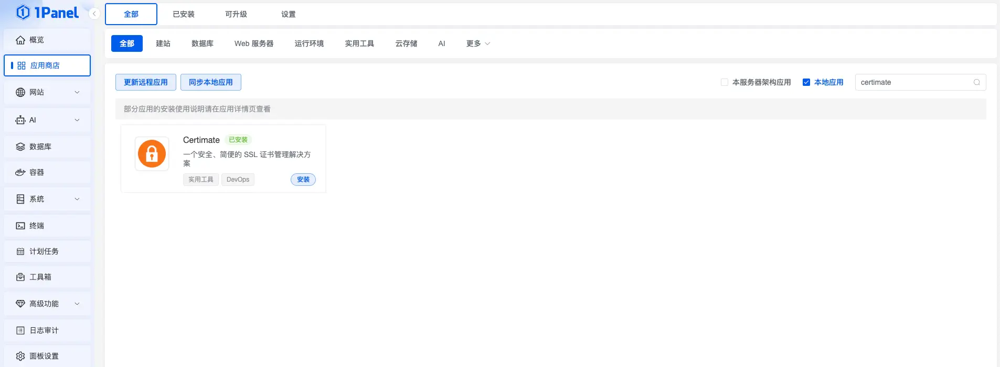

#### Docker 部署

有的小伙伴可能没有 1Panel 或者宝塔面板，这里再提供一下 Docker Compose 部署的方式。

```shellscript
mkdir -p ~/.certimate && \
cd ~/.certimate && \
curl -O https://raw.githubusercontent.com/certimate-go/certimate/refs/heads/main/docker/docker-compose.yml && \
docker compose up -d
```

复制上述命令到服务器终端，即可通过 Docker Compose 一键部署 Certimate～

如果不想使用 Docker Compose 也没关系，单纯使用 `docker run` 也 OK:

```shellscript
# 拉取镜像
docker pull registry.cn-shanghai.aliyuncs.com/certimate/certimate:latest
# 启动容器
docker run -d \
--name certimate \
--restart unless-stopped \
-p 8090:8090 \
-v /etc/localtime:/etc/localtime:ro \
-v /etc/timezone:/etc/timezone:ro \
-v $(pwd)/data:/app/pb_data \
registry.cn-shanghai.aliyuncs.com/certimate/certimate:latest
```

运行起来之后，我们就可以通过 `IP:8090` 来访问 Certimate 了！

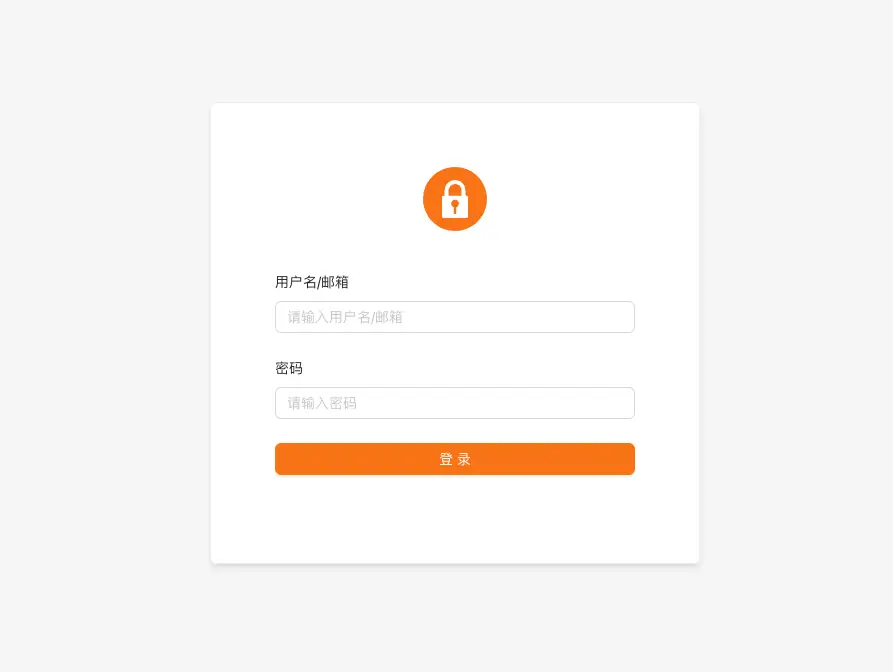

#### 配置

Certimate 的初始账号和密码为：

* 账号：`admin@certimate.fun`
* 密码：`1234567890`

登录之后，大家记得先去系统设置中把账号和密码修改了。

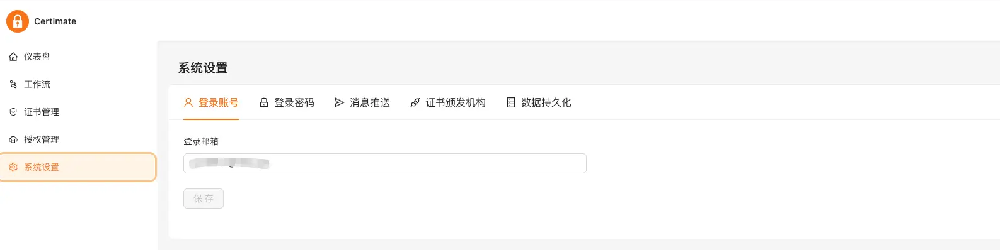

完了也别着急去新建工作流，而是先去「授权管理」新建授权。在 Certimate 上，我们一般只需要配置三个授权即可：

* DNS 提供商：你的 DNS 托管方，通常等同于域名注册商，用于在申请证书时管理你的域名解析记录。三金使用的是阿里云 ECS，域名也是在阿里云买的，所以这里就授权了下阿里云；

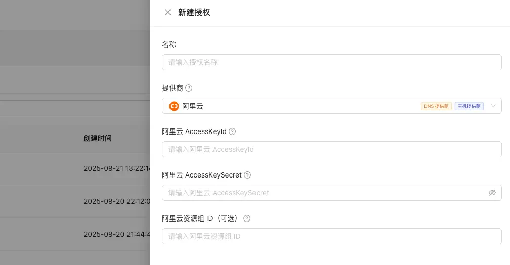

AccessKeyId 和 AccessKeySecret 可以在阿里云控制台上进行获取，具体步骤为：

* 到 RAM 平台创建一个 RAM 账号，专门用来做这种第三方授权的 AK\SK，好处就是相对直接使用主账号来说比较安全；

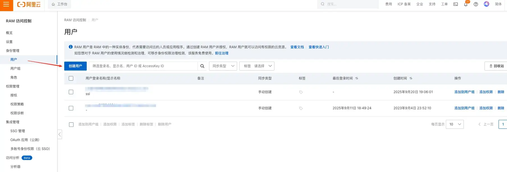

* 然后通过 hover 头像出来的「AccessKey」按钮到 AccessKey 页面去创建一个 AK/SK。

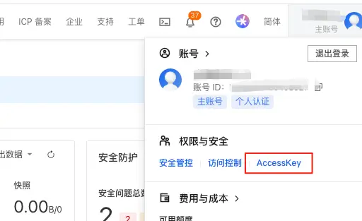


创建好之后一定要妥善保存到本地哦～

* 主机提供商：你的服务器或者云服务的托管方，用于部署签发的证书。我这里使用「远程主机」来存放申请下来的证书。

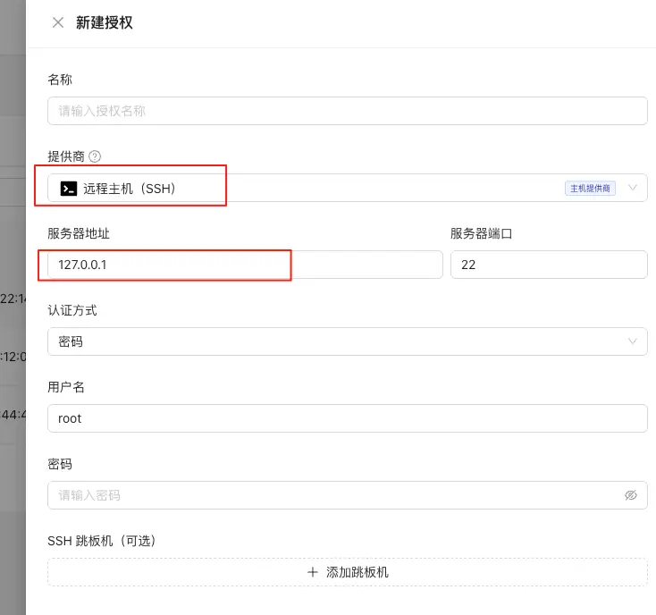

服务器地址一定要写你真实的服务器地址。

* 通知渠道：用于推送消息通知的应用。这里选了飞书（飞书的配置，实打实讲是非常方便的）

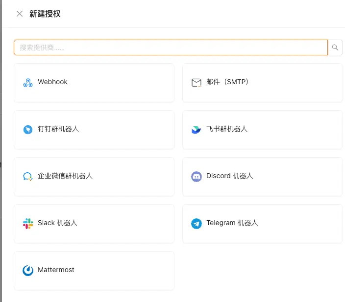

证书颁发机构 Certimate 内置了几个，倒是免去了我们再动手操作的麻烦。

#### 新建工作流

设置完授权之后，我们就可以到「仪表盘」中「新建工作流」了：

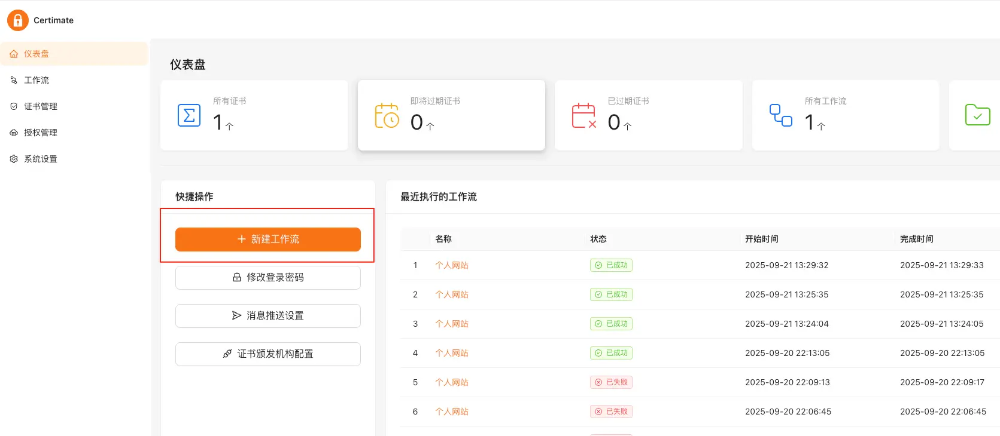

选择标准模板进行创建：

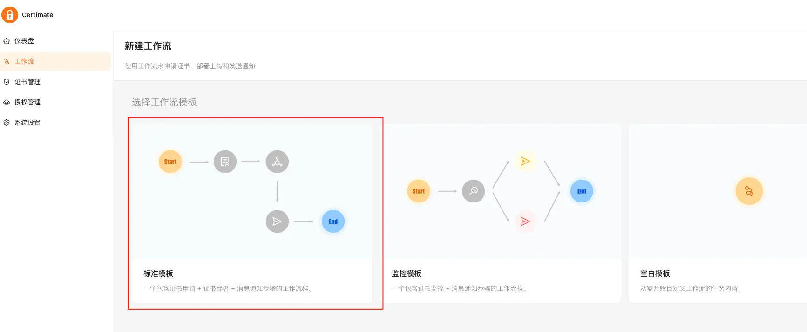

名称大家自己起一个就行，到流程编排页面后，我们修改已有的节点即可：

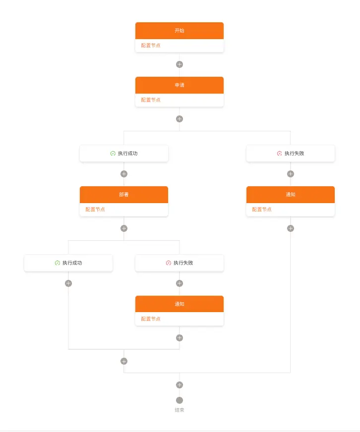

* 首先是开始节点，里面就两个选项：自动触发和手动触发。

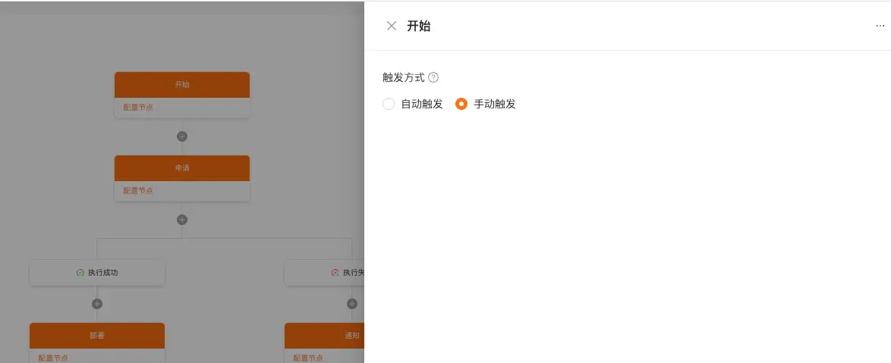

* 接下来是申请证书的节点，里面需要输入域名、邮箱和配置好的 DNS 提供商；

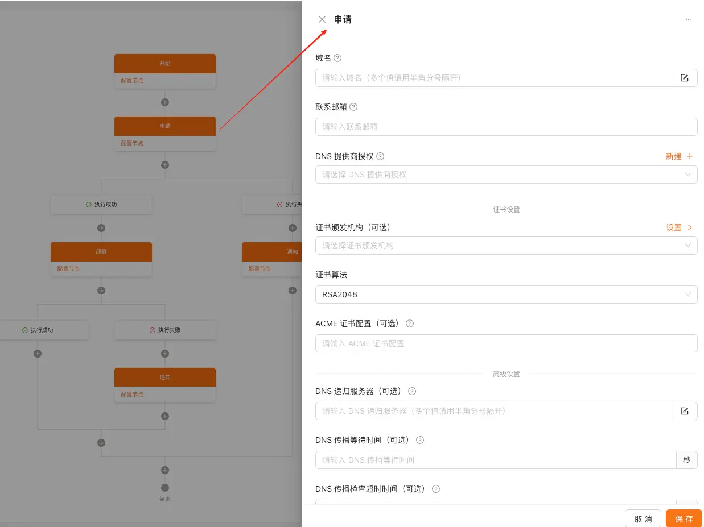

* 第三步的时候会根据成功或者失败走入不同分支。失败会走到通知节点，需要选择通知渠道；

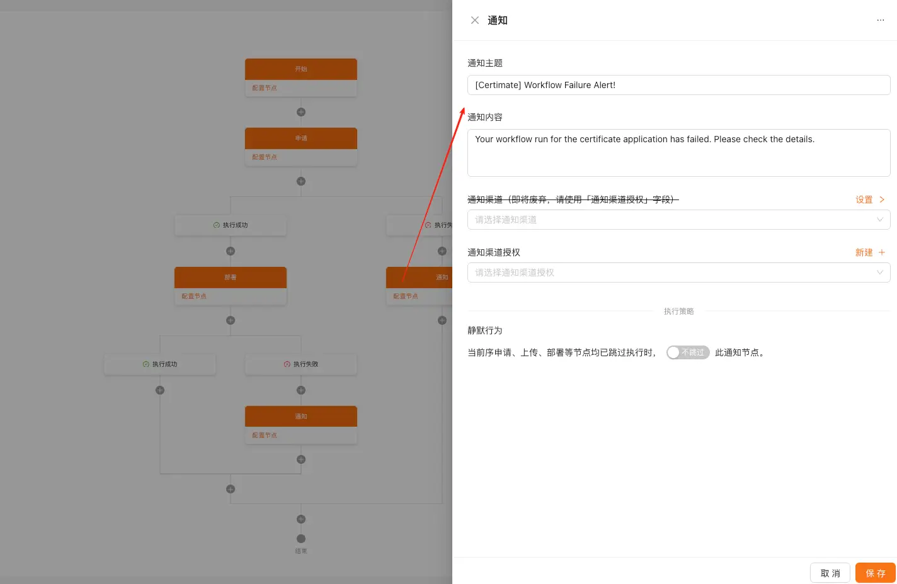

* 申请证书成功会走到部署节点，这里选择你要部署证书的主体，比如你要部署到远程服务器上还是 CDN 加速上；

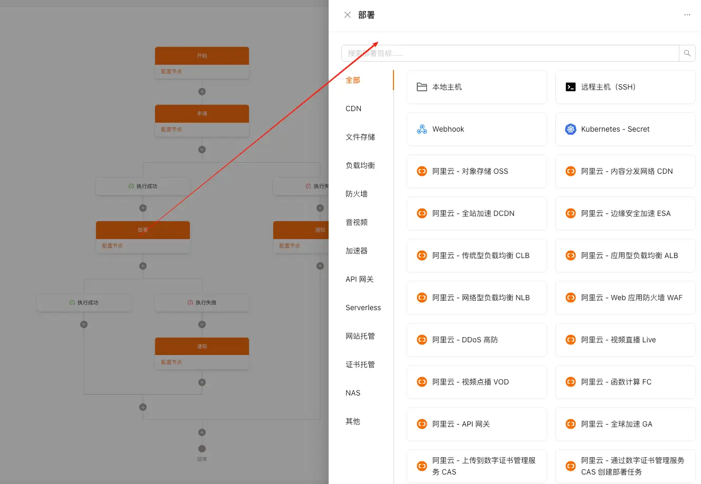

* 最后按照前一步任务是否成功，会走到不同的分支中。如果成功，那整个流程就走完结束了；如果失败会走到另外一个通知节点上，通知用户部署失败。

至此！配置完成。

让我们点击右上角的「发布更改」，再点击「执行」就可以了。

可以在执行历史中看到工作流的执行情况，如果部署成功，以远程服务器为例，可以通过 SSH 登录服务器，在对应目录下查看是否有新的证书文件生成即可～

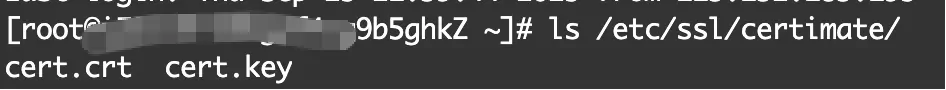

最后，大家需要注意的是，这个路径一定得是你 Nginx 里的 SSL 证书配置路径，**并且要重启 nginx 服务**！不然不生效哦～

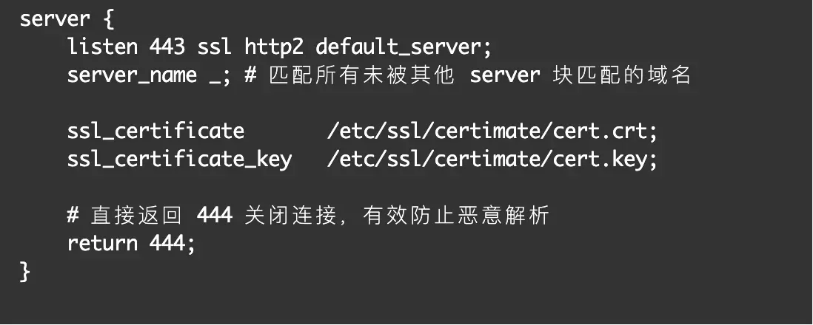

