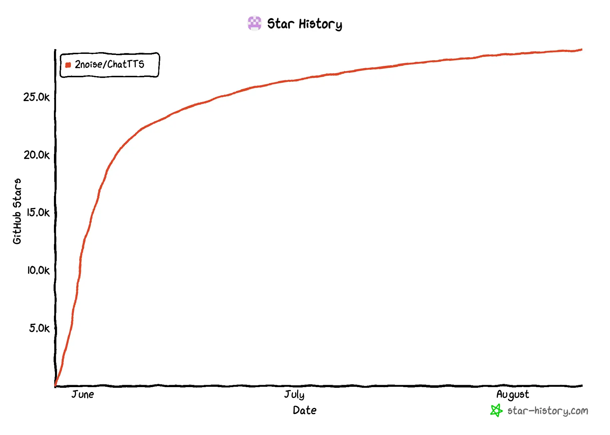
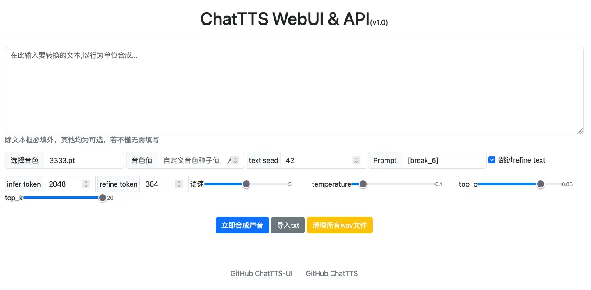
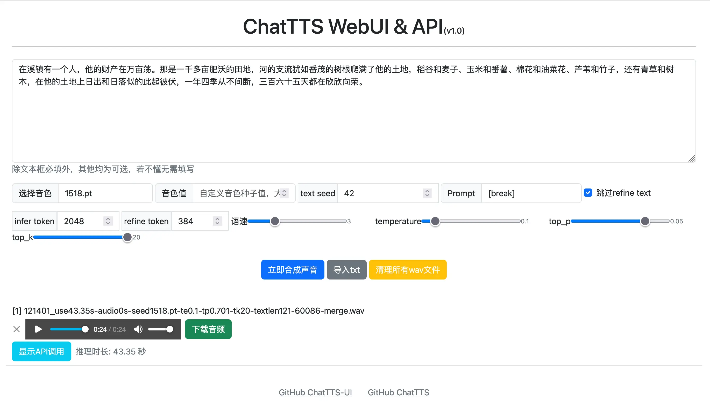
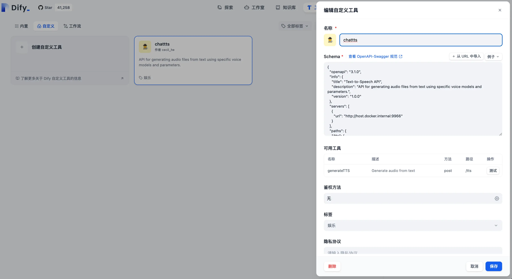
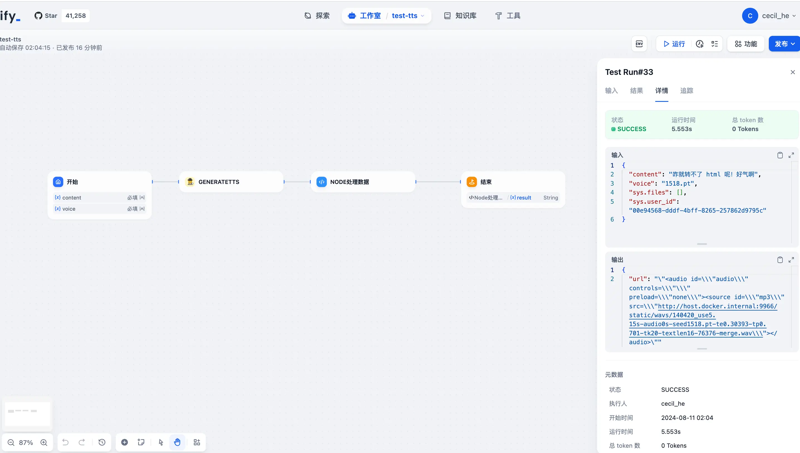
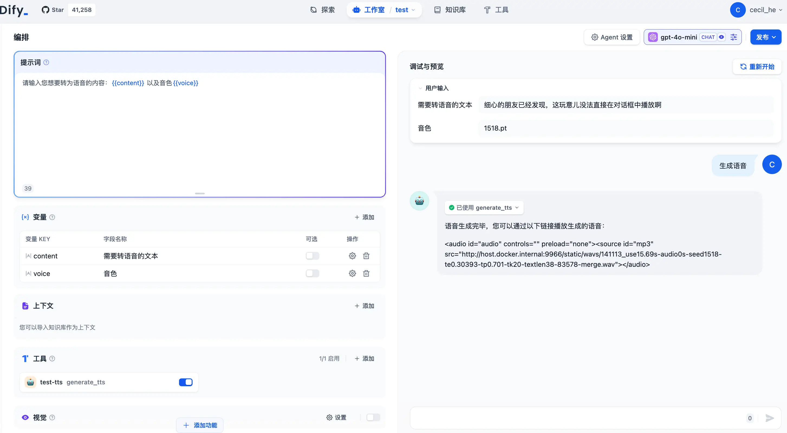

说起**文生语音模型**，最广为人知的肯定是**OpenAI 的 Whisper**，之前试过确实很 OK，不过国内要使用比较麻烦而且收费，所以今天要说的是一款**开源语音模型——ChatTTS**，它在**短短两个月**的时间就获得了**29k 的 Star**。



为什么它如此受欢迎？三金觉得起码有以下三点：

* **开源免费，个人电脑只要配置不是太差都能跑**
* **生成的语音真的很逼真，还可以加一些语气词、笑声、停顿**
* **提供 WebUI，简化操作**

> [GitHub 地址](https://github.com/2noise/ChatTTS)

而在 ChatTTS 开始发力之后，它的**派生项目**也接踵而至，其中比较知名的就是三金部署的——**ChatTTS-ui**，它**简化了 ChatTTS 中的 WebUI**，让用户**只需要关注要转化的文字、音色、语速、语气和笑声**等几个常用项，并支持**对外提供 API 接口**。



接下来我们就从项目部署、使用、及 API 接口逐一介绍～

### 部署

以 Mac 电脑为例，部署超级简单！前置准备有以下三点：

* 首先，电脑上需要有 python 3.9+ 以上的环境；
* 其次，需要安装 git，因为需要拉项目源码，[源码地址](https://github.com/jianchang512/ChatTTS-ui)
* 最后，需要安装可以处理音频文件的库 libsndfile 以及 ffmpeg

```shellscript
brew install libsndfile git python@3.10 ffmpeg

export PATH="/usr/local/opt/python@3.10/bin:$PATH"

source ~/.bash_profile

source ~/.zshrc
```

这样环境就搭建好了。

接下来创建空目录并拉取代码：

```shellscript
mkdir /data/chattts # 没有 data 目录自己建一个

cd /data/chattts

git clone https://github.com/jianchang512/chatTTS-ui .
```

创建并激活虚拟环境：

```shellscript
python3 -m venv venv

source ./venv/bin/activate
```

安装依赖及 torch，并启动项目：

```shellscript
pip3 install -r requirements.txt

pip3 install torch==2.2.0 torchaudio==2.2.0

python3 app.py
```

启动项目后会自动打开浏览器窗口，默认地址是`http://127.0.0.1:9966`，样子就是上面的贴图了。

### 使用

使用方法很简单：

* 输入想要转成语音的内容
* 选择一个自己喜欢的音色
* 点击「立即合成声音」即可



我们也可以（常用）：

* 自定义音色值，选择之后就会忽略左侧所选的音色
* Text Seed：文本种子，它其实是用于 refine text 的停顿。这个值的设置会影响音色、音调。
* Prompt：可以用来添加笑声、停顿等效果。比如`[oral_2][laugh_0][break_6]`，但是这个功能三金试了一下有些问题，并不能如官网上演示的那样添加语气，而是直接把单词读出来了，我看 issue 中也有相同的问题，有大佬知道是怎么回事吗？
* 默认勾选了跳过 refine text，也就是文本优化处理，我们关掉这个之后，就音色和音调都会好很多。
* 语速：这个不过多解释了吧
* temperature：用来控制输出的随机性。啥意思呢？默认是 0.1，生成的语音会比较平稳，我们设置到 0.3 之后生成的语音会更富有感情。

> 其他参数太专业了，不了解了

合成声音之后就会自动播放出来，并且可以下载音频。这里还可以查看对应的 API 调用是怎样的：


### API 接口

如上图，ChatTTS-ui 为我们提供了 API 接口调用，现在就让我们来试一下，在 Dify 中自定义一个 ChatTTS 的工具：



然后先做成一个工作流再插入到 Agent 中使用：





虽然 API 调用成功了，但是在 Dify 中呈现的方式却不是三金预期的，只能点那个链接新开一个页面才能听，有大佬知道咋解决吗？

其他 ChatTTS 的参考资料及派生项目：

* https://github.com/panyanyany/Awesome-ChatTTS
* [基于 ChatTTS 的 2000 条音色库](https://modelscope.cn/studios/ttwwwaa/ChatTTS_Speaker)
* [TTS 编号音色库，可快速查找并试听音色](https://www.ttslist.com/10000cn/)
