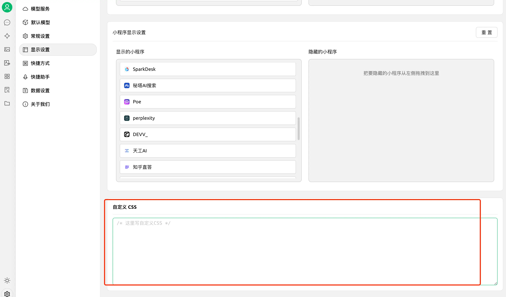

在去年，三金给大家安利过一款 AI 客户端应用 Chatbox，支持电脑客户端、手机应用和网页访问，深受大家喜爱。而今天再次提及它，是因为出现了另外一款功能更为强大的电脑端 AI 应用——Cherry Studio，目前它还没有手机端应用，但因为自身内置了许多功能，使得一大批人从 Chatbox 切换到了 Cherry Stduio。

那它到底有哪些功能呢？抛开基础聊天助手功能之外，它提供了以下功能：

* 智能体
* 绘画
* 翻译
* 小程序
* 知识库
* 文件

算上聊天助手一共七个功能。

除此之外，它还内置了很多服务商，光集成的大语言模型数量就超过了 300 多个。已集成的服务商详见[服务商配置](https://docs.cherry-ai.com/cherry-studio/pre-basic/providers)。

##### 聊天助手

这里和其他 AI 应用相同，又与其他 AI 应用不同。

相同的是：

* 都提供了会话界面，以及快速使用 Agent 的功能；
* 可以设置对话配置，比如模型类型、提示词、温度（Temperature）以及 Top P（核采样)等等。

不同的是：

* Cherry Studio 提供了更灵活的自定义方式，提供了话题功能，话题是助手的父集。单个助手下可以创建多个话题。

* 还能设置交互体验和自定义样式

* 在对话框中，还提供了翻译和知识库的功能，没错！Cherry Studio 还有知识库功能，这个后面会介绍

##### 智能体

Cherry Studio 目前内置了 32 个行业的智能体，每个智能体下都有 N 多个预设角色，超级方便！

##### 绘画

绘图目前智能使用硅基流动的 API，连页面都和硅基流动的长得一样：

##### 翻译

接下来就是翻译了，内置的翻译功能，不但有单独的页面，还可以在对话框中一键进行翻译：

##### 小程序

小程序，看起来其实就是将各大服务商的网页版嵌入到了应用中，相当于在应用加了一些书签。不过目前暂不支持自定义添加和删除。

##### 知识库

在 AI 客户端中嵌入知识库真的很棒！不但可以上传单个不同的文件，还能设置：

* 本地目录
* 具体网址
* 网站
* 添加笔记（当场手敲可还行）

##### 文件

在这里我们能看到对话、知识库、绘画里用到的文件，比如我们在对话中上传了一个文件，那么这个文件就可以在这里看到：

### 项目地址及官方地址

[Github](https://github.com/CherryHQ/cherry-studio)

[官方文档](https://docs.cherry-ai.com/cherry-studio/cherrystudio/preview/agents)
