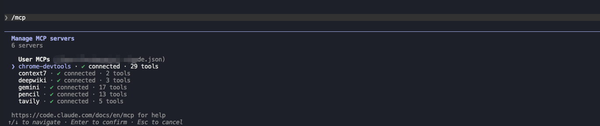
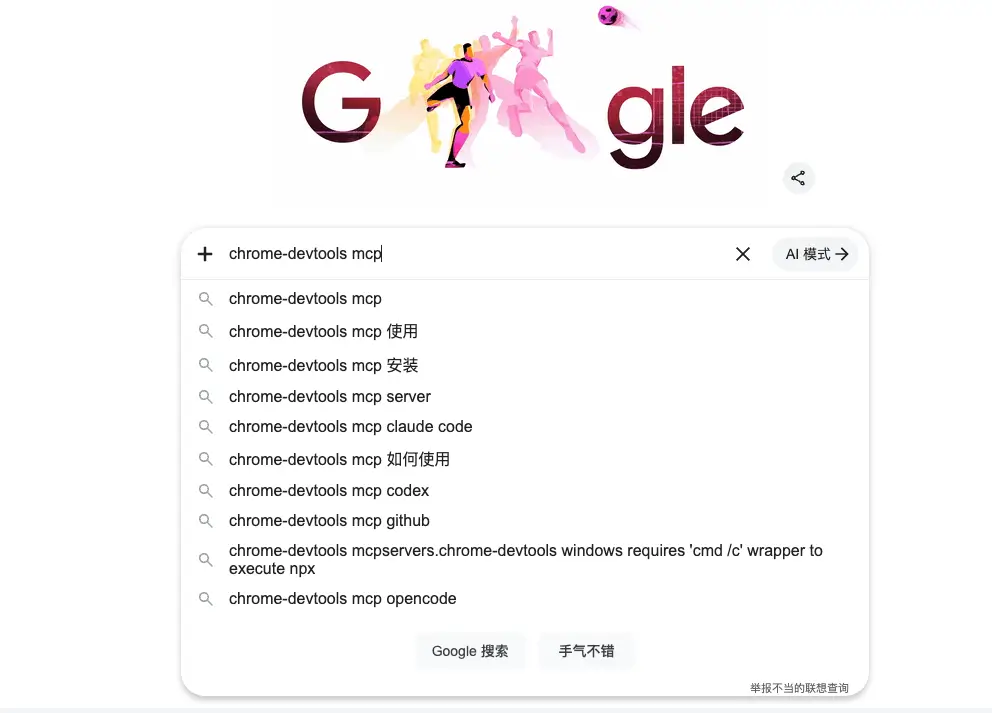
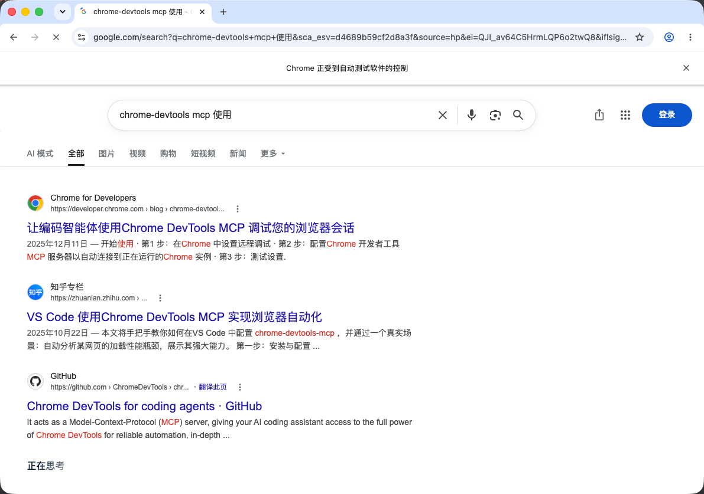
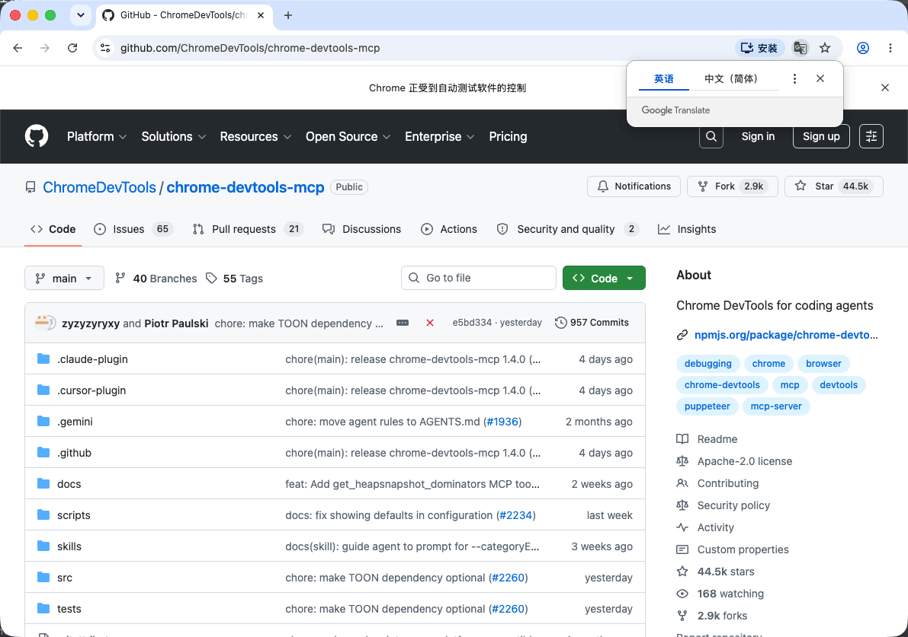
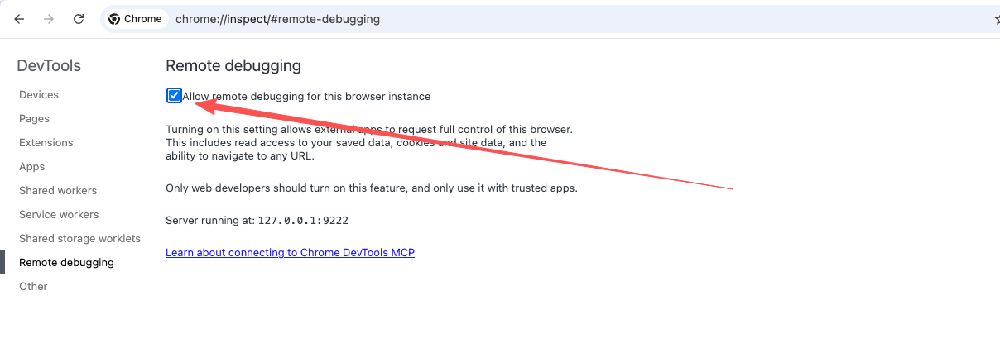
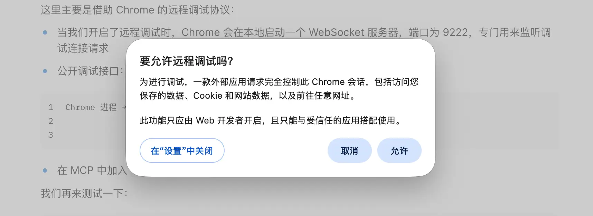
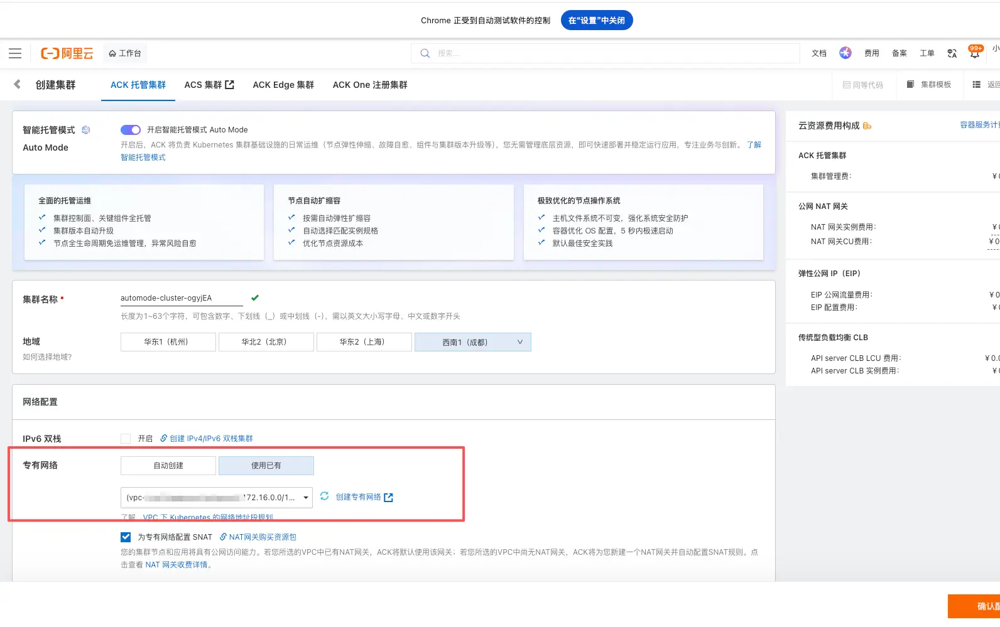
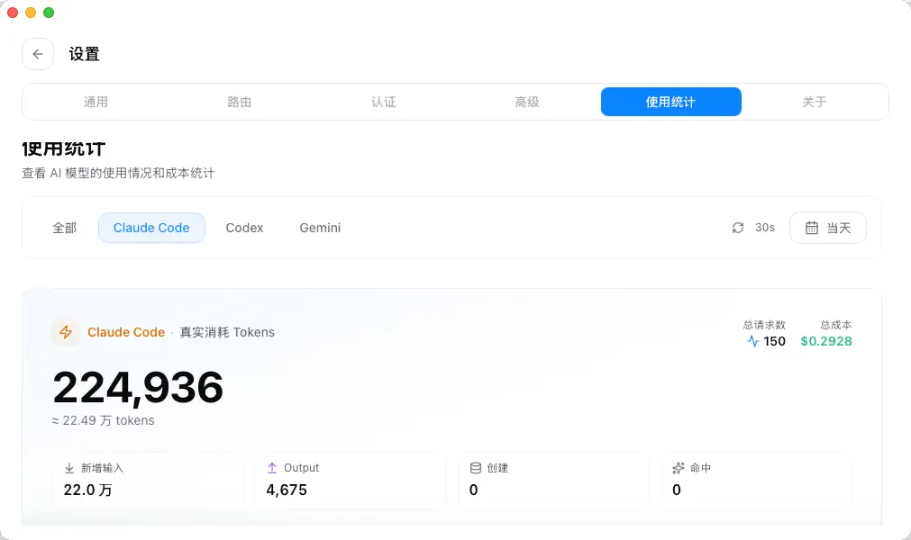

Hi\~这里是三金。

最近 AI 提效搞得人焦头难额，工作量相比之前一下子翻了倍，早期的一些想法也卡了壳，有点痛苦😖。

乘着这周末有点时间赶紧再推进一下。

上次我们尝试了 Playwright MCP 来做 E2E 自动化，操作下来发现它虽然可以按照预期进行操作，但是 token 消耗巨大，所以这次三金找了 Chrome 浏览器的衍生 MCP —— chrome-devtools MCP 来体验一下。

> 本次测试的流程和 Playwright MCP 是一致的，确保在相同场景下，可以对比出哪个工具更流畅，更具性价比。

### Chrome-devtools 简介

2025 年 9 月份的时候，Chrome 官方推出了 Chrome-devtools MCP，它能让 AI 直接操作 Chrome 浏览器，并可以调试网页。包括但不限于：

* 通过使用 Chrome 开发者工具分析网络请求、记录性能轨迹用于性能分析，以及检查控制台日志
* 还可以模拟用户行为，比如导航、填写表单和点击按钮（这不就是 E2E 需要的！）
* 遇到难以解决的布局样式问题，还可以让 AI 通过检查 DOM 和 CSS，自动进行样式布局调整（后端同学也不怕不会调样式了）
* 其他

### 安装

我们还是以 Claude Code 为例，有两种安装方式：

```shellscript
# claude 命令安装
claude mcp add chrome-devtools npx chrome-devtools-mcp@latest
```

另外一种方式是手动将对应的 JSON 内容贴到 MCP 配置文件中：

```json
{
  "mcpServers": {
    "chrome-devtools": {
      "command": "npx",
      "args": ["chrome-devtools-mcp@latest"]
    }
  }
}
```

配置好之后打开 claude 输入 `/mcp` 进行查看：



### 使用

明确告诉 AI 使用 chrome-devtools mcp 打开指定网站并进行操作：

```
使用 chrome-devtools mcp 打开浏览器：
1. 访问 https://google.com
2. 在搜索框中输入 chrome-devtools mcp，并点击搜索
3. 在搜索结果页面，点击第一个搜索结果
```

和 playwright 一样，chrome-devtools 也是单开一个浏览器实例在上面进行操作：









整个过程很顺畅！不愧是一个家族的～

### 直接访问已打开的浏览器实例

回归到最贴近开发测试的场景，如果需要登录态该怎么办？

在 Chrome 官方的博客中有提到从 Chrome 144+ 版本起，只要大家按照以下两步进行操作，就可以直接访问已打开的浏览器实例：

1. 在 Chrome 浏览器中通过 chrome://inspect/#remote-debugging 启动远程调试服务器
2. 在 MCP 配置中增加 `--autoConnect` 或者 `--auto-connect`

```json
{
  "command": "npx",
  "args": [
    "chrome-devtools-mcp@latest",
    "--autoConnect"
  ]
}
```



这里主要是借助 Chrome 的远程调试协议：

* 当我们开启了远程调试时，Chrome 会在本地启动一个 WebSocket 服务器，端口为 9222，专门用来监听调试连接请求
* 公开调试接口：所有打开的标签页、扩展程序等都会通过 CDP 暴露可操作接口

```
Chrome 进程 → 启动 WebSocket 服务 → 监听 localhost:9222
                                    ↓
                              暴露所有标签页的调试端点
```

* 在 MCP 中加入 `--autoConnect` 之后，它会自动发现已运行的 Chrome 实例。

我们再来测试一下：

```
使用 chrome-devtools mcp 打开浏览器：
1. 访问 https://cs.console.aliyun.com/
2. 点击创建集群
3. 在专有网络上点击使用已有
```





也是在已有实例的情况下，按照步骤丝滑进行了浏览器操作。

### 优势

chrome-devtools 是 Chrome 官方生态，所以天生比其他类似的 MCP 产品更占优势。

* 不用额外安装浏览器插件
* 除了可以做浏览器自动化之外，还能做性能分析、样式调整、Mock 等
* token 消耗相较于 playwright 成多倍数下降，相同的操作，playwright 要多于 chrome-devtools 几倍



### 缺陷

因为 Chrome 浏览器要一直开着 9222 端口的调试服务，且会暴露所有标签页的调试端点，所以如果电脑配置不太行，会越用越卡😂

而且如果测试用例内容过长，LLM 上下文消耗也会越快，不过这一点倒是可以使用切片的形式来解决。

小伙伴们还有别的工具或者成熟的 E2E Skill\Harness 推荐吗？可以打在评论区一起讨论～
