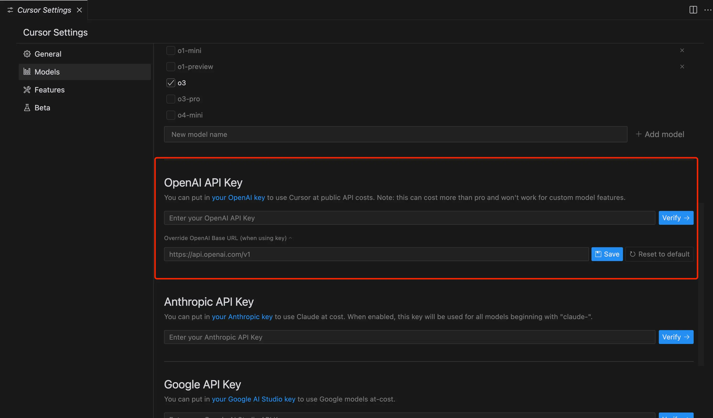
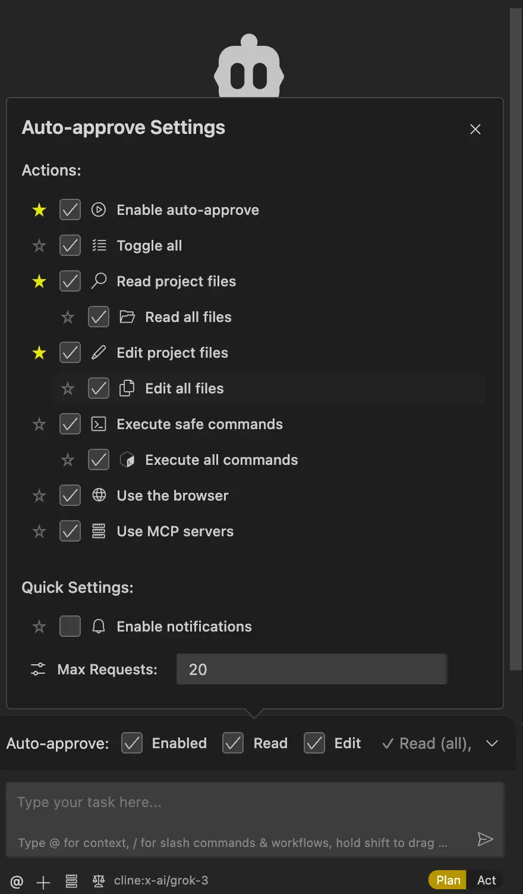
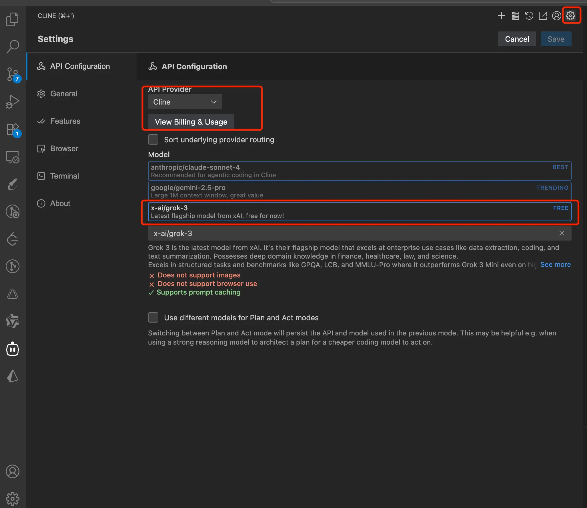
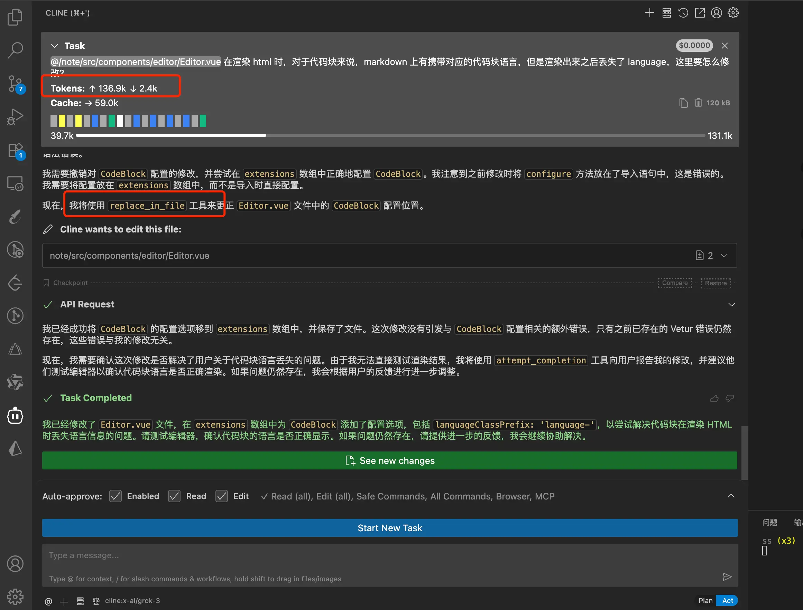

哈咯～大家好，我是三金！

自从 Cursor 的免费体验到期之后，我就暂停了 Cursor 的使用，转而开始尝试字节的 Trae AI 编辑器，该说不说国际版的 Trae 在未收费之前真的用得贼爽，尤其是现在还上了 Claude 4.0 Sonnet、Gemini 2.5 Pro 和 GPT 4.1\4o 模型，它们的编码能力强到令人惊叹。

在使用过一段时间的 Trae 之后，我发现我已经离不开 AI 编程了。直到，它开始收费......

其实就 Trae 的收费定价来说，不是很贵，相比其他 AI 编辑器甚至只有一半的价格（对，就是 Cursor）。首月 3 刀，后面每月 10 刀，也可以直接按年购买，算下来每个月 7.5 刀左右。

> 算完之后，三金心里：对对对！卷起来，把价格打下去！

但是话说回来，对于编程重度患者来说（刚需），购买 Trae 或者 Cursor 都说得过去。但如果只是偶尔需要 Coding 一下的话，花几十块买一个月的使用期，可能大部分时间都存在资源浪费的情况。

可能这里有小伙伴会说：可以自定义模型呀，这样就可以使用本地大模型了～

这个三金肯定也尝试过了：

* Trae：没有提供 Ollama 的选项，都是各大云厂商的；

* cursor：这里倒是可以自定义 OpenAI 的 url 来实现，不过再便宜的模型都顶不住 Agent 狂造，token 蹭蹭蹭的涨，钱包蹭蹭蹭的瘦。

至此，我瞄向了 Cline。

Cline 是 VS Code 编辑器的一款 AI 插件，目前下载量已高达 180w！它支持：

* MCP Server；
* 众多的 AI 大模型选项，还可以白嫖 Grok3；
* 上传文件或者图片；
* Plan 模式：统筹规划。我们可以将其理解为是一个架构师的预设角色，它可以做新功能设计和架构决策分析；
* Act 模式：执行模式。会按照用户的输入，理解和实施既定方案，也就是输出常规代码、执行测试用例等等；
* Auto-approve Settings-自动审批功能（其实就是用户可以选择性地授予 Cline 更高程度的自主权，让其能在一些场景下自动执行一些任务）。

令人惊喜的是，在 Cline 提供的模型中，Grok3 模型竟然是免费的！虽然它不支持图片解析和使用浏览器，但这并不影响我们使用它进行 AI Coding：

配置好模型之后，我们返回 Chat 页面，选择 Act 模式，输入要实现的功能，让 Cline 开始工作！这里它会展示出：

* 消耗的 token；
* 调用的工具；
* 最终的解决方案。

效果还是很出色的！要是需求明确，输出的代码运行起来基本符合预期，这不仅仅是 Cline 的功劳，Grok3 模型也展示出了极强的能力，且整个过程都是免费的。

这是使用 Cline 修改之前的页面：

这是使用 Cline 修改之后的页面：

说实话，我使用 Trae、Cursor 以及 Trae CN 都没有实现上面的效果，最终还是 Cline 帮我实现了。

对于 Trae CN 没实现预期的效果我能理解，毕竟那些可选的模型在代码能力上可能不如 Grok3，所以导致没有实现；

但是 Cursor 和 Trae 国际版也没有实现，我其实有些没想明白：

1. 在 Trae 还没收费之前我就尝试让它来优化这个笔记项目，在编辑器改造和菜单改造上很吃力，经常改着改着就把原有功能改没了，我只能在某个修改稳定之后提交一次再接着下一步；
2. Cursor 也是一样（我又搞了个邮箱白嫖了一下），大部分时间能完成一部分预期的效果，但是整体总是差强人意，配置 rule 的话，又增加了学习曲线，成本有些高；
3. 在代码模型上，均选的 Claude 3.7+ 模型，代码编程能力毋庸置疑。

反观 Cline 就没有这些问题，相同的提示词 + 免费的大模型 Grok3 轻松搞定！

整体使用体验就是：它放佛真的理解了我的需求，并细化拆分了这个部分，然后有序地、有条理地完成功能。上手难度及易用性远小于 Cursor。
