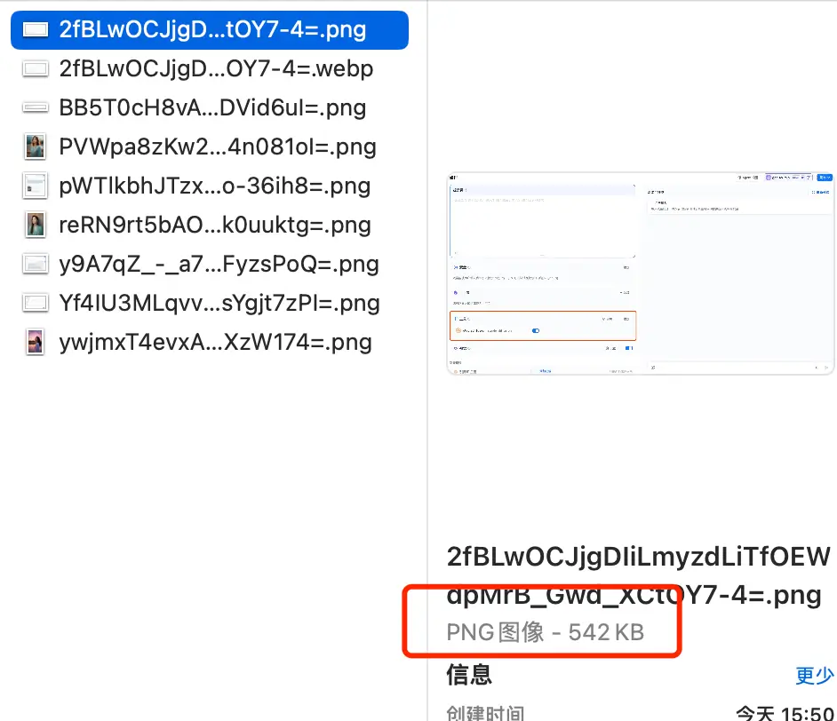
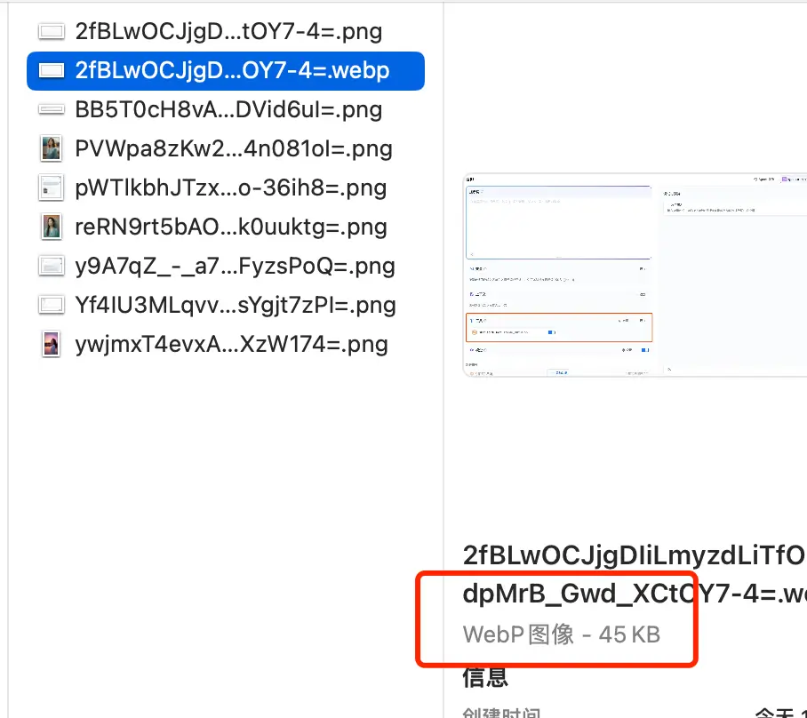
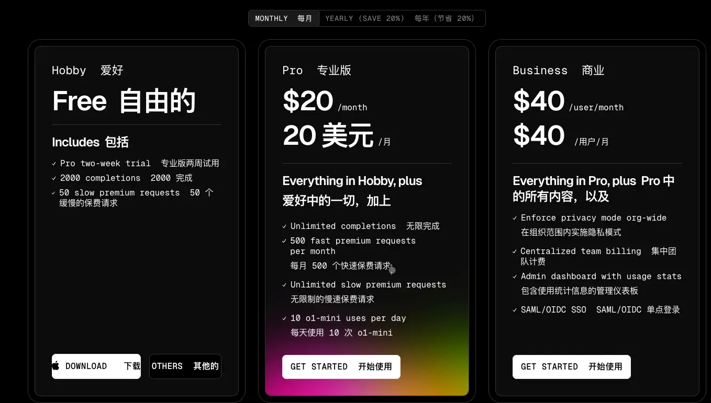
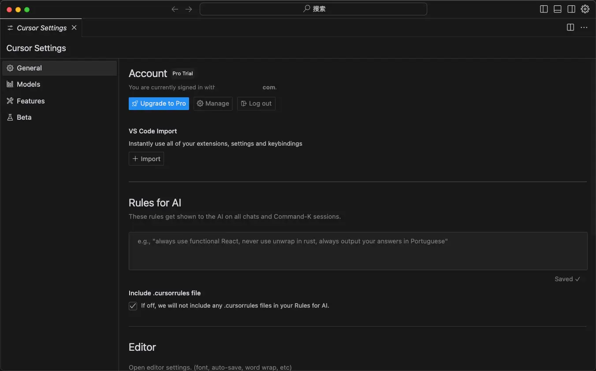
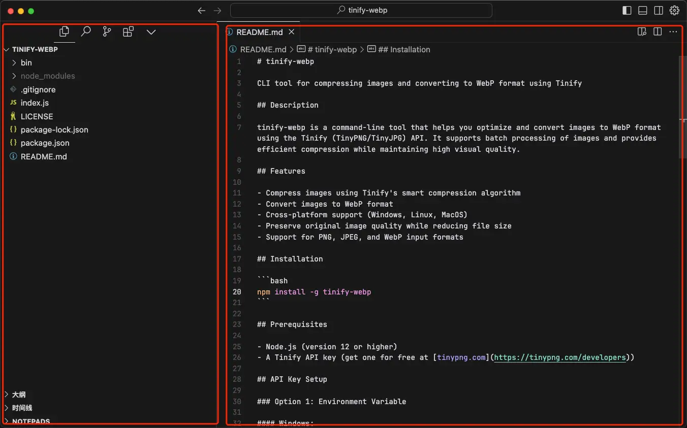
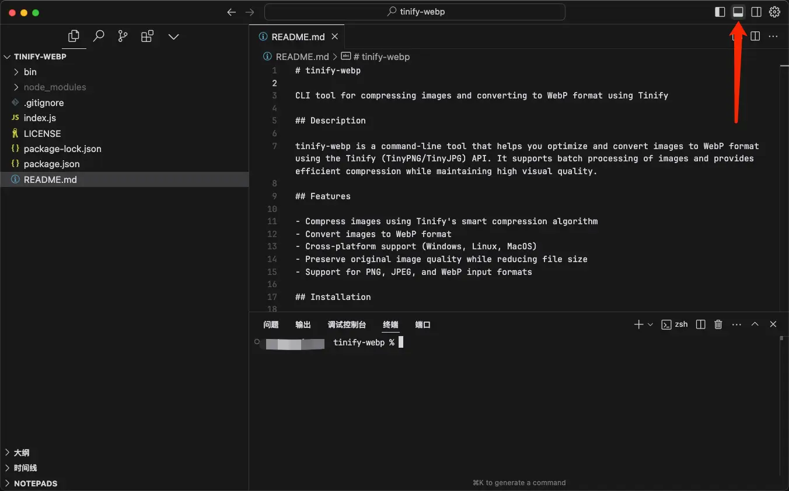
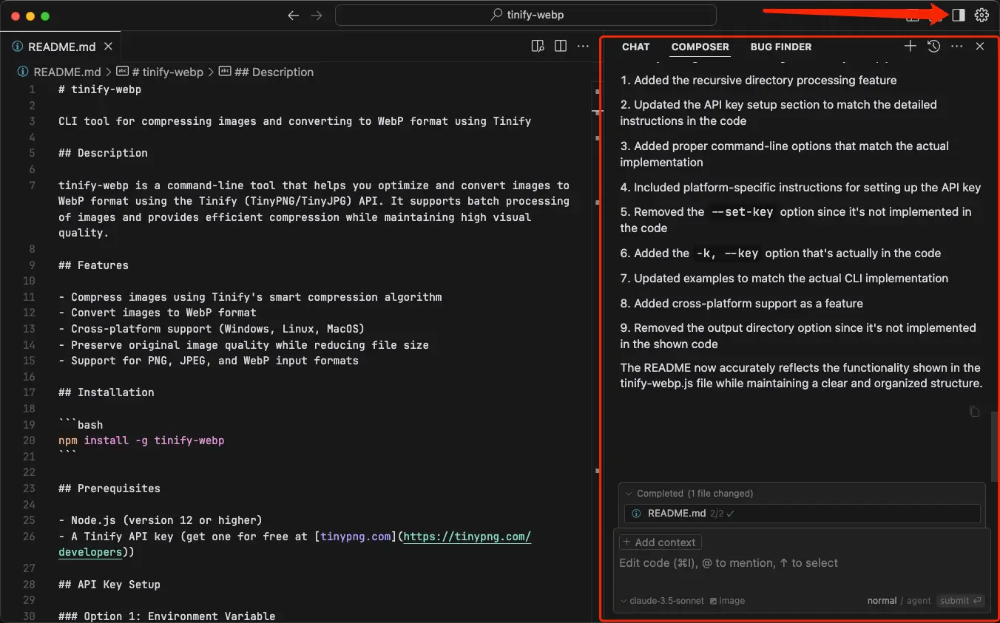
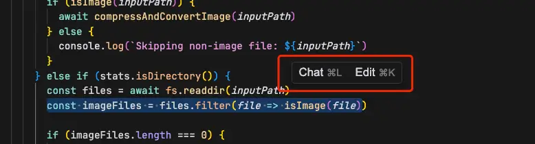
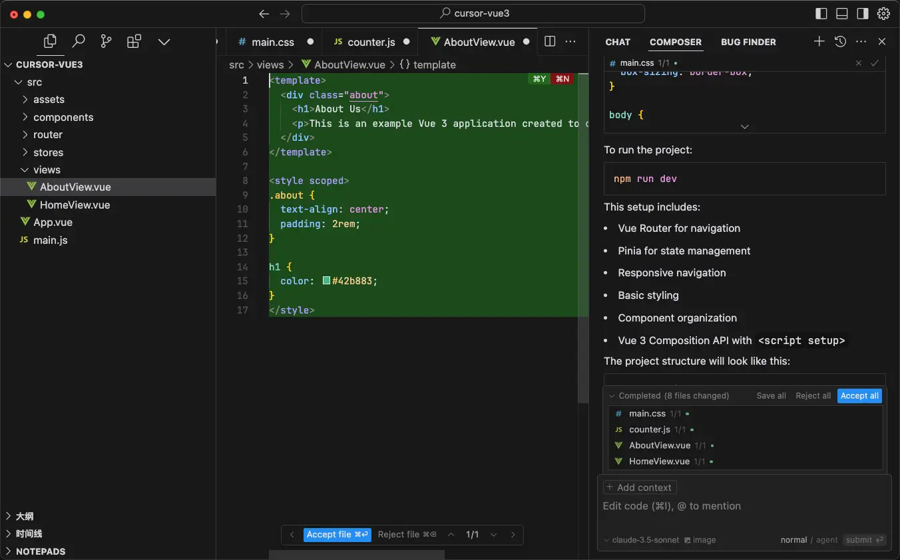

Cursor 这个 AI 编辑器其实已经出来很久了，但是刚开始一直不温不火，不知道在啥时候就突然热度高了起来。我记得我是在 23 中旬的时候就安装了 Cursor，当时并没有认真探索过，只是将它作为一个 AI 客户端来用，现在想来有些过于浪费了🤔。

今天心血来潮迁移了之前使用 Next.js 做的博客，因为打包编译久不说，还由于之前使用的 Github Actions 方案不合理而导致时不时会出现部署失败的情况，所以干脆直接换掉。

这次选择的博客框架是 Hugo，和 hexo 很相似，都是直接使用 Markdown 来写文，然后使用命令行的方式进行编译，配置上比较简单，一般来说选好模版之后直接无脑使用即可。

选它的原因是因为快！它是用 Go 写的，这玩意儿做工具不得不说真的很棒，前端新一代构建打包工具 vite 底层也是 Go。

回到 Cursor 上来，我在迁移博客之后对其进行了一些样式和工具上的调整，而这些都是直接使用 Cursor 来实现的，今天用它做了一个 `tinify-webp` 的 npm 包，专门用来将图片进行压缩及格式转换，效果很明显，上百 Kb 大小的图片在经过压缩和格式转换之后只有几十 Kb，还不影响图片的清晰度，对建站的人来说简直 YYDS～

那怎么使用 Cursor 呢？

其实和平时使用的编辑器一样，直接从官网下载即可，官网地址：https://www.cursor.com/。

下载安装之后，大家首先要做的就是登录。因为 Cursor 提供的 AI 编程能力实际是收费的，没有账号的话无法正常使用 AI 提效。注册 Cursor 的方式有三种：

* 邮箱注册
* 使用 Google 账号登录
* 使用 Github 登录

> 如果使用 Google 或 Github 进行注册可能会有网络问题，所以最好开启网络加速。

新用户一般有 14 天的试用期，14天之后就只能使用免费版本的功能。下图是它的收费标准：

安装好之后我们打开 Cursor 的客户端并记得进行登录：

实际上 Cursor 的布局和 VSCode 很相似，所以我们也可以很平滑的从 VSCode 切换到 Cursor：

点击右上角的「切换面板」图标可以快速唤出内置的终端：

点击右上角的「Toggle AI Plan」图标唤出 AI 面板：

我们既可以直接在代码中使用 AI 功能，也可以在 AI 面板中使用。两种方式针对的场景不同：

**在代码中使用**

在代码中 Cursor 提供了大家比较熟悉的 Tab 补全功能，也提供了针对选中代码的 Chat 和 Edit 功能：

这个场景下我们可以针对某一段代码进行优化或者生成注释：

* 尤其是在**维护前同事没有注释的代码**时及其有用！
* 当然，我们也可以使用这个功能来**阅读一些优秀的开源项目**。

**在 AI 面板中使用**

这个功能更适合**直接生成代码文件以及批量修改某个模块的代码**，**甚至你可以让它直接给你生成一个完整的项目**。

> 下图是直接生成了一个 Vue3 的项目，只要安装相关依赖就可以直接 `npm run dev` 了！

Cursor 非常适合独立开发者和一些有相关经验的互联网从业者，简直是开发利器，我们只需要输出自己的需求，代码完全交给 Cursor 帮我们输出，我们只需要验证一下最终是否可以正常跑起来以及效果是否符合预期即可。

篇幅有限，先安利到这，下一篇聊下如何利用之前的 13 行代码做出了 `tinify-webp` 工具。
