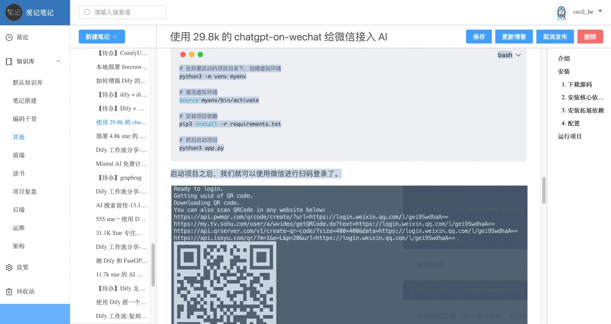
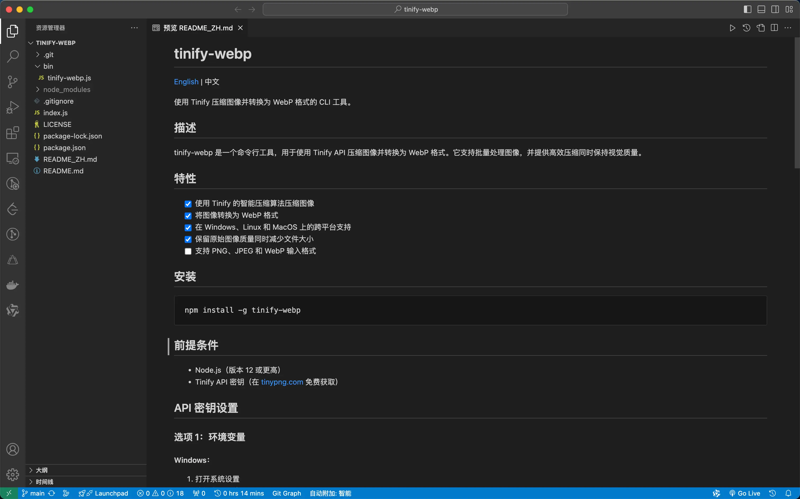
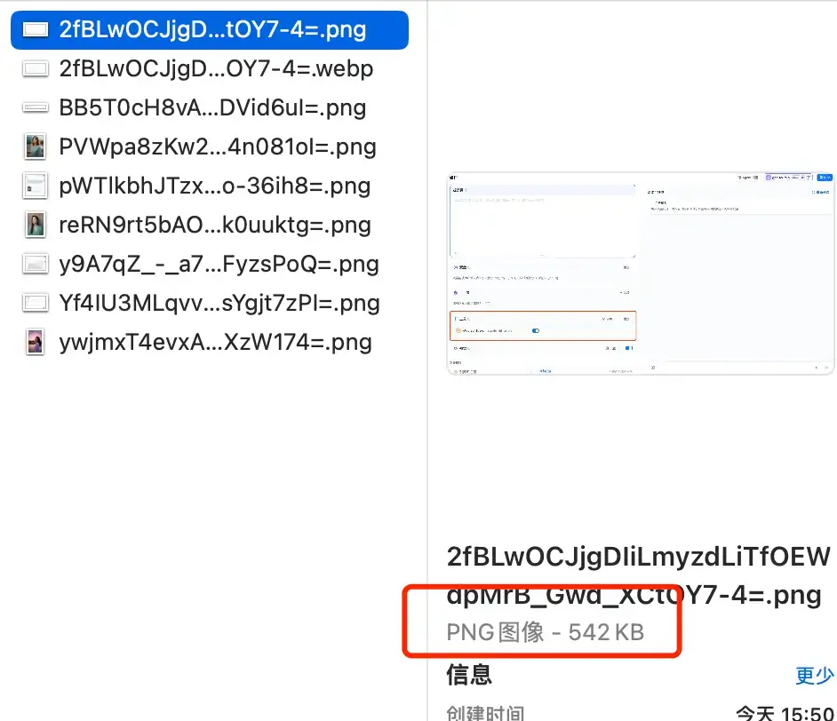
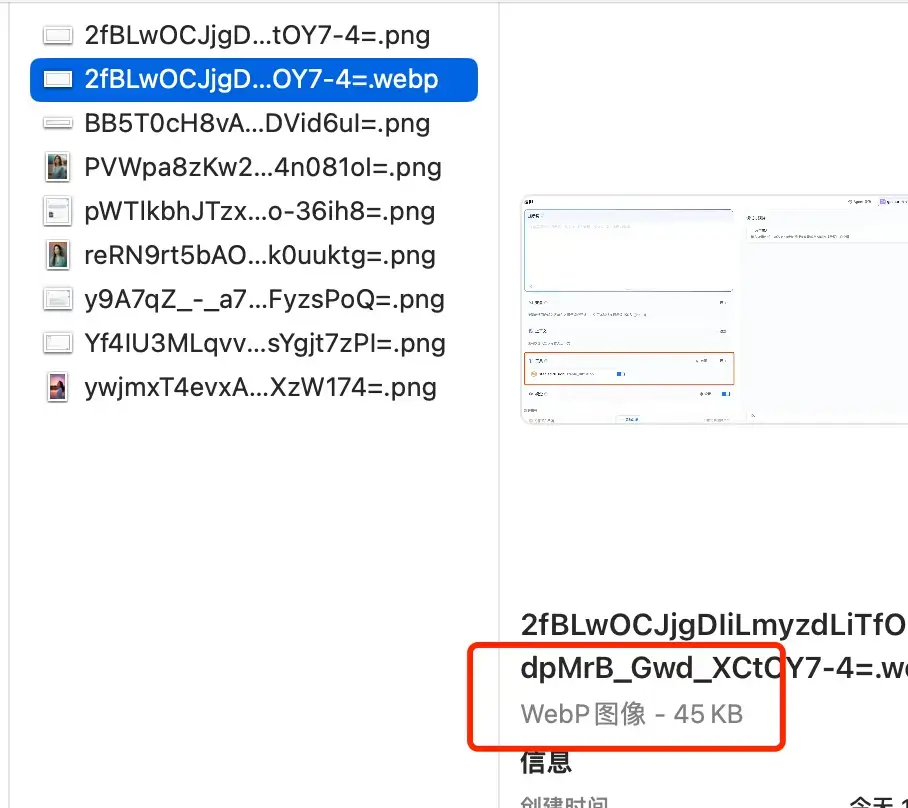

前两天我因为博客图片太大的原因，重新拾起了荒废一年多的 Cursor，仅用一小时不到的时间就为我写好了压缩图片的工具，并将其发布成了一个 npm 包—— `tinify-webp`。

基础代码是这一段：

```javascript
import tinify from 'tinify'

tinify.key = 'xxxx';
tinify.validate(function (err) {
  if (err) {
    console.log(`API 错误：${err}`)
  }
})

export const tinifyImg = async (fromBuffer: Buffer) => {
  const stream = await tinify.fromBuffer(fromBuffer).convert({
    type: "image/webp"
  }).toBuffer()
  return stream;
};

```

这是在我前年写的一个笔记项目中的代码，这个笔记项目我一直在用，除了有所见即所得的效果之外，最大的亮点就是可以和我的博客进行关联，我可以自己选择是否将笔记发布为博客。



样子有些简陋，UI 框架使用的是 ElementUI，开发这款笔记应用的初衷是想将笔记和博客关联起来，正巧那会儿 Vue3 出来没多久，就直接拿来练手了。

基本的功能都有：

* 二级菜单栏支持新建分组和笔记；
* 图片压缩转换格式并上传至服务器；
* 所见即所得；
* 发布博客 - 将笔记上传至 Github，然后通过 Github Actions 来自动进行部署；
* 数据库定时备份到阿里云 OSS。

目前因为有一个渲染层面的 Bug，所以暂时没有在用（其实是找到更好的开源产品，不过就没有了关联博客和定时备份数据库的能力）。

因为没有了博客关联能力，且因为之前博客的一些性能问题，我也换了博客的框架，在其中遇到了一些问题：

* 图片过大导致加载缓慢；
* 样式。

在之前的文章《[我竟然在 2023 年就安装了 Cursor 🤯，但是最近才开始用它](https://mp.weixin.qq.com/s/c1CSs2arAYnK0TuM_4DoSg?token=684367156\&lang=zh_CN)》中有提到，我现在使用 hugo 搭建博客，图片都是在 Github 上的，虽然使用了 CDN 加速，但是效果并不是很明显，主要根源还是在图片资源大小上。

所以我就想何不基于上面那段代码做一个命令行工具，先手动压缩转换博客中的图片？

在使用 Cursor 实现这个功能时真的特别简单，因为我的目的是明确的，基于已知代码进行改造，所以我只做了两件事：

* 创建一个新文件夹，并将这段 JS 代码文件放到里面；
* 使用 Cursor 打开该文件夹，使用 AI Composer 输入我的目标即可。

以下是 Cursor 帮我扩展出来的 `tinnify-webp` 项目，目前已经发布到 npm 上，有兴趣的小伙伴可以 `npm i -g tinify-webp` 尝试一下。



从有想法到实现，一共不到一小时，小问题是有，在生成的 README 中，有一些幻觉功能描述，检查之后删除就 OK 了，除此之外再无问题。

这里也放上我当时的提示词：

1. 请扩展这段代码，将其改成名为 `tinify-webp` 一个 npm 包；
2. `tinify-webp` 的 API 密钥改为从环境变量中获取，在使用时需要提示在哪里获取 API Key 以及如何设置环境变量；
3. 需要支持批量压缩；
4. 修改完之后将如何发布到 npm 的步骤也一起提供给我；

> [项目地址](https://github.com/foxhsx/tinify-webp)，欢迎 Star 👏

以下是工具运行效果图：


图片在压缩转换后的前后对比显著：




