前段时间给大家介绍了一款学习源码的网站——GitDiagram，可以使用它来生成开源项目的架构关系图，帮助用户快速理解复杂源码结构。

而这次给大家介绍另外一款非常牛的网站——DeepWiki，DeepWiki 是由 Devin 团队 Cognition AI 推出的一款新产品，它可以利用 AI 大模型为开源项目或者私有项目（付费功能）：

* 自动生成详细且易读的类 Wiki 文档；
* 提供交互式图表（架构图和流程图）；
* AI 对话助手，我们可以通过对话的方式来和文档进行“交流学习”；
* 深入研究（Deep Research）功能，如果你想了解代码库的设计理念或者最佳实践，就可以尝试此功能。

这里我们以前端流行框架 React 为例，因为这个框架已经被 DeepWiki 索引过了，所以可以直接在 home 页找到：

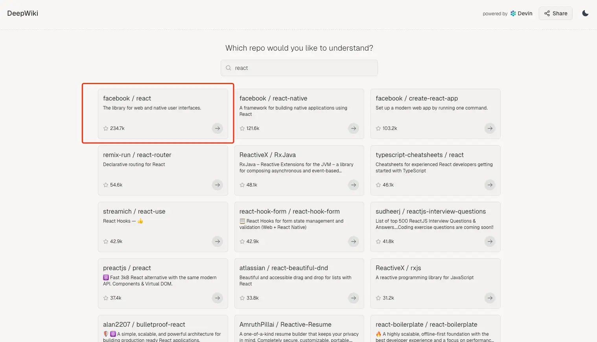

点开之后就可以看到 DeepWiki 为其生成的文档，文档中还有一些架构图和流程图：

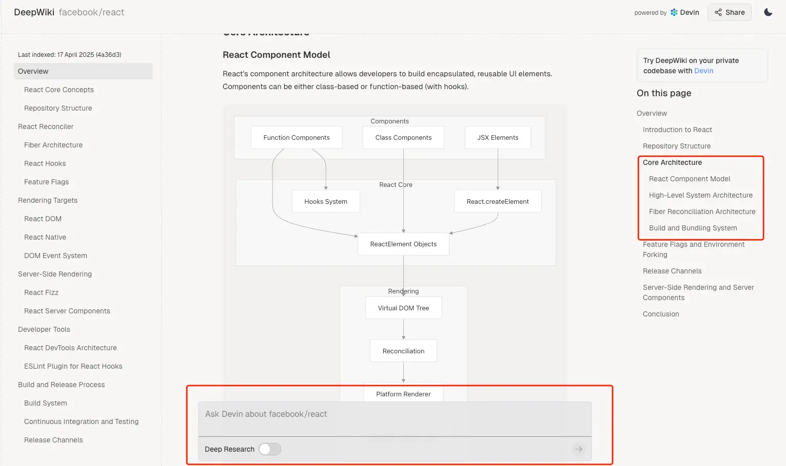

我们可以直接阅读文档，也可以在页面下方的 AI 对话框中进行提问。

比如：

* 如何快速创建一个 React 项目？

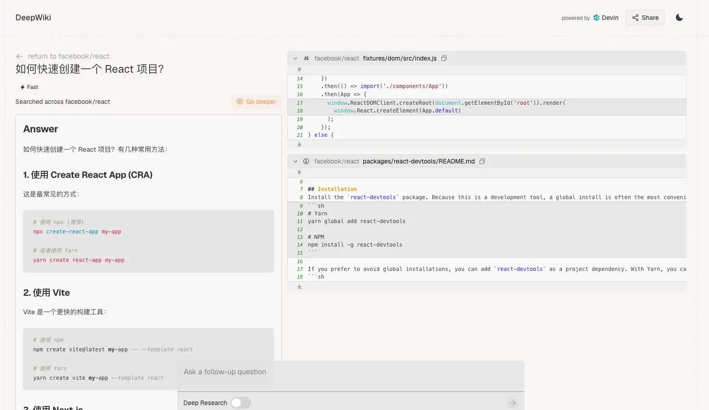

* React 的设计思想是什么？

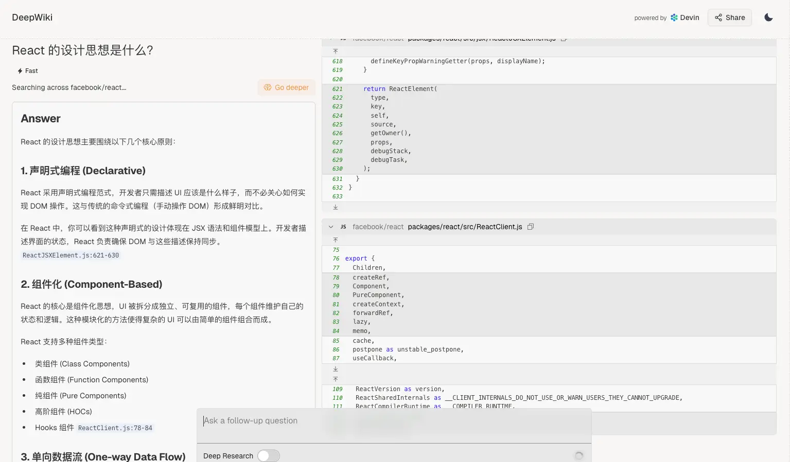

> DeepWiki 传送门：https://deepwiki.com/

除此之外，还有两种方法：

* 直接替换仓库地址。比如原来的仓库地址是 `https://github.com/foxhsx/tinify-webp`，只要将 github 改为 deepwiki 即可 `https://deepwiki.com/foxhsx/tinify-webp`。
* 使用 Tampermonkey 脚本，这个需要先安装浏览器插件，对于新手小白来说不太推荐。因为直接访问地址的方式更加直观，二来这种脚本插件也存在一定的安全隐患。

那 React 是已经收录过的代码库，对于没有收录过的代码库，要怎么办呢？

比如我要搜索 tinify-webp 这个项目，发现它并没有被 DeepWiki 收录，那么此时会看到这样一个页面：

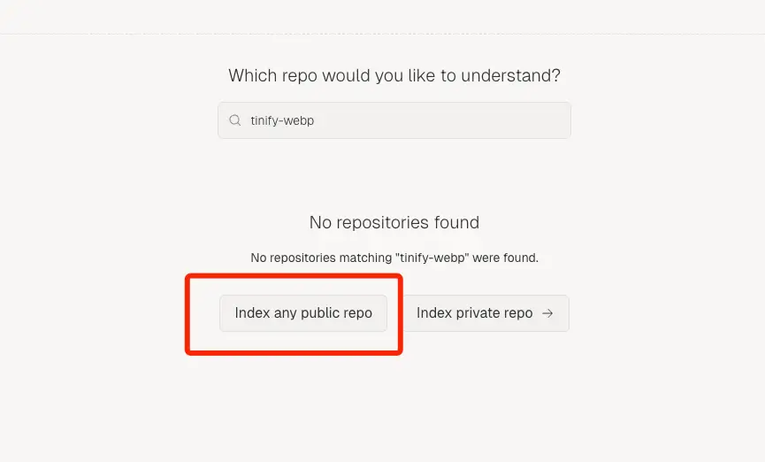

那我们就可以点红框中的这个按钮进行添加，这里会提供两种方式：

* 直接搜索仓库名称
* 知道仓库地址的情况下直接输入仓库地址

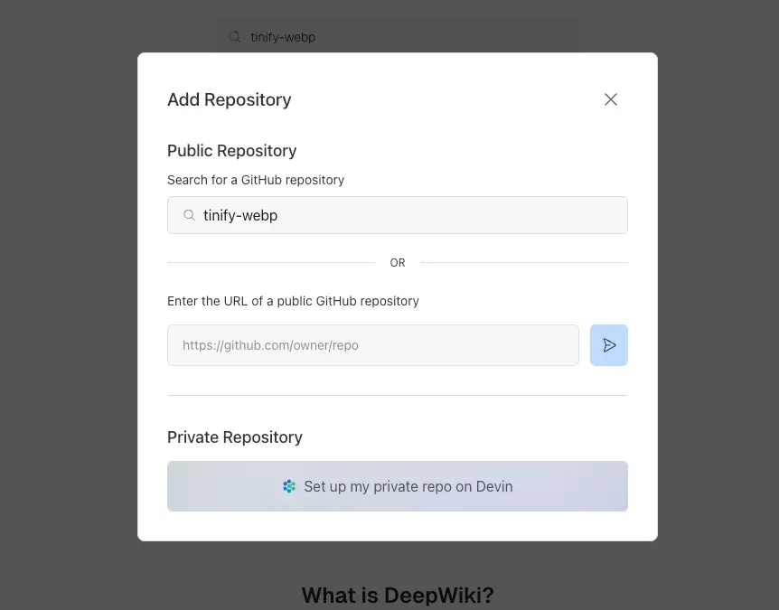

选中对应的仓库之后，按下回车键就会跳转到 DeepWiki 的索引页面，这里需要提供一下你的邮箱。因为索引时间可能较长，DeepWiki 会在索引完成后通过邮件通知你。

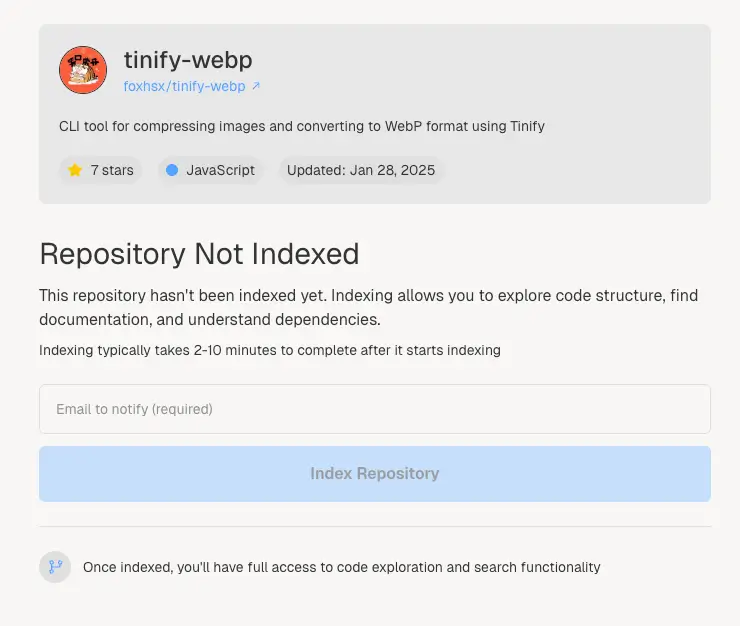

等待一段时间之后，就会在邮件中接收到消息：

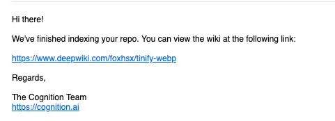

点击邮件中的链接，我们来看下 DeepWiki 为这个项目生成的文档，这不比项目 README 详细得多嘛～

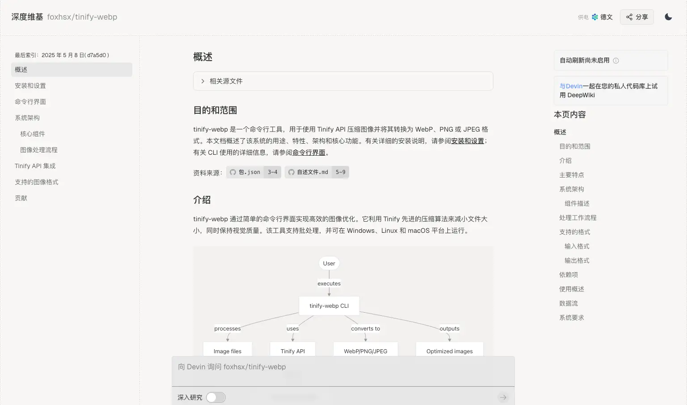

还生成了对应的流程图：

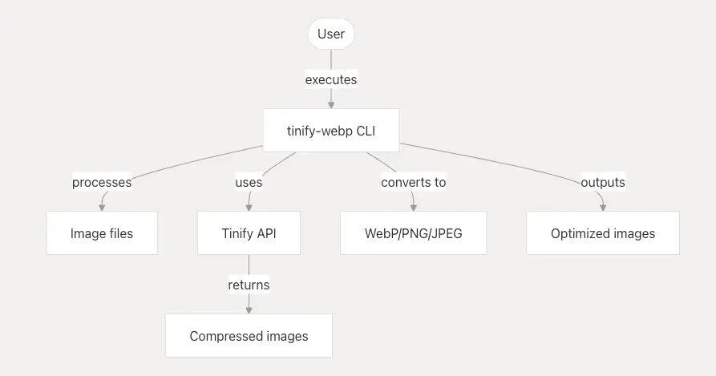

以及架构图：

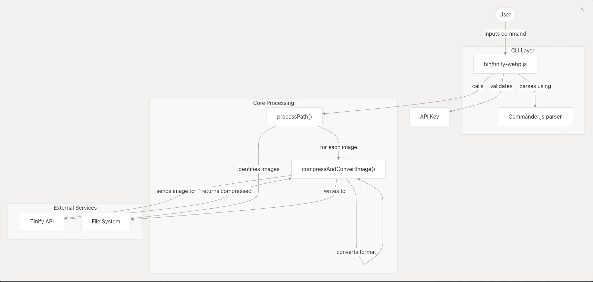

由此可见 DeepWiki 的“功力”之深，使用它来学习一些开源项目简直是事半功倍，感兴趣的小伙伴们赶紧用起来吧！
