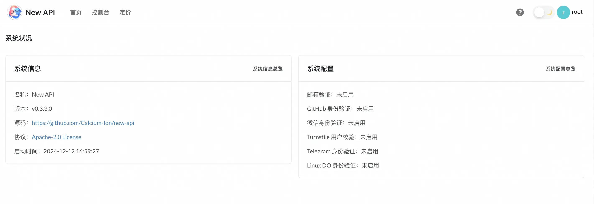
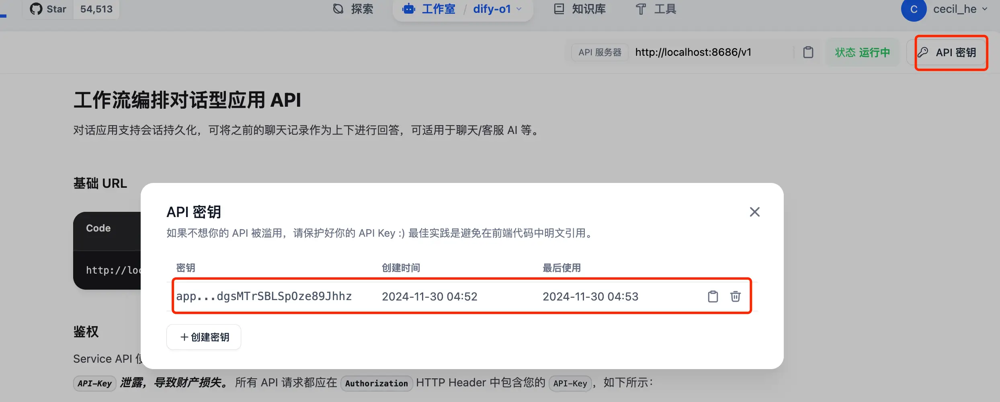

有捣鼓过 Dify 的同学应该都知道，虽然 Dify 是一个很棒的 AI 应用，但是它提供的 API 是和 Open AI 不兼容的，这就导致一些应用无法对接到 Dify 上。

有什么办法可以解决呢？

不知道大家还记不记得之前介绍过的一款开源项目 One API？不记得的话也没关系，来回忆一下：[使用 Docker 部署14.7k stars 的各大 AI 模型 key 分发及接口管理系统](https://blog.ihsxu.com/blog/1716306111877)

它可以聚合不同的 AI 大模型到一起，再统一转为 OpenAI 的 API 派发出去，不过到目前还不支持 Dify 的接入，所以路子虽然有了但是也无法解决上述问题。

此时有大佬出手，基于 One API 做了二开，项目名称为 New API，这个项目完全支持 Dify，至此我们终于可以玩转 Dify API 了！

> [Github 地址](https://github.com/Calcium-Ion/new-api)

### 部署

推荐使用 Docker 部署：

```shell
docker run --name new-api -d --restart always -p 3000:3000 -e TZ=Asia/Shanghai -v /home/ubuntu/data/new-api:/data calciumion/new-api:latest
```

也支持 Docker Compose：

* 首先下载项目代码到本地

```shell
git clone https://github.com/Calcium-Ion/new-api.git
```

* 然后进入项目根目录，可以根据自己的需求修改`docker-compose.yml`文件，最后启动 docker compose：

```shell
cd new-api
# 按需编辑 docker-compose.yml
# 启动
docker-compose up -d
```

有 Kubernetes 的同学也可以通过以下 YAML 来部署：

```yaml
apiVersion: v1
kind: PersistentVolume
metadata:
  name: new-api-pv
spec:
  capacity:
    storage: 20Gi
  accessModes:
    - ReadWriteOnce
  hostPath:
    path: "/home/ubuntu/data/new-api"

---
apiVersion: v1
kind: PersistentVolumeClaim
metadata:
  name: new-api-pvc
spec:
  accessModes:
    - ReadWriteOnce
  resources:
    requests:
      storage: 20Gi

---
apiVersion: apps/v1
kind: Deployment
metadata:
  name: new-api
spec:
  replicas: 1
  selector:
    matchLabels:
      app: new-api
  template:
    metadata:
      labels:
        app: new-api
    spec:
      containers:
      - name: new-api
        image: dockerpull.org/calciumion/new-api
        ports:
        - containerPort: 3000
        env:
        - name: TZ
          value: Asia/Shanghai
        volumeMounts:
        - name: data
          mountPath: /data
      volumes:
      - name: data
        persistentVolumeClaim:
          claimName: new-api-pvc
      

---
apiVersion: v1
kind: Service
metadata:
  name: new-api
spec:
  selector:
    app: new-api
  type: LoadBalancer
  ports:
  - port: 3000
    targetPort: 3000
```

部署成功过之后我们通过 IP + 端口的形式进行访问：



初始用户名密码是`root/123456`。

点击「控制台-渠道-添加渠道」，可以看到支持的渠道里是有 Dify 的，而除了 Dify 之外，还支持自定义渠道，FastGPT 知识库等等。


我们回到 Dify 中创建一个应用来试试看～

以之前分享过的山寨版 o1 为例，我们进入到 chatflow 中点击右上角的「访问 API」：


然后新建密钥，复制之后我们就可以将其集成到 new-api 中：



### 集成

回到 new-api 中「添加渠道」：


1. 我们在选中 Dify 类型之后，要输入 Dify 服务的地址。如果你的 new-api 服务和 dify 都是通过 docker 部署在一个机器上的，那么这里记得输入`http://host.docker.internal:你的端口号`，截图是我这边的示例，可不要原模原样照抄哦～。如果不是 docker 部署的方式，这里就输入 dify 服务的`http:// ip + 端口号`即可；
2. 因为接入的是 dify，所以在模型选择上我们只需要输入自定义模型名称即可，比如输入 dify，然后一定要点一下后面那个「填入」按钮；
3. 不管是自定义模型还是选择的其他模型，一定都会截图中 3 的位置展示出来，没展示说明没有配置上；
4. 最后一步我们填入上面复制号的密钥即可。

完成提交，我们就可以在渠道列表中看到一条数据啦～


如图，我们可以点击「测试」按钮看看是否已经正常使用了：


> 测试时间长短不一定，大家点击测试之后耐心等待一会儿

接下来，我们到令牌页面添加一个令牌。比如起名就叫 dify，自己使用的话可以将过期时间定为「永不过期」，金额设置为「设为无限额度」：


完成之后点击截图中的「复制」按钮，将令牌的 key 复制下来就可以使用了。

### 使用

现在万事俱备，只欠东风！为了方便测试，我又运行起了之前介绍过的 Open WebUI（不知道的朋友可以参考[官网](https://docs.openwebui.com/#quick-start-with-docker--recommended)）:


在刚部署好时，这里是没有可用模型选择的。所以我们需要进入到设置页面配置一下 new-api 的代理：

1. 点击右上角的头像，选择设置；
2. 点击管理员设置；
3. 选择「外部连接-OpenAI API-输入你 new-api 服务的地址」，如果 new-api 和 Open WebUI 都是通过 docker 部署在同一台机器上，这里只需要输入`http://host.docker.internal:你 new-api 的端口号/v1`即可，然后记得填入那会儿复制好的令牌密钥。最后在「添加一个模型 ID」那里输入 dify 后点保存就好了！
4. 如果不是通过 docker 部署的，这里就需要通过输入 IP + 端口的形式。


回到对话页面，我们测试一下：


可以用！

将 dify 的 API 转为 OpenAI API 之后，我们可以利用 dify 做的事情又增多了～举个非常简单的例子，一些开源的 AI 应用项目其实只支持 OpenAI API，这导致我们的 dify 应用无法接入，现在的话，就没有这个问题了
