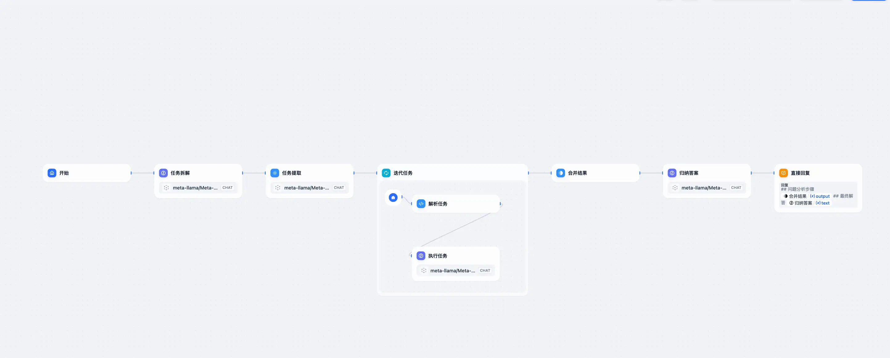
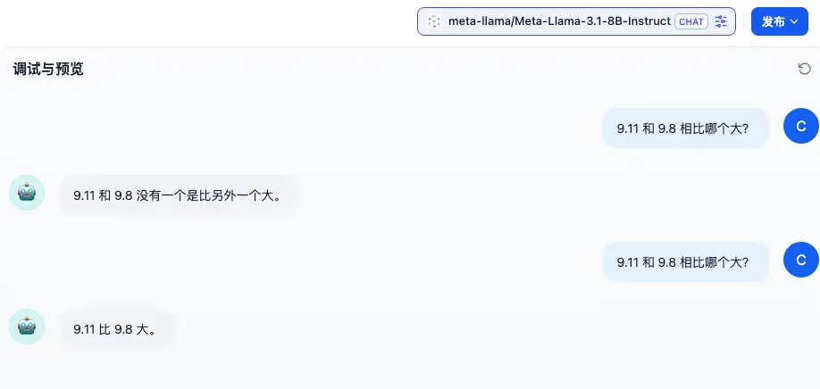
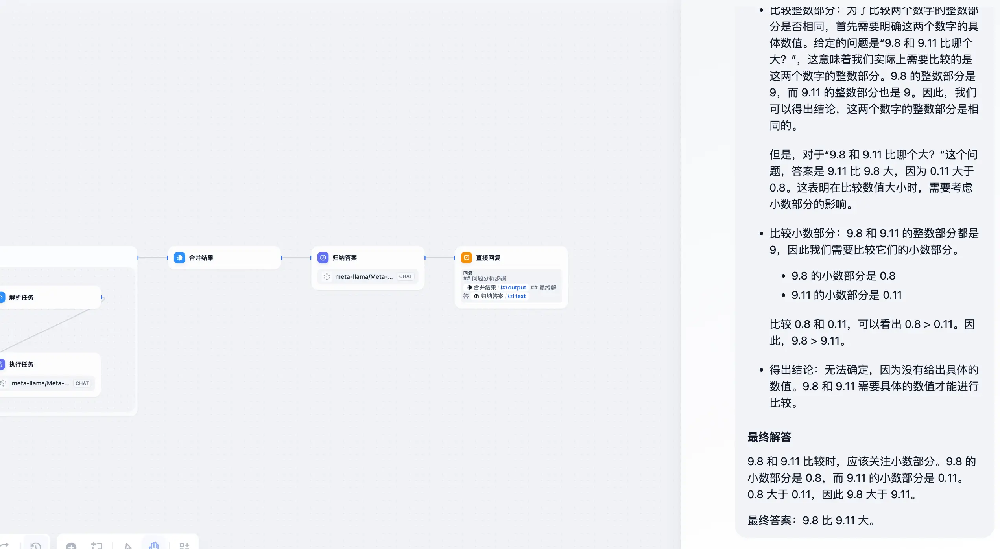
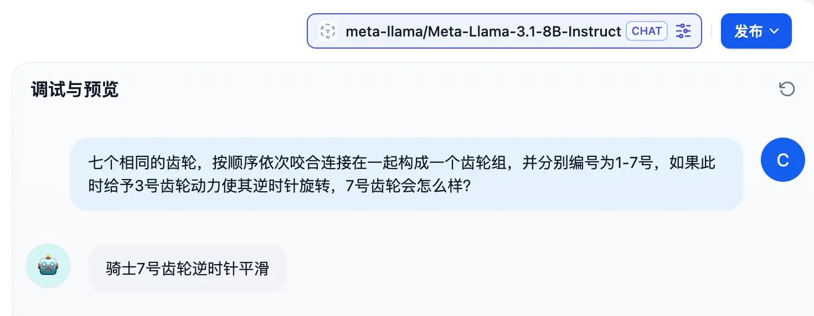
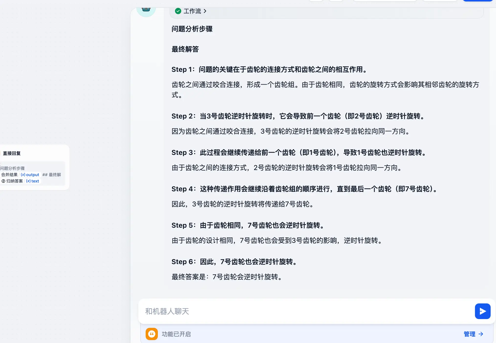
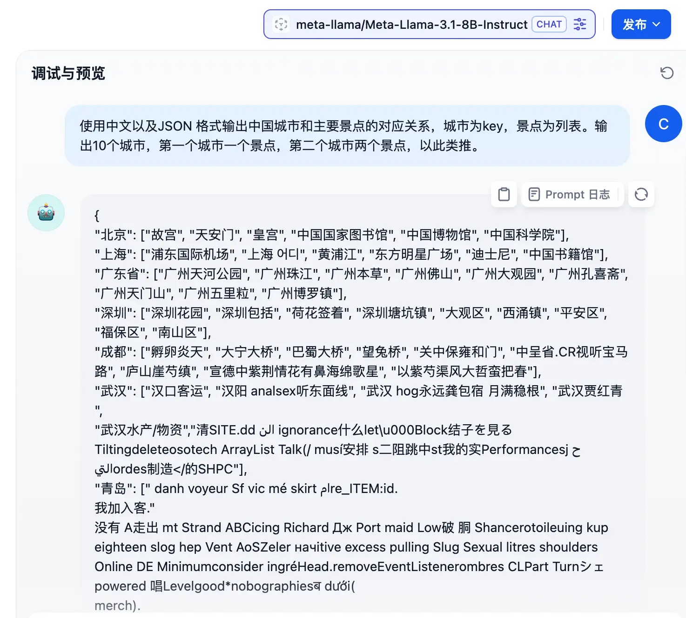
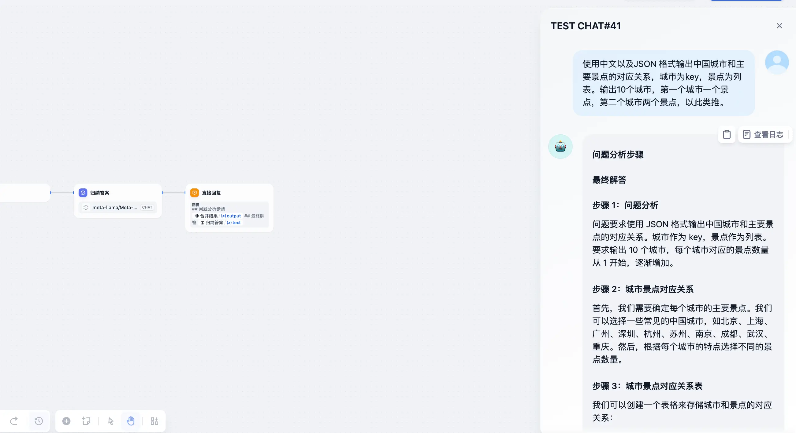
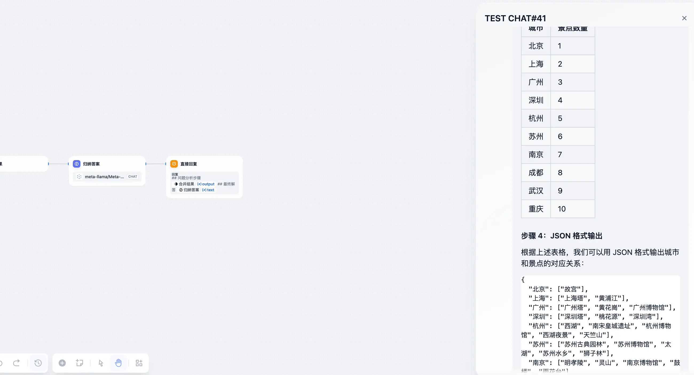
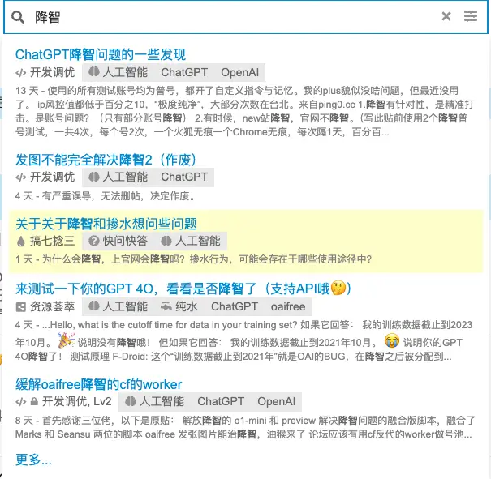

前些天 Close AI 推出了 o1 模型之后，AI 界又小小地震惊了一把，因为它可以处理复杂的推理问题了。

最大的亮点就是能够在回答问题之前进行较长时间的思考，思考时间越长推理质量越高。目前对客的话只推出了`o1-preview` 以及 `o1-mini` 两款产品，有体验过的小伙伴反馈，效果确实很哇塞～

但是话说回来 `o1-preview` 的 API 收费确实有些小贵，而且想要在国内使用的话，除了比较麻烦之外还伴随着封号的风险。

所以三金在网上搜罗了一下山寨版 o1 的做法，供大家食用。

> 参考文章：[Dify搭建工作流增强LLM逻辑能力](https://5km.studio/blog/dify-workflow-enhance-llm-capability)。博客中有对应的工作流 DSL 文件，如果访问不了，可以后台发送「dify-o1」获取
> [B站](https://www.bilibili.com/video/BV1XVtfejE31/?vd_source=fbe8ecd1547e7e909fd660f4a2b27cef)

#### 实现思路

首先要实现一个会思考的工作流，那势必不能让 AI 模型在回答问题的过程中直奔主题，而是要经历几个环节：

* 拆分用户的问题，将问题分解为一个个小任务
* 一个个地去完成这些小任务
* 合并并归纳最终的答案然后输出

看起来是不是很简单，接下来我们开始上节点。

#### 上手造 o1

* 开始节点：接收用户输入；
* LLM 节点-任务拆解：作用是将用户问题进行拆分，并确保拆分出来的步骤不少于三步；
* 参数提取器-任务提取：作用是将上一步内容中的步骤以数组的形式重组一下；
* 迭代任务-代码执行-解析任务：在迭代任务中，需要这样一个节点来提取每个任务中的关键信息——名称以及对应的内容；
* 迭代任务-LLM 节点-执行任务：解析完任务之后，AI 大模型通过在上一个节点获取到的关键信息给出具体答案；
* 模板转换-合并结果：迭代任务结束之后，我们需要将这些结果再做一个合并处理；
* LLM 节点-归纳答案：因为之前得到的结果都是小任务的答案，并不是初始问题的答案。所以这里还需要根据上一步的合并结果再做一个归纳总结；
* 直接回复：输出给用户的结果由两部分组成的——问题分析步骤 + 最终解答。

#### 测试

测试模型这里使用`Llama-3.1-8b`，并且会以「直接使用模型」和「使用 o1 工作流」两种方式来进行测试。测试问题：

* 9.11 和 9.8 哪个大？

* 七个相同的齿轮，按顺序依次咬合连接在一起构成一个齿轮组，并分别编号为1-7号，如果此时给予3号齿轮动力使其逆时针旋转，7号齿轮会怎么样？

* 使用中文以及JSON 格式输出中国城市和主要景点的对应关系，城市为key，景点为列表。输出10个城市，第一个城市一个景点，第二个城市两个景点，以此类推。

通过上述测试可以看到：

* 解决问题的正确率上升了，不过随之而来的肯定是消耗的 token 也有所增加
* 会在给出答案之前，确实会经过一些思考，这也是增加正确率的原因之一
* 直接进行对话时，哪怕是 Llama3.1-8b 也会胡说八道，但是“调教一番”之后，它就“乖”了

不过我们这毕竟是山寨版的，所以还是会遇到回答错误的情况。而且哪怕是正版，也会出错，这除了内部处理流程之外，和模型也是有关系的。

#### 题外话-gpt 降智

在推出 o1 系列之后，随之而来的，是最近大家都在吐槽的一件事——ChatGPT 降智了！

正因如此，好多人都开始转战 Claude，即便它的封号几率很大。

不过如果大家是本地部署的模型，或者其他低价购买的模型，推荐试试这个山寨 o1，因为在一定程度上，它是有一部分增智的效果在内的（除非模型本身的水平就不咋地）。

