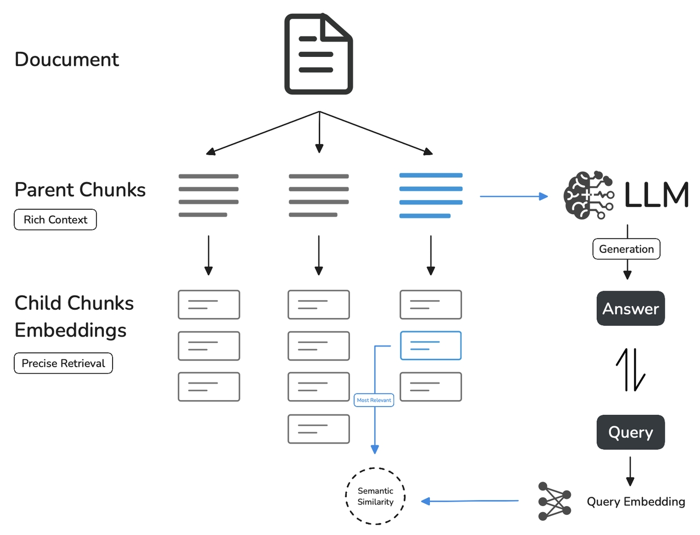

在 Dify 的 v0.15.0 版本中引入了新的分段模式——父子模式。官方介绍使用该模式可以在一定程度上增强知识库的检索能力和理解能力，从而显著提高 AI 生成回答的质量和准确度。

### 是什么？可以解决什么？

首先，在知识库检索中会有两种不利于生成准确回答的情况：

*   检索的结果是比较准确的，但是结果是从不同的分段中拿到的，比较分散，导致没有一个完整的上下文提供给 AI；
    
*   检索的结果不太精准，比较泛化，和上面一条刚好相反，上下文可能够了，但是精准度不够。
    

要解决上述问题，要做到两点：

*   合适的分块；
    
*   平衡精准度和上下文之间的效果。
    

这就是父子检索模式诞生的背景以及它在 RAG 中解决的问题。

### 啥机制？

*   子模块匹配查询：先进行子块进行精准打击，这一部分会拆得比较细，甚至一句话就是一个块；
    
*   父模块提供上下文：然后根据匹配到的子块找到对应的父级，补充一下这块的信息，丰富一下匹配内容。
    

举个简单点的例子：学校-年级-班级-学生。

假如我们要找小明，子模式检索出来的结果是某班级的小明或者小明本人，父模式就是提供小明所在的年纪、学校、以及在学校里的排名和表现等等。

### 实测

说了这么多都是对父子模式的说明解释，现在我们来一起看看它在检索这块的能力到底如何～

为了能让大家有更加清晰的对比，除了知识库所用的分段模式不同之外，这里我们将上传同样的文件、使用同样的嵌入模型和 Rerank 模型。

*   嵌入模型：BAAI/bge-m3；
    
*   Rerank 模型：BAAI/bge-reranker-v2-m3；
    
*   文件：JavaScript 高级程序设计第四版；
    

##### 通用模式

在召回测试中找到了三个召回段落：

集成到 Agent 中进行对话：

召回率为两个 0.63。

##### 父子模式

在召回测试中找到了6个召回段落：

集成到 Agent 中进行回答：

召回率为 0.74 和 0.72。

由此可见，父子模式下，检索召回的能力确实得到了提升。

但是随着检索能力提升带来的是分段时间的增长，父子模式下同样的文件花费了将近 20 分钟，而通用模式只需要 5 分钟。