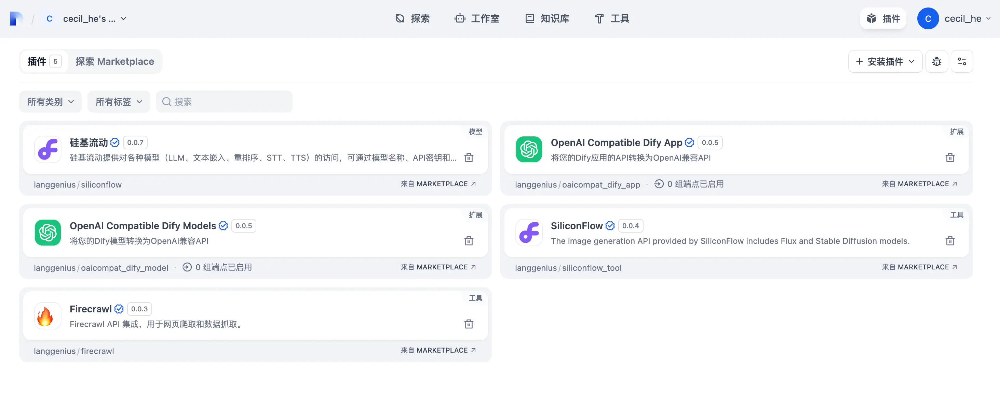
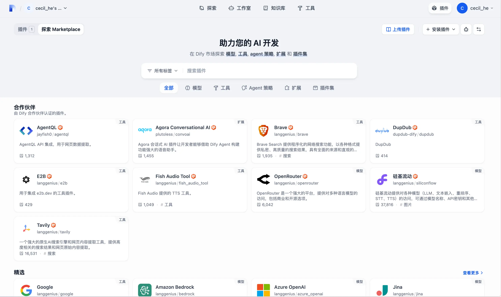
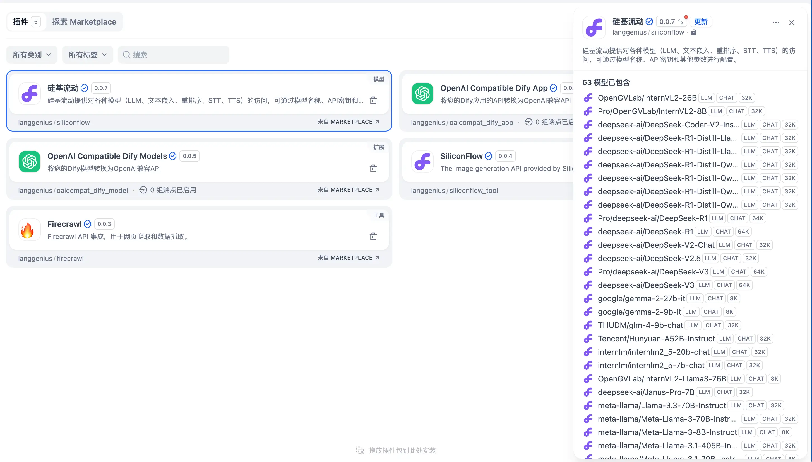
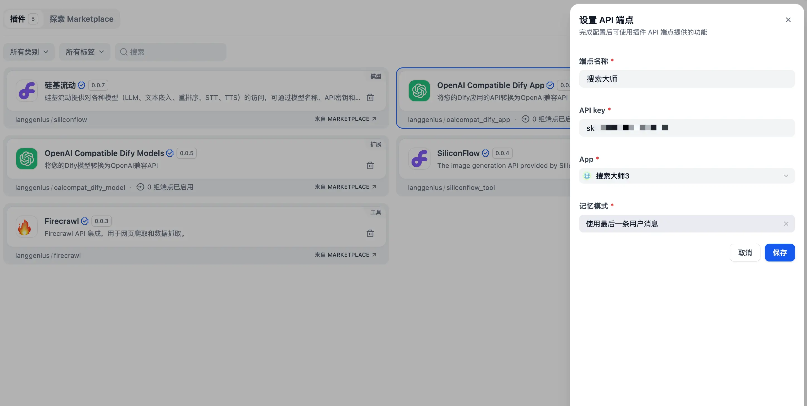
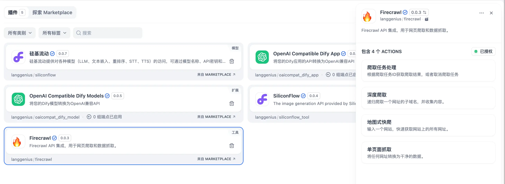

**插件**——在我们平时使用一些软件产品时并不少见，**主要是用来扩展应用主体的功能**。常见的有编辑器插件、浏览器插件。**不同的插件会为应用主体提供不同的功能**，比如：

* 浏览器插件 - 沉浸式翻译：可以**完全免费**地使用它来实时翻译外语网页，PDF翻译，EPUB电子书翻译，视频双语字幕翻译等。
* VSCode 编辑器插件 - Live Server：在 VSCode 编辑器中快速为当前静态文件启动一个本地服务器。

而 Dify 的插件也是如此，它的出现将赋予 AI 无限的可能。而Dify 官方也是这样描述插件的：**Dify 插件是一种即插即用的模块化组件，用于灵活扩展 AI 应用的能力。**

在新的版本中，之前大家所熟知的 **Models（模型）、Tools（工具）都被囊括在了插件类型中**，剩下的插件类型还有：

* **Agent 策略**：也就是把一个 Agent 封装成插件，这样可以将其使用到工作流当中；
* **Extensions（扩展）**：适用于只需要基础 API 调用的简单集成场景；
* **Bundle（插件包）**：说白了就是批量安装插件。

这五种插件类型配合 Workflow 和 Chatflow，给我最大的感触就是：**Dify 越来越像一个 AI 操作系统，我们可以在上面安装不同的 AI 应用（插件），从而挖掘出更多的可能性，并尽可能地发挥出 AI 的能力，实现效率最大化**。

如果将插件类比成乐高，那通过「插件+工作流」的拼装组合，我们可以造就出各式各样的 AI 应用。

回到 Dify 这个项目本身，插件机制将其中强耦合的模块进行解耦，使其可以独立进行安装、卸载和运行。这对于项目本身而言，相当于卸下了许多负重，用户只要按照自己的业务需求按需使用对应的插件即可。

Dify 插件的入口，在右上角用户名旁边，进入到插件页面之后，默认展示的是我们已经安装好的插件：

点击探索 Marketplace 就可以看到 **插件市场**，任何人都可以在这里安装、上传和分享插件：

这里推荐几个三金常用的插件：

* **硅基流动**：这个是国内比较出名的 AI 模型平台，大家所熟知的开源模型都能在上面找到，也提供免费的开源模型；安装好之后并配置上 API Key 就可以使用许许多多的模型了～（点击访问：https://cloud.siliconflow.cn/i/BBj85fco）

* **OpenAI Compatible Dify App/Models**：可以将我们的 Dify 应用或者模型的 API 转换为 OpenAI 兼容的 API；

* **SiliconFlow**：可以使用硅基流动提供的文生图 API 进行 AI 绘图，支持 Flux 和 Stable Diffusion；

* **Firecrawl**：可以自部署的网页爬虫，用来做数据搜索。

除了插件市场上的这些插件外，大家也可以上 Github 进行搜索。后面也会不定期分享一些有趣又厉害的插件给大家～
