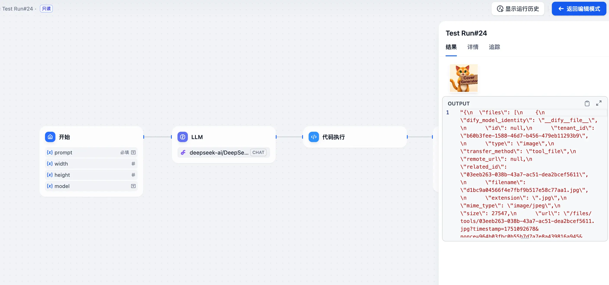

大家好，我是三金～

其实这篇文章是之前《[使用 DeepSeek 实现文生图](https://blog.ihsxu.com/p/%E4%BD%BF%E7%94%A8-deepseek-%E5%AE%9E%E7%8E%B0%E6%96%87%E7%94%9F%E5%9B%BE/)》一文的拓展，在那篇文章中主要给大家分享了如何直接和 DeepSeek 对话让其实现文生图的功能。但由于每次使用时都需要设置一次提示词很是麻烦，所以干脆在 Dify 中将其做成了工作流，方便使用！

在改造时，为了方便大家自定义模型以及图片的尺寸，三金把它们以参数的形式添加到了开始节点中，不填也没关系，会默认生成微信公众号尺寸的图片。

实际上公众号现在也有 AI 生成封面图片的功能，但是生成的内容经常让人不太满意（当然和自己输入的提示词也有关系）。偶尔用一下可以，经常使用的话，可能还需要微信团队再给力一点接入更好的文生图模型才行。

接下来给大家演示一下这个工作流的实际效果：

* 提示词：画一只橘色小猫，举着一个内容为 "封面生成器" 的广告牌；
* LLM：DeepSeek V3；
* 文生图模型：Flux。

整个流程非常简单：

1. 开始节点接收：提示词、图片宽高、文生图模型名称；
2. LLM 大模型优化提示词；
3. 代码执行：将开始节点的参数和优化后的大模型拼接到一起；
4. HTTP 请求：接收上一步的内容请求文生图模型服务；
5. 结束：输出图片。

这里不过多展开讲实现细节了，感兴趣的小伙伴可以在关注三金后，私聊发送「DSL」获取工作流文件。
