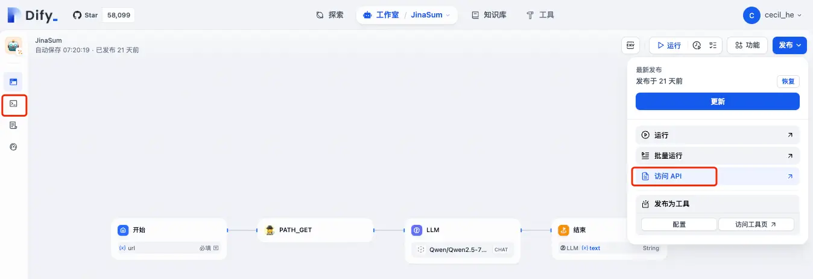
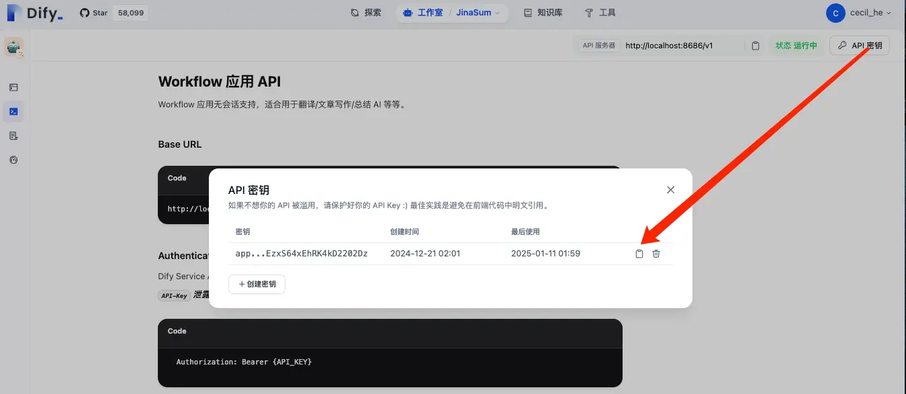
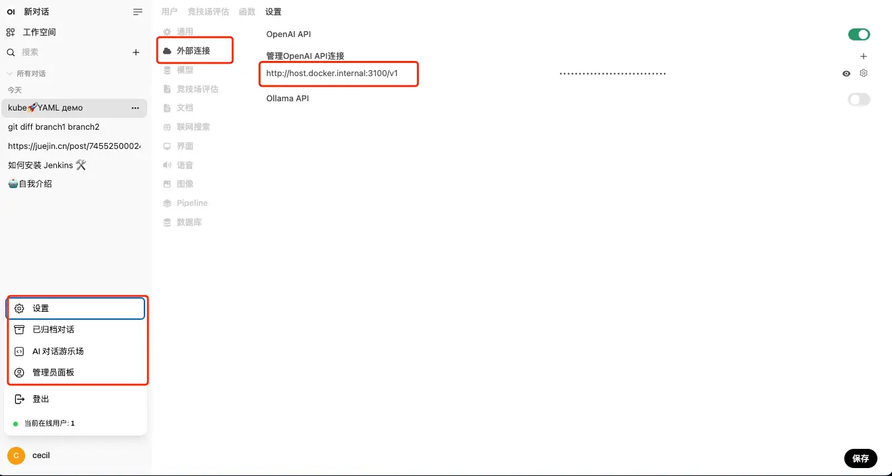
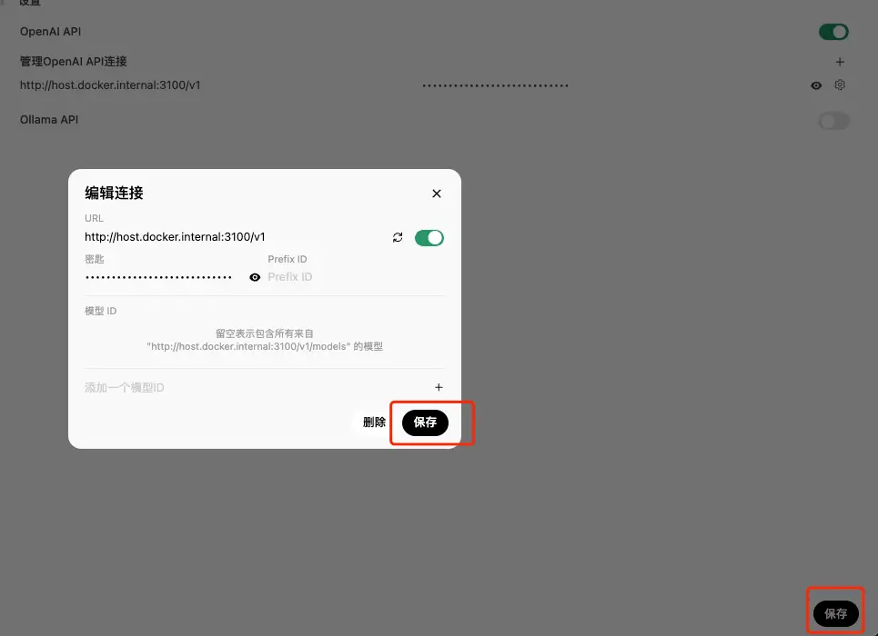
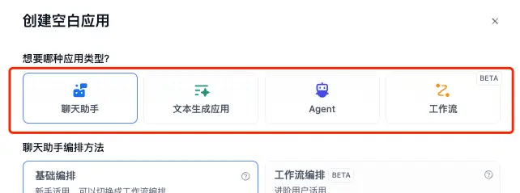
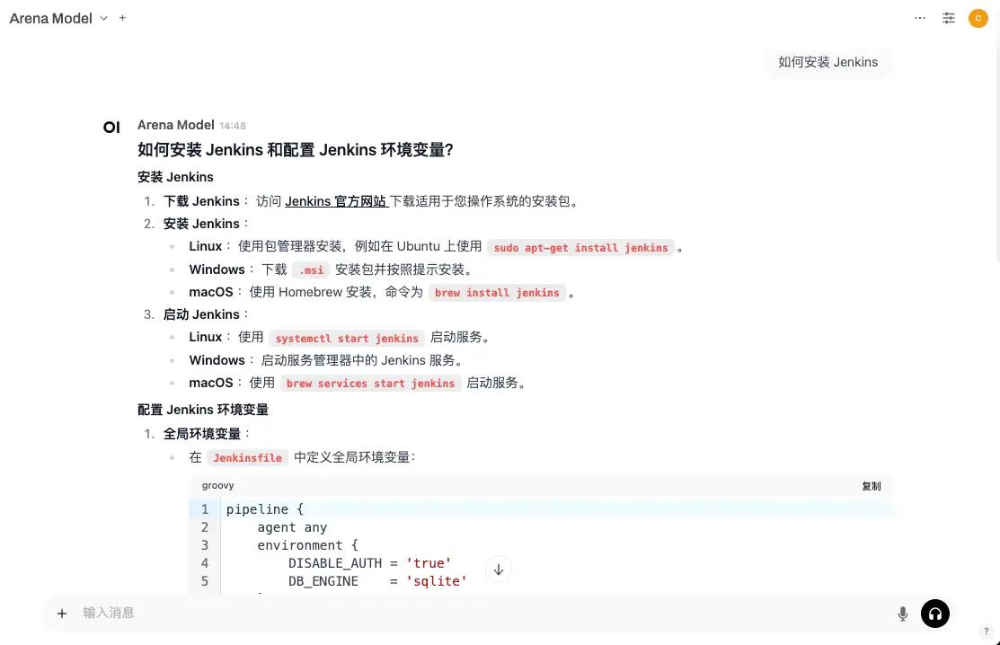
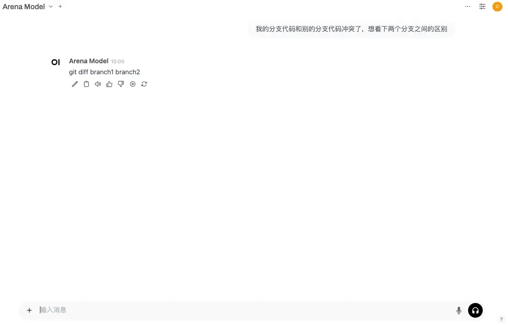
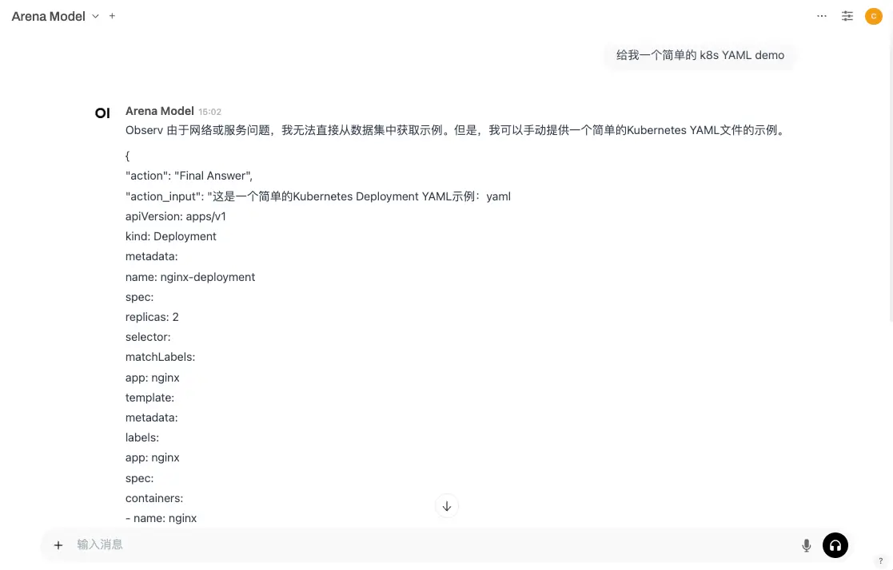

之前介绍过 one-api 的下游项目——New API，它支持将 Dify 的 API 转换为标准的 OpenAI 的 API 格式。

不过在写《[通过 NewAPI 接入 Dify 后能支持什么？](https://mp.weixin.qq.com/s/Q9dVgGE5PzyXc82DiOkNGQ?token=625489712)》这篇文章时，测试还不支持：

* AI Agent
* Workflow

至于「文本生成应用」有没有支持，当时忘了测。

而今天要介绍的开源项目 dify2openai 则是支持了 Dify 应用的所有 API，且只需要启动一个 node 服务就 OK，我们一起来看一下～

> 项目地址：[Github](https://github.com/fatwang2/dify2openai)

### 安装

首先拉去项目到本地：

```shell
git clone https://github.com/fatwang2/dify2openai.git
```

然后作者这边提供了两种启动方式：

* 本地使用 pnpm 启动
* 本地构建镜像启动

这边会先介绍环境变量，然后再来看启动方式。

### 环境变量说明

* DIFY\_API\_URL：Dify 服务的 API 地址，默认是官方地址，必填项；
* BOT\_TYPE：要接入应用的类型，支持 Chat\Completion\Workflow，默认是 Chat，必填项；
* INPUT\_VARIABLE：如果要接入工作流的话，需要配置这个环境变量，是开始节点中设置的变量，比如 query 之类的；
* OUTPUT\_VARIABLE：同样是使用工作流时需要设置的，输出结果的变量，一般是 text；
* MODELS\_NAME：模型名称，默认是 dify；
* PORT：服务端口，默认 3000。

### 启动方式

### 使用 pnpm 启动 -- 二开推荐

使用 pnpm 命令，对应就需要安装 node 环境，如何安装可以自行百度/Google，然后使用 npm 来安装 pnpm：

```shell
npm install -g pnpm
```

&#x20;全局安装好 pnpm 之后，进到项目根目录下安装项目依赖：

```shell
pnpm install
```

安装好依赖之后，先不要着急启动项目。此时还需要修改环境变量对应的文件 `.env`：

```shell
mv .env.template .env

vim .env
```

有两个必须设置/修改的参数：

* DIFY\_API\_URL: 你 Dify 服务器的地址，默认是官方 API 地址 `https://api.dify.ai/v1`；
* BOT\_TYPE：你的应用类型，默认是 Chat。

设置好这两个之后，就可以启动项目了：

```shell
pnpm start
```

项目端口默认 3000，我们在浏览器中使用 `localhost:3000` 来检查项目是否启动。

#### 使用 Docker 启动 -- 使用推荐

该项目貌似没有提供官方镜像，不过项目根目录下有提供 Dockerfile 文件，我们也可以自己 build 镜像：

```shell
docker build -t dify2openai:latest .
```

然后使用 docker 启动容器：

```shell
docker run -d name dify2openapi \
    --network bridge \
    -p 3000:3000 \
    -e DIFY_API_URL=<你自己的 Dify 服务地址> \
    -e BOT_TYPE=Chat \
    --restart always
    dify2openai:latest
```

或者直接在项目根目录下使用 Docker Compose 一把梭，在 build 镜像之后运行容器，下面是 `docker-compose.yaml` 文件内容：

```yaml
version: '3.5'
services:
  dify2openai:
    container_name: dify2openai
    build:
      context: .
      dockerfile: Dockerfile
    network_mode: bridge
    ports:
      - "3000:3000"
    restart: always
    environment:
      - DIFY_API_URL=<你自己的 Dify 服务地址>
      - BOT_TYPE=Chat
```

执行下面命令启动：

```shell
docker compose up -d
```

> 🔔提示：如果都是通过 docker 部署的 dify 和 dify2openai，这里的 IP 请换成：`http://host.docker.internal` 端口不变

### 测试

首先我们需要获取 Dify 应用的密钥，在 Dify 中你需要进入到该应用，点击右上角的「发布-访问 API」按钮或者左侧菜单栏的第二个 shell 图标之后进行获取。





然后我们依旧使用 OpenWebUI 来进行测试：

```shell
docker run -d -p 3000:8080 -v open-webui:/app/backend/data --name open-webui --restart always ghcr.io/open-webui/open-webui:main
```

启动后在「设置-外部连接」这里配置模型：



> 眼尖的朋友们或许发现 OpenWebUI 的端口也是 3000，这样的话会和 dify2openai 的容器端口冲突，所以我在这里将 dify2openai 的端口改成了 3100。
> 1\. 本地 pnpm 启动：在 `.env` 文件中加上 PORT 参数进行修改；
> 2\. Docker 启动，则在命令中或者 YAML 中将左侧的 3000 修改成你想要的端口。

此时这里的 URL 就变成了 dify2openai 的服务地址：`IP:port`；密钥就是刚刚我们复制下来的密钥，配置好之后保存一下即可。



新建对话，我们按照 Dify 中提供的应用类型来分别测试一下。



不同的应用，对应的 BOT\_TYPE 是不同的，且环境变量设置上也有差异：

* 聊天助手：BOT\_TYPE 是 Chat；
* 工作流：BOT\_TYPE 是 Workflow。除此之外，对于工作流而言你还需要配置 `INPUT_VARIABLE` 和 `OUTPUT_VARIABLE`；
* 文本生成应用：BOT\_TYPE 是 Completion；
* Agent：BOT\_TYPE 还是 Chat；

以下是测试截图～

**聊天助手**


**工作流**



**文本生成**



**Agent**



### 总结

dify2openai 可以将 Dify 应用的 API 转为 OpenAI 的 API，方便大家将自己的 Dify 应用接入到其他的 AI 应用中去，作为一个轻量服务，它所占的资源极少，很适合有次需求的小伙伴。

不过唯一的缺点就是，一个服务只能支持一个应用。
