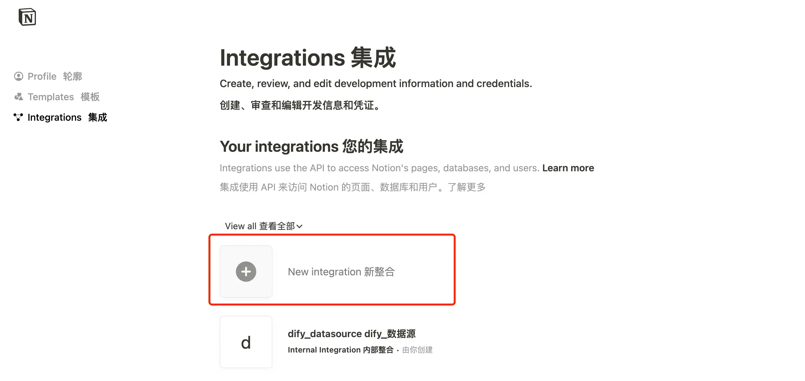
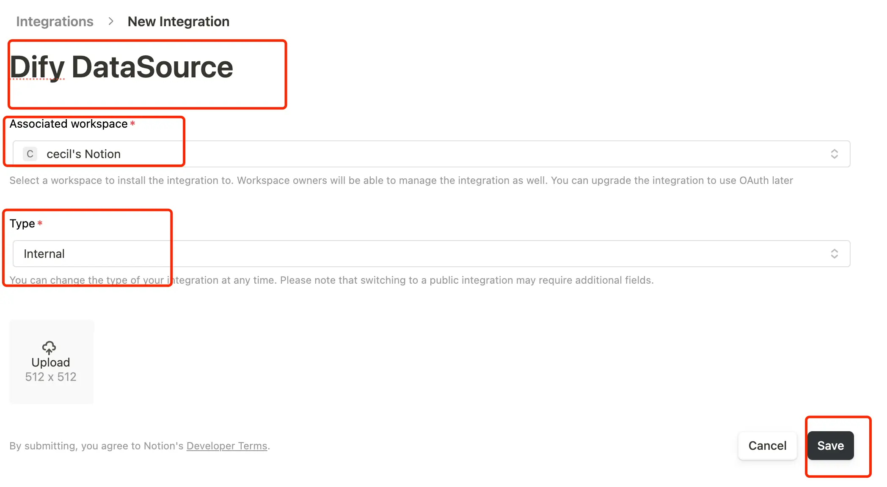
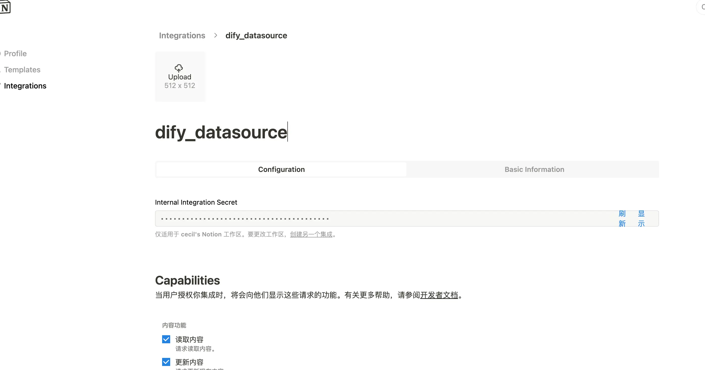
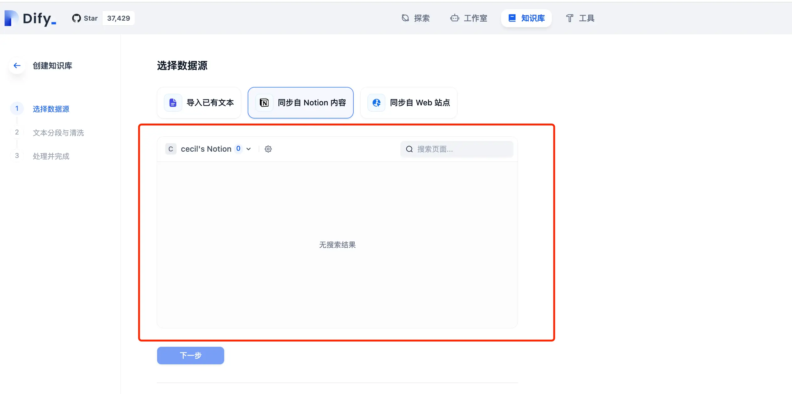
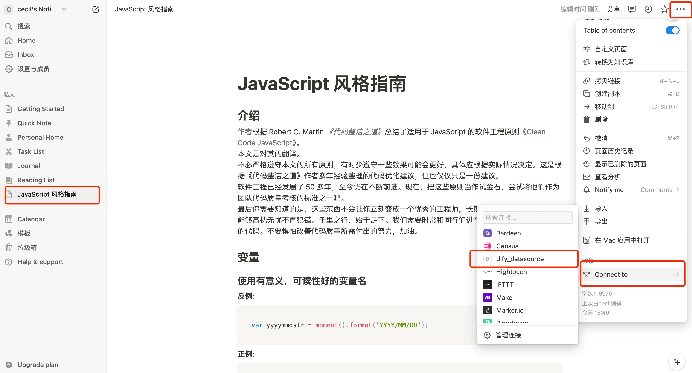
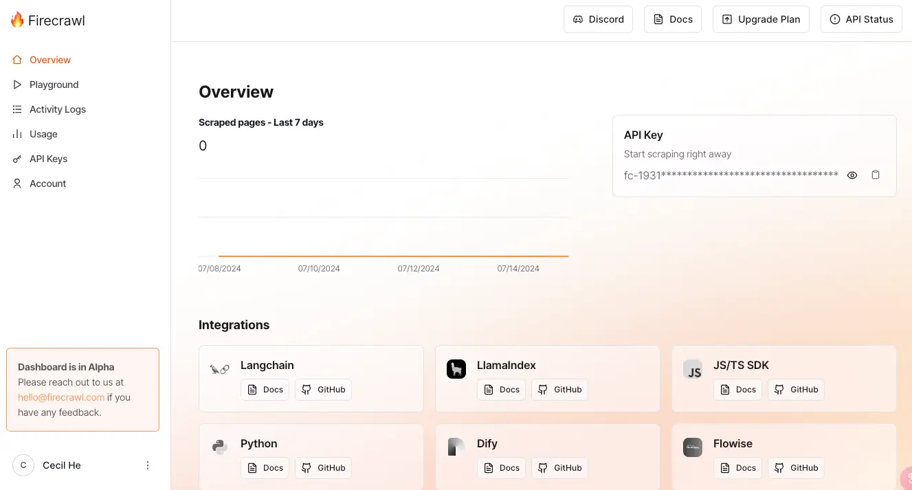
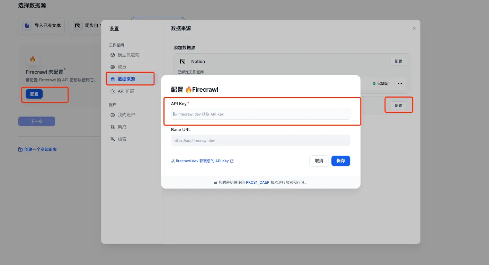
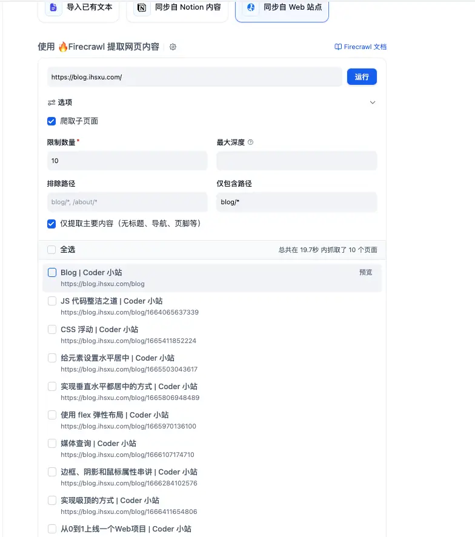

在上一篇《[Dify 教程二：使用本地大模型 Ollama](https://mp.weixin.qq.com/s?__biz=MzUyODkwNTg3MA==\&mid=2247485047\&idx=1\&sn=05e09f8ed8c452b42c151a7f67cdb6f7\&chksm=fa686596cd1fec80e020bd0de536f031a966ad06138bba27479d6f6885a915f38490f67ee1fa#rd)》中，我们介绍了如何在 Dify 中接入本地大模型，今天我们来**看看 Dify 创建知识库的其他两种方式**。

* **同步自 Notion 内容**
* **同步 Web 站点**

### 接入 Notion

我们本地部署的社区版 Dify 接入 Notion 有两种方式：

* **使用 Internal 集成方式**
* 使用 Public 集成方式

我们主要介绍一下如何使用 Internal 的集成方式，因为 Public 的集成方式也得先配置 Internal 集成。

那么如何创建一个 Notion 集成呢？

首先，我们需要**登录 Notion**，并访问 Notion 的[集成页面](https://www.notion.so/profile/integrations)；

然后，**创建一个新的集成「New Integrations」**；



再次，在**集成配置页面关联 Notion 的工作空间，类型选择 Internal**，并为这个集成起一个见名治意的名称，logo 可选可不选，然后提交；



最后，到**该 Integrations 详情页面中拷贝对应的 Secret 出来**。



以上就是创建一个 Notion 内部集成的流程，是不是超级简单？接下来我们要将这个 Internal 集成到 Dify 中去。

打开 Dify 源代码，在 docker 目录下找到`.env`文件，在该文件里配置相关环境变量，环境变量如下：

```shellscript
NOTION_INTEGRATION_TYPE = internal
NOTION_INTERNAL_SECRET=<刚刚拷贝出来的 Secret>
```

修改好之后，执行以下命令并重启启容器：

```shellscript
docker-compose down
docker-compose up -d
```

再次访问知识库并选中「同步自 Notion 内容」时就可以看到咱们已经集成成功了：



但是光是到这里其实还是不够的，我们还**需要将想要同步的文章关联到对应的 Integrations 中**：

* 在对应的工作空间下，打开一篇想要同步的文章
* 点击**右上角的菜单项，选择「Connect to」，在里面选择刚刚我们创建的 Integrations「Dify DataSource」**

- 回到 Dify 页面并刷新，就可以看到这篇文章已经被列出来了



接下来的操作和导入本地文件是一样的，就不过多赘述了。

> 关于如何实现 Public 集成，请[查看文档](https://docs.dify.ai/v/zh-hans/guides/knowledge-base/sync-from-notion#id-2-shi-yong-public-ji-cheng-fang-shi)

### 同步 Web 站点

同步 Web 站点的功能**需要配置 FireCrawl**，这是一款可以将网站转换为 Markdown 格式的产品。我们只需要在它的[官网](https://www.firecrawl.dev/pricing)申请一下 API Key 即可使用，有免费版也有付费版：


在申请 API Key 之前我们需要先注册一下，可以使用 Google 账号或者 Github 账号进行登录。

登录好之后我们就可以看到对应的 API Key 了：



将其粘贴复制到 Dify 的数据来源中去：



测试一下，以我的小破站为例：



已经成功抓取到了 10 个页面，点击下一步之后的操作也是和之前的都一样，就不过多赘述了。


