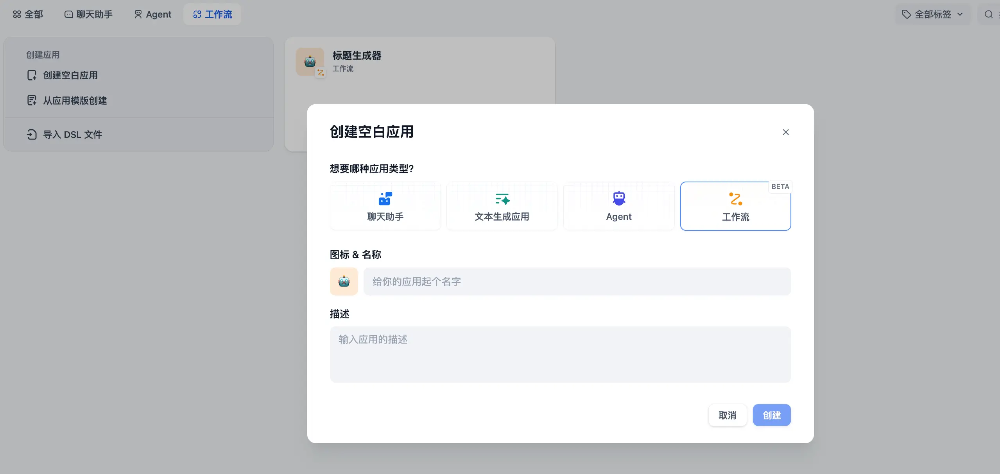
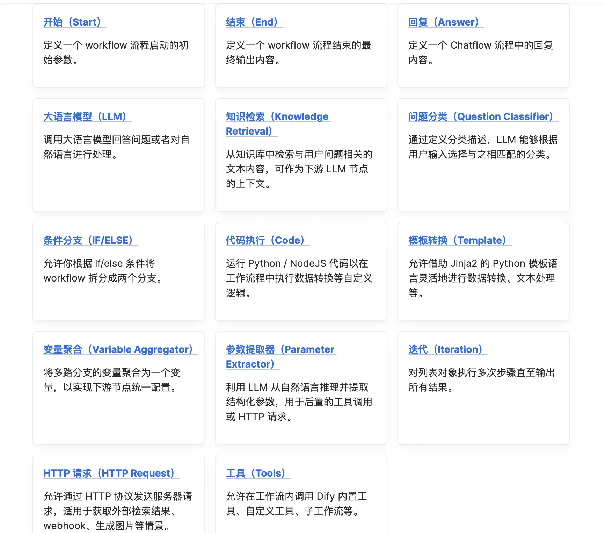
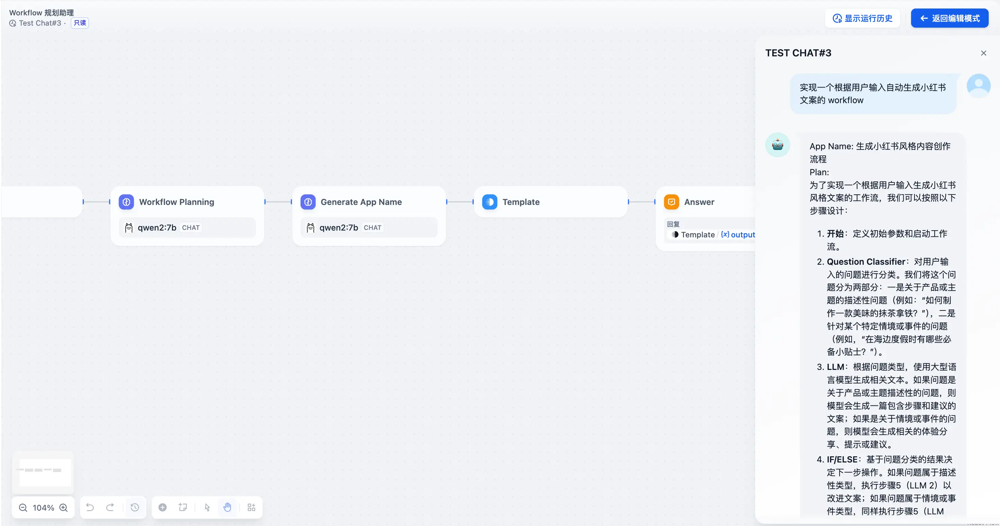

我们在之前的几篇文章中已经介绍了 Dify 的大部分功能，包括：

* 部署及基础使用：[37.4k 的 Dify，一款小白也可以轻松上手的大模型开发平台（一）：部署及基础使用](https://mp.weixin.qq.com/s?__biz=MzUyODkwNTg3MA==\&mid=2247485019\&idx=1\&sn=572e8f94c6d082183d80788a53cc6f55\&chksm=fa6865bacd1fecac6f3ed04454f5751444c7cf7849490d8991faf9e9c2296f565ac05140aa58\&token=1941914531\&lang=zh_CN#rd)**[原创](https://mp.weixin.qq.com/s?__biz=MzUyODkwNTg3MA==\&mid=2247485019\&idx=1\&sn=572e8f94c6d082183d80788a53cc6f55\&chksm=fa6865bacd1fecac6f3ed04454f5751444c7cf7849490d8991faf9e9c2296f565ac05140aa58\&token=1941914531\&lang=zh_CN#rd)**
* 连接本地大模型 Ollama：[Dify 教程二：使用本地大模型 Ollama](https://mp.weixin.qq.com/s?__biz=MzUyODkwNTg3MA==\&mid=2247485047\&idx=1\&sn=05e09f8ed8c452b42c151a7f67cdb6f7\&chksm=fa686596cd1fec80e020bd0de536f031a966ad06138bba27479d6f6885a915f38490f67ee1fa\&token=1941914531\&lang=zh_CN#rd)**[原创](https://mp.weixin.qq.com/s?__biz=MzUyODkwNTg3MA==\&mid=2247485047\&idx=1\&sn=05e09f8ed8c452b42c151a7f67cdb6f7\&chksm=fa686596cd1fec80e020bd0de536f031a966ad06138bba27479d6f6885a915f38490f67ee1fa\&token=1941914531\&lang=zh_CN#rd)**
* 创建知识库的三种方法：[38.2k 的 AI 开发平台 Dify 教程三：将 Notion 和网站作为知识库](https://mp.weixin.qq.com/s?__biz=MzUyODkwNTg3MA==\&mid=2247485086\&idx=1\&sn=16ffa7b2459ec604c9c0ce2c1ee31173\&chksm=fa68657fcd1fec69d4246d6271bafe0e0119a7c2731ad3049d258f7c3de722b864a05c0f6f3f\&token=1941914531\&lang=zh_CN#rd)**[原创](https://mp.weixin.qq.com/s?__biz=MzUyODkwNTg3MA==\&mid=2247485086\&idx=1\&sn=16ffa7b2459ec604c9c0ce2c1ee31173\&chksm=fa68657fcd1fec69d4246d6271bafe0e0119a7c2731ad3049d258f7c3de722b864a05c0f6f3f\&token=1941914531\&lang=zh_CN#rd)**
* 内置应用模板及工具：[38.2k 的 AI 开发平台 Dify 教程四：自定义 AI 工具（ChatGPT Actions）](https://mp.weixin.qq.com/s?__biz=MzUyODkwNTg3MA==\&mid=2247485110\&idx=1\&sn=e646064b99e45094d09c3e485bfa2f6a\&chksm=fa686557cd1fec413078802dfdeb15d91771d8df60b840897be2f98f59ad7db25d4b04f1c0d8#rd)

今天我们将结合以上模块**实现一个完整的 Workflow 应用**。

### 工作流

首先我们需要知道**什么是工作流**？

**工作流就是将复杂的任务拆分成较小的步骤（节点）来降低整体的系统复杂度，这样可以减少对提示词技术和模型推理能力的依赖，从而提高 LLM 应用面向复杂任务的性能，也提升了系统的可解释性、稳定性和容错性。**

在 Dify 中有两种类型的工作流：

* **Chatflow**：**面向对话类情景**，包括客户服务、语义搜索、以及其他需要在构建响应时进行多步逻辑的对话式应用程序。

* **Workflow**：**面向自动化和批处理情景**，适合高质量翻译、数据分析、内容生成、电子邮件自动化等应用程序。

在 Workflow 中**起到关键作用的就是节点**，关于节点的分类如下：

接下来三金以 Workflow 为例，**实现一个可以根据用户输入自动生成小红书文案的工作流**。Let\`s do it!

首先按照上一篇的文章《[38.2k 的 AI 开发平台 Dify 教程四：自定义 AI 工具（ChatGPT Actions）](https://mp.weixin.qq.com/s?__biz=MzUyODkwNTg3MA==\&mid=2247485110\&idx=1\&sn=e646064b99e45094d09c3e485bfa2f6a\&chksm=fa686557cd1fec413078802dfdeb15d91771d8df60b840897be2f98f59ad7db25d4b04f1c0d8#rd)》让 AI 帮我们生成一个 Workflow 的规划；

然后创建一个空白的 Workflow 应用，并按照刚刚的内容创建节点：

我们这里一共有 7 个节点：

* **开始节点**：在开始之前需要设置一些必须的参数，比如文章主题或者参考文章的 URL、文章风格以及内容长度
* **问题分类器**：根据第一步的参数将其进行分类，然后延伸出两个不同的节点——网页爬虫和根据主题生成文章
* **网页爬虫**：如果输入的是 URL 则会走到这个节点
* **根据爬虫内容生成文章（LLM）**：将爬虫爬到的内容做二次处理生成新的内容
* **根据主题生成文章（LLM）**：回到问题分类器那一步，如果只是输入了一个主题，那么就直接会根据主题生成一篇文章
* **变量聚合器**：将两个 LLM 生成的文章都会聚合到这个节点上来
* **结束**：最后输出给用户

我们来测试一下，点击右上角的运行按钮：

可以看到已经输出了一篇 100 字左右的小红书文案：

相信大家现在已经基本掌握了如何创建 Dify 工作流，那接下来我们就可以创建一些可以执行自动化任务的工作流 + AI 智能对话 + 微信推送来实现一个微信智能助理。
