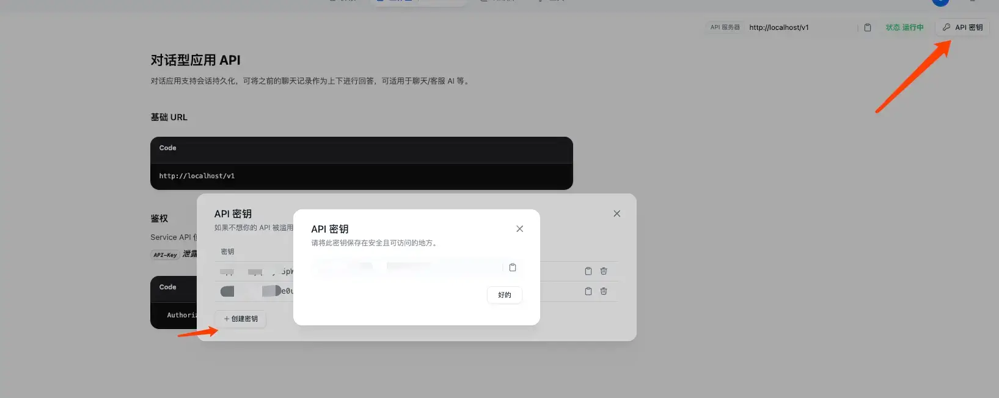
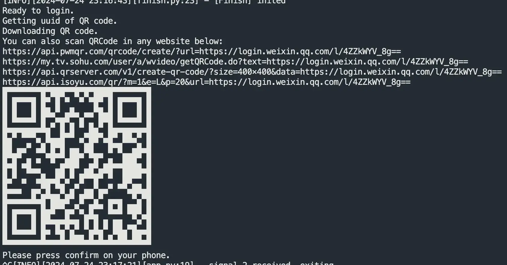
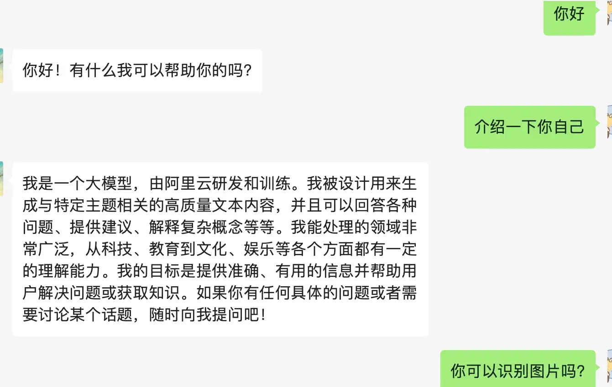

> ⚠️注意
> 目前微信官方对第三方接入风控严重，目前该篇教程中涉及到接入微信的部分已经不适用。但是！文章中说的项目已经更新到了新的版本，可以有效避开风控，大家可以移步到项目 README 进行查看～

在渐渐熟悉 Dify 的各个功能后，我们已经不满足于只在 PC 端或者说需要打开网页才可以使用 Dify 了。我们更希望的是它可以和我们平时最常用的通讯软件相对接，比如微信。

那如何将 Dify 接入到微信中？

这里介绍一下 Dify 生态圈中的一个开源项目——`dify-on-wechat`，运行这个项目，我们可以将 dify 应用轻松地接入到微信中，使我们可以随时随地都可以访问到 dify 应用。

接入步骤如下：

* 在 Dify 上创建一个聊天助手类型的应用，编排方式选择基础编排，详细步骤可以看：[37.4k 的 Dify，一款小白也可以轻松上手的大模型开发平台（一）：部署及基础使用](https://mp.weixin.qq.com/s?__biz=MzUyODkwNTg3MA==\&mid=2247485019\&idx=1\&sn=572e8f94c6d082183d80788a53cc6f55\&chksm=fa6865bacd1fecac6f3ed04454f5751444c7cf7849490d8991faf9e9c2296f565ac05140aa58#rd)
* 创建完成之后我们点右上角的发布，点击更新，然后再点击「访问 API」


* 在 API 管理页面，点击右上角的 API 密钥-点击创建密钥-复制保存密钥，右上角的 API 服务器地址也需要记住。



至此，在 Dify 这一侧的准备工作就算做好了。接下来就到了 dify-on-wechat 项目：

* 下载项目，并安装 python，官方建议 python 版本在 3.8 以上

```bash
git clone https://github.com/hanfangyuan4396/dify-on-wechat
cd dify-on-wechat/
```

* 建议使用虚拟环境来启动项目，因为可能出现一些 python 依赖上的冲突，我们可以使用`venv`或者`conda`创建虚拟环境

其中 venv 是 python 3.3+ 自带的，而 conda 则需要先进行安装。这里以 venv 为例：

```bash
# 在你要启动的项目目录下，创建虚拟环境
python3 -m venv myenv

# 激活虚拟环境
source myenv/bin/activate

# 安装项目依赖
pip3 install -r requirements.txt

# 然后启动项目
python3 app.py
```

* 安装依赖

```bash
pip3 install -r requirements.txt  # 国内可以在该命令末尾添加 "-i https://mirrors.aliyun.com/pypi/simple" 参数，使用阿里云镜像源安装依赖
```

* 还有拓展依赖（这个是可选的，官方建议安装）

```bash
pip3 install -r requirements-optional.txt # 国内可以在该命令末尾添加 "-i https://mirrors.aliyun.com/pypi/simple" 参数，使用阿里云镜像源安装依赖
```

* 填写配置文件，在项目根目录下创建一个名为`config.json`的文件：

```json
{
  "dify_api_base": "https://api.dify.ai/v1",   # dify 的服务器地址，把之前复制的服务器地址粘贴进去即可
  "dify_api_key": "app-xxx",                   # 之前复制的应用的 api key
  "dify_app_type": "chatbot",                  # dify 应用的类型
  "channel_type": "wx",                        # 通道类型，当前为个人微信
  "model": "dify",                             # 模型名称，不用动
  "single_chat_prefix": [""],                  # 私聊时文本需要包含该前缀才能触发机器人回复
  "single_chat_reply_prefix": "",              # 私聊时自动回复的前缀，用于区分真人
  "group_chat_prefix": ["@bot"],               # 群聊时包含该前缀则会触发机器人回复
  "group_name_white_list": ["ALL_GROUP"]       # 机器人回复的群名称列表
}
```

这里如果你的 Dify 使用的是云服务器进行部署的，那么服务器地址是可以被公网访问的。但是如果是在本地服务器或者电脑部署的，那么就需要一些工具来进行内网穿透，从而才能实现接入微信的功能，否则是无法实现微信与 dify 之间的交互的。

这里大家如果只是测试用，推荐使用 ngork。

```bash
ngrok http http://localhost:8686
```

这样就会生成一个外网环境也可以访问的服务地址，我们将上述配置中的 dify\_api\_base 的地址改为生成的地址即可。

* 启动项目`python3 app.py`，然后扫码登录



测试一下：



我们跑通之后，可以通过以下命令在后台运行程序并通过日志输出二维码

```bash
cd dify-on-wechat
nohup python3 app.py & tail -f nohup.out   # 在后台运行程序并通过日志输出二维码
```

或者使用 docker compose 也可以进行项目部署，在部署之前需要修改`docker/docker-compose.yml`文件，里面的内容和上面说到的`config.json`文件内容一致。

要确保正确配置了 DIFY\_API\_BASE 和 DIFY\_API\_KEY 以及 DIFY\_APP\_TYPE 这三个环境变量。

```yaml
version: '2.0'
services:
  dify-on-wechat:
    image: hanfangyuan/dify-on-wechat
    container_name: dify-on-wechat
    security_opt:
      - seccomp:unconfined
    environment:
      DIFY_API_BASE: 'https://api.dify.ai/v1'
      DIFY_API_KEY: 'app-xx'
      DIFY_APP_TYPE: 'chatbot'
      MODEL: 'dify'
      SINGLE_CHAT_PREFIX: '[""]'
      SINGLE_CHAT_REPLY_PREFIX: '""'
      GROUP_CHAT_PREFIX: '["@bot"]'
      GROUP_NAME_WHITE_LIST: '["ALL_GROUP"]'
```

然后执行如下命令启动容器即可：

```bash
cd dify-on-wechat/docker       # 进入docker目录
docker compose up -d           # 启动docker容器
docker logs -f dify-on-wechat  # 查看二维码并登录
```

小伙伴们快去试试吧～
