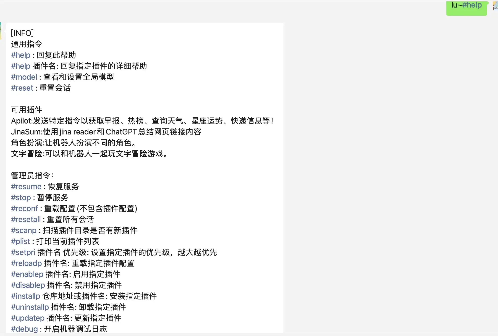
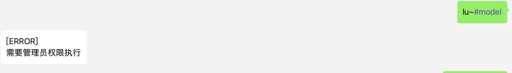
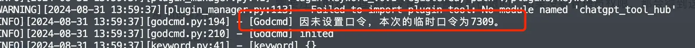
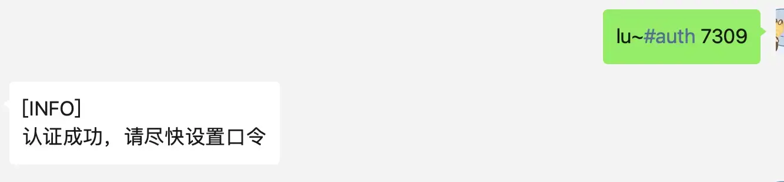
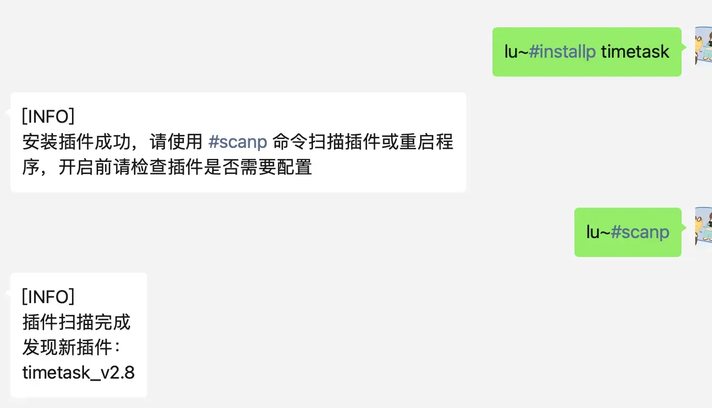
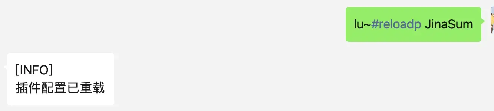

# Dify7. dify-on-wechat 深入探索

最近群友们在玩儿 dify-on-wechat 的时候，发现插件啥的还能搞定时任务，这不得研究研究，搞起来。

首先如何使用 dify-on-wechat（下文中简称 dow），可以参考三金之前的文章（[如何将 39.3k 的开源知识库 Dify 接入微信](https://mp.weixin.qq.com/s?__biz=MzUyODkwNTg3MA==\\\&mid=2247485151\\\&idx=1\\\&sn=22cbef91d44d7211e2ec71835a0faafd\\\&chksm=fa68653ecd1fec2883fbe8c428a62c9528f57e3f458ca9c1bc2ff45546edcc9fd50a5373ef6e\\\&token=1313093260\\\&lang=zh_CN#rd)）。

然后三金主要介绍几个个人觉得比较好玩儿的：

* JianSum
* 定时任务
* Apilot
* Godcmd

> 三金这里在启动 dow 之前，设置了「私聊前缀」，也就是大家文中看到的 `lu~`，只有对话中加这个前缀才能触发机器人回复。

## Godcmd

我们在将 dify 接入到微信中之后，实际上就可以使用插件了。其中默认开启的插件 Godcmd，是一款很好用的指令插件，我们可以使用 `#help` 来查看帮助文档，需要注意的是：**是否是管理员**和是否是在群聊中会影响帮助文档的输出内容。



需要注意的是管理员指令是需要管理员权限的，如果没有管理员权限，那会得到这个回复：



那如何开启管理员权限呢？需要发送 `#auth <认证密码>`，认证密码的设置有两种：

* 在 dow 项目目录 `plugins/godcmd/config.json` 中进行设置，启动项目后直接使用这个设置的密码
* 如果没有设置密码，可以在项目启动日志中寻找临时口令，类似这样：



这样我们就能设置管理员权限啦～



管理员权限可以做的事有很多，其中最重要的就是可以远程安装插件并更新配置，这样就无需重启 dow 项目了，很赞～

比如我们要安装后面要说到的 `timetask`插件，只需要执行下面指令就可以进行远程安装了：

```bash
#installp timetask

#scanp
```



> 只有在 plugins 目录下的 `source.json`文件中有记录的插件可以在安装时直接使用名称，如果没有记录的插件，在安装时将名称替换为项目地址即可：`#installp https://github.com/haikerapples/timetask.git`，这样也是可以的。

## JianSum

[工具地址](https://github.com/hanfangyuan4396/jina_sum)

使用 Jina Reader 和 ChatGPT 支持总结公众号、小红书、知乎等分享卡片链接，配置详情可以点击上面提供的工具地址进行查看。

这个插件也是自带的，我们只需要到源码中改下要使用的大模型地址和 API Key，然后再给 AI 微信发送 `#reload jiansum` 即可重载这个插件的配置。

```json
{
  "jina_reader_base": "https://r.jina.ai",
  "open_ai_api_base": "https://api.openai.com/v1", // 改成代理地址
  "open_ai_api_key":  "sk-xxx",  // 自己的 api key
  "open_ai_model": "gpt-3.5-turbo",
  "max_words": 8000,
  "white_url_list": [],
  "black_url_list": ["https://support.weixin.qq.com", "https://channels-aladin.wxqcloud.qq.com"],
  "prompt": "我需要对下面的文本进行总结，总结输出包括以下三个部分：\n📖 一句话总结\n🔑 关键要点,用数字序号列出3-5个文章的核心内容\n🏷 标签: #xx #xx\n请使用emoji让你的表达更生动。"
}

```




