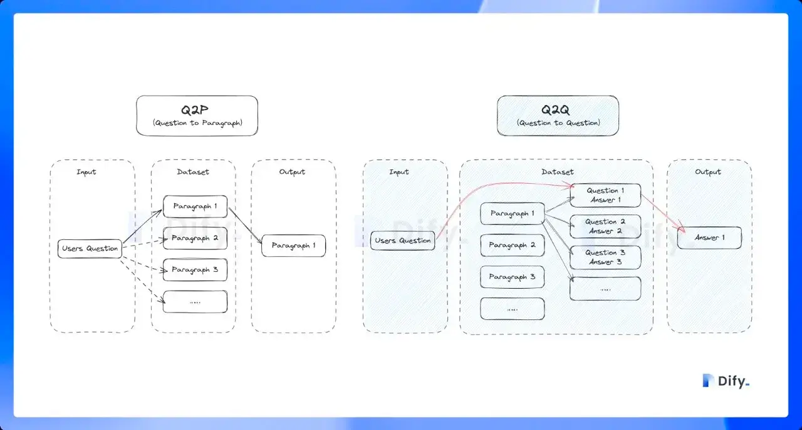
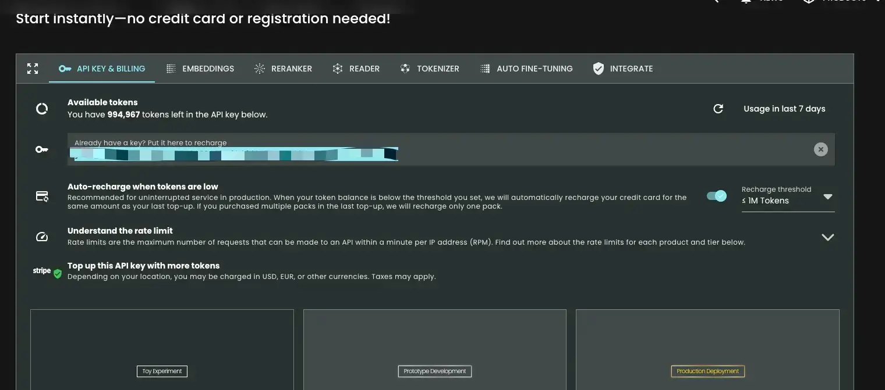
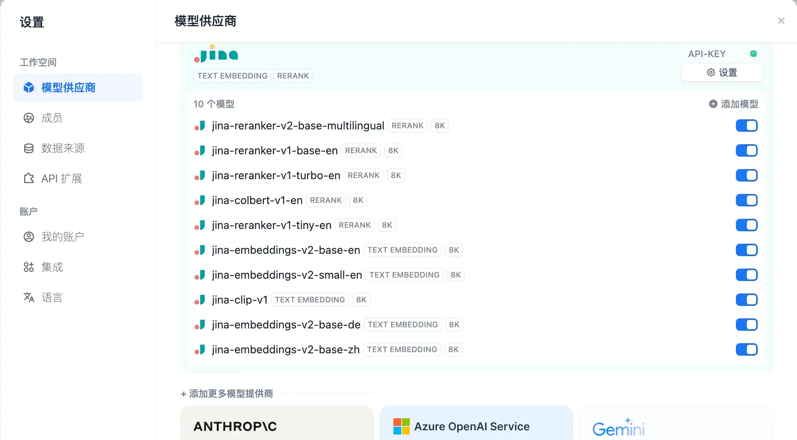
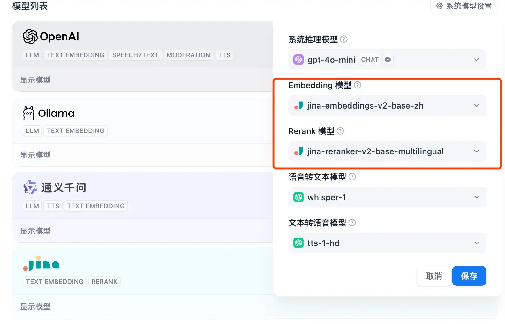
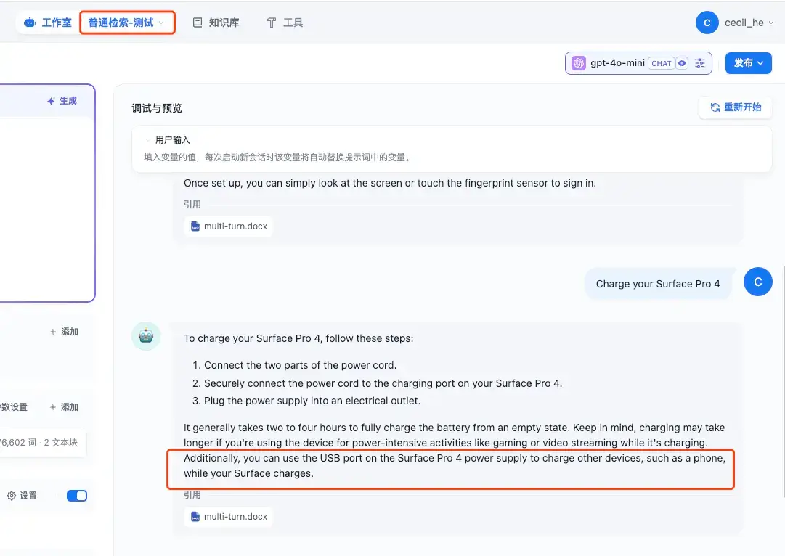
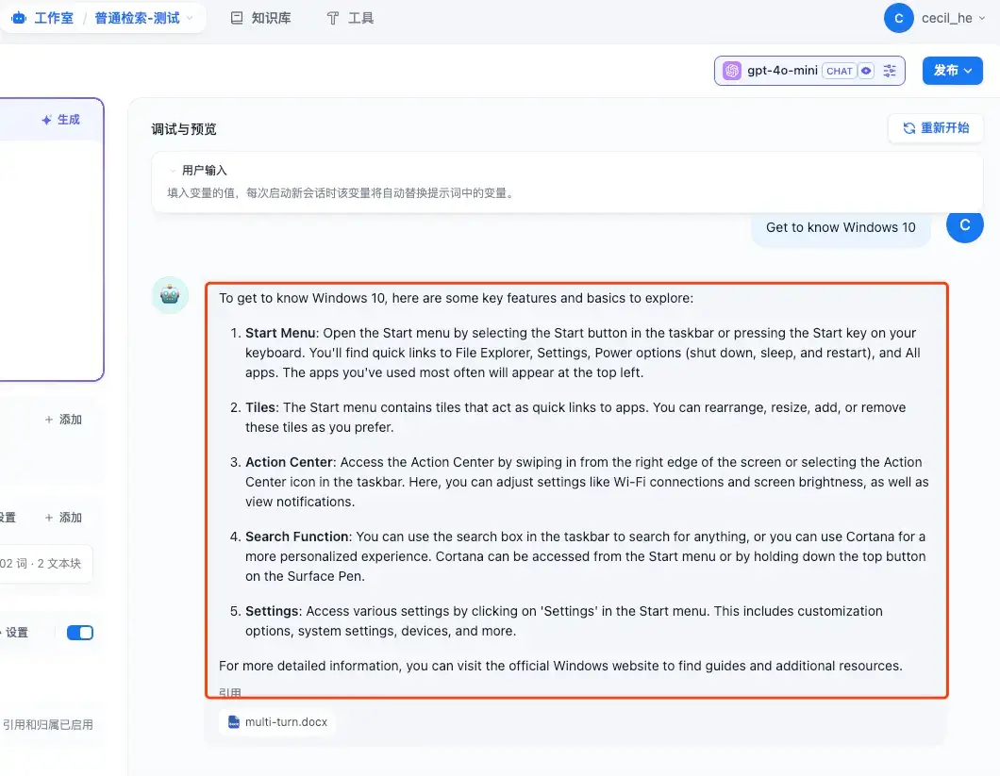
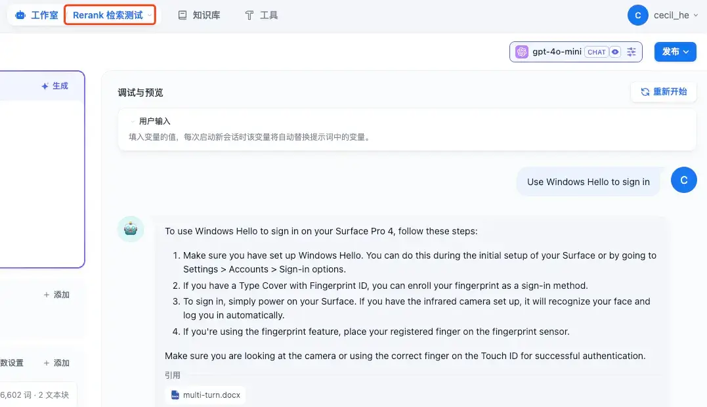
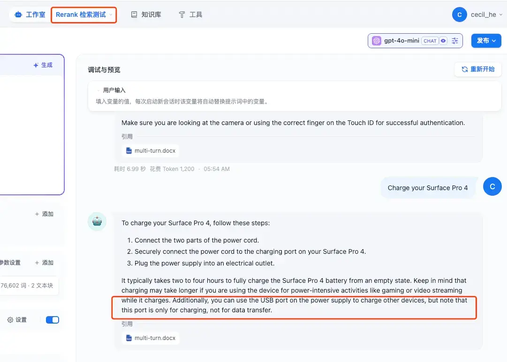
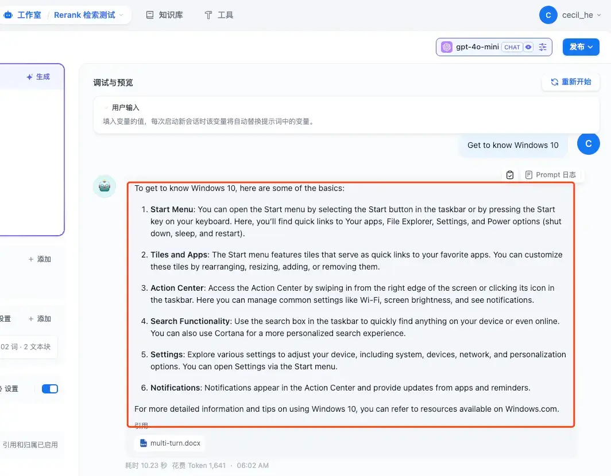

在上一篇文章《[AI 知识库对比：Dify 还是 FastGPT](https://mp.weixin.qq.com/s?__biz=MzUyODkwNTg3MA==\&mid=2247485319\&idx=1\&sn=a16827942700d6bce469c815a933ea0c\&chksm=fa686466cd1fed706a2710a505f13b261a352d340fd503f1b6643a48d85e2f28a39b577ad6d4#rd)》中对比过 Dify 和 fastGPT 之后，很明显的感受到了 Dify 在知识库检索方面的不足，但是 fastGPT 的一些功能以及大模型配置都比较麻烦，而且从功能的多样性上来说，Dify 还是比较有优势的。所以三金和小伙伴们都在想：**有没有什么方法可以增强 Dify 的知识库检索功能呢？**

首先我们知道，在 Dify 的知识库创建时，\*\*第二步「文本分段和清洗」\*\*页面会有三个配置项，它们分别是：

* **分段设置**
* **索引方式**
* **检索设置**

其中对于**分段设置来说，如果不了解，可以默认选择「自动分段与清洗」**。

而对于**检索方式来说我们则可以选择「高质量检索」和「采用 Q\&A 分段模式」**：

* 调用系统默认的嵌入接口进行处理，以在用户查询时提供**更高的准确度**
* Q\&A 分段模式功能，是采用「Q to Q」（问题匹配问题）匹配工作，在文档经过分段后，经过总结为每一个分段生成 Q\&A 匹配对，当用户提问时，系统会找出与之最相似的问题，然后返回对应的分段作为答案。这种方式**更加精确**，因为它直接针对用户问题进行匹配，可以更准确地获取用户真正需要的信息。（理所当然的，开启后将会消耗额外的 token）

> 问题文本是具有完整语法结构的自然语言，而不是文档检索任务中的一些关键字，所以 Q to Q （问题匹配问题）的模式会令语意和匹配更加清晰，并同时满足一些高频和高相似度问题的提问场景。

在上一篇文章《[AI 知识库对比：Dify 还是 FastGPT](https://mp.weixin.qq.com/s?__biz=MzUyODkwNTg3MA==\&mid=2247485319\&idx=1\&sn=a16827942700d6bce469c815a933ea0c\&chksm=fa686466cd1fed706a2710a505f13b261a352d340fd503f1b6643a48d85e2f28a39b577ad6d4#rd)》中，为了测试两个产品的知识库检索功能，三金其实都使用过 Q\&A 分段的形式，不过这个分段模式会比较耗费时间，因为它首先会对文档进行分段，然后通过大模型总结再为每个分段生成 Q\&A 匹配对。同一个文档，二者都花费了20分钟到半个小时左右的时间。

再接下来就是检索设置了，不同的索引方式提供了不同的检索设置，在高质量索引方式下，Dify 提供了三种方案：

* **向量检索**，通过生成查询嵌入并查询与其向量表示最相似的文本分段。
* **全文检索**，索引文档中的所有词汇，从而允许用户查询任意词汇，并返回包含这些词汇的文本片段。
* **混合检索**，同时执行全文检索和向量检索，并附加重排序步骤，从两类查询结果中选择匹配用户问题的最佳结果，需配置 Rerank 模型 API。

Dify 官方是推荐混合检索模式，三金尝试了一下，确实还可以。**尤其在 Rerank 模型之后，系统会在混合检索后对已召回的文档结果再一次进行语义重排序，优化排序结果。**

**综上，在不涉及其他优化手段的情况下，想要增强 Dify 知识库的检索能力，需要：**

* **在分段设置中选择：自动分段与清洗**
* **在索引方式中选择：高质量检索模式 + Q\&A 分段模式（这个耗时会比较久）**
* **在检索设置中，选择混合检索模式，并开启 Rerank 模型**

在我们之前的配置中，LLM 选择的是 OpenAI 的 gpt4o-mini 模型，Embedding 模型为 `text-embedding-3-large`模型，并没有 Rerank 模型。幸好 Dify 支持的大模型种类繁多，我们可以单独集成一个 Rerank 模型进来。

### Jina AI

我们可以**接入 Jina AI 来增强 Dify 知识库的检索能力**。

在 Jina AI 的[官网](https://jina.ai/)中对 Jina 的解释就一句话：

> Your Search Foundation Supercharged

解释过来就是：你的搜索能力被极大地提升了。

而我们在 Dify 中**使用 Jina AI 的向量检索和 Rerank 重排也确实可以极大地提升知识库检索能力**。接下来三金就给大家演示一下：

* **如何申请 Jina AI 的 API Key**
* **接入并使用 Jina AI 的 Embedding 模型以及 Rerank 模型**

#### 申请 API Key

Jina AI 的 API Key 申请非常简单，不需要注册登录，只需要访问他们的官方就会**提供将近百万的免费 tokens 供你使用**。

官网地址：[Jina AI](https://jina.ai/)

#### 在 Dify 中使用

Jina 还有一点好处就是**国内可以直接使用**！所以在 Dify 的模型配置对话框中，我们只需要填入 API key 就可以了。

Jina 支持的 Rerank 模型和 Embedding 模型也有很多：

我们可以将系统默认的 Embedding 模型和 Rerank 模型换成 Jina 中的：

那么在知识库中我们就可以使用 Jina 的向量模型和 Rerank 模型开始进行创建了。

#### 知识库设置

我们之前已经创建过一个 K8s 相关的知识库了，这个知识库中的向量模型使用的是 OpenAI 的 `text-embedding-3-large`，并且为了方便测试，我又添加了一个微软用来测试知识库的 Word 文件：

在这里准备了三个问题：

* •Use Windows Hello to sign in
* •Charge your Surface Pro 4
* •Get to know Windows 10

然后让我们来看一下在这个知识库中的回答情况如何：

看起来还可以，每个回答都可以看到对应的引用。

接下来我们将 Jina 接入到知识库中：

* 创建一个新的知识库，在第一步中上传相同的测试文件
* 在第二步中设置 Embedding 模型为 `jina-embeddings-v2-base-zh`，以及设置 Rerank 模型为 `jina-reranker-v2-base-multilingual`
* 为了节省测试时间，就不使用 Q\&A 方式进行分段了，我们直接开始创建

创建好之后我们提问相同的问题，对比一下结果：

* Use Windows Hello to sign in
* Charge your Surface Pro 4
* Get to know Windows 10

看起大差不差，但细节决定成败，加入了 Rerank 之后的回答，每个问题都比之前的回答多了一些内容，而这只是在只有 8.9k 大小的文件上体现出来的，如果是体积更大的文件，我相信**检索效果肯定会更加明显**！

OK！以上就是今天要分享的内容了，想要**加强 Dify 知识库检索能力**的小伙伴赶快去试试吧～
