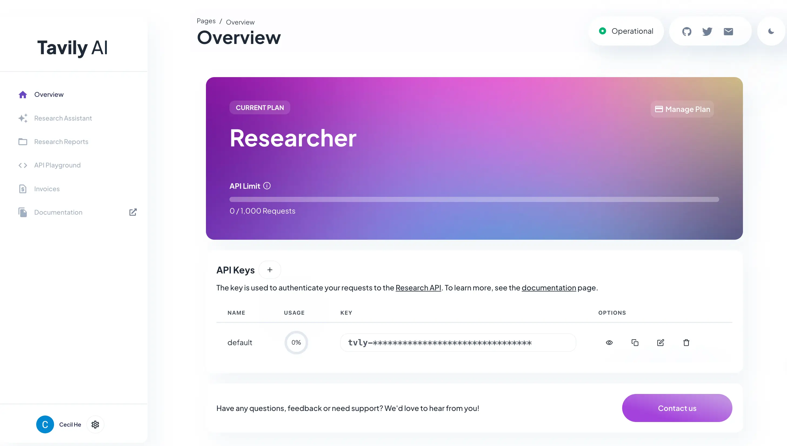
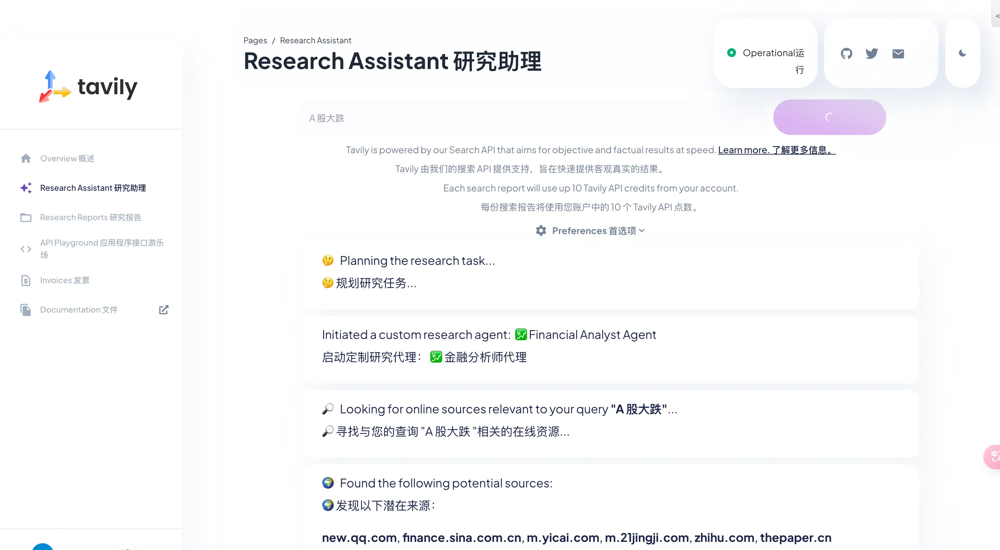
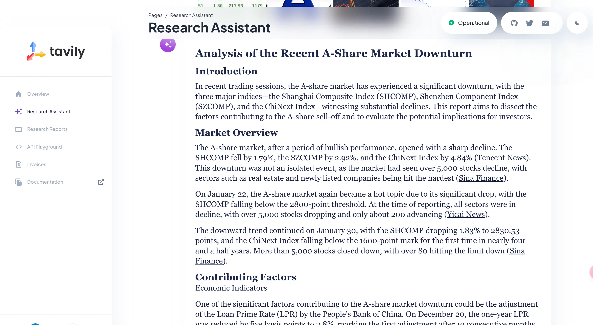

小伙伴们大家好，我是三金～

最近 A 股大涨，身边好多的朋友都血赚了一波，也引起了一大波人跟风进场，不过节后的股市究竟会怎么样谁也说不清，所以我找了一个 AI 搜索与分析的工作流，利用它来搜集一些信息并将这些信息整合起来进行分析。

比如我们要搜索「节后 A 股还会继续大涨吗？」


可以看到它收集了十几条相关话题的文章，并通过 AI 进行总结，最终以表格的形式输出给我们。好处就是省去了人工搜索和筛选，并将每篇文章的内容进行整理最终汇总到一个表格上，大大提高了我们对特定信息的搜集和信息处理。

#### 基本组成

在这个工作流中我们需要以下几个节点：

* 开始节点：输入要搜索分析的话题
* TavilySearch：AI 搜索工具，用来全网搜索话题相关内容
* 代码节点：用来从字符串中提取所有的 URL
* 迭代节点：用来循环执行上个节点输出的结果
  * HTTP 请求：用来爬取每个 URL 的内容
  * LLM 节点：用来对爬取的内容进行总结
  * 模板转换：将 URL 和总结的内容合并在一起
* 代码执行：将循环迭代的结果合并到一起进行输出
* 模板转换：将上一步输出的数组结果转为表格
* 结束：输出表格内容

其中需要用到两个工具：

* AI 搜索工具——Tavily AI
* Jina AI

Jina AI 对大家来说是老朋友了，之前介绍过就不再过多赘述，具体可以参考这篇文章——《[如何增强 Dify 的知识库检索能力？](https://mp.weixin.qq.com/s?__biz=MzUyODkwNTg3MA==\&mid=2247485354\&idx=1\&sn=8b69ca74d5ae5ee3d79170fca9944c23\&chksm=fa68644bcd1fed5d30a7c2830b0d25885b42bb510937243e0ec91741f7cc8284993ff9f816dc#rd)》。我们介绍一下另外一个 AI 搜索工具——Tavily AI。

> [官方网站](https://app.tavily.com/home)

注册即送 1000 次请求，当然用完之后就得充值了。

复制如图所示的 API Key 之后，在 dify 的工作流中进行 Tavily AI 的配置即可。



除了 API Key 之外，Tavily 还提供了研究助理「Research Assistant」的功能：



它会根据搜索的话题，自定义一个角色，然后这个角色会将搜索到的内容进行分析：



> 这里面也是会消耗那 1000 次请求的。

再到 Jina 这里，原本的工作流中是使用的 Jina AI 工具，我将其改成了使用 HTTP 节点，这样可以通过 Jina Reader 去实现网页内容爬取而不耗费个人 token。

一般来说 Jina 的 API Key 我会用在 Dify 知识库中，主要使用 Jina AI 的 Rerank 来加强知识库检索。Jina Reader 目前是免费的，所以我在这个工作流中使用 Jina Reader 来实现网页内容的爬取。

> 之前也介绍过 Firecrawl《[本地部署 Firecrawl 爬虫让 AI 知识库更丰满](https://mp.weixin.qq.com/s?__biz=MzUyODkwNTg3MA==\&mid=2247485446\&idx=1\&sn=b0680e49ec1a8ac7e3727721fd67536b\&chksm=fa686be7cd1fe2f1a23553e4b4f6aacc9418bf2081656844143d1313eccc3e52b2be09a68442#rd)》，大家如果有部署好的，也可以使用它来实现。

基本组成介绍完之后，接下来我们详细看看每个节点的内容吧～

#### 节点详情

* 开始节点：定义一个 question 字段，主要用来接收来自用户的输入；
* 工具-TavilySearch：拿着我们在上面获取到的 API Key 进行授权即可，然后接收开始节点传过来的字段进行搜索；
* 设定一个代码节点，主要作用是用来提取 URL，会输出一个 URL 的数组；

```python
import re
import time
def main(arg1) -> dict:
    urls = re.findall(r'http[s]?://[^\s)]+', arg1)
    return {
        "result": urls,
    }
```

* •添加一个迭代节点，循环请求提取出来的 URL，将内容合并到一起进行输出，里面有：
  * HTTP 请求：使用 Jina Reader 来爬取对应 URL 的内容并输出到下一个 LLM 节点；
  * LLM 节点：接收上一个节点传过来的内容，并进行内容总结；
  * 模板转换：将 URL 和总结出来的内容进行合并；
* 代码节点：因为迭代节点输出的是字符串，所以还需要再通过代码将里面的内容按照 URL + 对应内容的形式进行数据拼装再重新输出

```python
import time
def main(arg1) -> dict:
    result = []
    for item in arg1:
        url, text = item.split('\\SP')
        text = text.replace('\n', ' ')
        result.append({'url':url, 'text':text})
    return {
        "result": result,
    }
```

* 模板转换：上一个节点输出的是一个数组对象，在这里通过模板的方式转为 Markdown 的表格
* 结束节点：最终输出表格给用户

对于这个工作流来说，Tavily AI 搜索和 Jina AI 其实都是需要填写 API Key 的，不过因为 Jina AI 也提供了 Jina Reader 的功能，所以**对于 Jina AI 来说只要修改为 HTTP 节点，即可实现白嫖从而进行网页内容爬取**。

但是对于**Tavily AI，还是需要消耗官方提供的 API Key 来实现 AI 搜索，免费次数使用完之后就需要充值或者使用其他工具了**。

> 其实对于 AI 搜索来说，也可以通过本地部署 AI 搜索应用来实现，全流程本地化应用。

最后，三金在结束节点之前还**增加了一个 LLM 节点，用来对搜索的所有内容做一个总结**：


好了，本次工作流分享就到这里啦～需要 DSL 的小伙伴可以后台发送「AI 搜索与分析」获取。
