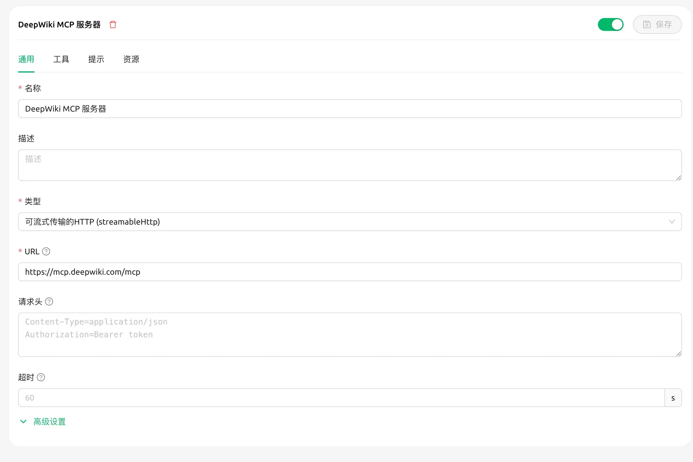
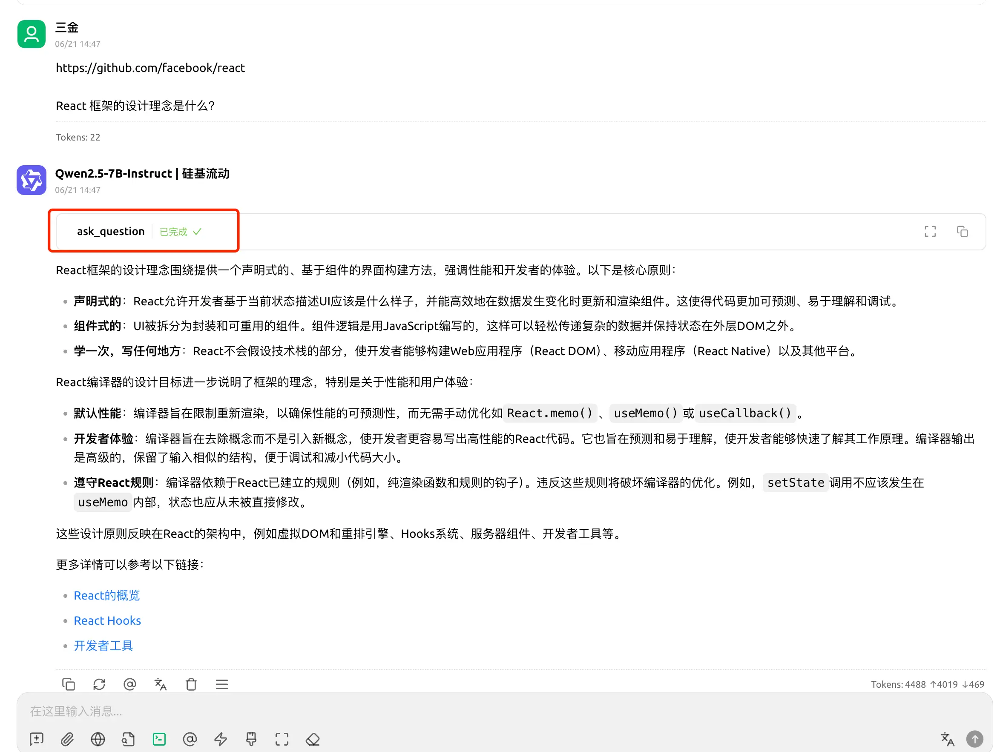
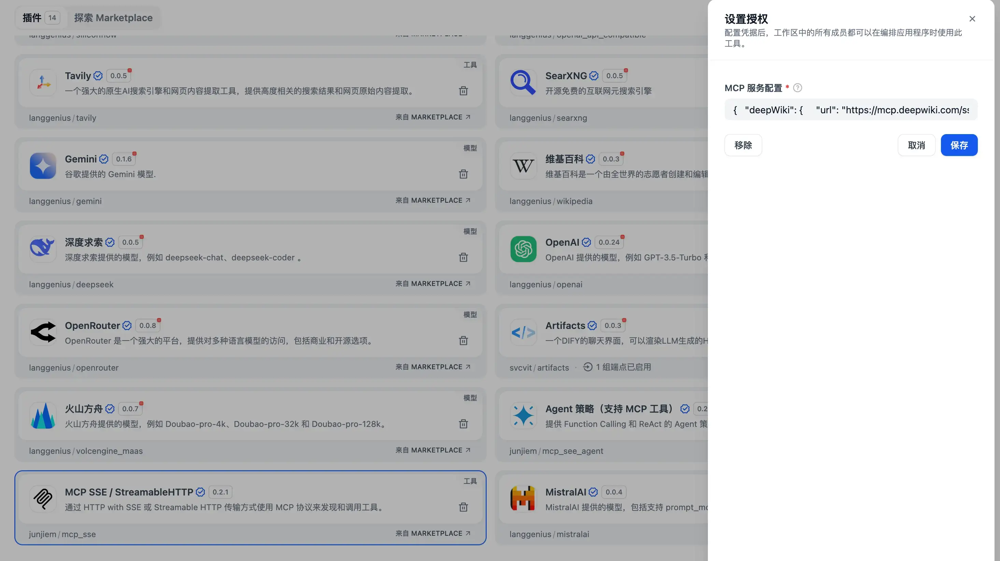

#### 前言

哈咯大家好，这里是三金～

之前几篇文章介绍了 DeepWiki 以及 DeepWiki Open，它们的主要能力是使用 AI 为目标项目生成项目文档，助力开发者快速学习、上手项目。

但如果**既想学习开源项目，又想尽快熟悉工作内容（对新人而言）**，就需要：

1. 打开 DeepWiki 官网（没有魔法还打不开）；
2. 自部署一套 DeepWiki Open（为私有/本地项目服务）；

这就很难受了，有什么办法可以解决这个问题呢？

很简单！我们可以**使用 MCP 将二者聚集在一个应用上**，这样就可以实现既能又能的效果啦～

而在二合一的方向上，有两个维度：

* **个人使用**：推荐使用 Cherry Studio 实现，方便又快捷；
* **企业使用**：推荐使用 Dify 进行集成，做成 Agent 之后，可分享给团队多人使用。

接下来我先以 DeepWiki 官方 MCP 为例，给大家分别展示一下如何在 Cherry Studio 和 Dify 中接入 DeepWiki MCP Server。

#### 前置知识

在正式进入实战之前，我们需要大概了解一下 DeepWiki MCP Server：

1. DeepWiki MCP Server 的服务地址是 `https://mcp.deepwiki.com/`；
2. 该 MCP Server 提供了三种工具，分别是：
   1. `read_wiki_structure` - 获取 GitHub 仓库的文档主题列表；
   2. `read_wiki_contents` - 查看有关 GitHub 仓库的文档；
   3. `ask_question` - 询问有关 GitHub 仓库的任何问题，并获得基于上下文的 AI 驱动的响应；
3. 支持两种协议：
   1. **SSE**：`https://mcp.deepwiki.com/sse`。可用于大多数应用集成，是 MCP 官方规范版本；
   2. **Streamable**：`https://mcp.deepwiki.com/mcp`。较新的协议，也支持 `/see` 版本。

> DeepWiki MCP 文档：`https://docs.devin.ai/work-with-devin/deepwiki-mcp`

#### 接入到 Cherry Studio

> 还不了解 Cherry Studio 的小伙伴可以看这篇：《[内置知识库的 AI 客户端—Cherry Studio](https://blog.ihsxu.com/p/%E5%86%85%E7%BD%AE%E4%BA%86%E7%9F%A5%E8%AF%86%E5%BA%93%E7%9A%84-ai-%E5%AE%A2%E6%88%B7%E7%AB%AFyyds/)》

在 Cherry Studio 的设置中，我们打开 MCP 服务器，选择「添加服务器」：


填入对应信息，这里三金选择使用 Streamsable 流式进行调用（sse 试了下失败了）：



保存之后我们回到对话页面，并开启 MCP 服务器：


来测试一下，我们以前端框架 React 为例：



可以看到它调用了 DeepWiki MCP Server 提供的 ask\_question 工具，并返回了对应的信息，非常赞！

不过**这个场景只适合个人，如果是公司内部使用，还是推荐 Dify 这种平台**，只需要大家访问对应的 AI Agent 网址即可。

#### 接入到 Dify

在 Dify 中要接入 MCP，需要用到对应的插件——MCP SSE / StreamableHTTP。


安装好之后，填写 MCP Server 配置：

```json
{
  "deepWiki": {   
     "url": "https://mcp.deepwiki.com/sse",
     "headers": {},     
     "timeout": 50,     
     "sse_read_timeout": 50  
  } 
}
```



> 在 Dify 中我们使用 SSE 协议进行演示～

创建一个新的 Agent 应用：

1. 添加「发现和调用 MCP 工具」，将其里面的两个 tool 都选上；
2. **设置提示词**，这一点很重要，我在调试中发现如果不预设提示词，有的 AI 模型都不会主动调用 MCP 工具。


需要注意的是，**输出效果会因为提示词和模型的原因有一些差异，甚至出现幻觉，最好选择稍微牛一点的模型，可以有效地减少幻觉**：


测试 OK 之后，我们就可以将 Agent 分享给其他小伙伴进行使用了，非常适合企业内的开发场景！

#### 踩坑

**在 MCP 工具调用时，arguments 参数一定要让 AI 提前转义一下，否则会报参数不正确的错误！！**

