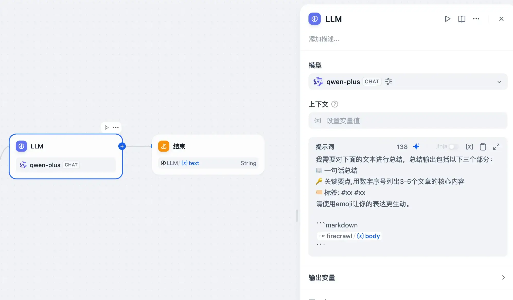
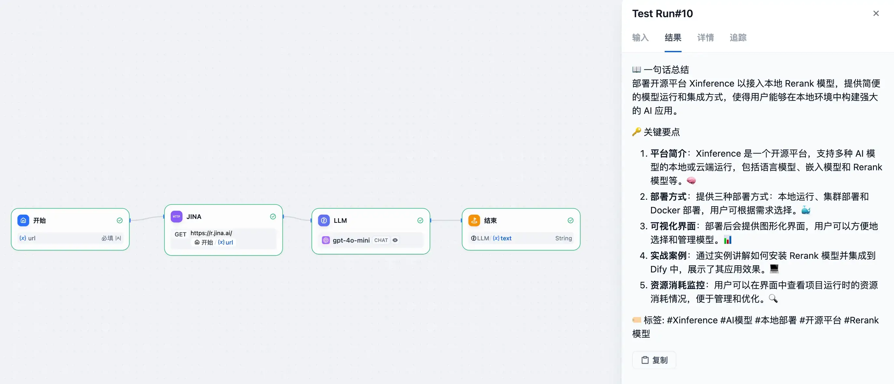

小伙伴们大家好，我是三金～

今天要分享的 JinaSum 其实在之前的文章《[使用 dify-on-wechat 中的插件搭建私人助理](http://mp.weixin.qq.com/s?__biz=MzUyODkwNTg3MA==\&mid=2247485369\&idx=1\&sn=566913a7bb22739cebc50bf553f029ab\&chksm=fa686458cd1fed4e39edfddbdb9625eb3c9fd253f69c043bbe8416683c980734f52c0325dd40\&scene=21#wechat_redirect)》中已经有介绍过，不过它是以 dify-on-wechat 中插件的身份出现的，其主要作用就是总结网页内容。

今天我们通过工作流的方式来实现一下。

新建一个空白工作流，在这个工作流中我们需要四个节点：

* **开始节点**：接收一个网页链接
* **HTTP 请求节点**：这里可以通过之前我们部署的本地 firecrawl 服务来实现，也可以选择使用 jina 来实现，主要作用是爬取网页内容并将其转为 Markdown 格式
* **LLM 节点**：接收上一步传递过来的内容，并对其进行总结整理
* **结束节点**：将总结的内容进行输出

具体实现：

* 在开始节点中，定义一个字段 url，用户需要输入想要进行总结的网页 url；
* HTTP 请求，这里有两种选择：

一种是使用 jina 的服务`https://r.jina.ai/`，在这个链接后面拼接上开始节点输入的 url 链接即可。

另外一种是结合之前的文章中《[本地部署 Firecrawl 爬虫让 AI 知识库更丰满](https://mp.weixin.qq.com/s?__biz=MzUyODkwNTg3MA==\&mid=2247485446\&idx=1\&sn=b0680e49ec1a8ac7e3727721fd67536b\&chksm=fa686be7cd1fe2f1a23553e4b4f6aacc9418bf2081656844143d1313eccc3e52b2be09a68442#rd)》介绍的，使用 firecrawl 的服务：

> 相较之下 jina 会更简洁方便一点，但 firecrawl 的话可以根据自己的需求进行一些参数配置，定制化强一点

* 将爬取到的网页内容输出到 LLM 中，在 LLM 中预设好提示词即可：

* 最后通过结束节点输出内容

我们来测试一下：

使用 Jina 和 firecrawl 都是可行的。
