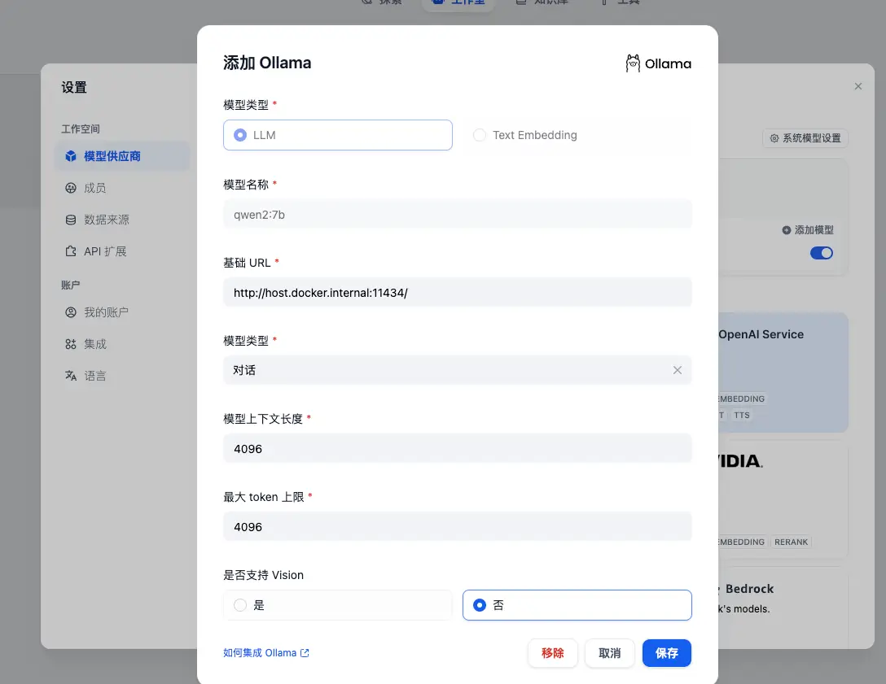
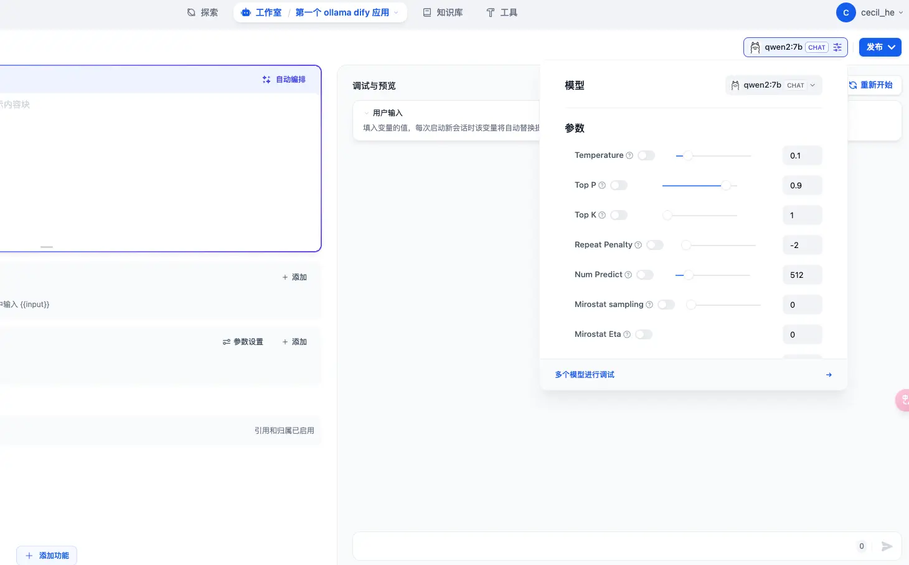
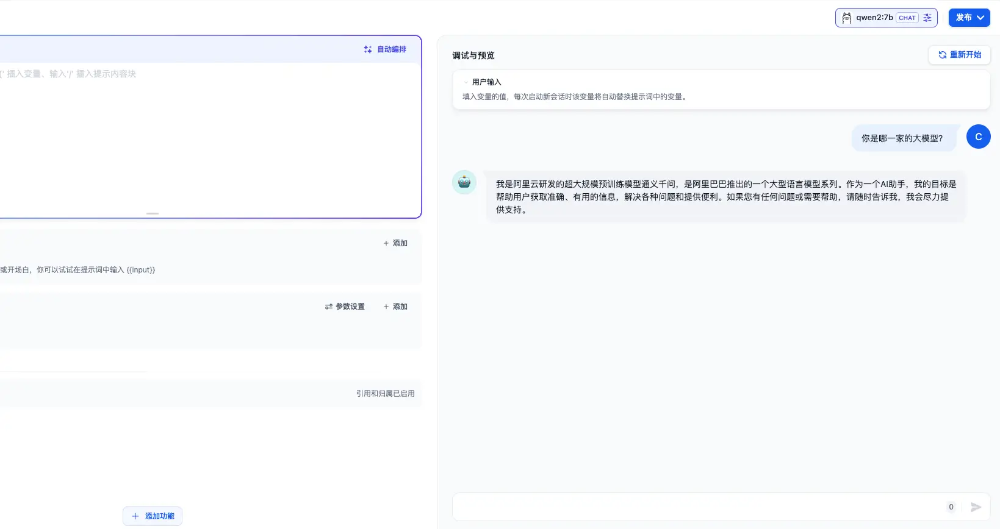
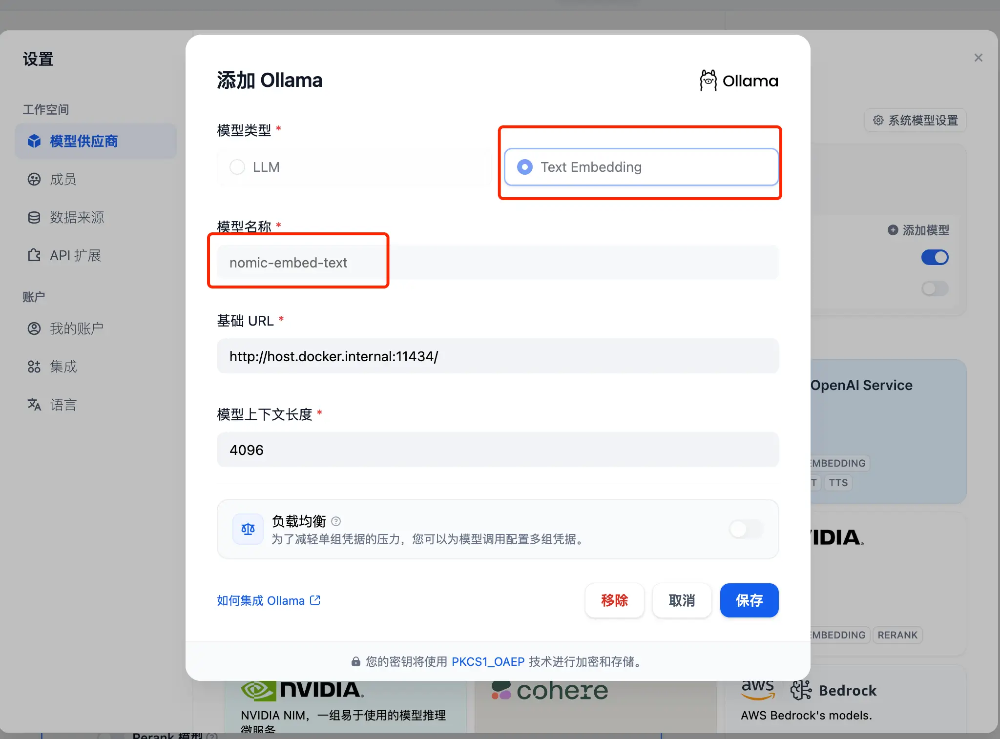
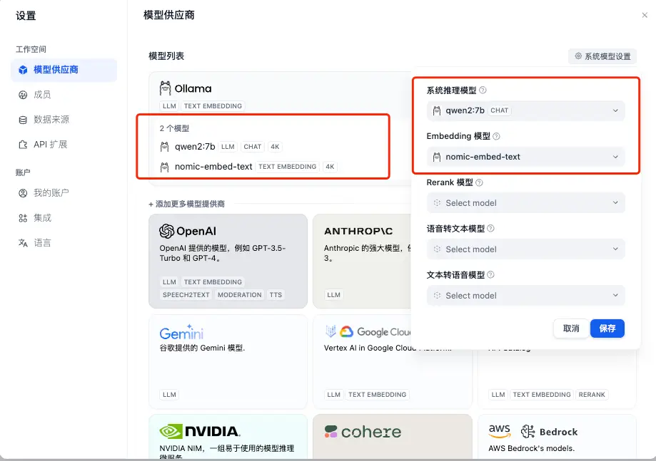
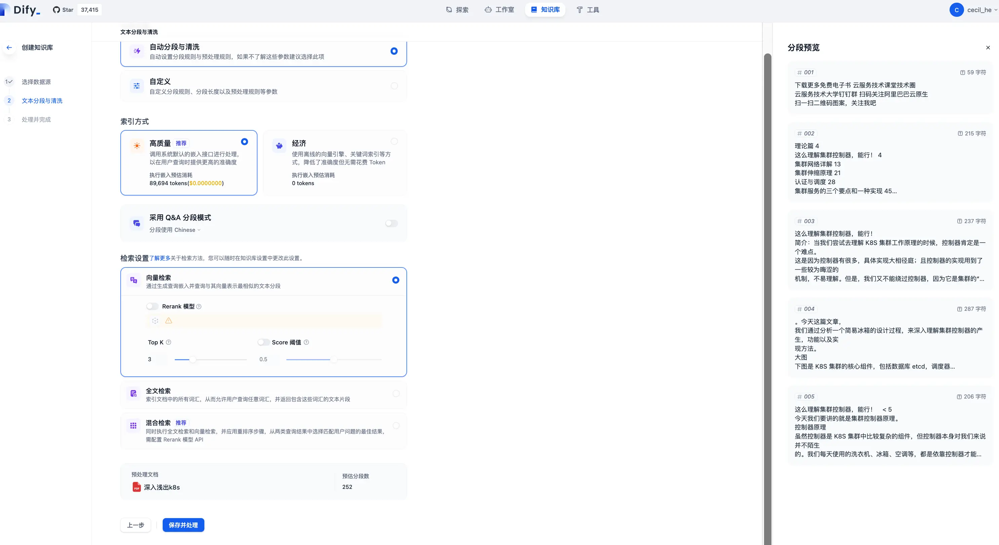
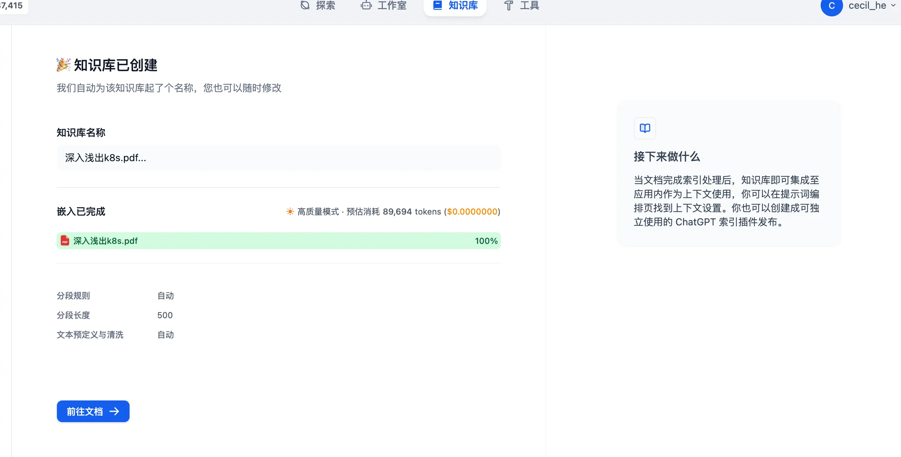
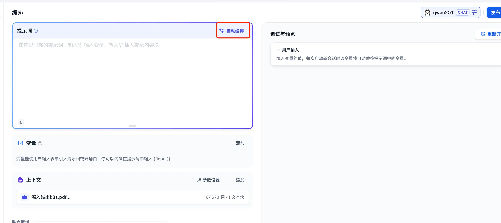
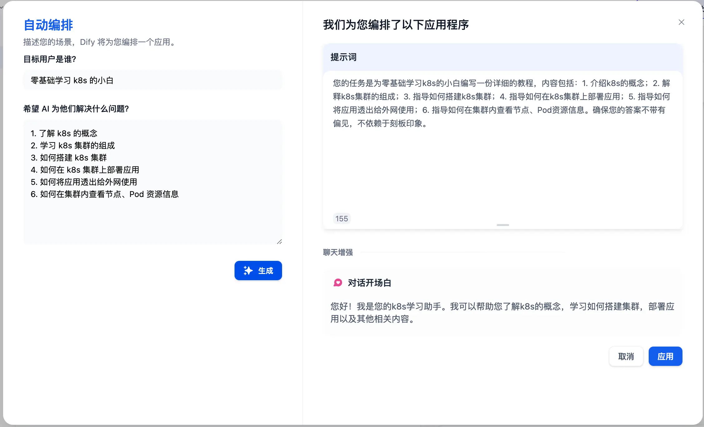
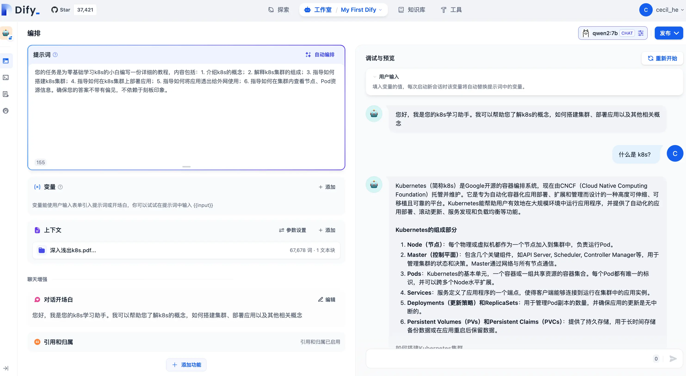

上一篇文章《[37.4k 的 Dify，一款小白也可以轻松上手的大模型开发平台（一）：部署及基础使用](https://mp.weixin.qq.com/s?__biz=MzUyODkwNTg3MA==\&mid=2247485019\&idx=1\&sn=572e8f94c6d082183d80788a53cc6f55\&chksm=fa6865bacd1fecac6f3ed04454f5751444c7cf7849490d8991faf9e9c2296f565ac05140aa58\&token=1234823734\&lang=zh_CN#rd)》我们介绍了 Dify 的部署及基础使用，今天我们来介绍一下**如何为 Dify 接入 Ollama**。

> 关于如何在本地部署并使用 Ollama，可以参考[中文版斯坦福多智能体AI小镇（一）：安装 Ollama](https://mp.weixin.qq.com/s?__biz=MzUyODkwNTg3MA==\&mid=2247484912\&idx=1\&sn=4b9d831c1b85af97c43e922182faa7ae\&chksm=fa686611cd1fef07abafc1c0b996068515b91576dcd3d9b4ba65ca37184631c8e1378cdc04b7\&token=284766951\&lang=zh_CN#rd)

### 使用 Ollama

还是在设置的弹窗中选择「模型供应商」，这次我们选择 Ollama，以 `qwen2:7b`模型为例：

* 模型名称我们填入 `qwen2:7b`
* 基础 URL 填入 `http://host.docker.internal:11434`
* 其他选项可以根据自己的需求进行配置，或者也可以保持默认
* 然后保存即可



回到创建的应用中，在编排页面的右上角切换大模型为 `qwen2:7b`:



可以看到的，由于是本地大模型，所以响应速度非常快！



### 知识库配置嵌入模型

因为咱们本次使用 Ollama 来作为 Dify 的 AI 模型，所以在创建知识库时会有一些问题：


这是**因为 Dify 默认的系统 Embedding 模型是 OpenAI 的&#x20;****`text-embedding-3-large`**，但是当我们使用本地大模型时，是无法连接到这个模型的，所以我们**还需要再拉取一个 Embeddinng 模型下来，这里以&#x20;****`nomic-embed-text`****&#x20;为例**：

```shellscript
ollama pull nomic-embed-text
```

然后在 Ollama 模型设置中选择 `Text Embedding`：



保存之后，我们可以**修改 Dify 的默认系统模型，点击右上角的「系统默认设置」按钮进行设置**：



再创建一个新的知识库进行测试：



也可以成功嵌入：



### 测试应用

接下来我们将刚刚创建的知识库添加到应用中去，并给应用添加提示词。如果不知道怎么编写提示词，还可以点击右上角的自动编排让 AI 帮助我们完成：





点击右下角的「应用」按钮，就会自动为我们添加这些提示词和开场白到应用中了：



我们可以在知识库中添加大量的 K8s 相关的资料，打造一款 K8s 大师应用。是不是很棒😊
