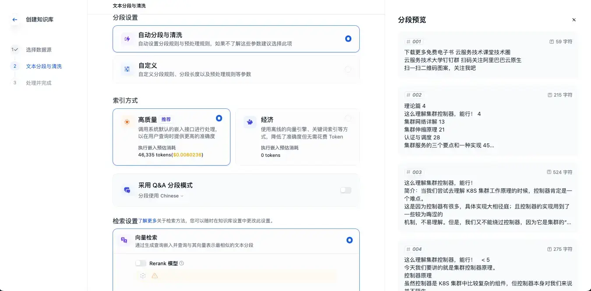
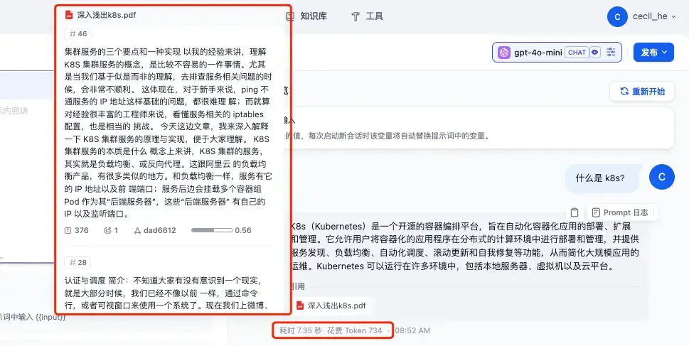
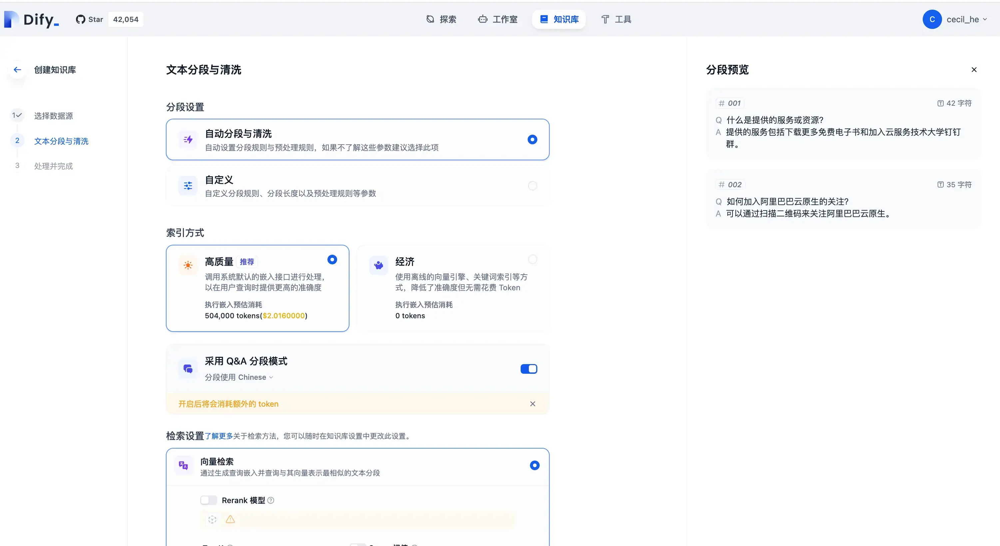
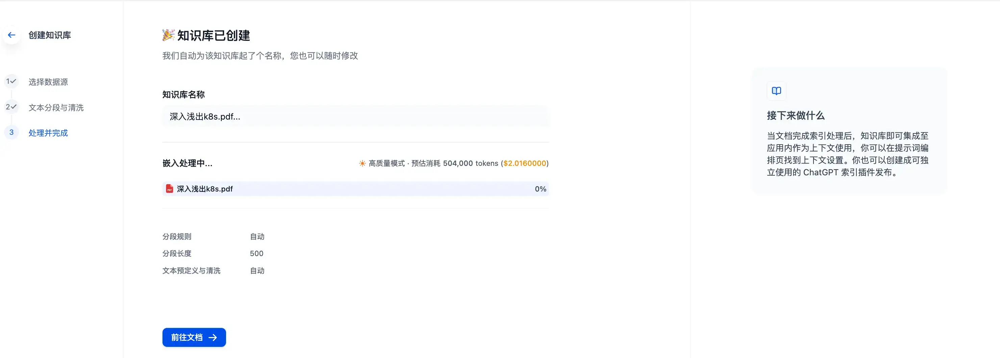
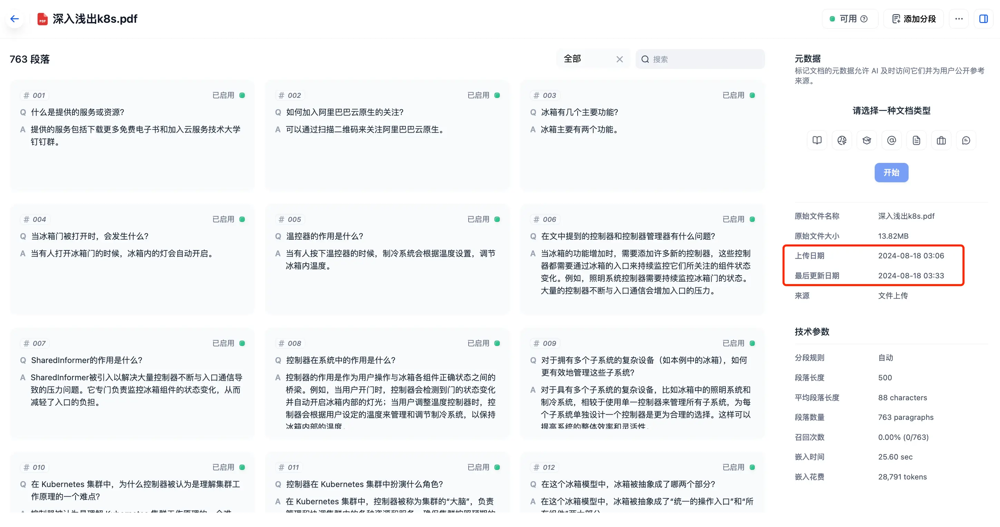
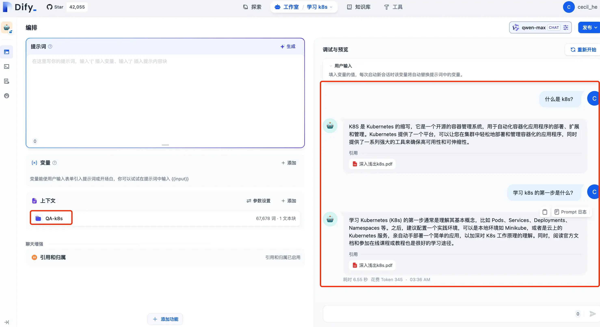
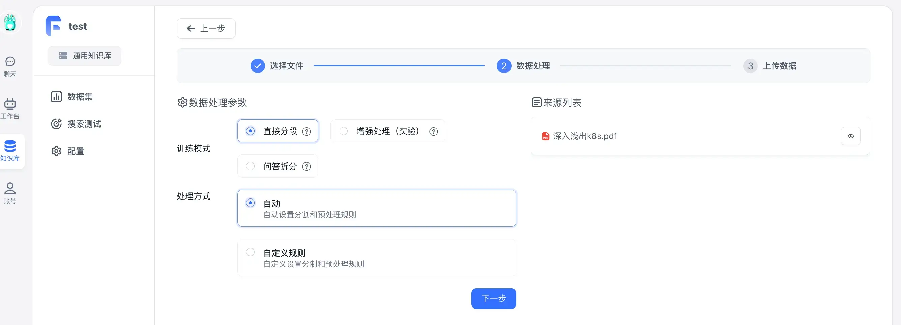
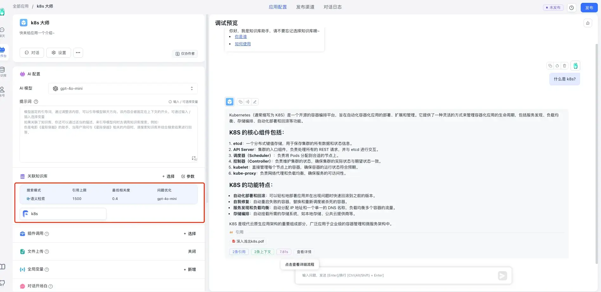
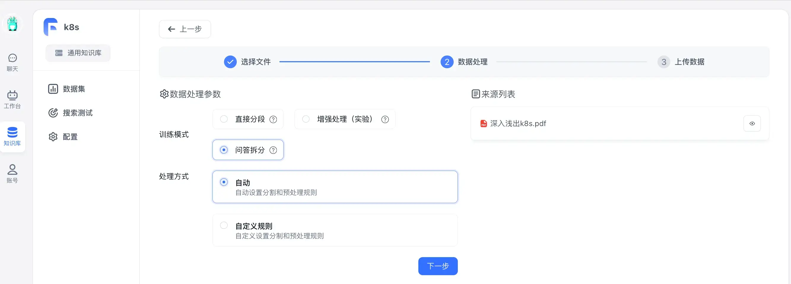
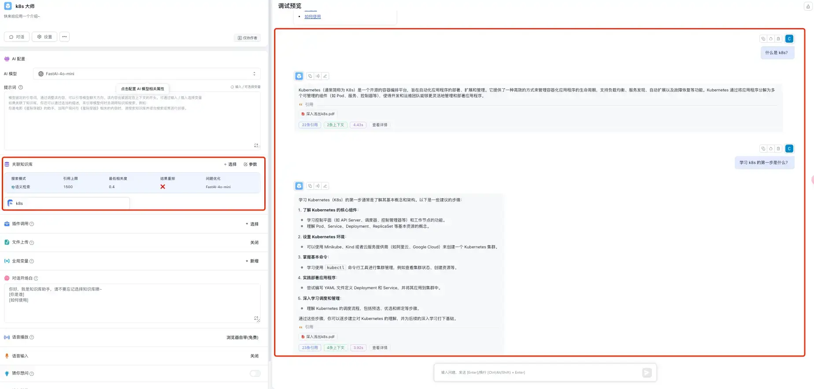

之前出了一些 Dify 的[基础教程](https://mp.weixin.qq.com/mp/appmsgalbum?__biz=MzUyODkwNTg3MA==\&action=getalbum\&album_id=3595421362707415047#wechat_redirect)，后台有小伙伴经常问三金：**Dify 和 fastGPT 哪个好啊？我该用哪个呢？**

为了帮小伙伴解开这个疑惑，今儿三金就先带大家分别看下这两个产品**在知识库上的异同点**。废话不多说，开整！

### Dify

先来看 Dify 吧，三金比较熟。这里也推下我之前做的[Dify 基础教程](https://mp.weixin.qq.com/mp/appmsgalbum?__biz=MzUyODkwNTg3MA==\&action=getalbum\&album_id=3595421362707415047#wechat_redirect)，**从部署到使用上，整体来说都比较容易上手，类似于 Coze**。

我们之前创建过一个 k8s 相关的知识库，在里面导入了一本讲解 Kubernetes 的书籍，**文本分段和清洗都是默认的配置**：

最终得到的文档信息如下：

* 分段为 147
* 段落长度 500

现在将它加到应用中试试看效果：

可以看到它从知识库中找到了相关内容并给出了回答。除此之外它还**标注了引用的知识库，以及从哪段内容中获取的内容**：

目前看起来效果还 OK，接下来我们试试**Dify 中提供的 QA 模式**，看看在这种模式下知识库检索能力是否能得到提升：

QA 模式的嵌入处理会比较耗时，需要耐心等待：

最终花费了 27 分钟的时间，终于分段好了：

问两个问题试试看：

emmmm，咋说呢，回答是回答了，但是感觉没啥变化，回答还是和刚刚一样精简😄

### FastGPT

相同的文件，我们在 FastGPT 中创建并使用知识库，这里同样先**按照默认配置进行知识库创建**：

然后在应用中提出相同的问题，看看结果怎么样？

可以看到都是默认配置，但是**FastGPT 相较于 Dify 来说，回答得更为详细**。不但给出了 k8s 的相关概念，还**连带着介绍了 k8s 的核心组件以及功能特点**。

这是因为 fastGPT 在回答问题时，会**帮我们扩展问题**，这样可以使回答的内容更加详细精准：

接下来我们升级一下知识库，在创建知识库时选择 QA 模式（也就是问答拆分），看看二者在效果还有没有这种明显差异。

可以看到正在生成数据，不过过程有些慢（这块和 Dify 一样，QA 模式的生成一般都会耗费大量的 token 和时间）：

再回到应用中进行测试：

简直是正中目标！！相比之下，FastGPT 的知识库能力完胜。

> 在本地部署的版本上，QA 花费的时间太长而且因为三金的 API 问题，老是卡住，所以直接切到 fastGPT 的线上去测试，最终效果是一样的。

### 总结

从效果上来看，FastGPT 的知识库检索是强于 Dify 的，但是这并不代表 Dify 就不如 FastGPT：

* 首先，在知识库创建上，FastGPT 在「Web 站点同步」和「外部文件库」这两个功能上是收费的，就算是本地部署也是收费的，而 Dify 则是免费的；
* 其次，个人感觉 Dify 的部署到使用，是比较简单的，而且交互体验和 UI 上也优于 FastGPT
* 开源版本的 FastGPT 的知识库限制为 30个，应用限制为 500 个；而 Dify 的社区版没有这些限制
* Dify 中提供了**丰富的内置工具和一些模版**，FastGPT 在这块比较欠缺

综上，如果**对知识库有比较高的要求的话，推荐使用 FastGPT**，反之**对 Agent 感兴趣则可以尝试一下 Dify**。
