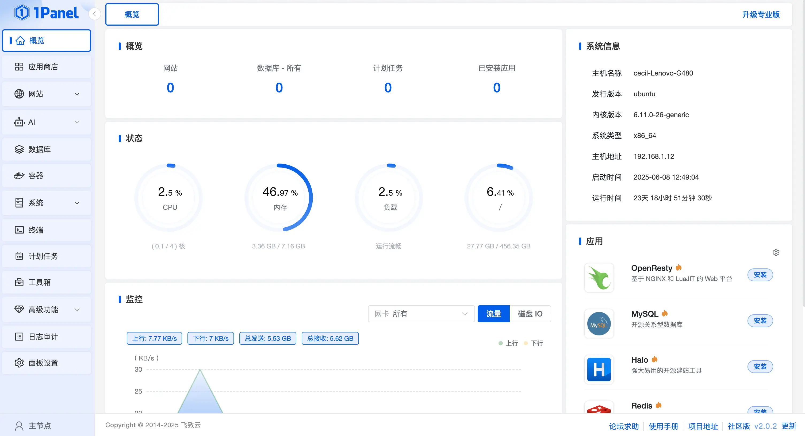
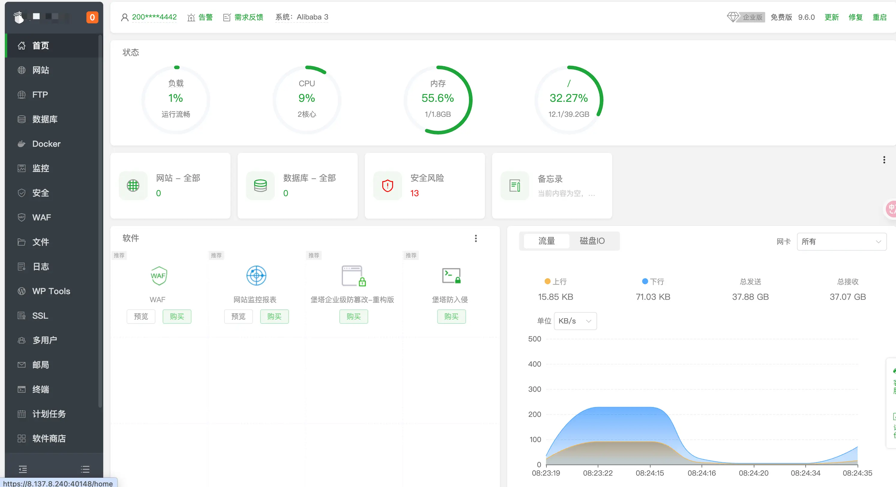
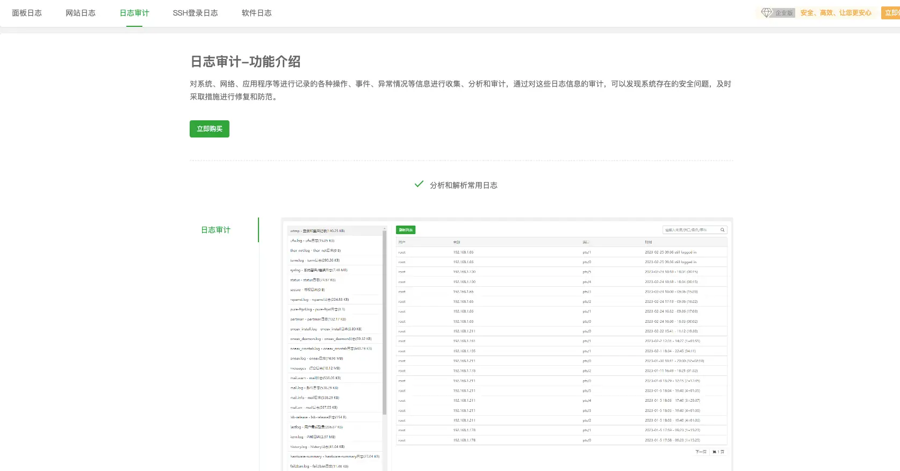

大家好，我是三金～

最近想继续在 Ubuntu 服务器上部署一些有趣的应用，但是我这个服务器是原来淘汰掉的 Windows 电脑改的，配置不是很高，只有 4 核 8 G，所以就想先找一个服务器运维管理系统来观察一下服务器目前的资源使用情况。

网上搜索和咨询了身边的大佬，呼声最高的有三个：

* **Prometheus**
* **1Panel**
* **宝塔面板**

#### Prometheus

我首先尝试的是 Prometheus，因为在工作中经常能听到它的大名，也操作过监控大盘（就是鼠标点点点），潜意识认为它对我而言会比较容易上手！

还有一个原因是它在开源监控领域的口碑很好，Github Star 数目前也高达 59.2k，在各大云厂商的容器服务产品中也都集成了 Prometheus 来做大盘监控。

部署 Prometheus 并使用它有一丢丢麻烦：

1. **部署 Prometheu**s：定期从配置好的 jobs 或者 exporters 中拉 metrics；
2. **部署 Grafana**：一个可视化的图形界面，可以将 Prometheus 采集到的数据以图表的形式展示给用户；
3. **部署 node-exporter**：用来暴露要监控的节点（服务器）的系统指标；

你没看错，要运行三个容器才可以，我在网上找到一篇比较详细的部署教程：[docker部署监控Prometheus+Grafana](https://www.cnblogs.com/misakivv/p/18059352)。

按照里面的步骤一步步进行部署，但是最后卡在了添加监控节点那里。

在 Prometheus 的应用中 Status -> Targets 里并没有发现 Grafana 和对应的节点 job，查了许久的资料也没定位出来具体原因是什么，docker 日志中也没有报错，这对一个新手来说简直太折磨人了😩。

好在世上无难事，只要肯放弃！我转头就去看 1Panel 和宝塔去了😄

> 其实主要还是在阅读 Prometheus 官方文档以及相关文章时看到，它更适合在类似 k8s 集群中使用，适合企业级用户，对于个人用户而言并不是最优解。

#### 1Panel

1Panel 目前在 Github 上已斩获 29.4k Star 的好成绩！免费社区版拥有以下功能：

* **应用商店**：里面涵盖了建站、数据库、Web 服务、AI 大模型等不同类型的 178 个应用；
* **网站管理**：建站、SSL 证书管理；
* **数据库管理**：包含 MySQL、PostgreSQL 以及 Redis；
* **容器管理**：不管是你直接在服务器上启动的容器还是通过 1Panel 运行的容器，都会在这里被统一进行管理；
* **文件管理**：Web 版 SFTP，也能直接打开终端使用命令行进行操作；
* **服务器监控**：负载、CPU、内存、磁盘 I/O 以及网络都可以监控到；
* **防火墙**：统一管理服务器防火墙，创建端口规则；
* **进程管理**：查看机器上的进程和网络；
* **SSH 管理**：Web 版 SSH 会话，还能查看登录日志；
* **计划任务**
* **日志审计**：免费使用日志审计功能；
* **AI 模型管理**：通过安装 Ollama 来部署和管理本地 AI 大模型，还集成了 MCP 列表，可统一管理 MCP 服务；
* **GPU 监控**：如果你的电脑上有 NVIDIA 或者 XPU，1Panel 能对 GPU 资源做监控。



安装部署也很简单，只需要执行下面这行命令即可：

```shellscript
bash -c "$(curl -sSL https://resource.fit2cloud.com/1panel/package/v2/quick_start.sh)"
```

如果遇到 Docker 安装失败等问题，可以尝试运行以下脚本：

```shellscript
bash <(curl -sSL https://linuxmirrors.cn/docker.sh)
```

安装成功后，控制台会打印面板访问信息，可通过浏览器访问 1Panel：

```shellscript
http://目标服务器 IP 地址:目标端口/安全入口
```

如果是云服务器的小伙伴，要记得在安全组中放开对应的端口号。

我是在自己的机器上部署的 1Panel，使用下来感觉不管从 UI 交互上还是功能上都比较符合我的预期：

* 简单！
* 易上手！
* 界面好看！
* 也可以监控服务器资源使用情况！

但还有个宝塔我还没看，货比三家，不看心里不安逸，所以我又跑了一下宝塔面板😂

> 差点忘了补一下 1Panel 的官网地址：https://1panel.cn/

#### 宝塔面板

宝塔的安装和 1Panel 类似，都是一行命令完事儿：

```shellscript
if [ -f /usr/bin/curl ];then curl -sSO https://download.bt.cn/install/install_panel.sh;else wget -O install_panel.sh https://download.bt.cn/install/install_panel.sh;fi;bash install_panel.sh ed8484bec
```

安装好之后，连访问方式都是一样的，会有一个安全入口：

```shellscript
http://目标服务器 IP 地址:目标端口/安全入口
```

> 其他系统安装请查阅：https://www.bt.cn/new/download.html



可以看到大部分功能都是一样的，但是在宝塔面板中日志部分是收费的，而 1Panel 是免费的：



除此之外：

* 宝塔的安装时常大概有 4 分钟左右，而 1Panel 的安装时间会短一些；
* 1Panel 的设计风格更简约一些，交互体验上也优于宝塔；
* 不过宝塔面板作为老牌的 Linux 服务器运维管理面板，在一些方面肯定是有优势的（有用过的小伙伴可以讲一讲）。

权衡之下，最终选择了 1Panel，目前来说已经能满足我的日常需求了。

