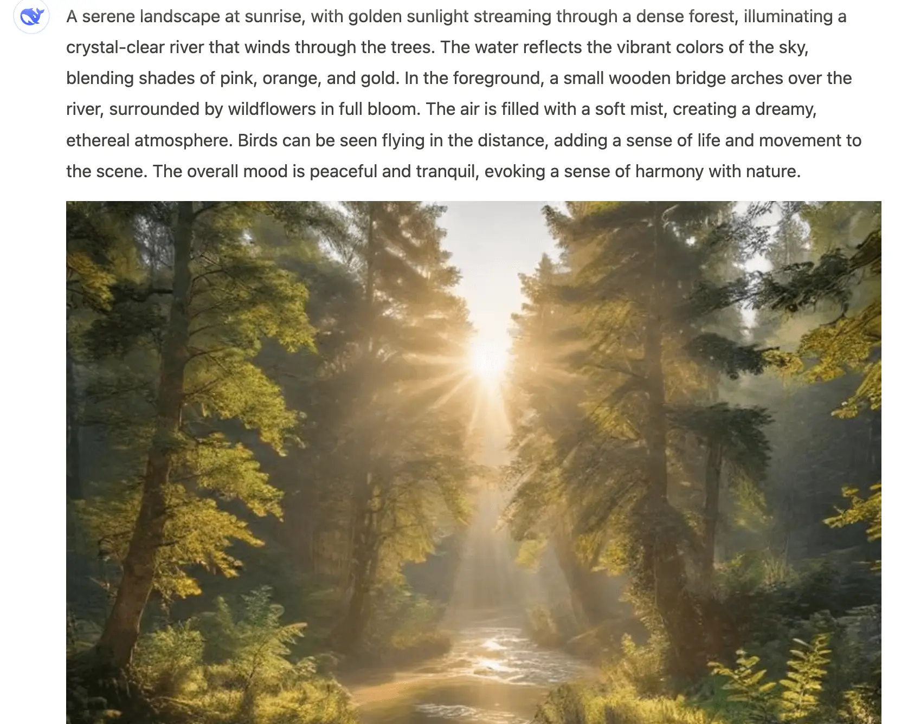

今天逛帖子时发现一个使用 DeepSeek 实现文生图的场景，觉得人家的思路很棒，这里分享给大家。

> 帖子原地址：https://linux.do/t/topic/447840/294

实现很简单，只需要一个提示词即可：

```
你现在是一个ai图片生成机器人，我给你一些提示，你用你的想象力去生动描述这幅图片，并转换成英文填充到下面url的占位符中:

```

这里作者其实给 DS 下发了两个任务：

* DS 根据用户提示生成图片提示词；
* 然后再将生成的图片提示词替换到 `{prompt}` 中

到这就结束了。我们只需要找到一个可以直接访问 url 就能生成图片的 AI 服务即可。

同理，如果还有一些其他类似的 AI，也可以这样搞。

我们来测试一下：画一个日出时分的森林。




效果还不错，就是图片渲染出来需要等一会会儿时间。

接下来我们再看下上述提示词中所使用到的——[Pollinations](https://pollinations.ai/).AI。

Pollinations AI 是一个免费开源的 AI 平台，它无需我们进行注册，使用时也不需要提供 API 密钥，支持：

* Text Generation
* Text To Image
* Text To Audio

以文章开头中的提示词为例，如果要使用文生图的功能，Pollinations 提供了 `https://image.pollinations.ai/prompt/{description}` 地址，description 就是需要填充的提示词。

在 url 地址后面我们还可以设置：

* width：图片宽度；
* height：图片高度；
* seed：确保在不同的环境中（比如不同运行时或环境中），文生图能够生成相同的图像，从而提高环境兼容性和稳定性；
* model：使用模型，比如 flux；
* nologo：是否去掉水印。

以下是 Pollinations AI 提供的其他 API：

* 图像生成：`https://image.pollinations.ai/prompt/{prompt}`
* 图像模型：`https://image.pollinations.ai/models`
* 文本生成：`https://text.pollinations.ai/{prompt}`
* 音频生成：`https://text.pollinations.ai/{prompt}?model=openai-audio&voice={voice}`
* 文本模型：`https://text.pollinations.ai/models`

Github: https://github.com/pollinations/pollinations

官网地址：https://pollinations.ai/

感兴趣的小伙伴快去试试吧～
