前段时间三金给大家分享了一款可以**根据截图或者 URL 自动生成代码的 AI D2C 产品——ScreenshotToCode**。它的原理是通过多模态模型去分析和理解上传的截图，然后再生成代码。整个流程简单来说就是：**图片输入** → **LLM理解** → **直接输出代码。**

> 原文：[虽然 V0 很强大，但是 ScreenshotToCode 依旧有市场](https://mp.weixin.qq.com/s/TZ6Qs27l5NlHm0rF5iKNsQ)

听起来很炫酷对吧？

但其实它有一个**对开发人员来说无法容忍的缺陷——无法集成到开发环境中**！也就是说它只能生成以单页面为主的 HTML 文件。

那有没有可以和开发环境完美集成的工具以及方法呢？答案肯定是有的！那就是 Figma MCP + Claude Code。

### Claude Code + Figma MCP

首先，假设你们公司的 UI 已经使用 Figma 设计了一款产品设计稿，并将设计稿链接发给了你；

然后，给你的 Claude Code 安装 Figma MCP，命令如下：

```shellscript
claude mcp add --transport http figma https://mcp.figma.com/mcp
```

安装好之后打开 Claude Code，并输入 `/mcp` 选择 figma：

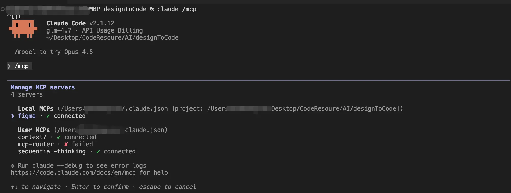

第一次使用时，是需要进行认证的：

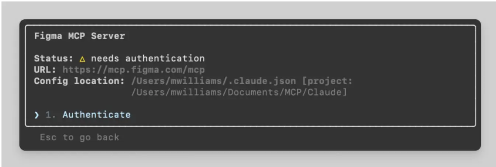

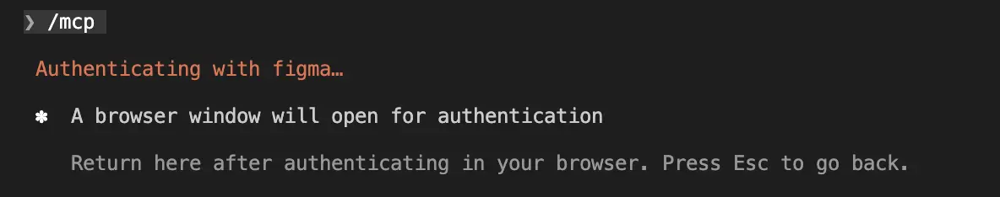

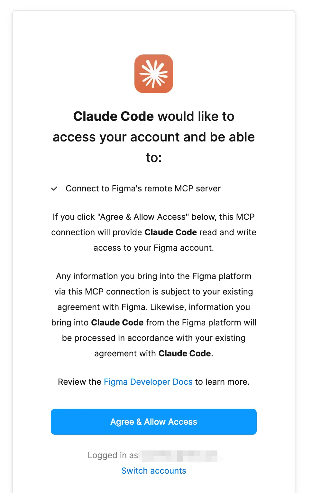

点击 「Agree & Allow Access」 按钮即可，成功后会提示：


Claude Code 中也会有相应的提示：

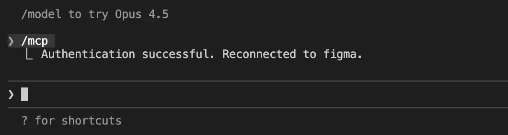

接下来，我们需要打开 Figma 中的设计稿，并选中要让 AI 生成代码的部分，右击再选中「copy link to selecttion」：

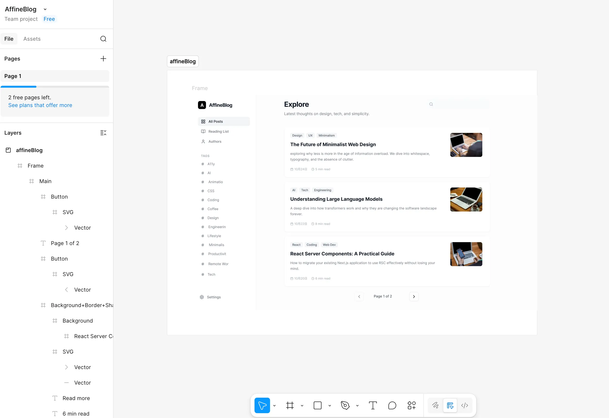

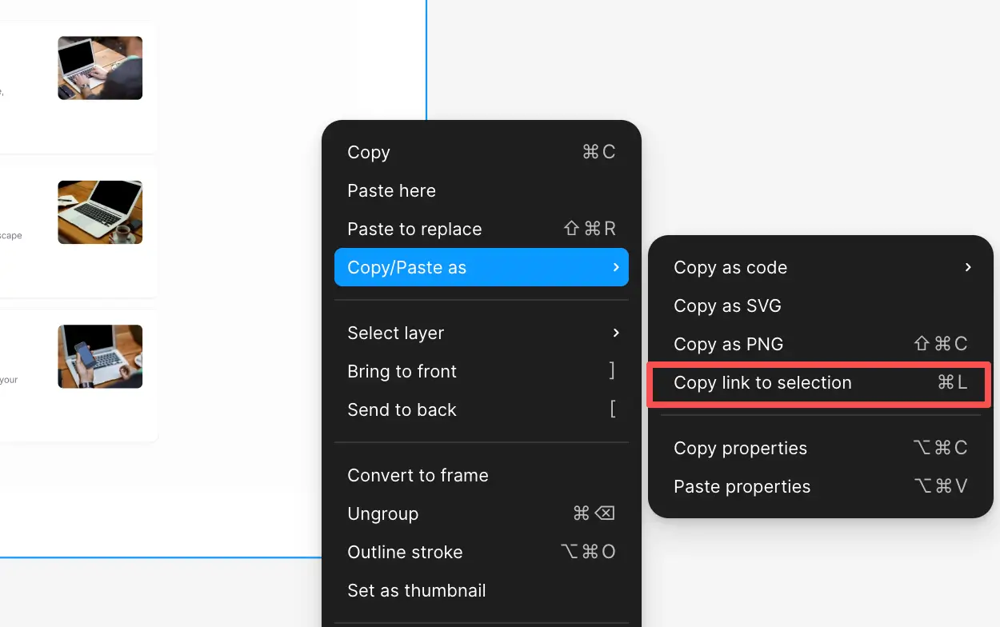

回到 Claude Code 后我们就可以进行 AI D2C 工作了：

> 输入提示词：请使用 React + Tailwind CSS 严格按照这个设计稿中的样式和交互进行还原。「这里再将刚刚复制的 Figma Url 粘贴进来」

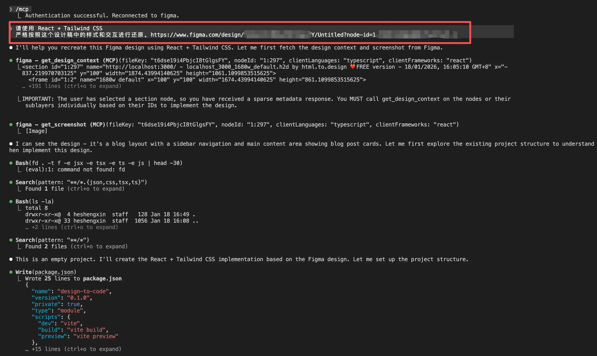

等个几分钟，一个页面就已经画好了：

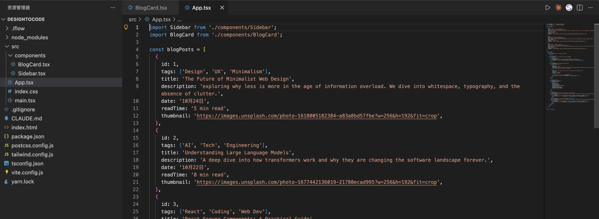

启动以后检查了一下，还原度可以说达到了 95% 以上，简直完美！！

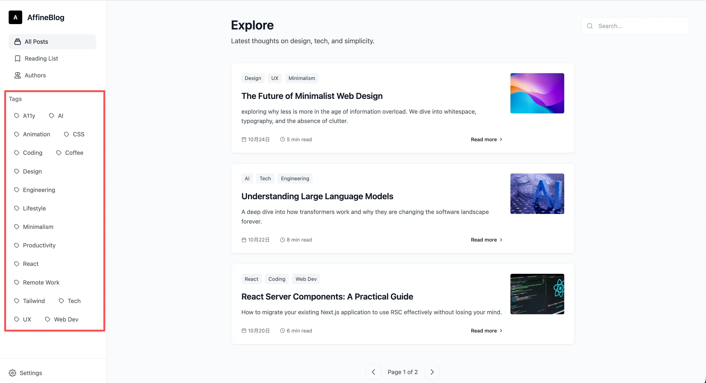

另外，官方还提供了 VSCode 和 Cursor 的示例，来都来了，我们再一起看下 VSCode + Figma～

### VSCode + Figma MCP

* 按下 Command + Shift + P，输入 MCP 之后会有两种设置 MCP 的方式，一种是用户级别的设置，一种是工作区级别的设置。我们可以直接设置用户级别的
* 然后在 `mcp.json` 中粘贴以下代码，并点击启动即可进行认证，认证成功后开始进行 AI D2C：

```json
{
   "inputs": [],
   "servers": {
     "figma": {
       "url": "https://mcp.figma.com/mcp",
       "type": "http"
     }
   }
 }
```

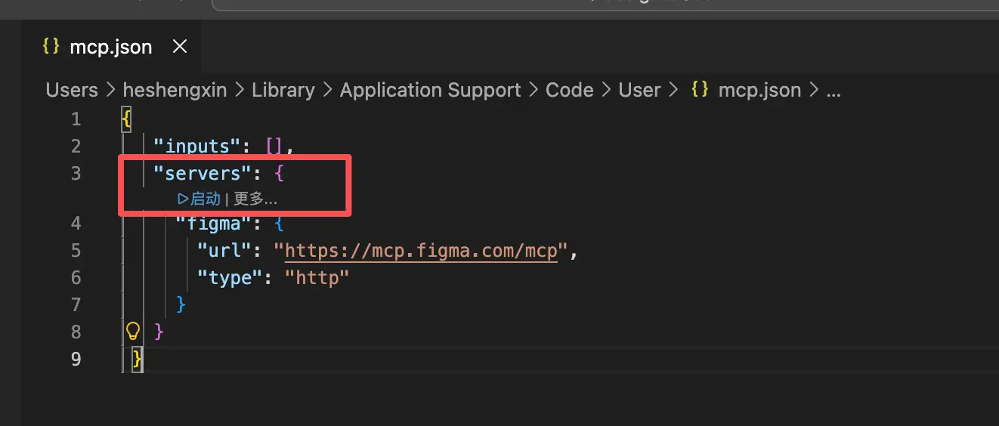

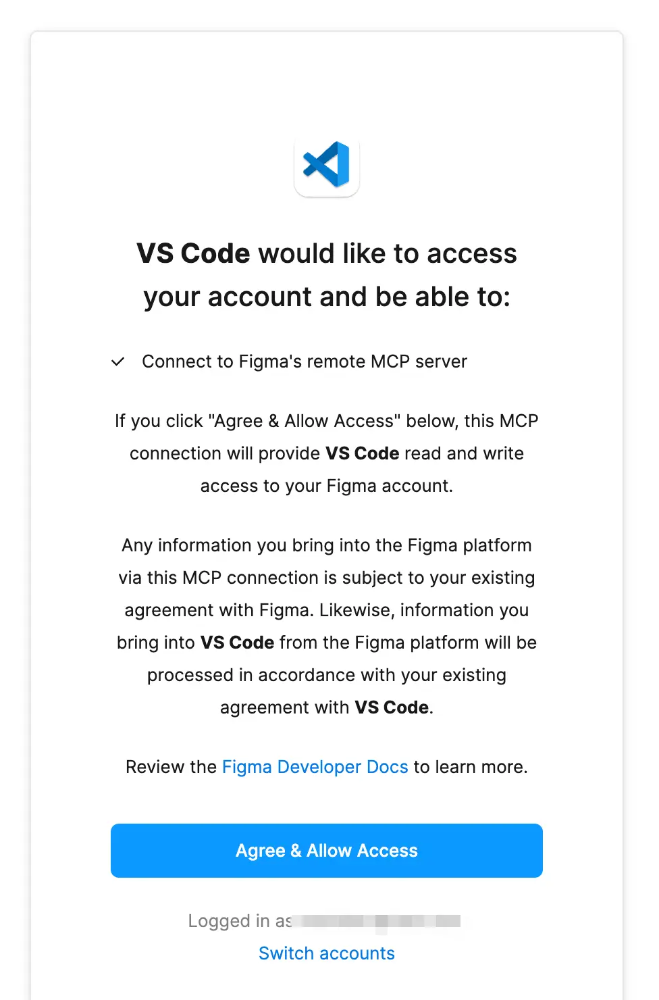


打开 Github Copilot 进行 AI D2C：

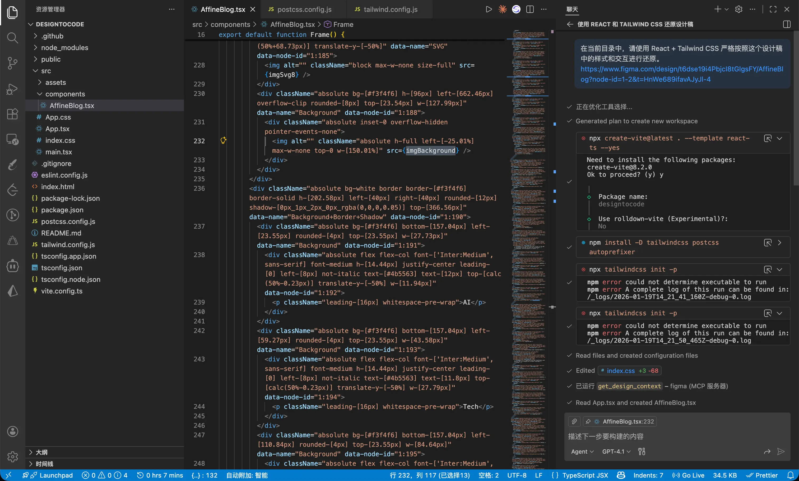

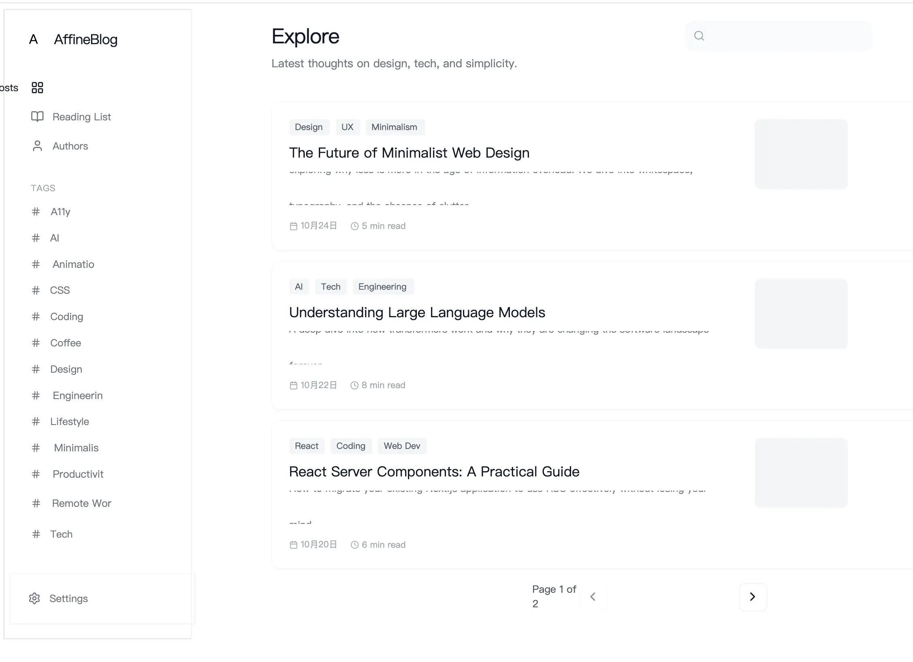

不知道我不会用还是咋，Github Copilot 的产出结果让我难以置信：

* 代码混乱
* 好多 UI 部分直接使用图层截图来实现的，比如搜索框，你根本就点击不了
* 布局混乱，列表上都出现了重叠

Agent 模式下使用的模型是 GPT-4.1，响应速度非常慢，产出结果还是这个样子，体验简直糟糕透了！

参考资料：

* [Figma MCP 接入文档](https://developers.figma.com/docs/figma-mcp-server/remote-server-installation/)
