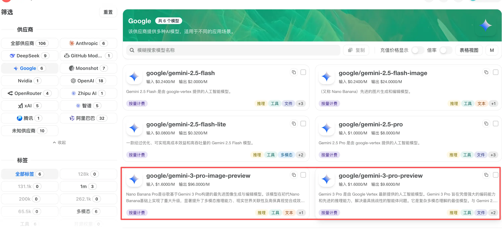
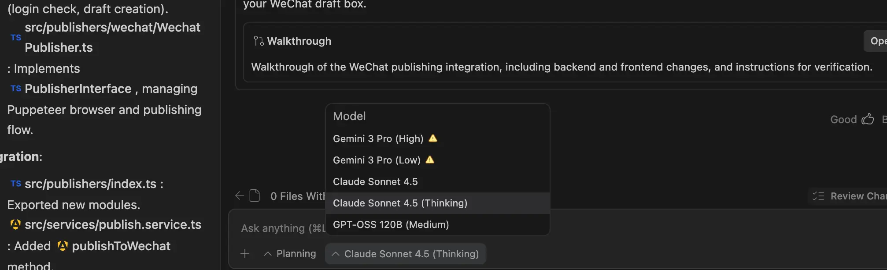

最近两天 Google 家又火爆得不行，Gemini 3 Pro + Nano Banana Pro 两款王炸出来以后，全网都在赶这一波浪潮，三金也是紧赶慢赶体验了下 Gemini 3 Pro。

首先需要说明的是，由于网络原因，我们在一般情况下是无法在国内直连到这些国外 AI 模型的，大多数情况下只有通过一些中转站或者网络魔法来进行体验。

中转站的话，目前就我所知 Cherry 家的 cherryin 已经上架了 Gemini 3 Pro preview：

直到 12 月 19 号之前有 8 折优惠！有需要的小伙伴通过点击🫱链接自行购买：https://open.cherryin.ai/register?aff=Z9ad

> 温馨提示：不要使用 github 直接登录，因为登录不上，好像有 bug😂。直接通过邮箱注册就好了。

而如果要使用网络魔法的话，其实现在各大 AI 博主都已经说过了，就是那三板斧：

1. 谷歌账号。有的博主说注册地址不要选国内啥的，这个我个人觉得应该没有那么大限制，因为我账号的地址就是国内，关键还是要满足下面两点。
2. 开全局。最好是美国节点。别的节点不一定行
3. tun 模式。有的工具没 tun 模型，就不要乱下载了，浪费时间。三金说俩有的，一个是 v2rayN，另外一个是 ClashX.Meta。

满足上述三点之后，到 https://antigravity.google/download 这里下载 antigravity，然后一步步往下点点点就行了。

目前 Antigravity 会免费提供五款模型，分别是：

* Gemini 3 Pro High 和 Gemini 3 Pro  Low
* Claude Sonnet 4.5 和 Claude Sonnet 4.5 Thinking
* 还有个 GPT-OSS 120B Medium

我基本上只用 Gemini 3 Pro High 和 Claude Sonnet 4.5 Thinking。

另外，大家也可以在 Google 的 AI Studio 上体验 Gemini 3 Pro Preview，网页版的也能用，而且很丝滑～

