大家好，这里是三金～

最近有一位粉丝朋友私信我，他想要学习一下 Dify 的项目源码，但是苦于项目过于庞大复杂，有一种无从下手的无力感，问我有没有什么比较好的方法可以快速入手？

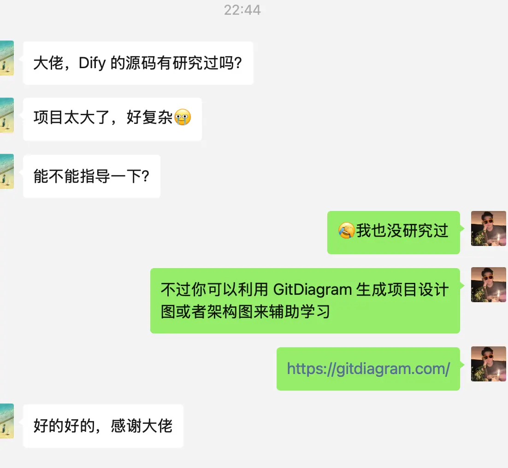

说实话我对源码没有研究过，大多数时间都在应用层面和探索封面，不过我推给他之前看到的一个学习开源代码辅助工具——GitDiagram。

这个工具具体有什么用呢？

- 访问 GitDiagram 官网：https://gitdiagram.com/

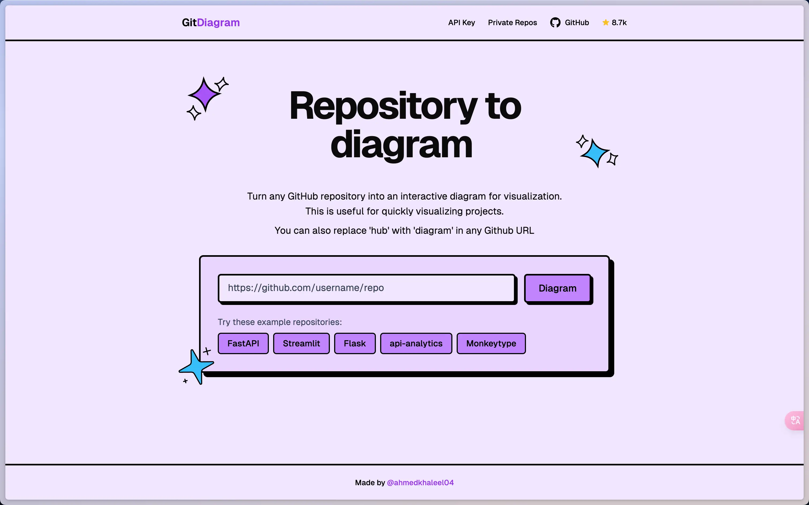

- 只需要在网站中提供的输入框中输入想要学习的 Github 仓库地址即可。这里我们以 Dify 为例：

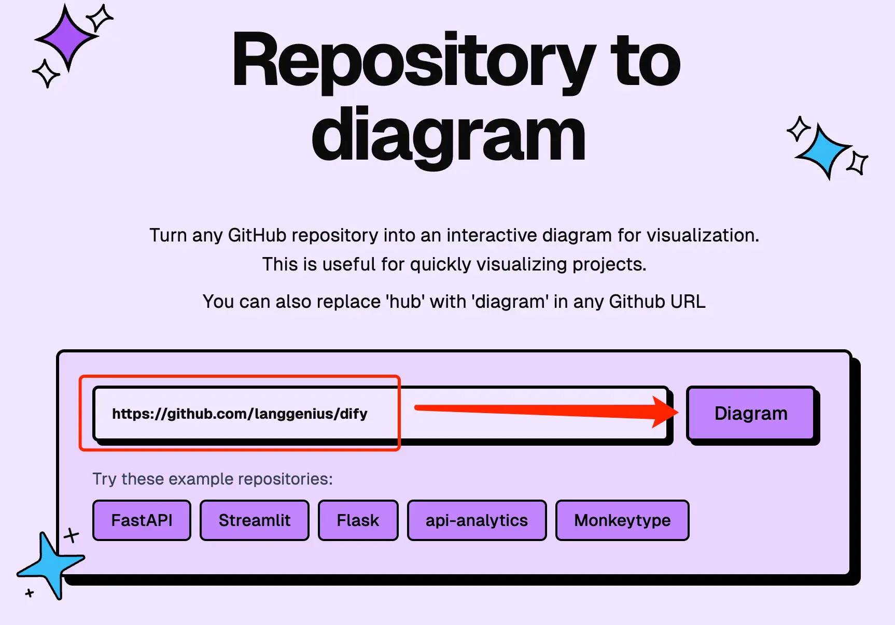

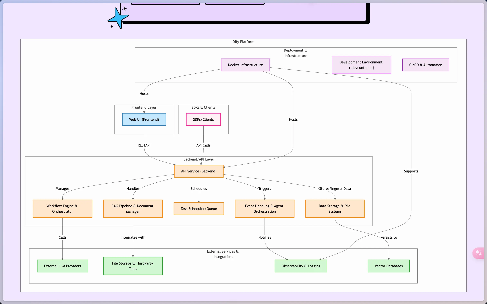

可以看到很快就生成了项目的关系图，这对于学习项目源码来说真的很有用，万事开头难，这一步算是利用 GitDiagram 解决了。

GitDiagram 提供了五个功能：

- 点击关系图中的模块可以跳转到对应的项目目录下；

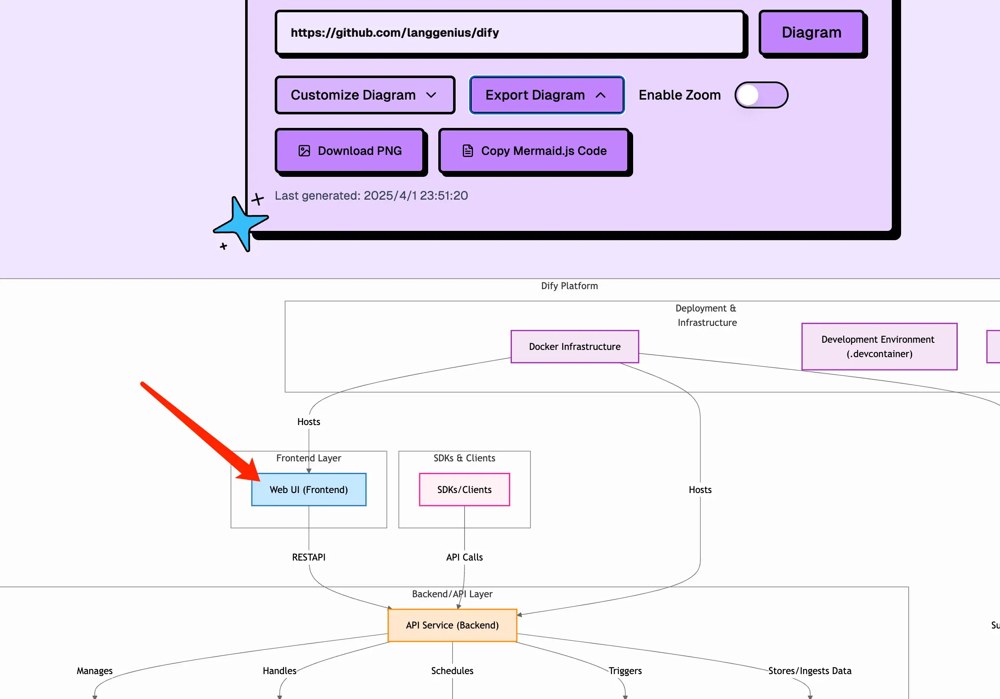

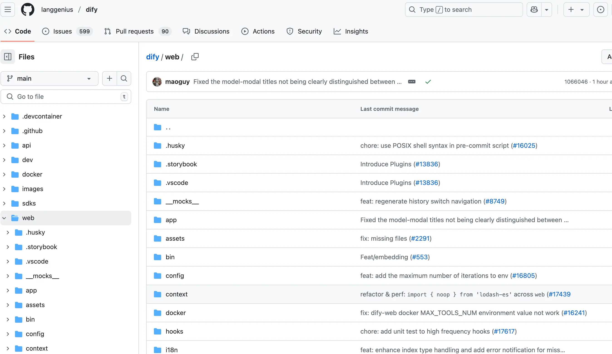

- 自定义指令修改和重新生成图表；

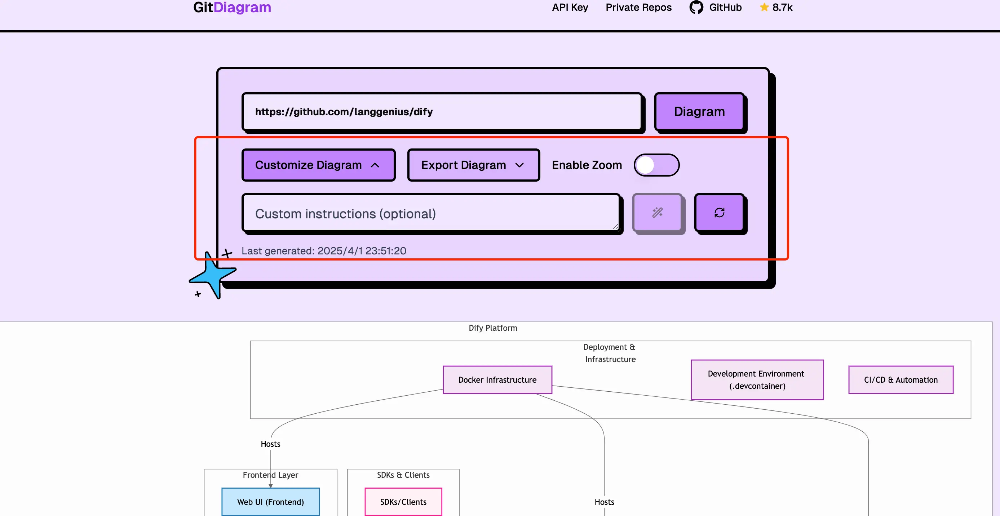

这个功能我在使用的时候遇到一些问题——因为 Dify 项目过于庞大需要消耗的 token 过多被拦截了：

不过情有可原，毕竟网站中使用的 o3-mini 模型是项目作者本人在垫付，能免费提供给大家使用真的已经用爱发电了！

如果有需要自定义图表的小伙伴可以使用自己的 API Key（只支持 OpenAI 的模型）：

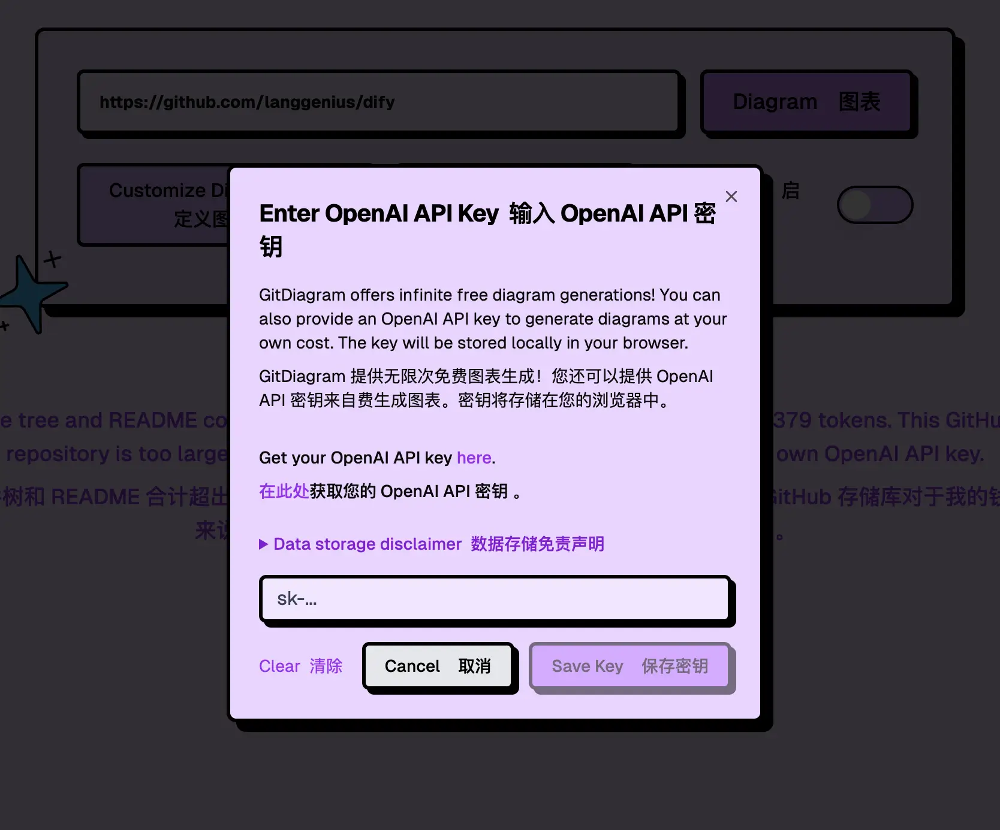

有想使用其他模型的需求，可以到 Github 上提 issue 或者拉取源代码自行进行修改和部署。Github 地址：https://github.com/ahmedkhaleel2004/gitdiagram

- 导出图表功能，支持导出 PNG 和复制 Mermaid.js 代码；

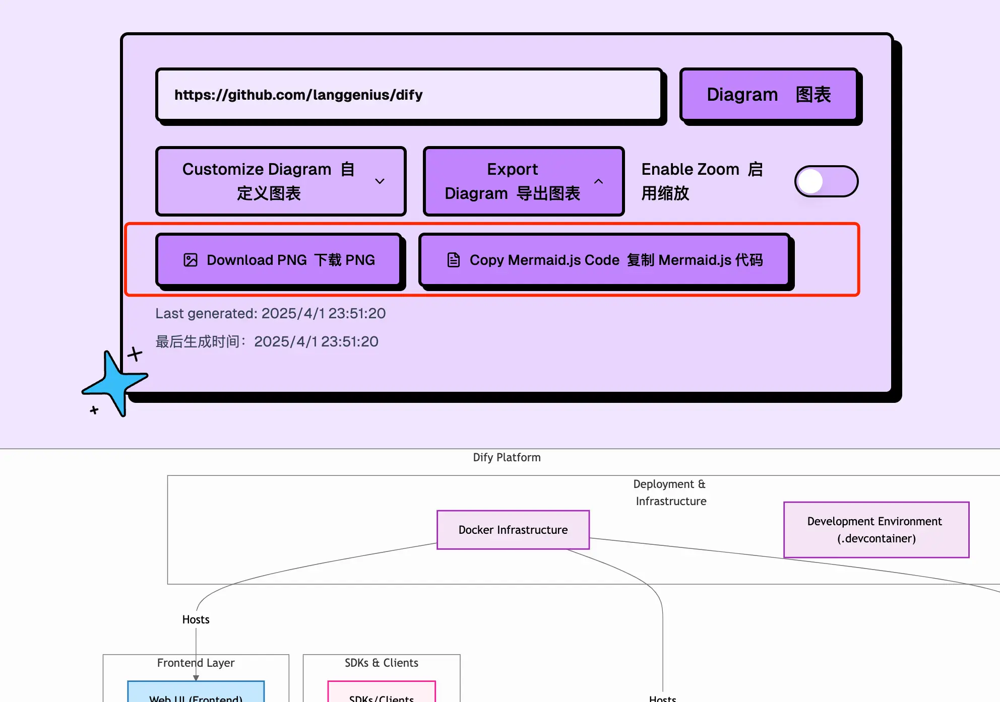

- 如果项目设计图比较复杂，导致生成的图片内容比较小，还提供了缩放功能；

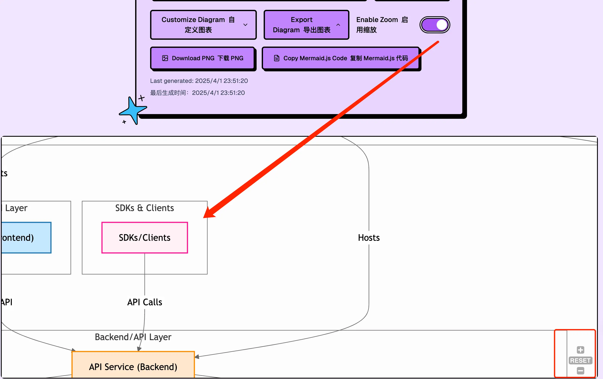

- 支持访问私有仓库，不过如果大家有私有仓库的需求，还是建议自己部署，防止仓库代码泄漏。

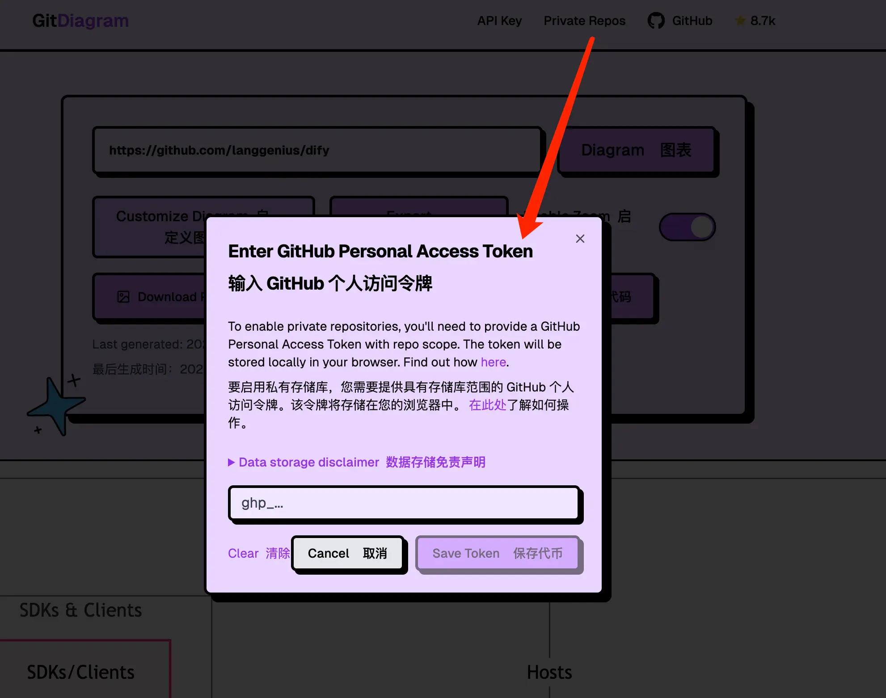

以上就是关于 Diagram 相关介绍，大家也可以通过它来辅助学习其他开源项目。感兴趣的小伙伴可以去试试～

这里也献上该项目的 Github 地址：[https://github.com/mingrammer/diagrams](https://github.com/ahmedkhaleel2004/gitdiagram)

如果对您有用，也可以给项目点个 Star～
