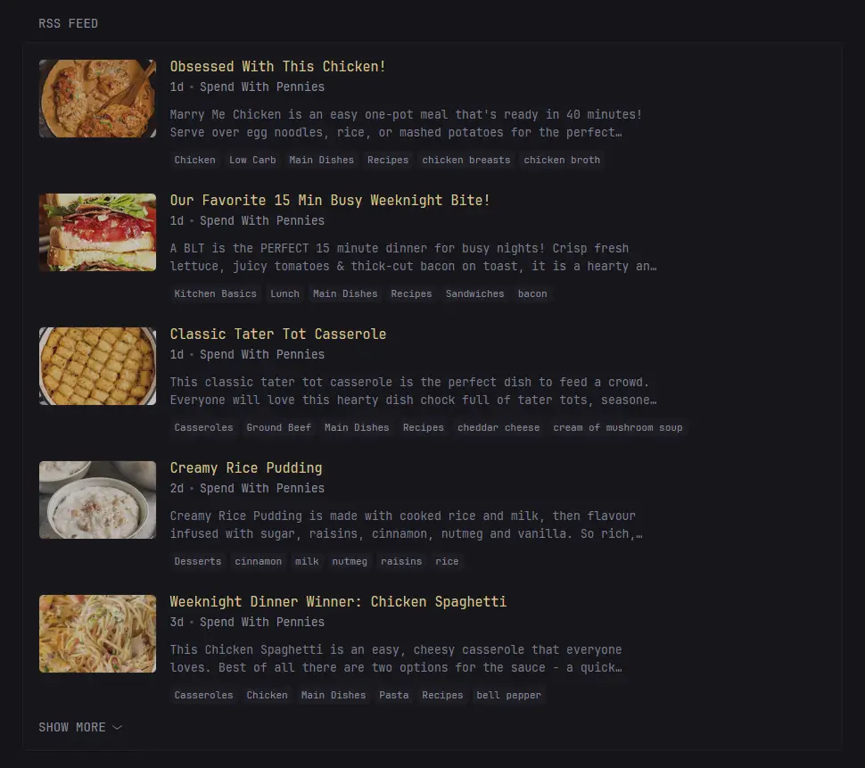

#### 前言

最近三金在做一些信息聚合的事情，有用到一款开源自托管仪表盘-Glance，感觉非常棒！这里也分享给大家～

它支持：

* **自定义配置页面组件，想你所想，看你所看**；
* 展示 RSS 订阅内容
* 指定频道的 YouTube 视频
* 日历、天气、时钟
* 股票信息
* Github 仓库信息
* 网站监控
* ……

在不修改任何配置的情况下，部署后的 Glance 长这样：


我们可以通过修改 Glance 的配置文件来调整页面内的展示信息。下图是三金这边调整后的效果：


> 目前该项目已在 Github 收获 26.4k Star，Github 地址：[https://github.com/glanceapp/glance](https://github.com/glanceapp/glance?tab=readme-ov-file#installation)

#### 如何部署

Glance 提供了 Docker 部署的方式：

```bash
mkdir glance && cd glance

curl -sL https://github.com/glanceapp/docker-compose-template/archive/refs/heads/main.tar.gz

# 解压
tar -xzf - --strip-components 2
```

解压后的目录结构如下：

```text
glance
  ├── assets
  │   └── user.css
  ├── config
  │   ├── glance.yml
  │   └── home.yml
  └── docker-compose.yml
```

* assets 目录下存在的是 glance 的静态资源文件，比如 CSS 样式表；
* config 目录下就是核心配置，我们可以通过修改它来更新 Glance 仪表盘内容；
* `docker-compose.yaml` 定义和配置多个 Docker 容器的设置文件。

在终端执行以下命令：

```bash
docker compose up -d
```

然后在浏览器中访问 `http://localhost:8080` 即可～

#### 如何配置

刚刚我们介绍了 Glance 的配置文件是在 config 目录下，默认有两个配置文件：

* `glance.yml`：顶级配置文件，用来定义主题、认证、服务等信息；
* `home.yml`：页面级别的配置，在这个文件中进行首页的布局配置；

##### glance 配置

默认的 `glance.yml` 文件，只有三个配置项：

* server：用来定义 Glance 服务，比如端口号、静态资源路径等等；

```yaml
server:
  port: 8080
  assets-path: /home/user/glance-assets
```

* theme：用来自定义 Glance 主题。颜色值采用 [HSL](https://giggster.com/guide/basics/hue-saturation-lightness/) （色相、饱和度、亮度）格式。下面是官方的例子：

```yaml
theme:
  # This will be the default theme
  background-color: 100 20 10
  primary-color: 40 90 40
  contrast-multiplier: 1.1

  disable-picker: false
  presets:
    gruvbox-dark:
      background-color: 0 0 16
      primary-color: 43 59 81
      positive-color: 61 66 44
      negative-color: 6 96 59

    zebra:
      light: true
      background-color: 0 0 95
      primary-color: 0 0 10
      negative-color: 0 90 50
```

* pages：定义 Glance 里的页面，最先定义的页面将会成为主页，也就是 Glance 服务一打开就会看到的页面。

```yaml
pages:
  - name: Home
    columns: ...

  - name: Videos
    columns: ...

  - name: Homelab
    columns: ...
```

* 还有一些其他的顶级配置，比如 auth 配置可以用来设置用户名密码，以限制陌生人访问；branding 配置可以设置网站 logo 以及名称等等。

##### home 配置

`home.yml` 文件，其实是顶级配置 `pages` 下的组件配置，里面通过 `column` 属性来设置页面布局，它有两个值：`small` 和 `full`，分别对应小列（300px）和全列（占满剩余宽度）。需要注意的是，每个页面必须要有至少一个 `full` 属性。

```yaml
pages:
  - name: Home
    columns:
      - size: small
        widgets: ...
      - size: full
        widgets: ...
      - size: small
        widgets: ...
```

在每一列下，需要通过 Widgets 属性来丰富我们的页面，比如天气、时钟、日历以及 RSS 订阅等等：

```yaml
pages:
  - name: Home
    columns:
      - size: small
        widgets:
          - type: calendar
            title: 日历
          - type: weather
            title: 天气
            location: London, United Kingdom

      - size: full
        widgets:
          - type: rss
            title: News
            style: horizontal-cards
            feeds:
              - url: https://feeds.bloomberg.com/markets/news.rss
                title: Bloomberg
              - url: https://moxie.foxbusiness.com/google-publisher/markets.xml
                title: Fox Business
              - url: https://moxie.foxbusiness.com/google-publisher/technology.xml
                title: Fox Business
```

Glance 本身就提供了很多 Widgets 组件，有：

* RSS

```yaml
- type: rss
  title: News
  style: horizontal-cards
  feeds:
    - url: https://feeds.bloomberg.com/markets/news.rss
      title: Bloomberg
    - url: https://moxie.foxbusiness.com/google-publisher/markets.xml
      title: Fox Business
    - url: https://moxie.foxbusiness.com/google-publisher/technology.xml
      title: Fox Business
```



* Videos 视频

```yaml
- type: videos
  channels:
    - UCXuqSBlHAE6Xw-yeJA0Tunw
    - UCBJycsmduvYEL83R_U4JriQ
    - UCHnyfMqiRRG1u-2MsSQLbXA
```


* Search 搜索组件

```yaml
- type: search
  search-engine: duckduckgo
  bangs:
    - title: YouTube
      shortcut: "!yt"
      url: https://www.youtube.com/results?search_query={QUERY}
```


* Todo List 待办组件

```yaml
- type: to-do
```


* Weather 天气组件

```yaml
- type: weather
  units: metric
  hour-format: 12h
  location: London, United Kingdom
```


* Monitor 网站监控

```yaml
- type: monitor
  cache: 1m
  title: Services
  sites:
    - title: Jellyfin
      url: https://jellyfin.yourdomain.com
      icon: /assets/jellyfin-logo.png
    - title: Gitea
      url: https://gitea.yourdomain.com
      icon: /assets/gitea-logo.png
    - title: Immich
      url: https://immich.yourdomain.com
      icon: /assets/immich-logo.png
    - title: AdGuard Home
      url: https://adguard.yourdomain.com
      icon: /assets/adguard-logo.png
    - title: Vaultwarden
      url: https://vault.yourdomain.com
      icon: /assets/vaultwarden-logo.png
```


* Releases 订阅特定仓库的最新版本，包括 Github、Gitlab 以及 Docker Hub 等；

```yaml
- type: releases
  show-source-icon: true
  repositories:
    - go-gitea/gitea
    - jellyfin/jellyfin
    - glanceapp/glance
    - codeberg:redict/redict
    - gitlab:fdroid/fdroidclient
    - dockerhub:gotify/server
```


* 服务器统计

```yaml
- type: server-stats
  servers:
    - type: local
      name: Services
```


* ……

> 注意：以上配置均来源自官方示例，记得更换为自己需要的数据哦～

其他更多信息，可以查看 Glance 的配置文档：[https://github.com/glanceapp/glance/blob/v0.8.4/docs/configuration.md](https://github.com/glanceapp/glance/blob/v0.8.4/docs/configuration.md#configuring-glance)

感兴趣的小伙伴快去试试吧🎉

