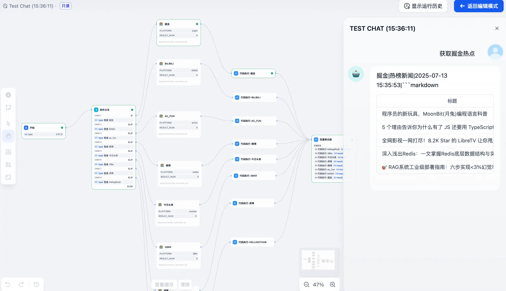
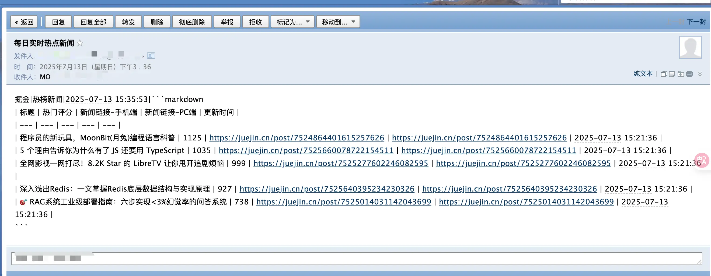
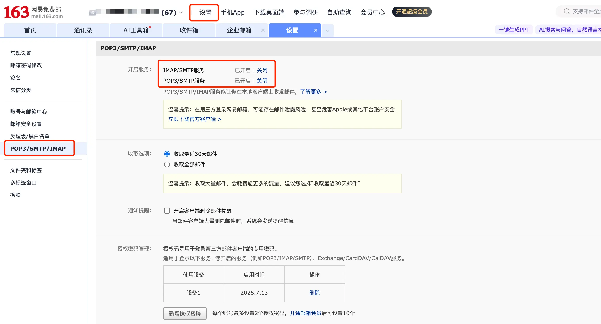
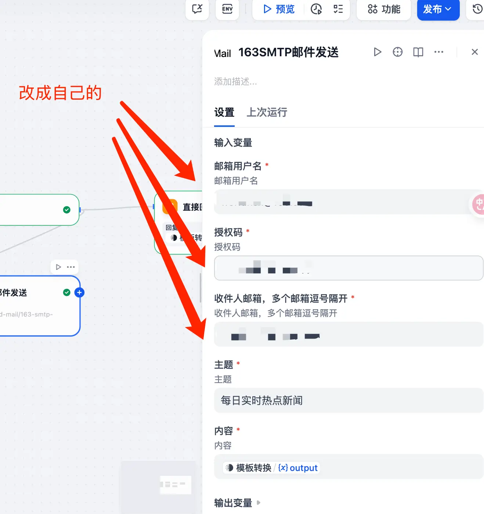

Hi～大家好，这里是三金。

最近天气炎热，小伙伴们要注意防暑防晒！那说到热，今天给大家分享一个「**实时热点每日简报**」的工作流。

这个工作流支持：

* 通过「Rookie\_RSS 工具」**抓取 B 站、微博、今日头条等八大热点榜单信息**；
* 使用 AI 清洗和结构化处理抓取的数据，**形成高价值的新闻摘要**；
* 最后自动生成一份热点简报并**通过「163 SMTP 邮件发送工具」发送到指定邮箱**。

以下是三金的**测试掘金平台**的数据：

也正常收到了邮件：

里面还有一篇是三金上一篇文章，哈哈哈哈～

从功能上来说：

* 确实聚合了比较热门的几个平台，也可以获取对应平台热点；
* 且实现了邮件发送。

但是每次对话只能获取一个平台的热点，想获取别的平台热点，得新开对话选择其他平台才行。

如果大家感兴趣可以自行在此基础上实现同时获取多个平台的能力，三金有个大致思路：

* 使用「**多轮对话 + AI 模型处理**」实现增加平台数或者减少平台数；
* 获取「**AI 处理后的数据 + 代码 + 迭代**」的方式实现多平台热点数据聚合。

除此之外，在使用时该工作流时，需要注意的是：

* **提前把插件安装好**，需要「Rookie\_RSS」和「63 SMTP 邮件发送工具」；
* **邮件工具需要 163 邮箱的授权码**。

**163 邮箱授权码获取步骤如下**：

1. 登录网页版 163 邮箱，并进入设置-常规设置；
2. 点击左侧菜单中的「POP3/SMTP/IMAP」，并开启两个 SMTP 服务；
3. 这个时候会生成一个授权码，一定记得 COPY 下来，存放到一个能找得到的位置，因为它只展示一次；
4. 替换工作流中邮箱的名称、授权码和收件人邮箱即可。

该工作流来自开源项目「**DifyAIA**」，由 B 站 UP 主 **bannylon7** 维护，目前**已有 1.4k Star**，大家可以动动小手点点赞哦～

> 需要该工作流的小伙伴，关注我后私发 DSL 获取工作流文件。

