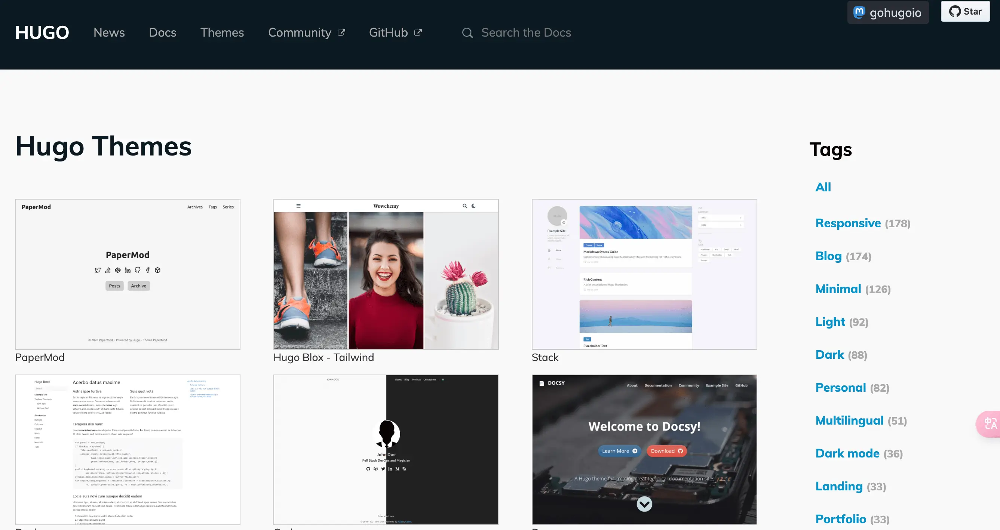

上节介绍了如何快速入门 Hugo，这节来看看 Hugo 的主题以及配置都有哪些。

## 主题

Hugo 的主题有一个专门的页面来做展示👉[传送门](https://themes.gohugo.io/)。可以看到有很多的主题供我们选择：



需要注意的是，这里并非只有博客主题，还有一些做公司官网的主题，所以大家在选择的时候需要挑选一下。除此之外，如果对这个页面的主题都不满意，也可以直接到 Github 上搜索 Hugo Theme，会发现很多有意思的主题。

那么如何把主题加入到我们的站点中呢？

其实在上一节的时候已经有演示过一次：

```shellscript
cd myBlog

# 在当前目录中初始化一个空的 Git 存储库。
git init

# 将 Ananke 主题克隆到主题目录中，并将其作为 Git 子模块添加到您的项目中。
git submodule add https://github.com/theNewDynamic/gohugo-theme-ananke.git themes/ananke
```

这是使用 git 子模块的形式将主题拉取到站点的 themes 目录下的，也是官方推荐的。还有一种方式是直接到主题的 Github 仓库中将 release 包下载下来，然后解压到 themes 目录下。

到这一步为止我们已经完成了站点初始化的 99%，剩下的 1% 需要我们来进行站点配置，配置文件就是项目根目录下的 `hugo.toml`。

## 配置

一般情况下最简单粗暴的方式就是将 `themes/<你的主题目录>/<演示目录>` 中的配置拿出来直接覆盖站点根目录下的主题，毕竟在这之前你都没有做过配置，还不如直接用现成的。以 Stack 主题的配置为例，我们大概说一下：

```yaml
baseurl: https://example.com
languageCode: en-us
theme: hugo-theme-stack
paginate: 3
title: Example Site
copyright: Example Person

# Theme i18n support
# Available values: ar, bn, ca, de, el, en, es, fr, hu, id, it, ja, ko, nl, pt-br, th, uk, zh-cn, zh-hk, zh-tw
DefaultContentLanguage: en

# Set hasCJKLanguage to true if DefaultContentLanguage is in [zh-cn ja ko]
# This will make .Summary and .WordCount behave correctly for CJK languages.
hasCJKLanguage: false

languages:
    zh-cn:
        languageName: 中文
        title: 演示站点
        weight: 2
        params:
            description: 演示说明

services:
    # Change it to your Disqus shortname before using
    disqus:
        shortname: "hugo-theme-stack"
    # GA Tracking ID
    googleAnalytics:
        id:

params:
    mainSections:
        - post
    favicon: # e.g.: favicon placed in `static/favicon.ico` of your site folder, then set this field to `/favicon.ico` (`/` is necessary)

    dateFormat:
        published: Jan 02, 2006
        lastUpdated: Jan 02, 2006 15:04 MST

    sidebar:
        emoji: 🍥
        subtitle: Lorem ipsum dolor sit amet, consectetur adipiscing elit.
        avatar:
            enabled: true
            local: true
            src: img/avatar.png

    article:
        math: false
        toc: true
        readingTime: true

    widgets:
        homepage:
            - type: search
            - type: archives
              params:
                  limit: 5
            - type: tag-cloud
              params:
                  limit: 10
        page:
            - type: toc

### Custom menu
### See https://stack.jimmycai.com/config/menu
### To remove about, archive and search page menu item, remove `menu` field from their FrontMatter
menu:
    main: []

    social:
        - identifier: github
          name: GitHub
          url: https://github.com/CaiJimmy/hugo-theme-stack
          params:
              icon: brand-github

        - identifier: twitter
          name: Twitter
          url: https://twitter.com
          params:
              icon: brand-twitter

markup:
    goldmark:
        renderer:
            ## Set to true if you have HTML content inside Markdown
            unsafe: true
    tableOfContents:
        endLevel: 4
        ordered: true
        startLevel: 2
    highlight:
        noClasses: false
        codeFences: true
        guessSyntax: true
        lineNoStart: 1
        lineNos: true
        lineNumbersInTable: true
        tabWidth: 4
```

* baseUrl：你的站点网址；
* languageCode：你的站点语言；
* theme：站点使用的主题名称，这个要和 themes 目录下的主题目录名称相同；
* paginate：站点一页展示多少篇博客；
* title：站点标题；
* DefaultContentLanguage：站点默认展示什么语言；
* hasCJKLanguage：如果是中日韩三国语言，需要将这个配置设置为 true；
* languages：多语言配置，如果只有一种语言的情况下，将多余的删除即可；
* services：
  * disqus：留言配置，收费的；
  * googleAnalytics：Google 的网站流量监控（我有，我加上）；
* params.mainSections：文章内容的目录名称；
* params.favicon：网站的 icon；
* params.widgets：网站右侧展示的内容；
  * homepage：首页右侧展示；
  * page：文章页面右侧配置，上述例子是开启了文章的目录；
* params.dateFormat：文章上的时间展示，我们需要改成 2006-02-11，不然网站的时间会被转成英文的；
* params.sidebar
  * emoji：头像右下角的 emoji 表情；
  * subtitle：头像下的副标题；
  * avatar：头像的照片
* params.comments：评论，大多数都是收费的，utterances 这个是免费的，可以搜搜相关教程；
* menu.social：头像下的其他平台链接；
* markup.highlight：代码高亮，这里注意 lineNos 配置，使用这个会将代码包裹在一个表格中。

> ⚠️注意：上面代码被我做了一些删减。

如果还有别的有趣的配置，我会补充到这篇文章中。

