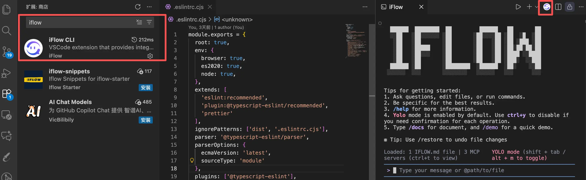
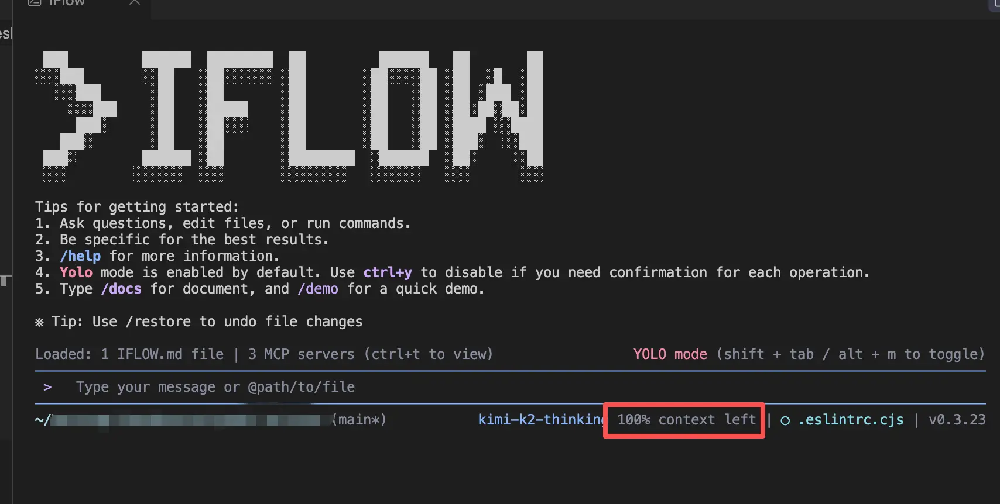
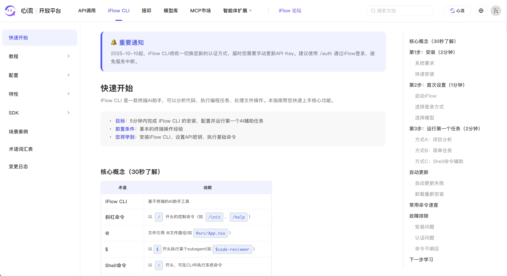
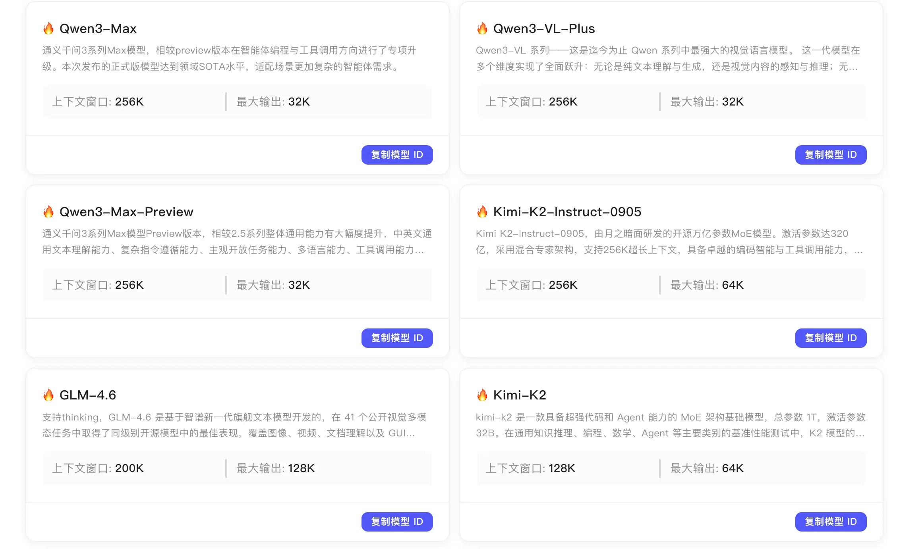
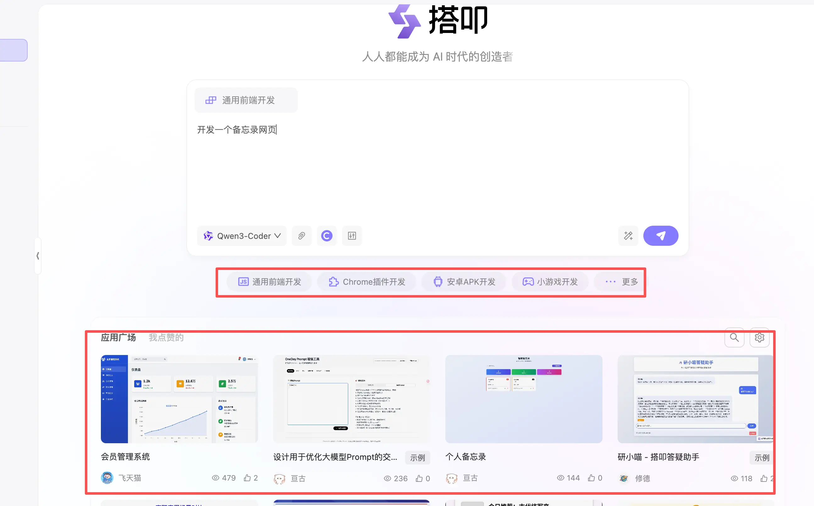
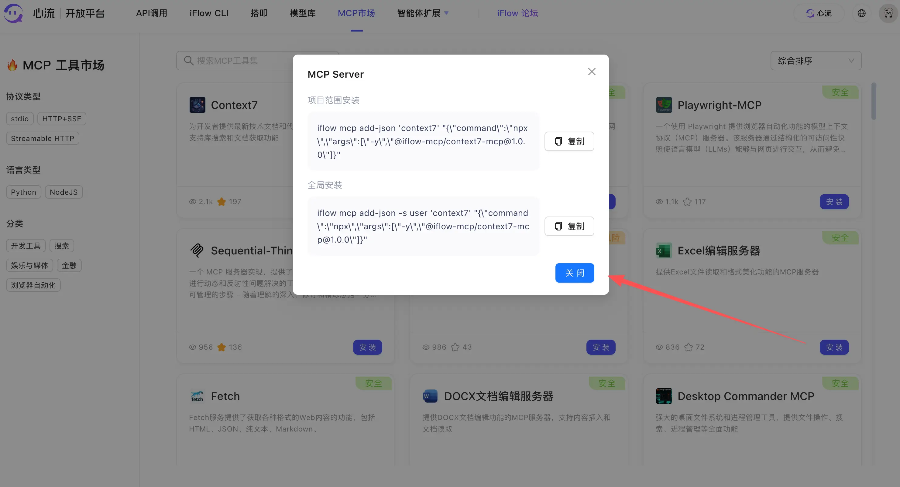

在之前的《十月份 AI Coding 实践！Qoder、CC、Codex 还是 iflow？》文章中，三金分享了一些 AI Coding 的感悟与工具，其中有提到一款由阿里心流团队打造的终端编码工具——IFlow CLI，今天让我们来详细介绍一下它！

在前段时间阿里 Qoder 官方的直播中，有人问到：你们阿里出了通义灵码、Qoder 还有 IFlow CLI，哪个最好？各有什么优势？

当时官方的回答絮絮叨叨一大堆，我只记得对于 IFlow CLI 来说，最大的优势就是**免费**！而且免费的还是市面上综合评价比较好的几款模型：

* GML-4.6
* Kimi-K2-Thinking
* MiniMax-M2
* Qwen3-Coder-Plus
* DeepSeek-V3.2
* Kimi-K2-0905

除此之外，在用法和功能上，也是对齐 Claude Code，像快捷指令 Command、SubAgent 以及 MCP 集成，和 Claude Code 完全一致。在国内环境，我们可以很平滑地由 Claude Code 转移到 IFlow CLI 上，再加上这些免费模型，让开发者们可以实现开箱即用！

### 安装

在安装之前，需要检查一下是否有 Node.js 20+ 的环境，以及机器配置是否满足 4GB+ 的内存。如果没有 Node.js 20+ 可以直接执行一键安装脚本：

```shellscript
# 一键安装脚本，会安装全部所需依赖
bash -c "$(curl -fsSL https://gitee.com/iflow-ai/iflow-cli/raw/main/install.sh)"
```

而在已有 Node.js 20+ 的环境下，只需要执行：

```shellscript
# 已有Node.js 20+
npm i -g @iflow-ai/iflow-cli@latest
```

我们可以通过 `iflow --version` 来检查是否安装成功。

### 启动

在终端输入 `iflow` 进行启动：

```shellscript
iflow
```

启动后，iFlow CLI 需要进行认证登录，官方提供了三种方式：

* **Login with IFlow 登录**，会直接打开心流平台进行登录。最推荐这种方式，因为它能让你的 IFlow CLI 拥有完整的功能体验；
* **心流 API Key 登录**，适合无浏览器环境（比如服务器下）。也支持完整功能，但是每 7 天需要更新一次 API Key。
* **OpenAI Compatlble API**，使用第三方模型。不推荐，不细说了。

而 IFlow CLI 的完整功能有：

* **WebSearch 服务**：智能网络搜索，获取最新信息
* **WebFetch 服务**：网页内容抓取和分析
* **多模态能力**：内置图像理解等多模态功能
* **工具调用优化**：心流平台提供的模型经过专门优化，工具调用更加精准高效
* **自动续期**：令牌自动刷新，永不过期
* **无缝连接**：一次授权，持续使用

### 核心概念

| 术语           | 说明                                        |
| ------------ | ----------------------------------------- |
| iFlow CLI    | 基于终端的AI助手工具                               |
| 斜杠命令         | 以 `/` 开头的控制命令（如 `/init`、`/help`）          |
| @            | 文件引用 @文件路径(如 `@src/App.tsx` )             |
| \$           | 以 `$` 开头执行某个subagent(如 `$code-reviewer` ) |
| Shell命令      | 以 `!` 开头，可在CLI中执行系统命令                     |
| yolo         | 默认允许CLI执行所有操作的执行模式                        |
| MCP          | 模型上下文协议，用于扩展AI能力的服务器系统                    |
| Sub Agent    | 智能Agent系统,适用于执行不同专业的任务                    |
| Sub Command  | 命令行扩展                                     |
| context left | CLI右下角的提示信息，代表模型在对话过程中剩余的上下文长度            |

我们可以在 VSCode 编辑器中安装 IFlow CLI 插件来快速在项目中启动：



和 Claude Code 一样，我们可以通过 `/init` 指令来为项目生成完整的项目上下文。也可以在终端的右下角处看到当前对话的剩余上下文长度：



如果剩余上下文不多，可以选择使用 `/compress` 来压缩上下文或者直接 `/clear` 重置对话。

由于其模型免费的特点，非常建议无法使用 Claude、GPT5 以及 Gemini 的小伙伴进行下载安装。而有这些顶尖模型的小伙伴也可以选择搭配使用：

* 复杂需求或疑难杂症使用 Claude 等模型 + Claude Code/Codex
* 一般需求使用 iflow

这样下来既把活干了，又省 token，堪称最佳搭档～

对于 IFlow CLI 的高阶用法及最佳实践，推荐大家直接访问心流开放平台-https://platform.iflow.com/cli/quickstart



### 心流家族

除了给大家介绍的 IFlow CLI 之外，心流还提供了：

* API 调用，目前是免费使用的，大家可以在心流官网注册后申请使用，支持的模型可以在模型库进行查看（https://platform.iflow.cn/models）



* 搭扣，心流提供的一款 Agent 产品，可以实现一站式研发，比如官网开发或者小程序开发。体验地址：**[https://dakou.iflow.cn/](https://dakou.iflow.cn/?spm=54878a4d.2ef5001f.0.0.7c125783AhUsZg)**



* MCP 市场（https://platform.iflow.cn/mcp），提供了一系列当下比较热门的 MCP 工具，大家可以根据引导提示一键进行安装；



* 智能体扩展（https://platform.iflow.cn/agents?type=agents\&category=all），这个里面包含了工作流 Workflow、智能体 Agent 和指令 Command，也是可以通过引导提示一键进行安装，非常方便；


* 官方论坛（https://vibex.iflow.cn/），画风和 linuxDo 一样，用的是一套论坛模板，有很多大佬在里面进行交流。


除此之外，在心流官网（https://iflow.cn/），对于免费用户来说，每个月还提供了 30次高级研究以及 200 次 AI PPT 生成。

高级研究能做什么呢？比如你想做一个旅游攻略，这个时候就可以点击下图中的网页，并告诉它你想生成去重庆的旅游攻略，待几天？想做什么？想吃什么？等等越详细越好。

而它会在后台执行异步任务，根据任务的复杂度会在20-40分钟左右（自己测的，可能也不准）生成一个旅游攻略的网页给你。非常赞！！


感兴趣的小伙伴可以去试试看了～

> PS：大家都在推 Gemini3，而我因为还没有测试完，所以后面再说
