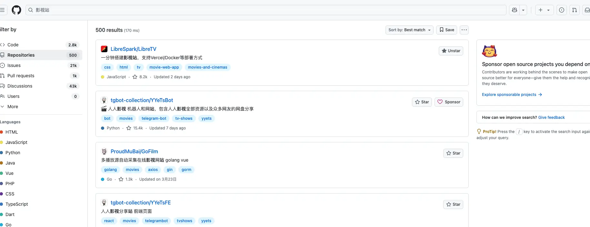
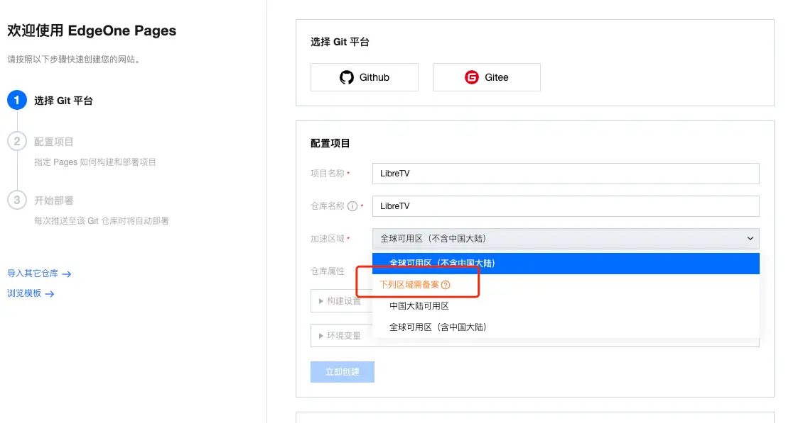
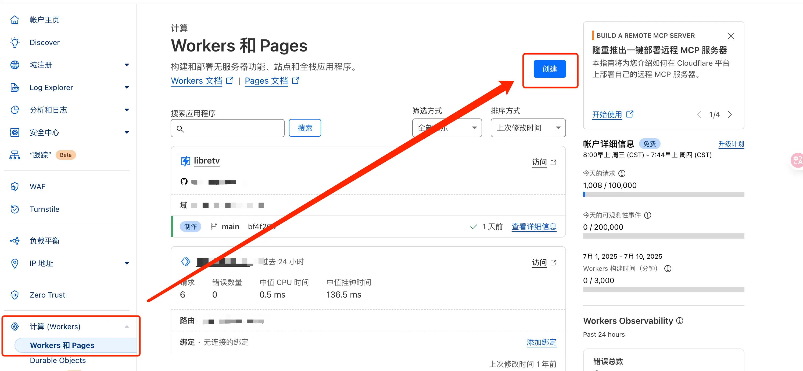
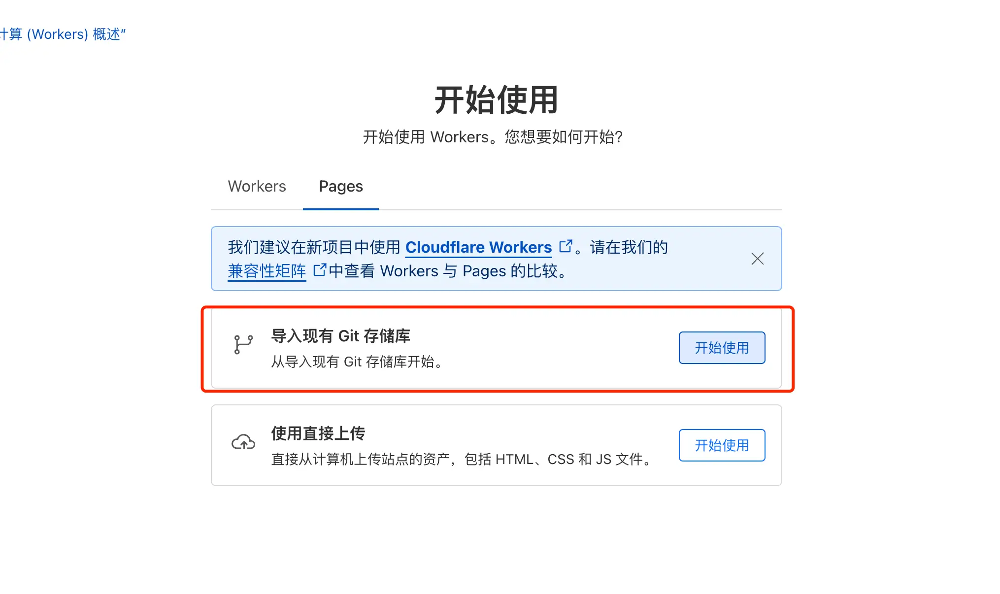
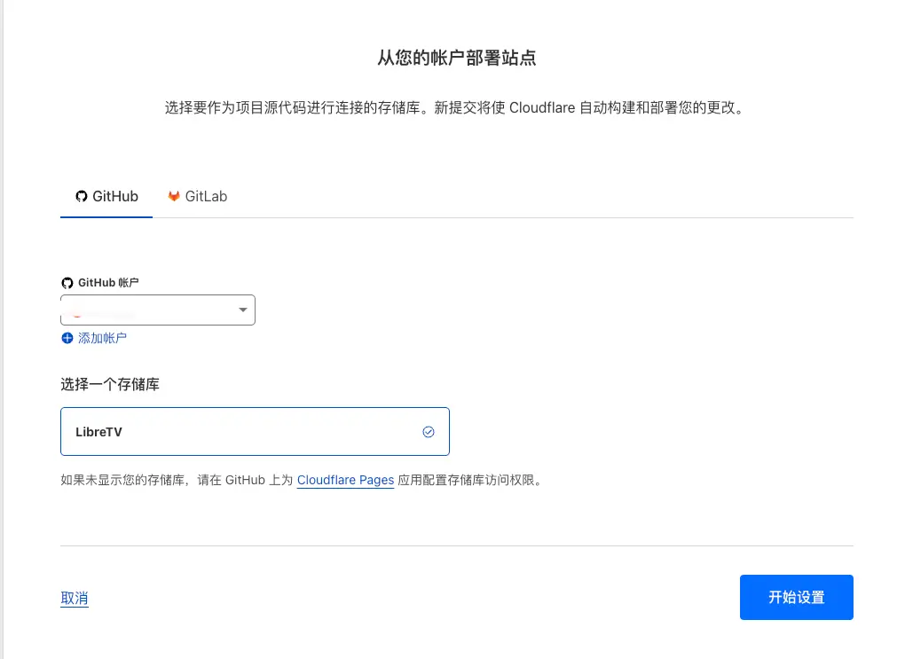
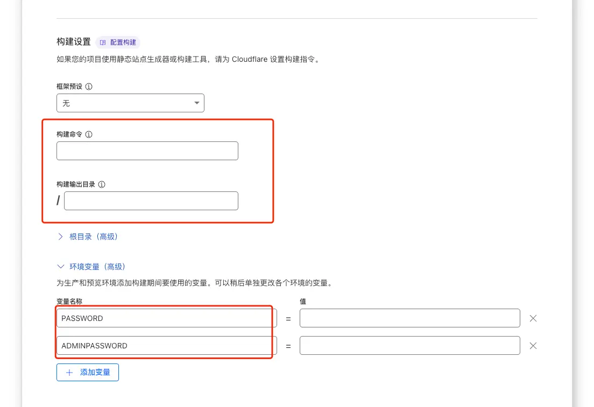
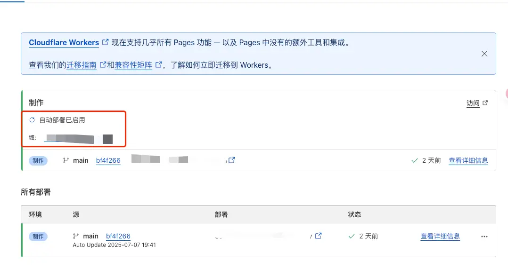
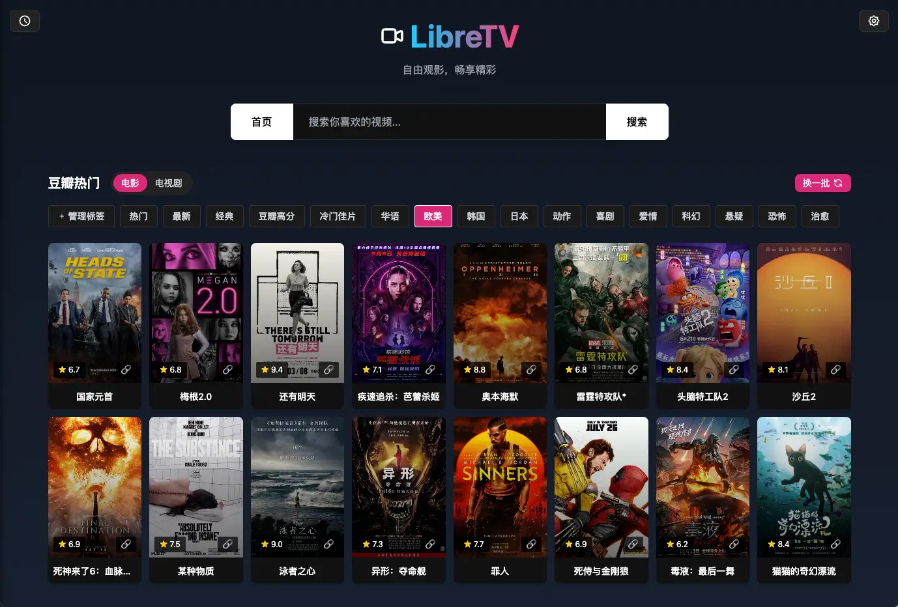
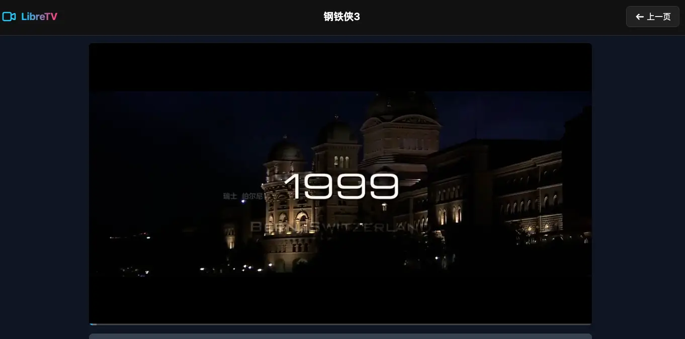

最近老婆在重刷甄嬛传，又开了个某视频网站会员，结果在投屏时人家还要再收个投屏的费用，着实被这吃相给恶心到了。于是跟我抱怨想看个热播剧，不是在 A 平台独播，就是在 B 平台独播，想同时追就得多平台都开会员，让我给她想想办法。而我只能：

不过！只要思想不滑坡，方法总比困难多！直接上 Github 搜一下有没有这类的开源项目：

看看！这不就找到了～

前几个 Star 数比较高的我都看了一下，比较中意的是 LibreTV 这个项目，因为它：

* 部署超简单！同时支持多种部署方式；
* 页面好看！同时适配 PC 和移动端；
* LibreTV 仅作为视频搜索工具，不存储、上传或分发任何视频内容。

那接下来就让我们一起来部署一下。

刚刚也说了，LibreTV 支持很多种部署方式，包括：

* Cloudflare Pages；
* Vercel；
* Render；
* EdgeOne（没错，腾讯刚出的那个）；
* Docker 和 Docker Compose。

本来我是想试试 EdgeOne 的，但是如果要在国内访问部署在上面的应用，必须要有备案过的域名才可以：

所以我就又转向了大善人 Cloudflare，毕竟在它上面部署的应用即便在国内访问速度也杠杠的。部署步骤如下：

1. Fork 或者克隆该项目到自己的 Github 账户；
2. 登录到 [Cloudflare Dashboard](https://dash.cloudflare.com/)，并进入 Pages 服务；
3. 点击创建，**连接刚刚 fork 的项目仓库**；

1. 在设置时「构建命令」和输出目录都留空即可。而环境变量必须配置 **`PASSWORD`** 变量，**`ADMINPASSWORD`****&#x20;**&#x53D8;量可选；

1. 最后保存并部署即可。

部署好之后，我们可以通过点击下图红框位置的域名访问自己的 Libretv 了：

国内没使用魔法的情况下，速度也杠杠的：

