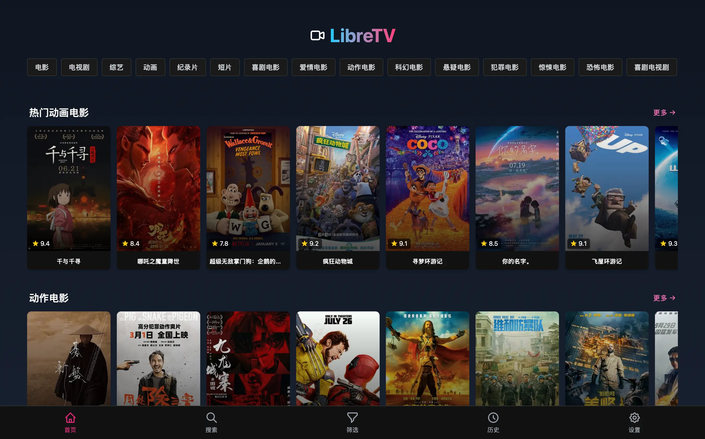
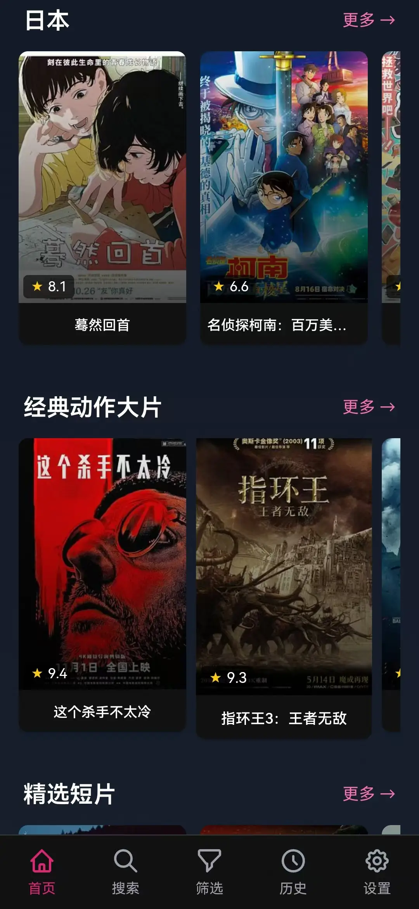
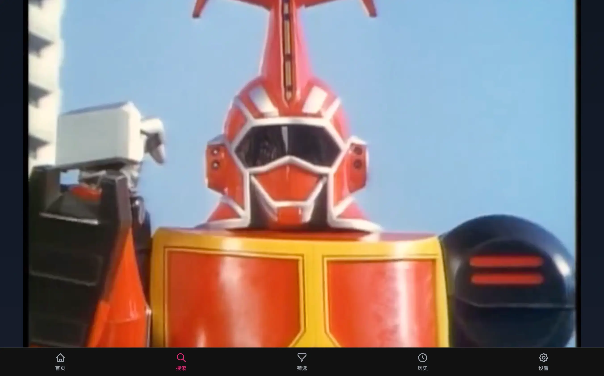

前两天三金给大家推荐过一款追剧神器——LibreTV，结果广受大家好评。也有很多小伙伴问我，有没有客户端软件？

这不三金就给大家找来了 LibreTV 的开源客户端软件项目——LibreTV App。

> Github 地址：https://github.com/KeyRotate/LibreTV-App

LibreTV App 支持 Windows、MacOS、Linux 和 Android 平台，和 LibreTV 一样：

* 海量视频随心看；
* 基于 Tauri 2.0 构建，提供了接近了原生的性能和流畅体验；
* 对移动端 UI 界面做了深度优化，无论是手机还是平板都能确保拥有良好的交互体验；
* 开箱即用，直接下载对应平台安装包即可使用，无需任何配置；
* 高效！简洁！无广告！

以下是三金电脑和手机上的 LibreTV App 截图：

在 Mac 上安装时，需要到「设置-隐私与安全性」中选择「仍要打开」来允许 Mac 安装 LibreTV App，否则无法正常使用。

流畅度也是 OK 的（如果不 OK，换个播放源）：

清晰度也是一样，有的播放源提供的清晰度一般，可以尝试一下别的源。

下载地址：https://github.com/KeyRotate/LibreTV-App/releases。如果无法打开的话，可以在后台私信三金～

另外，虽然作者没有提供  iOS 包，但是有提供构建指南（https://github.com/KeyRotate/LibreTV-App/blob/main/BUILDING.md），有兴趣的小伙伴可以参考看看。
