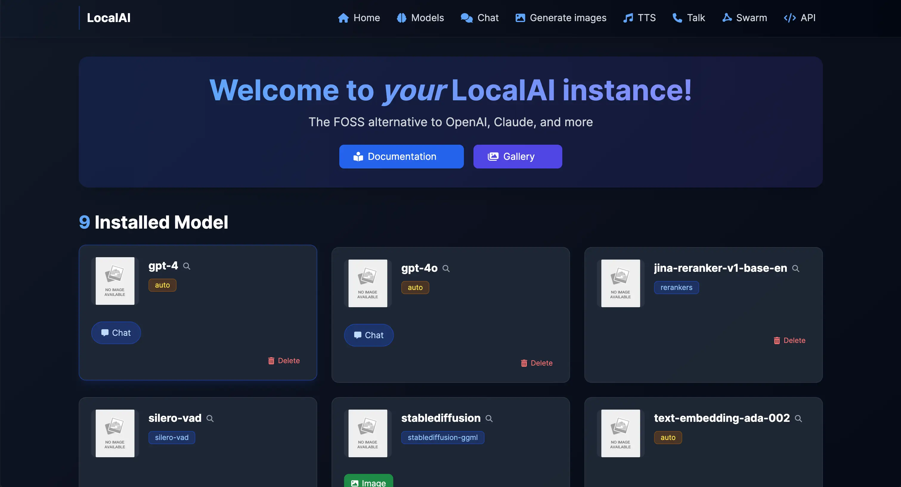
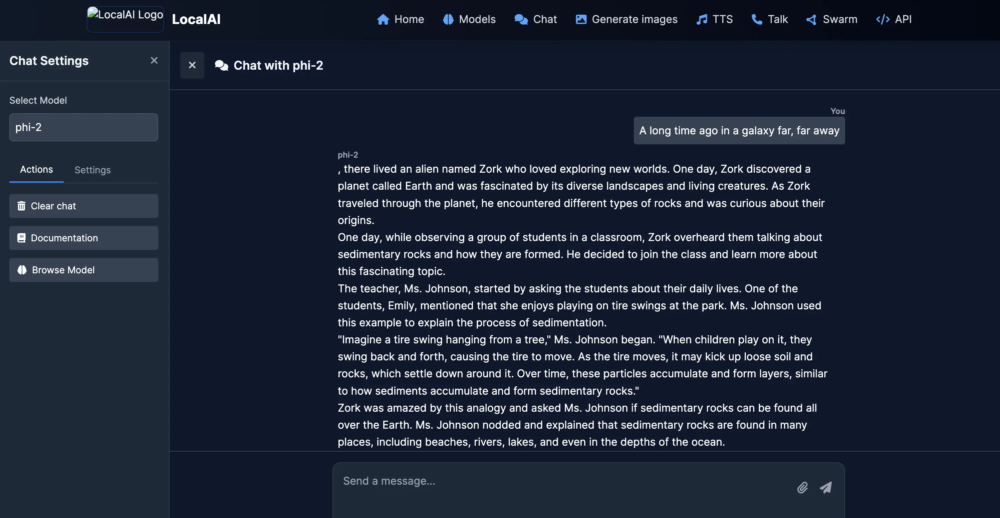
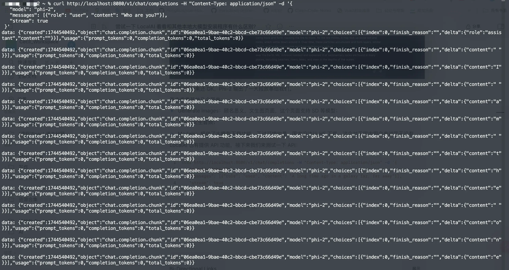

大家好，这里是三金～

很久很久之前，三金有介绍过四款本地部署大模型的工具，它们分别是：

* **Ollama**：可以说非常火的本地部署大模型方案，虽然没有提供可视化界面，但是也不影响它的热度，目前 Github Star 已经高达 137k。如何使用参考：[中文版斯坦福多智能体AI小镇（一）：安装 Ollama](https://mp.weixin.qq.com/s/NqDsa7_eiP57Nf50xgP3dA?token=1775765562\&lang=zh_CN)；
* **Jan**：开源免费的本地部署大模型客户端，只需要动动小手就可以轻松下载部署本地大模型，目前 Github Star 数已经 28.4k。参考：[18k star 的开源本地部署大模型利器-](https://mp.weixin.qq.com/s/SPdog8WLlMYSSRTuixIZXQ?token=1775765562\&lang=zh_CN)*[Jan](https://mp.weixin.qq.com/s/SPdog8WLlMYSSRTuixIZXQ?token=1775765562\&lang=zh_CN)*[，支持启动本地服务](https://mp.weixin.qq.com/s/SPdog8WLlMYSSRTuixIZXQ?token=1775765562\&lang=zh_CN)；
* **LMStudio**：也是一个本地部署大模型客户端，免费但不开源。不过开不开源并不影响咱们使用，使用参考：[没有网络限制！超简单本地部署 Llama3 的方法](https://mp.weixin.qq.com/s/gD2Yjngrq5twDhMJnhkNuw)；
* **Xinference**：开源并提供可视化界面的本地部署大模型方案，可部署的模型类型种类繁多，也支持自定义模型。使用参考：[部署 4.8k star 的 ](https://mp.weixin.qq.com/s/5GTtPwpAm67XM37xCEDpHg)*[Xinference](https://mp.weixin.qq.com/s/5GTtPwpAm67XM37xCEDpHg)*[ 给知识库接入本地 Rerank 模型](https://mp.weixin.qq.com/s/5GTtPwpAm67XM37xCEDpHg)。

今天再给大家介绍另外一个同样很火的本地部署模型方案——LocalAI。

> 介绍不同部署方案的原因是，不同人群的部署需求也不相同，比如：
> 1\. 有的朋友只是想尝尝鲜，电脑配置可能不高，这个时候使用 Ollama 会比较合适（当然电脑配置太拉垮用啥也不行，根本带不起来）；
> 2\. 有的朋友不习惯敲命令、也不懂程序，那可以选择使用客户端软件；
> 3\. 而有的朋友比较专业，他们可能更看好 Xinference 之类的程序（也有适合企业级别的，但是三金还没环境玩儿——俗称玩不起）。

LocalAI 和其他几款程序一样，都可以启动一个大模型服务供其他人使用，并且与 OpenAI API 规范兼容，可用于本地推理。LocalAI 支持各种模型，包括大型语言模型、图像生成和音频转录。

#### 安装

目前有三种方式安装 LocalAI:

* 使用 Bash 安装；

```shellscript
curl https://localai.io/install.sh | sh
```

* 如果是 MacOS 用户可以使用 Homebrew 进行安装；

```shellscript
brew install localai
```

* 使用 Docker 或者 K8s 进行运行；

本篇文章我们将使用 Docker 来运行 LocalAI。在使用 Docker 之前，我们还需要注意的是：不同的环境 LocalAI 提供了不同的镜像，我们需要根据当前环境来拉取正确的镜像。

以下是除默认镜像之外的其他镜像类型：

* 以 `-core` 结尾的镜像，这类镜像的体积都比较小，不会预先下载 Python 依赖项；
* 包含 `aio` 标签的镜像，这个是启用了所有功能的一体化镜像，并附带一组自定义配置；
* 以 `-ffmpeg` 结尾的镜像，这类镜像主要是用于 `audio-to-text` 功能，需要该功能的朋友需要安装此类镜像；
* 包含 `gpu` 标签的镜像，顾名思义这类镜像可使用 GPU 进行加速，就是镜像体积比较大，动辄十几个G。

对于苹果芯片的小伙伴来说，不要一上来就 `docker pull localai/localai:latest`，因为默认镜像的架构是 AMD 的，而苹果芯片是 ARM 架构的，跑不起来。

所以这里需要找一个 ARM 架构的镜像，比如 `master-aio-cpu` 镜像来运行 LocalAI。

在运行 LocalAI 之前，我们还需要做一件事情：那就是解决在国内下载模型的问题。

众所周知 huggingface 上的模型国内网络无法正常进行下载，因此我们可以先创建一个在本地存放大模型的目录 models：

```shellscript
mkdir models
```

然后到 huggingface 的镜像网站 HF-Mirror 上下载模型，比如：

```shellscript
wget https://hf-mirror.com/TheBloke/phi-2-GGUF/resolve/main/phi-2.Q8_0.gguf -O models/phi-2
```

然后启动 LocalAI 容器：

```shellscript
docker run -p 8080:8080 -v $PWD/models:/models -ti --rm quay.io/go-skynet/local-ai:master-aio-cpu --models-path /models --context-size 700 --threads 4

# 看到终端有输出这条信息说明启动成功了
1:38AM INF LocalAI API is listening! Please connect to the endpoint for API documentation. endpoint=http://0.0.0.0:8080
```

启动成功之后我们可以访问 `http://localhost:8080` :



#### 测试

我们可以点击菜单栏的 Chat 进入到对话页面，在对话页的左侧选择 Phi-2 模型进行对话（其他俩模型因为没拉下来所以没法用）：



测试对话效果还 OK，Phi-2 输出了一大段故事给我们。

再来看看其他几个菜单：

* Generate images：顾名思义，文生图页面，这个页面支持 SD 等模型；
* TTS：文生音频；
* Models：提供了大模型下载功能，不过可惜的是，国内没法从 HF 下载，这个对于国内用户来说等于没有。

LocalAI 也有提供 API 功能，接下来我们来测试一下 API：

```shellscript
curl http://localhost:8080/v1/chat/completions -H "Content-Type: application/json" -d '{
   "model": "phi-2",
   "messages": [{"role": "user", "content": "A long time ago in a galaxy far, far away"}],
   "stream": true
 }'
```



也是 OK 的～

#### 和 Ollama、Jan、LMStudio、Xinference 有啥区别

* 从体验上：
  * Ollama 没有可视化界面，所以在操作上略为繁琐，每次都需要手动输入指令才可以。
  * Jan 和 LMStudio 都是客户端软件，体验上会相对好一些，但是拉取模型的地址需要改为国内镜像站 HF-mirror。
  * Xinference 和 LocalAI 都有提供 UI 界面，比客户端多了一步部署操作，部署之后可以通过网页进行访问。
* 模型支持程度：
  * Ollama：支持嵌入模型、重排序模型、视觉模型和常用的文生文模型，不支持图像生成、音频生成和视频生成。
  * Jan：和 Ollama 支持的模型大致一样。
  * LMStudio：LM Stdudio 支持的模型类型比较全，图像生成和音频生成以及视频生成都是支持的。
  * Xinference：上述模型类型都支持。
  * LocalAI：上述模型类型都支持。
* 核心特性上：
  * Ollama：虽然没有图形化界面，但是官方教程非常简单，安装之后常用的命令就是 `ollama run` ，没有特别复杂的操作，上手及其简单。
  * Jan 和 LM Studio：客户端软件就是最大的亮点。不需要打开终端、不需要输入命令，只需要在图形化界面上点点点就完事儿了。
  * Xinference 和 LocalAI：实际上，关于这俩之间的区别，个人使用的话我没有感觉明显的差异，毕竟没有针对性很强的场景。但是看二者的文档内容，可以得出的结果是——LocalAI 相对来说是更灵活、更强大的本地推理平台，支持多种模型和后端库，它支持GPU加速，可提升推理速度和效率，但也能在无GPU的普通硬件上运行，上手和学习曲线是更陡峭的。

因此，这几款部署 AI 大模型的产品，按照产品的易用性和专业性可以分为：

* 小白用户：更适合 Jan 和 LM Studio 这两款客户端应用，超级简单易上手。
* 对有一点技术基础但不多的用户：Ollama 和 Xinference 都可以，如果需要更多模型类型的支持，更推荐 Xinference。
* 企业级别的用户： 还剩下 LocalAI 了，当然个人感觉 Xinference 也可以（有企业级别的用户可以在评论区留下宝贵的经验）。


