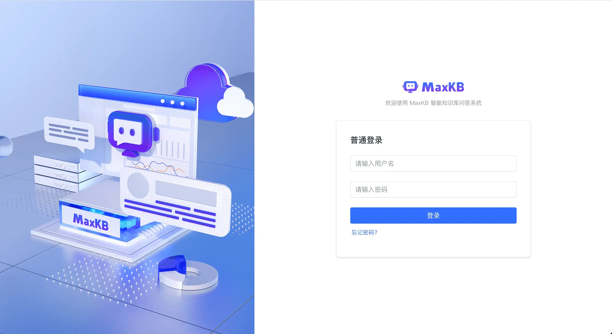
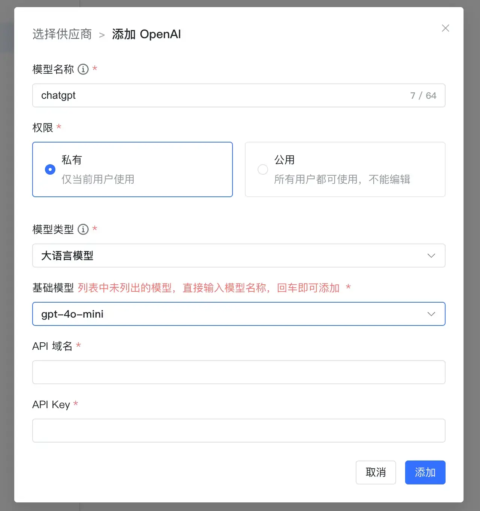
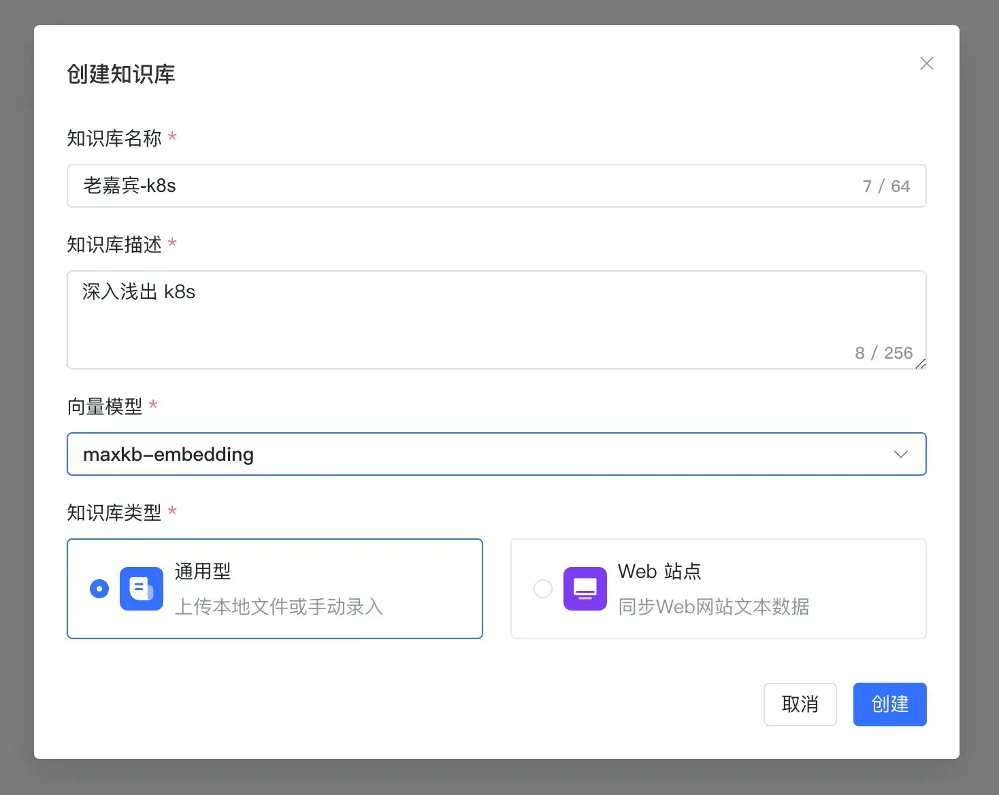
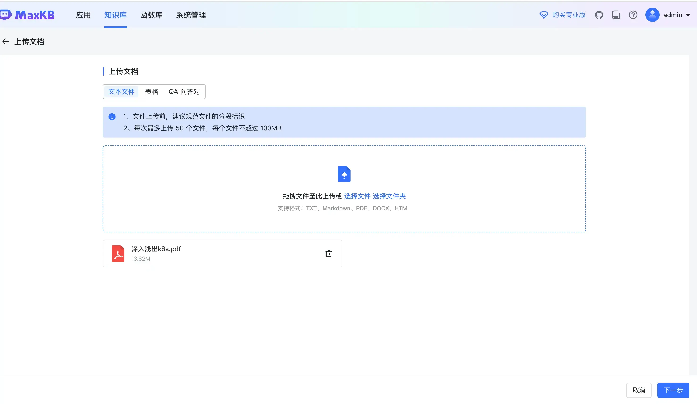
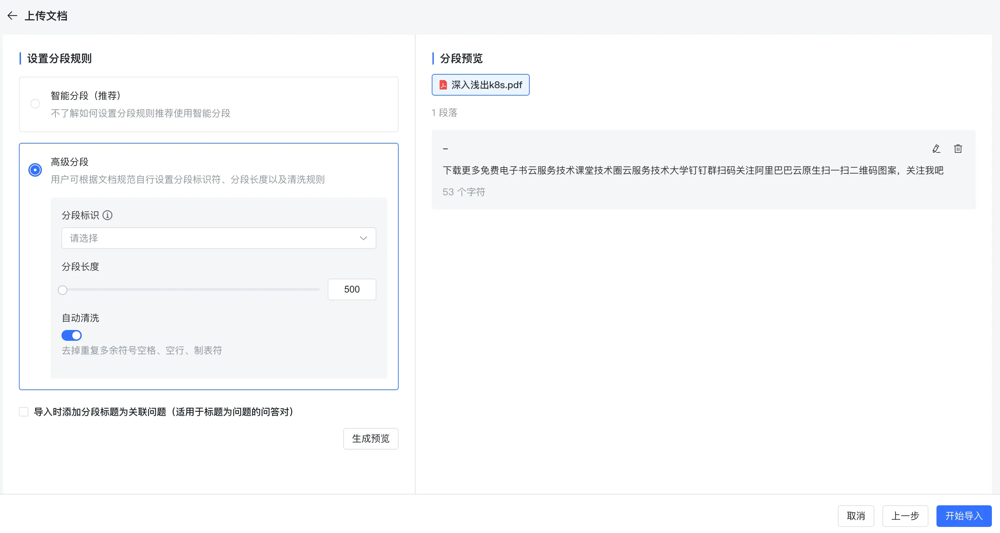
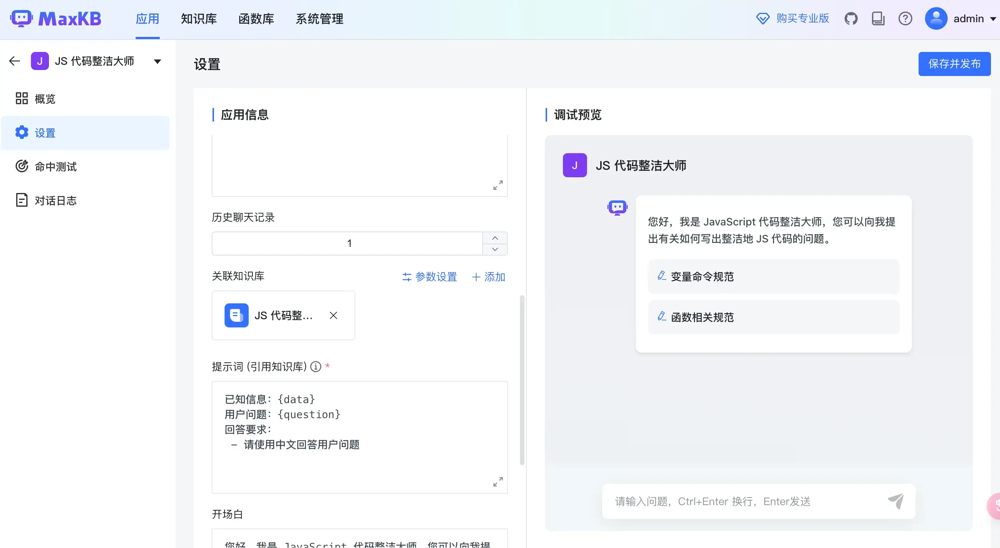
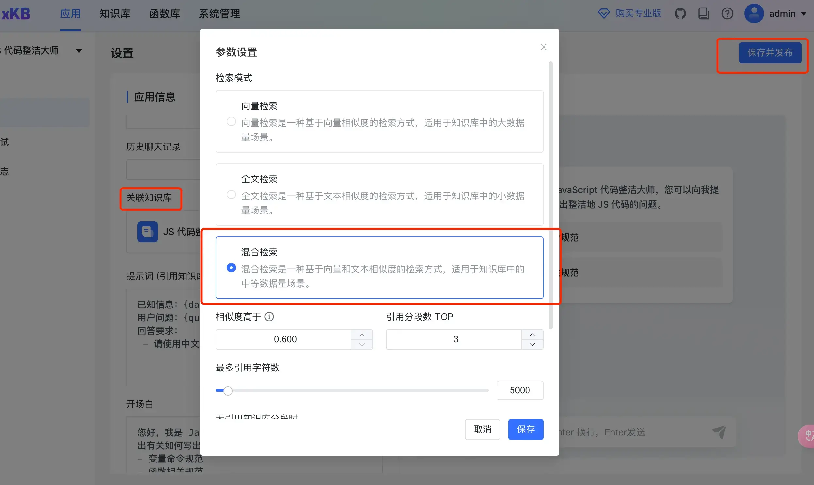
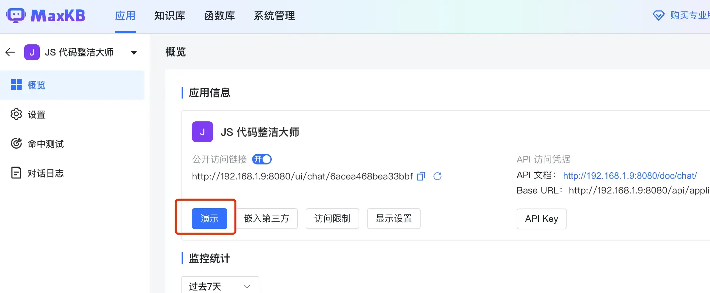
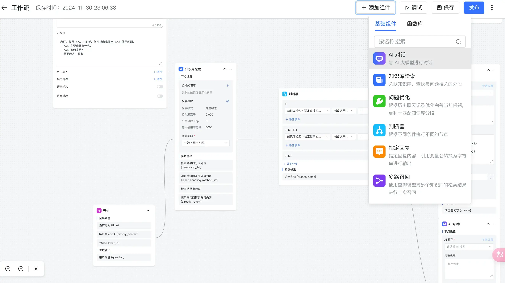

大家好～，我是三金。

在尝试了 Dify、FastGPT、Flowise 和 RAGFlow 之后，我想着要不把剩下类似的产品都玩儿下看看，所以这周主要在尝试 MaxKB。

在 MaxKB 的官网是这样介绍自己的：

> MaxKB（Max Knowledge Base）是一款开源的基于大语言模型和RAG技术的知识库问答系统，广泛应用于智能客服、企业知识库、学术研究和教育等领域。它通过全流程自动化知识采集、入库和构建，提升企业的知识管理效率，并能够智能解析用户问题并匹配相关知识。采用 LLM + RAG 技术，MaxKB 提高了问答准确性，减少了大模型幻觉的干扰，增强了业务数据的分类和召回能力。此外，MaxKB 支持本地部署，保障了数据安全，帮助企业快速部署AI助手，优化业务流程，提高用户体验。

产品方向和之前的几款都差不多，而如果要部署 MaxKB 的话，至少需要：

* 操作系统：Ubuntu 22.04 / CentOS 7.6 64 位系统
* CPU/内存：4C/8GB 以上
* 磁盘空间：100GB

[Github 地址](https://github.com/1Panel-dev/MaxKB)

[官网地址](https://maxkb.cn/)

#### 部署

我们直接 docker 进行部署即可：

```shellscript
docker run -d --name=maxkb --restart=always -p 8080:8080 -v ~/.maxkb:/var/lib/postgresql/data -v ~/.python-packages:/opt/maxkb/app/sandbox/python-packages cr2.fit2cloud.com/1panel/maxkb
```

启动之后我们可以通过访问 `IP:8080` 进行访问：



初始登录的用户名和密码是：

* admin
* `MaxKB@123..`

登录之后，我们就可以开始玩儿起来啦～


在导航栏中，选中「系统管理」，可以在这个里面：

* 创建用户
* 管理团队成员
* 设置模型
* 系统设置-邮箱配置

其中比较常用的，肯定是模型设置，我们可以在里面接入 AI 大模型。在配置模型时，只有当你选择了你要使用的模型名称之后，才会展示输入 API Key 和 API 域名的地方（这个体验比较一般）。




> 函数库这个之前的产品库中都没有，看了下文档，有点类似自定义工具之类的。

#### 社区版限制

* 只支持 5 个应用
* 50 个知识库

只有升级到专业版才可以拥有更多的应用和知识库配额。

#### 使用

让我们来创建一个 k8s 知识库：



创建好之后上传我们的老嘉宾《深入浅出 k8s》：



在分段时，它的配置明显少于其他几款产品：



点击「开始导入」后等待分段成功。

> 等了半天，只分段了一个。我以为是模型问题，换了模型以后也是只分段了一个。一脸懵逼


而且不管是智能分段还是高级分段都只有一段！！

可能我哪里配置不对？又或者是 MaxKB 对 PDF 文件的解析还有所欠缺。换一个 Markdown 文件试试：


Markdown 格式的文件看起来是 OK 的，分段数量为 61 段，我们新建一个应用来试试看：



在关联知识库这里，点击参数设置，将检索模式换成「混合检索」并确认，然后点击右上角的「保存并发布」：



跳转到左侧菜单中的「概览」并点击「演示」开始进行测试：




效果还不错，这只是简单配置的应用，我们也可以选择高级编排，实际上就是工作流：



这个感兴趣的小伙伴可以自己探索哦～

#### 附-k8s YAML

```yaml
apiVersion: v1
kind: PersistentVolume
metadata:
  name: maxkb-data-pv
spec:
  capacity:
    storage: 10Gi  # 根据实际需求调整大小
  accessModes:
    - ReadWriteOnce
  hostPath:
    path: /root/.maxkb  # 根据实际主机路径调整

---
apiVersion: v1
kind: PersistentVolumeClaim
metadata:
  name: maxkb-data-pvc
spec:
  accessModes:
    - ReadWriteOnce
  resources:
    requests:
      storage: 10Gi  # 需要和 PV 容量匹配

---
apiVersion: apps/v1
kind: Deployment
metadata:
  name: maxkb
spec:
  replicas: 1
  selector:
    matchLabels:
      app: maxkb
  template:
    metadata:
      labels:
        app: maxkb
    spec:
      containers:
      - name: maxkb
        image: cr2.fit2cloud.com/1panel/maxkb
        ports:
        - containerPort: 8080
        volumeMounts:
        - name: maxkb-data
          mountPath: /var/lib/postgresql/data
        - name: python-packages
          mountPath: /opt/maxkb/app/sandbox/python-packages
      volumes:
      - name: maxkb-data
        persistentVolumeClaim:
          claimName: maxkb-data-pvc
      - name: python-packages
        hostPath:
          path: /root/.python-packages  # 根据实际主机路径调整

---
apiVersion: v1
kind: Service
metadata:
  name: maxkb
spec:
  type: LoadBalancer  # 或者使用 LoadBalancer，取决于你的需求
  ports:
  - port: 8080
    targetPort: 8080
    nodePort: 30080  # 可选，范围在 30000-32767 之间
  selector:
    app: maxkb
```

可以使用上述 YAML 在 k8s 中部署应用。

整体来说，MaxKB 在知识库创建和知识库创建上要比之前用过的其他产品简单一些，上手也比较容易。高级编排（也就是流程图）也是，节点比较少，用起来很快就能搞明白。

但是像工作流这块貌似是无法导出的，还有就是函数库功能，对于不会编码的用户来说也有一些使用成本在里面。

如果是想接触类似 AI 知识库应用的新手，MaxKB 还是很不错的；如果是想拥有更多配置化、更灵活的能力，则可以尝试 Dify 等其他产品。
