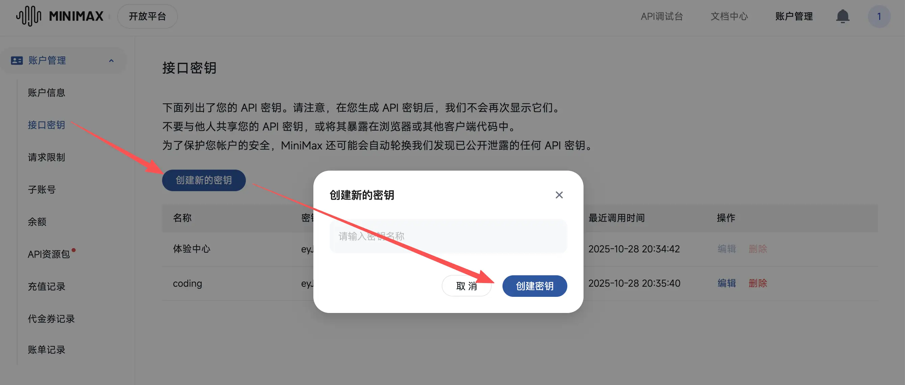
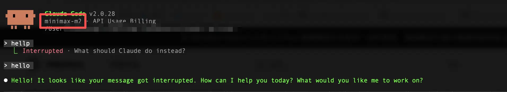
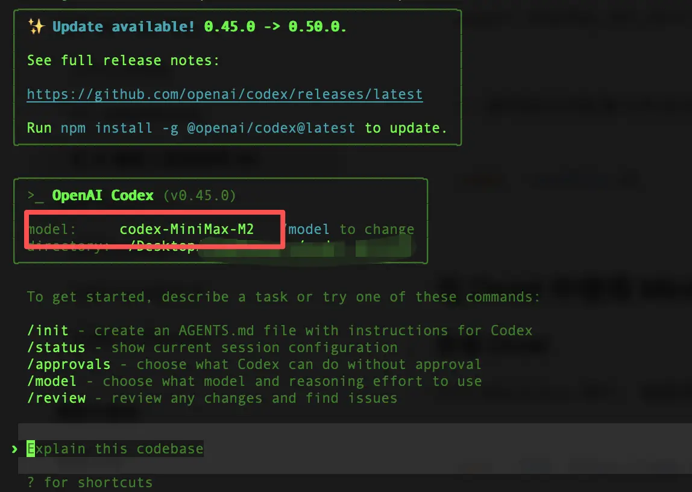

前天晚上 MiniMax 正式推出了 MiniMax-M2 模型，这个模型具备优秀的代码理解、多轮对话和推理能力，还兼容了 OpenAI 和 Anthropic 接口协议，非常适合做 Claude 和 GPT-5 的平替，官方也无缝对接了 Claude Code、Codex、Cursor 等 AI Coding 工具。

MiniMax官方还免费为大家提供该模型到 11 月 7 号，我们只需要按照下述内容进行注册申请和配置即可～

### 获取 API Key

首先，我们需要访问[ MiniMax 开放平台](https://platform.minimaxi.com/user-center/basic-information/interface-key)，如果是新用户，使用手机号注册一个账号即可。

> 不要科学上网！！！会自动给你跳转至国际站，而国际站的模型在 Claude Code 中使用时会报错！

然后在新打开的 tab 页面中点击“**创建新的密钥**”按钮，随便输入一个名称然后点击**创建密钥**即可生成一个 API Key。



需要注意的是，密钥只展示一次，所以一定要保存到本地！

> 话说回来，丢了再创建一个就好了。

接下来，我们就可以在 AI Coding 工具中进行使用了～

### 在 Claude Code 中使用

在终端，通过 `vim ~/.claude/settings.json` 来编辑 Claude Code 的配置文件：

```json
{
  "env": {
    "ANTHROPIC_BASE_URL": "https://api.minimaxi.com/anthropic",
    "ANTHROPIC_AUTH_TOKEN": "<MINIMAX_API_KEY>",
    "API_TIMEOUT_MS": "3000000",
    "CLAUDE_CODE_DISABLE_NONESSENTIAL_TRAFFIC": 1,
    "ANTHROPIC_MODEL": "MiniMax-M2",
    "ANTHROPIC_SMALL_FAST_MODEL": "MiniMax-M2",
    "ANTHROPIC_DEFAULT_SONNET_MODEL": "MiniMax-M2",
    "ANTHROPIC_DEFAULT_OPUS_MODEL": "MiniMax-M2",
    "ANTHROPIC_DEFAULT_HAIKU_MODEL": "MiniMax-M2"
  }
}
```

再次提醒，如果出现 `API Error: Cannot read properties of undefined (reading ‘map’)` 问题，需要检查一下是不是申请了 MiniMax 的国际站。如果是，需要切回到国内站（不要科学上网，重新访问 MiniMax 开放平台进行申请）或者更换国际站的链接。



### 在 Codex 中使用

也是需要修改对应配置。

1. 在终端通过 `vim .codex/config.toml`，将下边的配置贴进去：

```toml
[model_providers.minimax]
name = "MiniMax Chat Completions API"
base_url = "https://api.minimaxi.com/v1"
env_key = "MINIMAX_API_KEY"
wire_api = "chat"
requires_openai_auth = false
request_max_retries = 4
stream_max_retries = 10
stream_idle_timeout_ms = 300000

[profiles.m2]
model = "codex-MiniMax-M2"
model_provider = "minimax"
```

1. 然后设置环境变量：

```shellscript
export MINIMAX_API_KEY="<MINIMAX_API_KEY>"
```


1. 通过指定配置文件启动 Codex

```shellscript
codex --profile m2
```



补充一下，上述设置环境变量的方式只是临时的，如果需要永久设置，请按以下描述操作：

```shellscript
vim ~/.zshrc

# 在里面添加
export MINIMAX_API_KEY="<MINIMAX_API_KEY>"

# 保存退出后执行
source ~/.zshrc
```

重启你的终端并打开 Codex 就可以正常使用了。

