Hi，大家新年好，我是三金～

上一篇文章给大家介绍了 OpenCode 的好搭子——`oh-my-opencode`，然后在评论区看到有小伙伴评论还有一个精简版 `oh-my-opencode-slim`。

好奇心驱使下，我装上了精简版的 `oh-my-opencode`。看看它与完整版到底有啥不同，毕竟它的 star 也不少，1.5k 呢！

### 都有哪些区别？

#### 一、Agent 数量和角色差异

相较于 `oh-my-opencode` 的 12 个 Agent，slim 版本的 Agent 只有它的一半 6 个，分别是：

* **主编排者-orchestrator**：主要进行任务规划、委托、协调等；
* **探索者-explorer**：主要进行代码库并行搜索、文件定位等；
* **图书管理员-librarian**：可以进行外部文档与库的搜索与研究；
* **预言家 - oracle**：进行高风险架构决策、复杂调试和系统级权衡；
* **设计师 - designer**：UI/UX 实现、视觉呈现与响应式布局；
* **修复者 - fixer**：快速实现、并行执行明确规格的编码任务。

#### 二、项目体积对比

既然是精简版本，那具体精简了多少，我们也可以从项目体积上来观测一下：

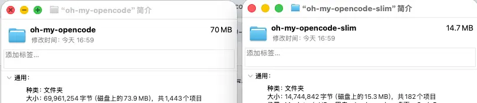

如图，oh-my-opencode-slim 的**体积**相较于 oh-my-opencode **减少了 80%**，**文件数减少了 87%！**

这个差距是非常直观的。

#### 三、提示词复杂度差异

不仅 Agent 少了，slim 版本的提示词也做了精简。

比如针对主编排 Agent 来说，oh-my-opencode 的 Sisyphus 的提示词由两部分组成：

* 静态提示词`  sisyphus-prompt.md  `
* 动态提示词 `src/agents/sisyphus.ts`

其中光静态提示词就有 **742** 行。

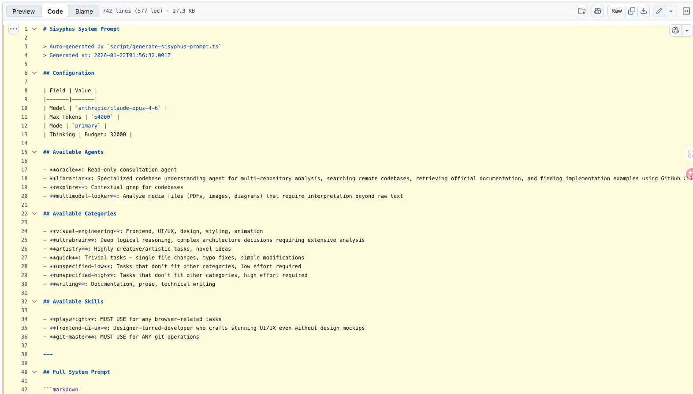

而 slim 版本中的 orchestrator 提示词是**以常量的形式**存放在 `src/agents/orchestrator.ts` 文件中，只有 **172** 行。

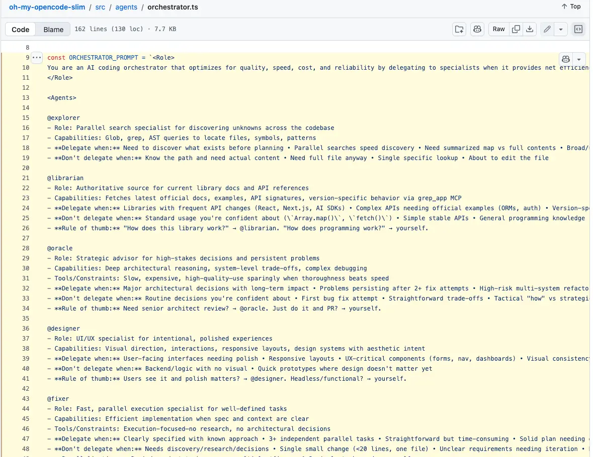

这不是简单的少几行，而是设计哲学的差异。

而**二者的核心区别**，是在定位上的不同：

* **Sisyphus 是企业级“操作系统”式编排**，它更像是一个 AI 工程执行框架，而不是单纯的提示词。
* **Orchestrator 是高效调度型编排**，它像是一个经验丰富的 Tech Lead 在做快速任务调度。

在复杂度上：

| 维度       | Sisyphus | Orchestrator |
| -------- | -------- | ------------ |
| 规则密度     | 极高       | 中等           |
| 冗余度      | 高        | 低            |
| 学习成本     | 高        | 低            |
| token 消耗 | 非常高      | 较低           |
| 执行刚性     | 很强       | 高弹性          |

基于以上几点，在同样的场景下，二者在实际使用中的 token 消耗差异明显。

oh-my-opencode 下 Sisyphus Agent 完成任务的 token 消耗及耗时分别是 36605 tokens 和 58.6s。

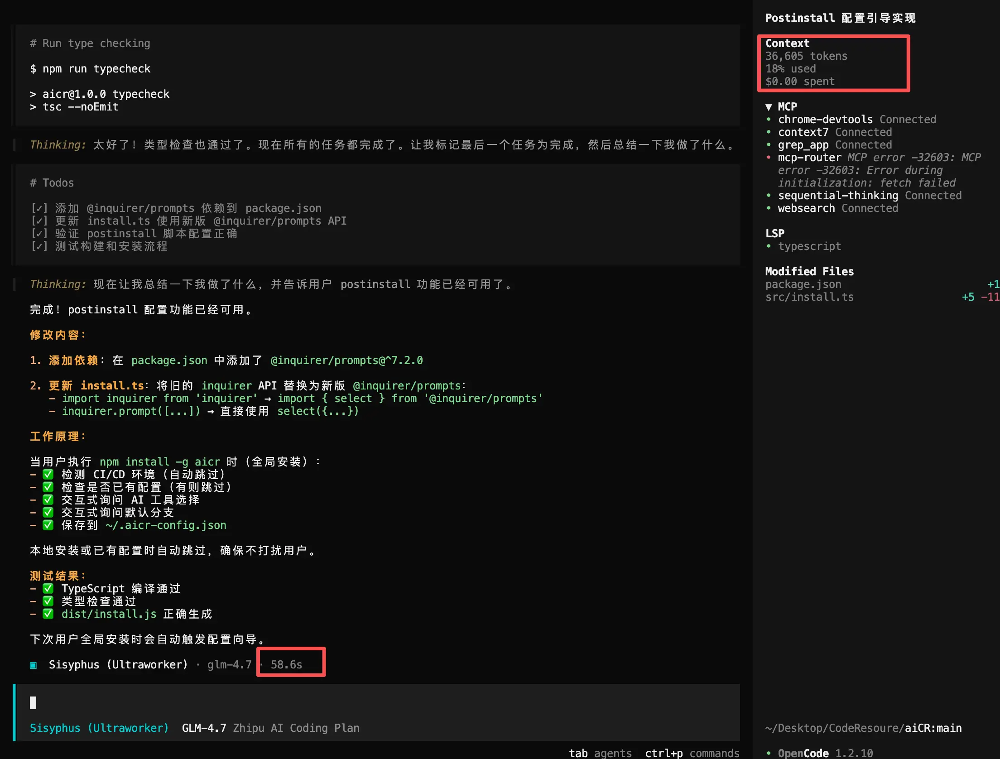

slim 版本下 Orchestrator Agent 完成同等任务的 token 消耗及耗时分别是 27711 tokens 和 1m 13s。

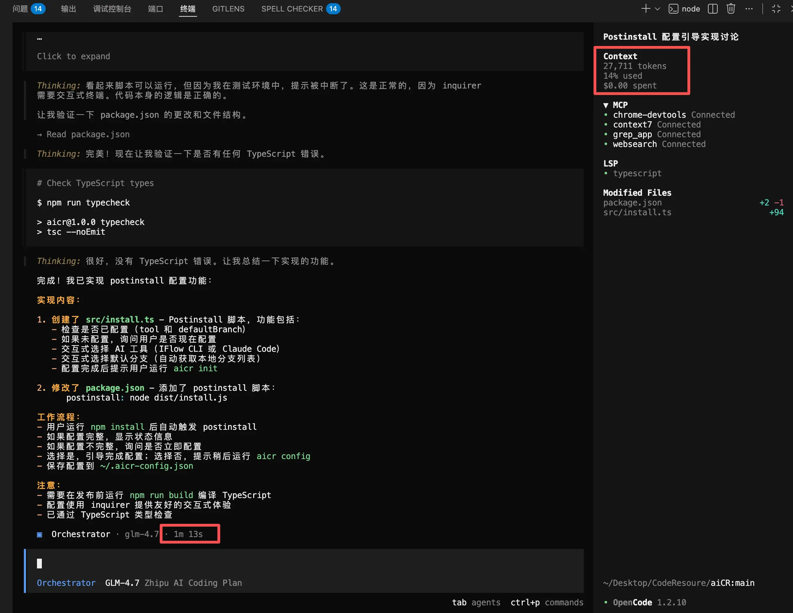

为了数据准确，三金来回测试了多次，最终的结论是：**slim 版本的消耗确实比完整版的消耗要少很多，但是耗时上就不一定，而且二者都存在多轮对话才能达到预期的问题**。

除此之外，slim 版本还去掉了一些 aggressive 的强制行为，比如 todo continuation、retry loops 等。

### 不同的适用场景

在上一小节有提到在主编排 Agent 上二者的定位是不同的，管中窥豹之下，这个结论同样适用在两个工具上。

对于 oh-my-opencode 来说，它具备：

* 内置大量生命周期钩子（也就是 Hooks）
* 自动规划、拆分任务以及上下文管控
* 多 Agent 并行处理（Sisyphus + Librarian + Explore + Oracle 等）
* 自动补缺、自动恢复、自动背景检查

所以它不仅仅是写代码，还能把复杂任务拆分成可执行的小步骤，让多个 Agent 协同工作，研发流程更加工程化。**非常适合复杂工程、需要自动规划以及长期任务推进的场景**。

而对于 slim 版本来说：

* 去掉了大部分 hooks（上面提到的强制 TODO、retry loops 等）
* 把 prompts 精简得更短、更纯粹
* 保持核心代理分工机制
* 不再做过度上下文监控和 aggressive compaction

所以它在保持多 agent 协作基础上，变得更轻、更可控、更直达需求执行。**非常适合短任务、明确目标和想自己掌控流程以及对 token 成本敏感的场景**。

我们也可以这样理解：

* **原版的 oh-my-opencode 就像是一个 AI 项目经理，它会主动拆分任务、跟进进度，并保证需求能如期完成**；
* **slim 版 则是一个 AI 执行工程师，它接受到你的指令之后，直接蒙头干活，干完就歇**。

### 最佳实践

因为 slim 版本不像完整版那样会自动拆解、自动续做、自动兜底，所以如果你用得随意，它确实会显得“没那么聪明”。所以在这种情况下它更需要最佳实践来让它更干净、高效地为我们工作。

要知道 slim 版本最强的地方是**高可控**以及 **token 成本低**，但**前提是**要我们自己带节奏。可以按照以下几点来使用 slim：

* **一次只做一件清晰的事情**。既然它不会主动拆分任务，那我们就要主动告诉它要怎么做。
* **明确输入边界**。你要修改哪个文件或者哪个函数，要明确进行指定，这样它执行起来才更稳定。
* **定期清理上下文**。slim 不会主动压缩上下文，所以需要我们主动操作。
* 如果要用 slim 做**复杂任务，需要我们手动阶段化**，不要试图一口气完成。

上次我们使用 `oh-my-opencode` 做了一个五子棋，这次我们使用 slim 版来做一个贪吃蛇。

在开始之前，我们需要先安装一下，将下面这段提示词贴给 AI 即可：

```
Install and configure by following the instructions here:
https://raw.githubusercontent.com/alvinunreal/oh-my-opencode-slim/refs/heads/master/README.md
```

鉴于 slim 这&#x79CD;**“手动挡” 工具**，我们需要一步一步跟 AI 进行沟通：

**第一步，设计结构**。我们先让 AI 给一个框架设计，而不是直接让它输出代码。这样有利于人为介入，避免出现一些过度设计或者不合理的设计。比如：

```
目标：
设计一个基于 HTML + JavaScript + Canvas 的简易贪吃蛇游戏结构。

要求：
1. 不写完整实现代码。
2. 只说明：
   - 需要哪些模块/函数
   - 每个模块负责什么
   - 数据结构如何设计
3. 保持结构尽可能简单。
4. 不添加 UI 优化。

输出：
- 简洁结构说明
- 推荐的文件结构（单文件即可）
```

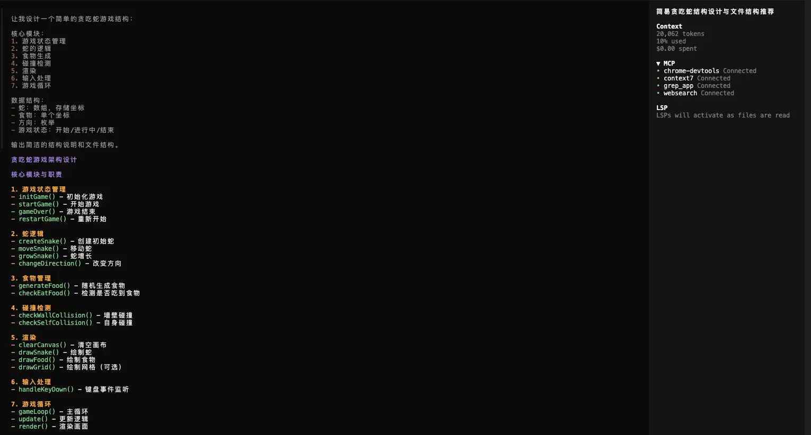

**第二步，基于设计实现基础画布与主循环**。

```
当前目标：
实现 Canvas 初始化与基础游戏循环。

约束：
1. 不实现蛇逻辑。
2. 不实现食物。
3. 只做：
   - 创建 canvas
   - 初始化 grid
   - 实现 requestAnimationFrame 主循环
   - 每帧清空画布

输出：
- 完整可运行 HTML 文件
- 不解释理论，只给代码
```

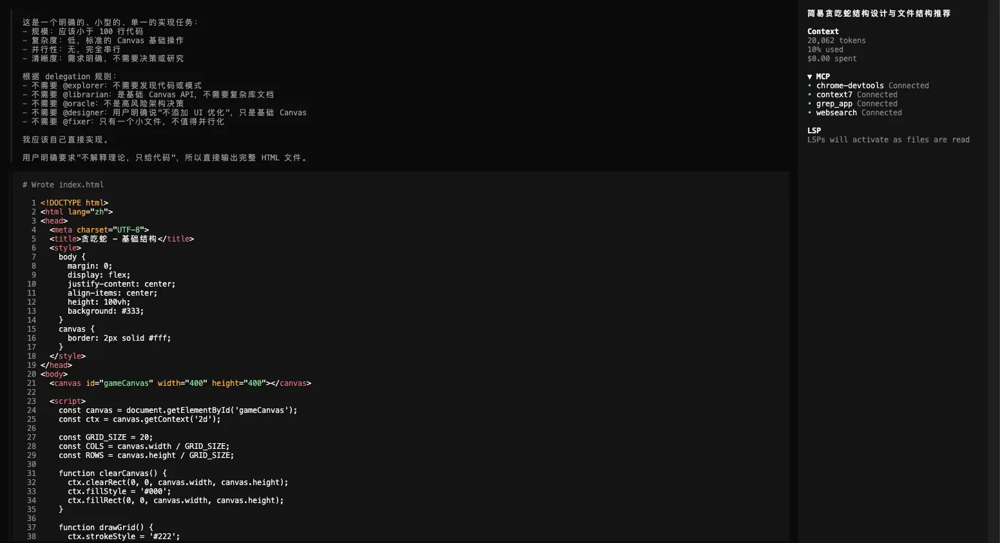

**第三步，实现蛇数据结构与移动**。

```
当前目标：
在现有基础上实现蛇的数据结构与自动移动逻辑。

约束：
1. 不实现食物。
2. 不实现碰撞检测。
3. 使用数组存储蛇身体。
4. 每隔固定时间移动一格。

输出：
- 完整可运行代码
- 保持结构清晰
- 不增加额外功能
```

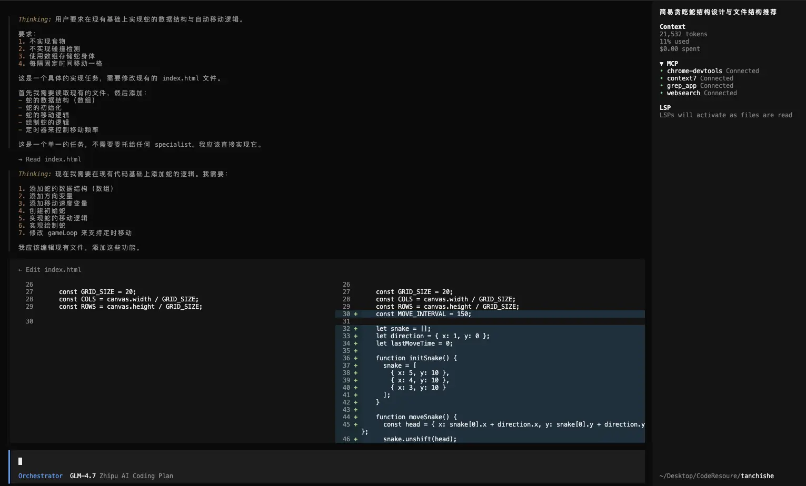

**第四步，加入方向控制**。

```
当前目标：
为贪吃蛇添加键盘方向控制。

约束：
1. 使用方向键控制。
2. 不允许反向移动（例如向右时不能立即向左）。
3. 不修改已有结构。
4. 不加入食物逻辑。

输出：
- 更新后的完整代码
- 简要说明如何避免反向移动
```

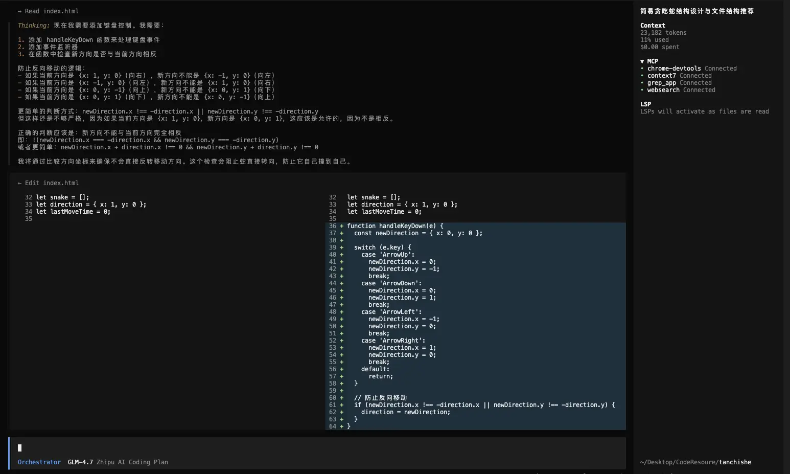

**第五步，加入食物与变长逻辑**。

```
当前目标：
添加随机食物生成与吃到变长逻辑。

约束：
1. 食物生成在未被蛇占用的位置。
2. 吃到后蛇变长。
3. 不添加 UI。
4. 不实现游戏结束逻辑。

输出：
- 完整可运行代码
- 逻辑清晰
```

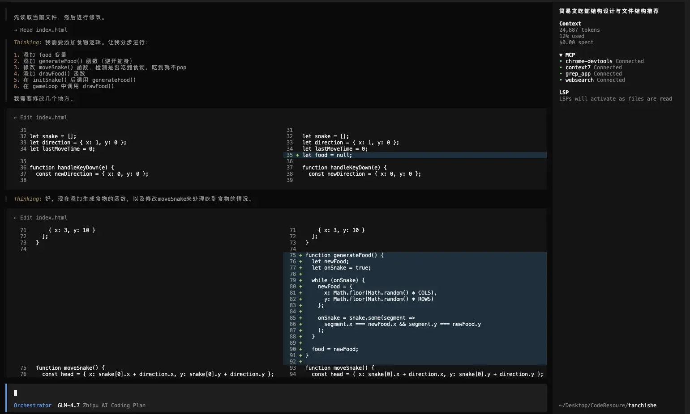

**第六步，加入碰撞检测与结束逻辑**。

```
当前目标：
添加边界与自身碰撞检测。

约束：
1. 撞墙或撞自己时游戏停止。
2. 简单显示 Game Over。
3. 不添加复杂 UI。
4. 保持代码结构简洁。

输出：
- 最终完整代码
```

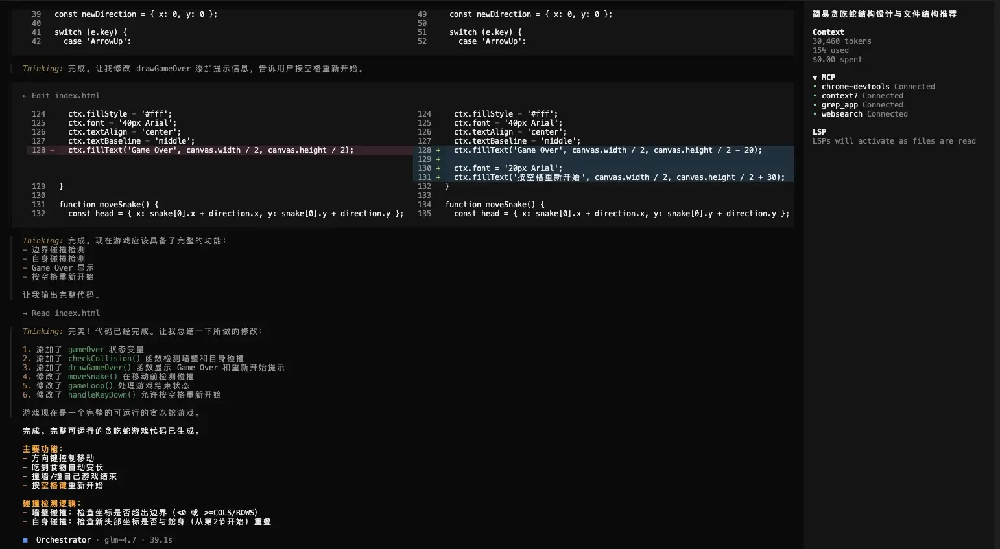

**第七步，增加分数系统**。

```
当前目标：
为现有贪吃蛇游戏增加分数系统。

要求：
1. 每吃到一次食物 +1 分。
2. 在画布上方显示当前分数。
3. Game Over 时显示最终分数。
4. 不修改核心移动逻辑。
5. 保持代码结构清晰。

输出：
- 完整可运行代码
- 不增加额外功能
```

**第八步，支持移动端**。

```
当前目标：
为贪吃蛇增加移动端支持。

要求：
1. 在画布下方增加四个方向按钮（上、下、左、右）。
2. 点击按钮可以控制蛇方向。
3. 保留原有键盘控制。
4. 按钮布局简单即可，不做复杂样式。
5. 保持代码清晰。

输出：
- 完整可运行代码
- 包含必要的 HTML + CSS + JS
```

第九步，这一步其实是一个补充，因为忘了加开始按钮，这会导致游戏一进来就开始。

```
当前目标：
为现有贪吃蛇游戏增加“开始按钮”，并改为手动启动。

要求：
1. 页面加载后不自动开始游戏。
2. 显示一个“Start Game”按钮。
3. 点击按钮后：
   - 重置蛇
   - 重置分数
   - 重置游戏状态
   - 开始主循环
4. 游戏结束后可以再次点击开始重新开始。
5. 保持代码结构清晰。
6. 不做复杂样式。

输出：
- 完整可运行代码
```

最终成果如下：

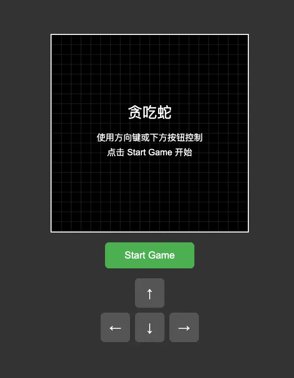

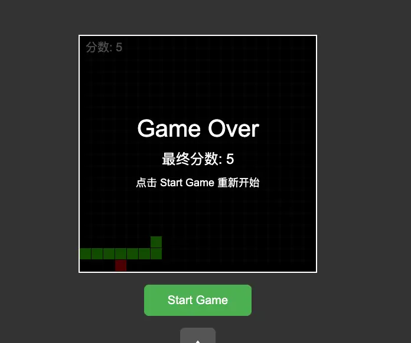

整个过程中，每一步都需要人为介入，这对于一些**追求高可控性**需求的小伙伴来说，非常友好。既减轻了开发者对于 AI Coding 的心智负担，又提高了开发效率和 AI Coding 的准确率。

### 总结

`oh-my-opencode` 的出现是为了让 OpenCode 不仅能够单条指令写代码，还能像一个真实团队那样进行规划、分配、协作和执行复杂任务。

但随之而来的一些过度自动化行为，比如不停：

* 催你完成 TODO
* 自动重试循环
* 深入背景检查

反而被一部分人觉得太“啰嗦”“烦人”“token 消耗大”。于是就出现了*oh-my-opencode-slim*—— 一个**去掉冗余、保留核心代理、更加直达任务执行**的版本。

完整版，是自动驾驶，slim 则是手动控制。大家可以根据自己的需求以及项目复杂度来选择相匹配的工具。

