上篇文章主要带大家入门 OpenCode，在文末也说到了 oh-my-opencode，那它到底是什么呢？

今天三金就带大家一起来揭开它的面纱～

> 请注意：`ohmyopencode.com` 不是官方提供的网站，而是一个冒充官方的恶意网站。
> 在 OpenCode 的 Github Issue 中已经有人上当下载了包含病毒的软件，请务必注意！
> issue 地址：https://github.com/anomalyco/opencode/issues/7736

### Oh My OpenCode 是什么？

`oh-my-opencode` 是针对 OpenCode 的开源插件和编排层。

> 编排层对非软件领域的小伙伴可能比较难以理解。
> 通俗来讲，就是把你的话转为具体行动步骤，然后指挥 AI 去执行这些任务，是一个自动化的指挥系统。

它的命名灵感来源于著名的开源项目 **oh-my-zsh**，目标是通过“开箱即用”的配置和增强功能，将 OpenCode 从一个代码助手转变为一个强大的**多智能体协作系统**。

其主要功能与特点：

* **主编排代理-Sisyphus**：引入了一个名为 **Sisyphus（西西弗斯）**&#x7684;核心编排代理。Sisyphus 像一个技术主管，能够将复杂的开发任务拆解，并指派给专门的子智能体。它通过意图分类、并行委托、TODO 管理和持续执行机制，确保任务从开始到和技术都可以被可靠完成。就像希腊神话中不断推巨石的西西弗斯一样。
* **主编排代理**-**Atlas**：名称源于希腊神话中支撑天空的泰坦神，象征着它的作用就是支撑整个工作流程的正常运行。经常与 Prometheu&#x73;**&#x20;**&#x8FDB;行协作，Prometheus 创建详细的工作计划，然后用户通过 `/start-work` 启动 Atlas 开始执行计划。
* **主编排代理**-**Hephaestus：**&#x540D;称源于希腊神话中的赫菲斯托斯，是一个自主深度工作者。它就是一个技术精湛的手艺人，可以进行深度探索、自主决策和完整执行任务，适合需要跨多个文件、跨多个领域的复杂任务。
* **子智能体**：
  * 分析层：
    * **Oracle**：负责架构设计和深度调试；
    * **Librarian**：负责检索文档和研究框架；
    * **Explorar**：负责扫描代码库文件和上下文。
  * 规划层：
    * **Prometheus**：战略规划师。Prometheus 是一个纯规划代理。我们可以理解它为其他 CLI 工具中的 Plan Mode。它不会一上来就给你写代码，而是通过访谈模式创建详细的工作计划。
    * **Metis**：计划顾问。也可以说是一个预规划分析专家，会在 Prometheus 生成计划前识别隐藏问题和潜在风险。比如做一些意图分类啊、识别一些 Prometheus 可能遗漏的隐藏意图啊之类的。
    * **Momus**：计划审查者。不能光做计划不做审查对吧，Momus 就是一个绝对理智的计划审查者，专门用于发现阻碍执行的关键问题，确保计划是可执行的。
  * 实现层：
    * **Frontend UI/UX Engineer**：顾名思义，它是一个前端视觉实现专家，专门用来负责 UI/UX 开发和视觉设计实现，在技术配置上，推荐使用 Gemini-3-Pro 模型。
    * **multimodal-looker**：媒体分析专家，专门用来分析 PDF、图像和图表等非文本文件，推荐使用 Gemini-3-Flash 模型。
  * 执行层：
    * **Sisyphus-Junior**：这是为了解决无限委托循环问题而设计的一个特殊代理。因为在多代理系统中，如果每个代理都能继续委托任务，是很有可能使其陷入无限递归的问题中的。而 Sisyphus-Junior 此时就会作为终端执行者，从而结束委托。
* 增强工具：集成了 LSP（语言服务器协议）和 AST（抽象语法树）工具，使 AI 能更深入地理解代码结构。
* 自动化工作流：支持在后台运行任务，拥有 Ultrawork 模式，适合处理大型重构或者迁移任务。即在提示词中包含  `ultrawork`  或  `ulw`  关键词，Sisyphus 会自动处理整个工作流。

### 如何安装？

在安装之前，你要确保已经下载过了 OpenCode，且版本要大于等于 1.0.150。

官方强烈建议让 LLM 帮我们安装，只要在你的 AI CLI 或者编辑器中输入以下提示词即可：

```
Install and configure oh-my-opencode by following the instructions here:
https://raw.githubusercontent.com/code-yeongyu/oh-my-opencode/refs/heads/master/docs/guide/installation.md
```

这个看你网络，如果无法访问 github 的话，也是白搭。

另外的安装方式就是使用 `bunx` 或者 `npx` 进行交互式安装：

1. 先安装 `oh-my-opencode`，比如使用 `npm install -g oh-my-opencode`；
2. 然后再使用如下方式进行交互式配置

```shellscript
bunx oh-my-opencode install

# 也可以使用 npx
npx oh-my-opencode install
```

当然，如果你想直接以参数的方式进行安装也 OK：

```shellscript
bunx oh-my-opencode install --no-tui --claude=<yes|no|max20> --gemini=<yes|no> --copilot=<yes|no>
```

> ⚠️注意：里面使用尖括号的部分是需要你根据自身情况进行选择的，比如有 claude 就选 yes，开了 max 就选 max20。

在交互式安装中，安装程序会询问你的订阅状态：

* Claude 订阅（no/yes/max20）
* OpenAI/ChatGPT Plus（可选）
* Gemini 集成（yes/no）
* GitHub Copilot（yes/no）

这里也是根据你自身情况进行选择即可，如下图：

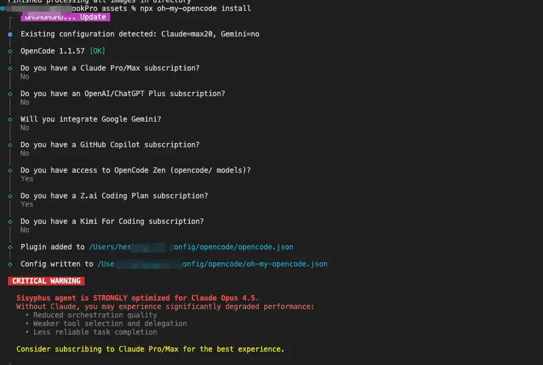

> 这些收费的你都没订阅的话，默认会给你使用它们提供的免费模型，比如 GLM-4.7

在安装时，程序会：

1. 注册插件到 `~/.config/opencode/opencode.json` 文件中，这是 opencode 的配置文件；
2. 根据订阅配置分配代理模型，这个会在 `oh-my-opencode.json` 中展示出模型的分配情况，你也可以手动修改；
3. 如果需要 Gemini，需要添加 `opencode-antigravity-auth` 插件。

如果你走的是这些模型的官方渠道，记得在安装之后进行配置认证：

```shellscript
opencode auth login
```

然后选择模型供应商：

* **Anthropic**：Claude Pro/Max OAuth；
* **Google Gemini**：需先安装 `opencode-antigravity-auth` 插件；
* **GitHub Copilot**：OAuth 认证；
* **Iflow**：没错，Iflow 也提供了很多的免费开源模型。

### 如何自动配置？

上一篇文章中有讲到，OpenCode 的亮点在于它强大的模型兼容能力，我们可以在 OpenCode 上面使用市面上大多数模型。比如用一些开源模型做一些日常任务，用一些商用模型做复杂任务。

但，这些还需要我们人工去进行切换。而有了 `oh-my-opencode` 之后就不一样了，这些事情它已经提前按照已有模型帮我配置好了，以 iflow 提供的免费开源模型为例。

* 执行 `opencode auth login`，选择 Iflow，并输入 API Key（可以在 https://iflow.cn - API 管理中获取）；

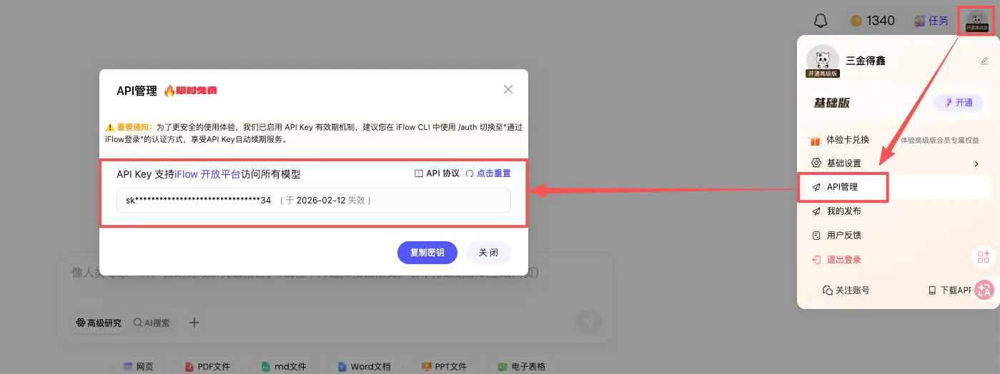

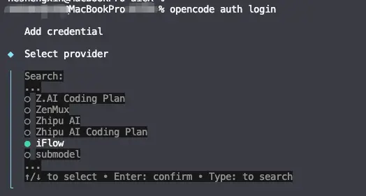

回车后在这里输入第一张图中复制的 key，再回车就完事儿了：

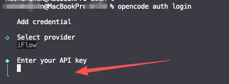

让我们再次启动 OpenCode，并输入 `/models` 查看是否成功配置了 iflow 的模型:

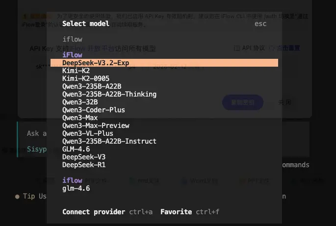

该说不说，IFlow 提供的免费模型还挺多～

接下来我们可以根据已有模型，自行修改 `oh-my-opencode.json` 配置文件，当然如果你嫌自己配置起来比较麻烦，也可以将这份工作交给 AI 来做：

> 请根据当前已配置的模型，给 oh-my-opencode 重新分配一下各个 Agent 的模型？预期是根据不同模型所擅长的能力与 Agent 能匹配。

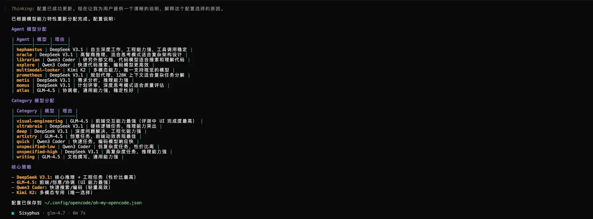

不过这个结果，并没有百分百符合预期，它全都改成了 iflow 的模型。还是得跟它讲清楚：

> 感觉不太对，你怎么都改成了 iflow 的模型？OpenCode Zen 中也有免费模型，IFlow 中也有免费模型，Zhipu AI Coding Plan 我也配置了模型。你需要在这些可用的模型中选择合适的模型进行配置，现在请重新开始。

再次修改之后，看起来是符合预期的了。

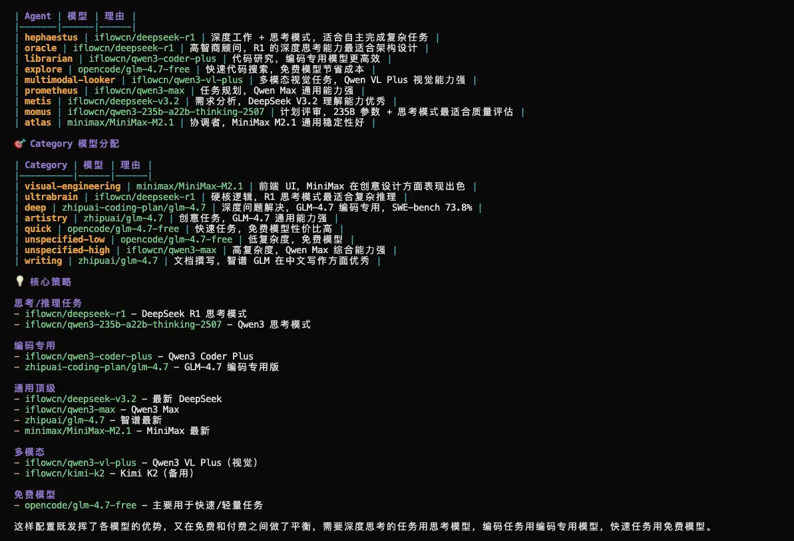

OK，到这里三金基本把这些前置准备都给大家讲清楚了。接下来给大家也推荐一下在三金看来 oh-my-opencode 的最佳使用方式。

### 最佳实践

在软件开发领域，我们一般都会遵守设计先行的原则。没有设计就蒙头进行开发，是非常莽撞且极具风险的行为。一般来说，开发阶段我们会经历「**设计** -> **开发** -> **代码审查**-> **测试」**&#x8FD9;四个步骤，那这四个步骤对应到 `oh-my-opencode` 中：

* **Prometheus-设计：**&#x7AD9;在产品或者架构师的角度，通过多轮对话的形式把你的模糊需求转为详细的设计文档。
* **Sisyphus - 开发，或者在 Prometheus 设计之后输入&#x20;****`/start-work`****&#x20;启动 Atlas：**&#x5728;指令中增加 `ultrawork` （或简写为 `ulw`），可以激活 Agent 的最大强度模式，它会自动启动并行代理、后台任务、深度探索等功能，直到任务完成。
* **Oracle - 审查：**&#x8FD9;一步需要手动通过 `@oracle` 唤起 Oracle Agent，让它 review 刚才的改动，看看产物是否符合预期以及是否带来了新的问题。
* **测试**：如果你的项目中已经有测试基础设施，那在设计阶段，Prometheus 会询问你是否开启 TDD，建议开启，可以大大提高你的项目功能稳定性。如果没有，你可以在指令中加入需要测试任务的要求。

这种 Plan -> TODO 的模式，是目前比较常用且高效的开发方式。接下来三金会通过一个 demo 来进行演示。

### 现场测试

好多大 V 都在写贪吃蛇游戏，那我们来做一个五子棋游戏。

* 首先我们创建一个新目录并在该目录中启动 OpenCode；
* Agent 切换到 Prometheus 上，输入：我想要做一个五子棋的游戏，你帮我出一个完整的设计；
* 如下图，Prometheus 会通过对话的方式跟我们确认细节。包括支持的平台、功能、技术展、UI、难度等等；

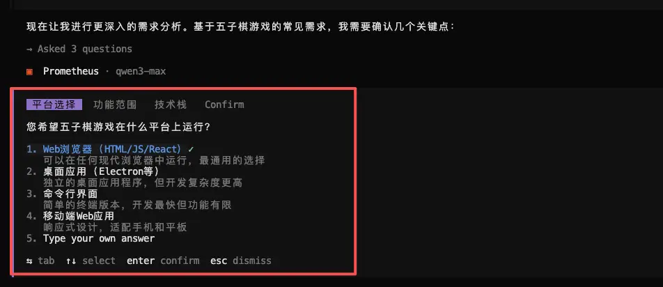

* 确认好需求之后，会调用 Metis 检查计划是否有遗漏的地方。这个耗时会比较长，但确实有用；

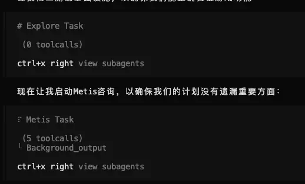

* 待 AI 产出设计文档之后，如果你不放心该设计，还可以进行高精度审查；

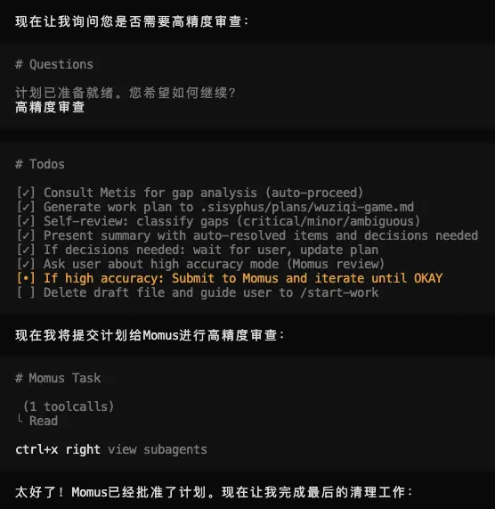

* 审查通过以后，我们就可以通过提示运行 `/start-work` 开始 AI Coding 了；

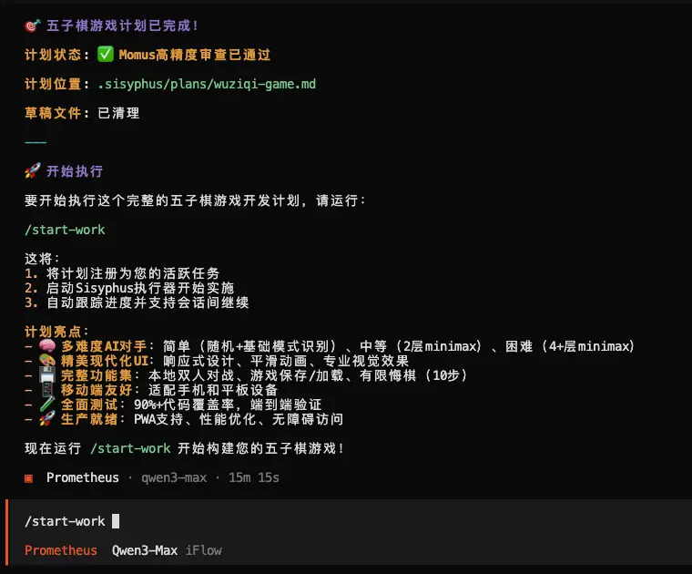

* 在开发过程中，AI 还会自动调用 Playwright MCP 来进行调试，非常地 nice～，就是这个过程会有些长（对于从0到1的项目而言）

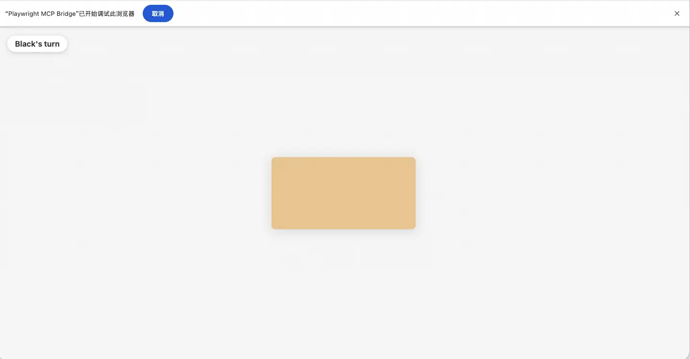

整个流程如下图所示：

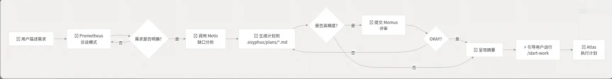

在经历了两轮对话后的产物如下：

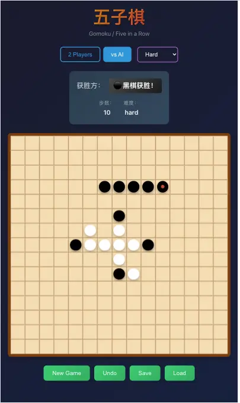

看 UI 和交互都很不错，唯一让人有点不满意的就是 AI 对战的算法还是有点弱（不过这也是因为最初设定原因）。

OK，就介绍到这里吧，如果对你有帮助，记得一键三连哦～
