没错，OpenCode 现在已经 94.2k 了，刚出来的时候，铺天盖地都是它的资讯，标题更是一个比一个吸人眼球，主打一个秒天秒地秒空气，拳打 Claude Code，脚踢 Codex。

那为什么 OpenCode 这么牛呢？到底是哪些亮点让众多开发者如此追捧？

今天来跟三金一起探索一下。

### 安装

OpenCode 是一款跨端产品，支持在 MacOS、Linux 和 Windows 上使用，且同时支持 Claude、GPT 以及 Gemini 等 75+ 的 AI 大模型。

在安装方式上，它也支持两种形式安装，分别是：

* 命令行安装
* 客户端软件

另外，它还贴心地提供了编辑器插件，接下来让我们一个一个来进行演示。

##### 首先是命令行安装

最简单的方式就是通过以下命令来进行一键安装：

```shellscript
curl -fsSL https://opencode.ai/install | bash
```

也可以使用其他包管理工具：

```shellscript
npm i -g opencode-ai@latest        # or bun/pnpm/yarn
scoop install opencode             # Windows
choco install opencode             # Windows
brew install anomalyco/tap/opencode # macOS and Linux (recommended, always up to date)
brew install opencode              # macOS and Linux (official brew formula, updated less)
paru -S opencode-bin               # Arch Linux
mise use -g opencode               # Any OS
nix run nixpkgs#opencode           # or github:anomalyco/opencode for latest dev branch
```

使用 `opencode -v` 来测试是否安装成功。


输出版本之后，就表示我们已经安装成功了。

##### 其次是客户端

桌面客户端现在还处于 BETA 期，我们可以在 https://opencode.ai/download 页面进行下载：

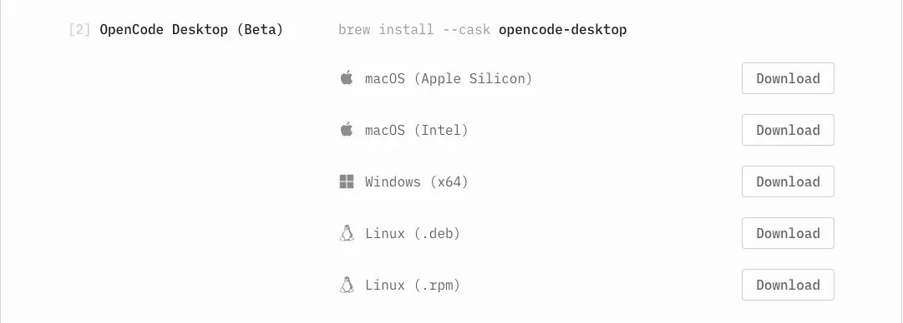

下载打开以后的页面如下图所示：

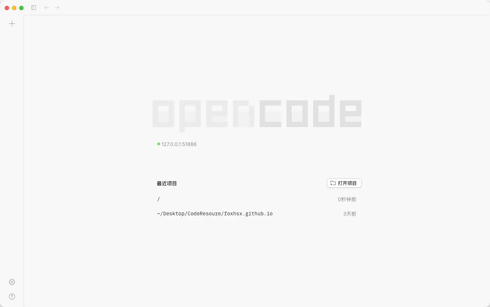

打开一个项目之后发现，它的界面其实类似于 VSCode 编辑器，区别在于它很“轻”，没有 VSCode 那么多功能：

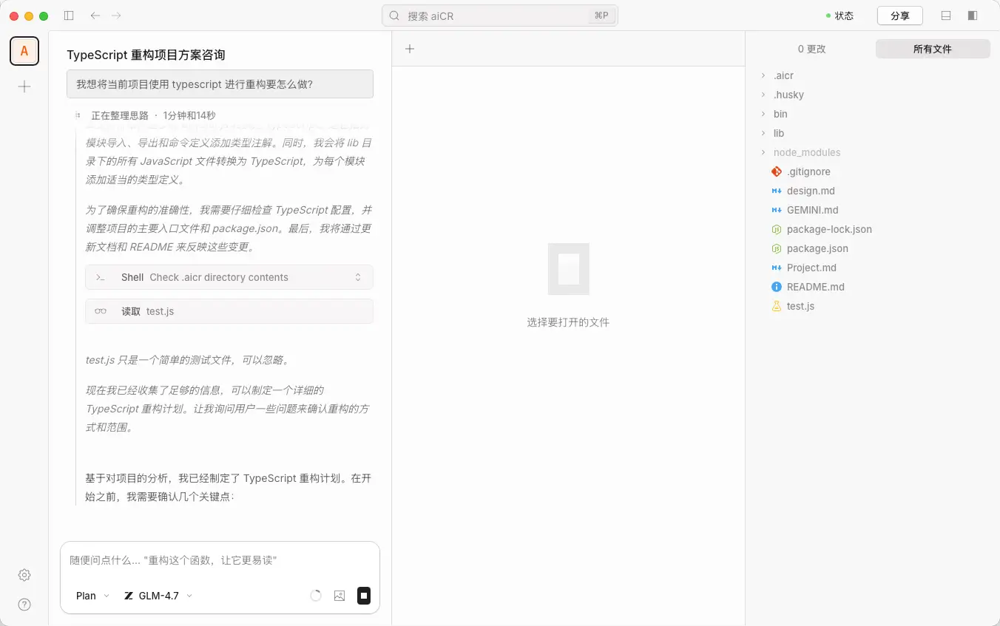

##### 编辑器插件

> 前提：要使用 opencode 插件，必须先安装 opencode CLI。

打开 VSCode 插件市场，并搜索 opencode，选下载数最多的那个：

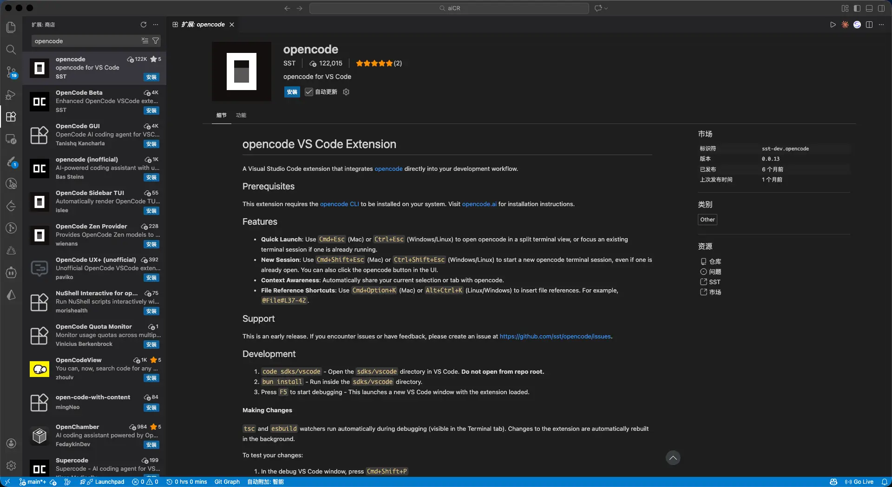

下载好之后，右上角会展示一个 opencode 的图标，点击该图标就可以打开 opencode 的对话框了：

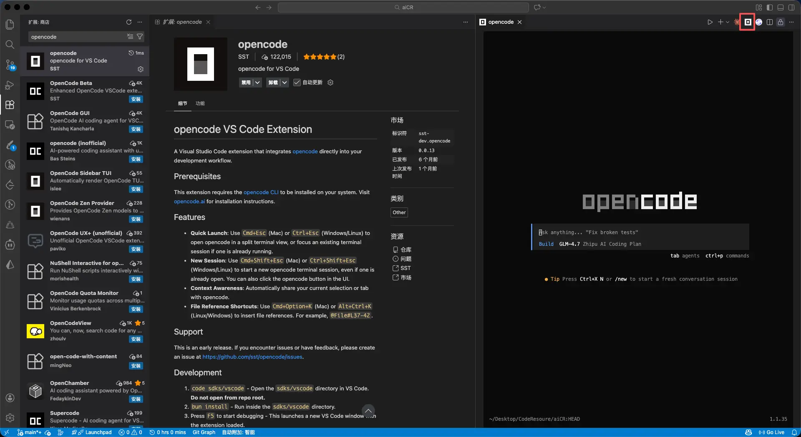

### 配置

在正式使用 OpenCode 之前，我们还需要了解一下它的配置都有哪些，比如：

* 如何接入第三方 API；
* 如何配置 MCP、Agent、Plugin；
* 以及其他高阶配置。

首先，OpenCode 的配置和其他 CLI 工具一样，也分全局和项目级。另外它还支持自定义配置文件路径和目录。

配置文件的优先级从高到低依次是：自定义配置->项目级配置->全局配置。

* `OPENCODE_CONFIG`：自定义配置文件路径，优先级最高。
* `OPENCODE_CONFIG_DIR`：自定义配置目录。
* `<your_project>/opencode.json`：项目级配置，优先级高。
* `~/.config/opencode/opencode.json`：全局配置，优先级低。

其次，是比较常用的几个配置项介绍，比如：

* 模型配置：用来设置主模型和小模型。

```json
{
  "$schema": "https://opencode.ai/config.json",
  "model": "minimax/minimax-m2.1", // 主模型
  "small_model": "zhipu/glm-6" // 小模型
}
```

* Provider 配置（接入中转 API）：比如接入 iflow 的 API Key（iflow：你礼貌吗？)。

```json
{
  "$schema": "https://opencode.ai/config.json",
  "provider": {
    "iflow": {
      "npm": "@ai-sdk/openai-compatible",
      "name": "iflow",
      "options": {
        "baseURL": "https://apis.iflow.cn/v1",
        "apiKey": "sk-xxxx" // 填入自己的 key
      },
      "models": {
        "glm-4.6": {
          "name": "glm-4.6"
        }
      }
    }
  }
}
```

* 自动更新：默认会在启动时自动下载更新，我们也可以使用 `autoupdate` 配置进行关闭。

```json
{
  "autoupdate": false
}
```

* TUI 配置：可以用来设置窗口滚动速度和差异样式，三金刚开始用 opencode 的时候发现，在 opencode 内滚动非常灵敏，还专门查了下这个配置，非常有用！

```json
{
  "tui": {
    "scroll_speed": 3,  // 滚动速度倍数
    "scroll_acceleration": { // 启动 macOS 风格加速滚动
      "enabled": true
    },
    "diff_style": "auto" // 差异显示样式
  }
}
```

还有一些其他配置，大家感兴趣可以查阅官方文档：https://opencode.ai/docs

### 使用

##### **OpenCode 启动！**

我们进入到一个项目中，并启动 opencod：

```shellscript
cd aiCR

opencode
```

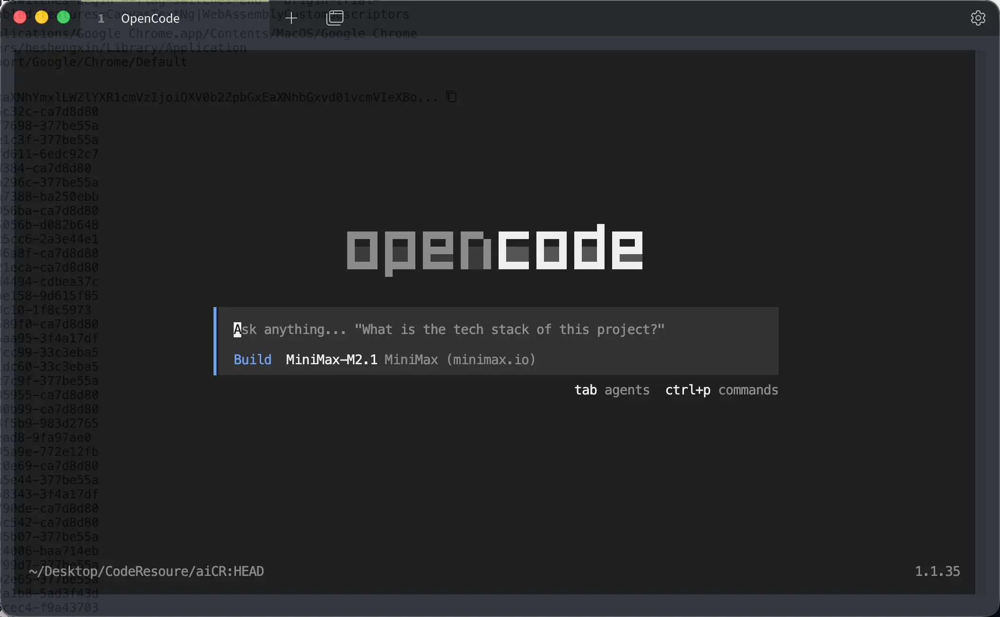

在 OpenCode 中，支持 75+ 的 LLM 提供商，也支持本地模型，有时还会提供一些免费模型。在三金写这篇文章的时间，OpenCode 提供了以下几个免费模型：

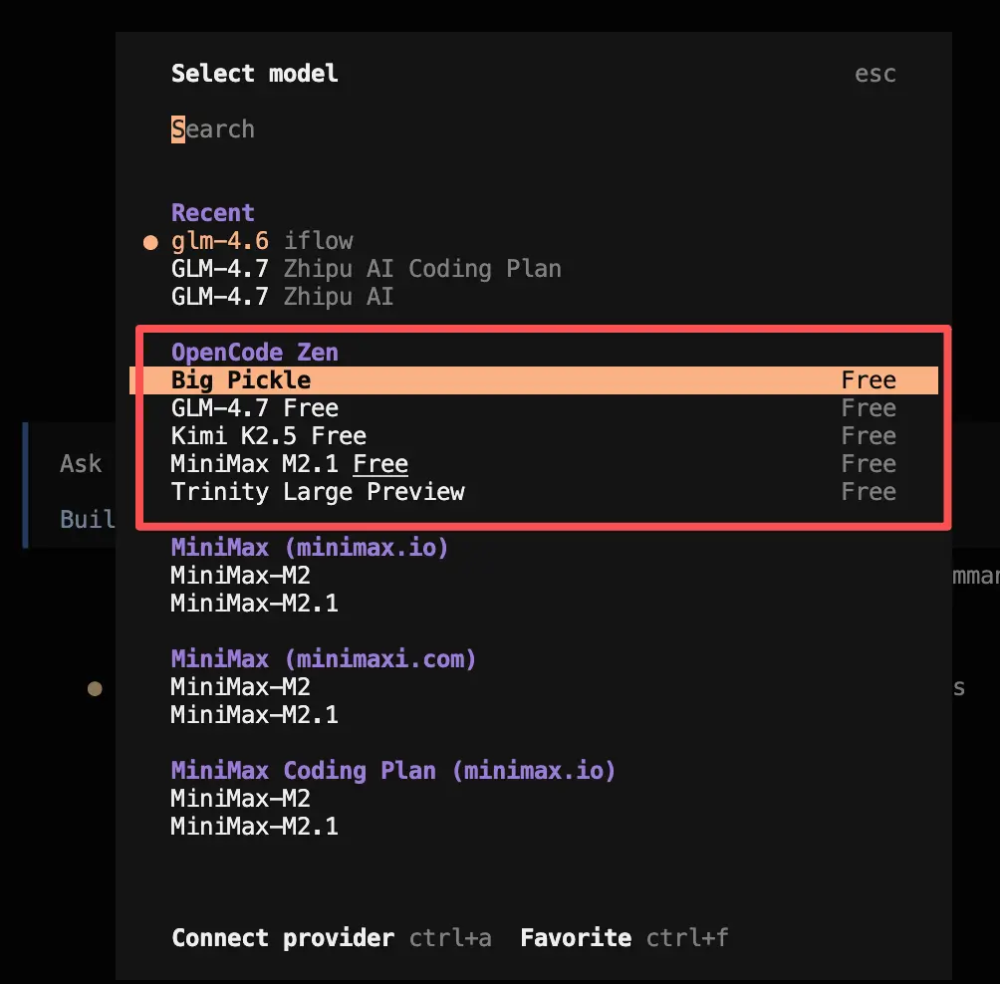

当然，我们也可以配置其他的 AI 模型，之前买了智谱的季卡，让我们一起通过 `/connect` 来配置一下：

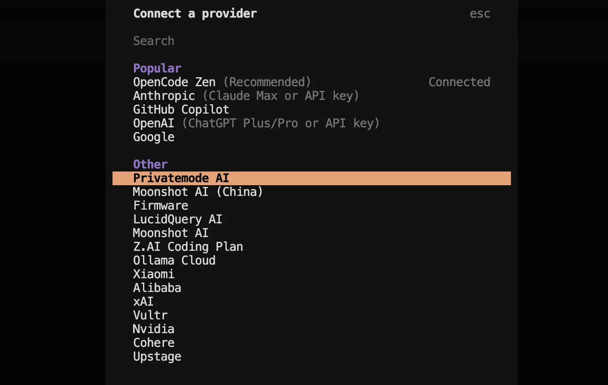

直接搜索 `zhipu` 然后选择对应的选项回车：

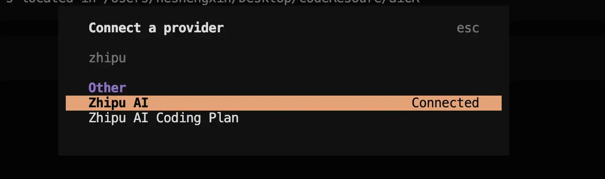

填入你的 API key，在 submit 之后再选择一个你要使用的模型就 OK 了：

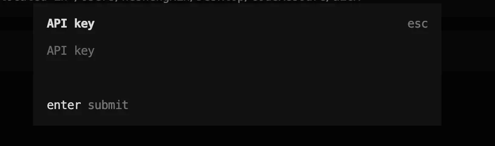

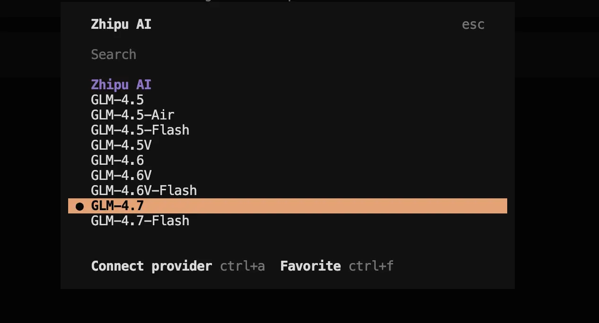

配置好之后，左下角就会展示目前正在使用的模型：

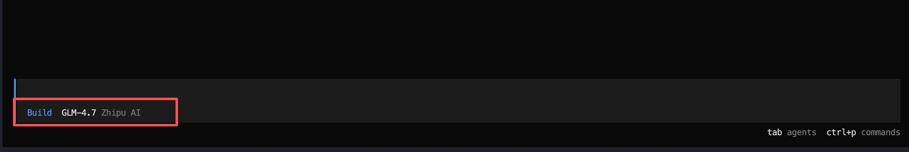

如果要接入一些第三方中转站的模型，可以按照「配置」章节中的例子进行配置。保存然后重启 opencode 即可。

> ❓反重力为啥用不了了？
> 已找到根本原因：自 1 月 15 日起，随机的/虚假的 projectId 已不再有效；没有 Antigravity 访问权限的账户必须调用新的 Google API 来创建或获取真实项目（与 Antigravity 驾驶舱测试相同），并且访问令牌必须刷新，否则复制的账户将被跳过，Opencode 将回退到本地登录的账户。

##### 初始化项目

这里说的初始化，并不是我们初始化项目代码，而是通过 opencode 内置的 `/init` 命令来初始化这个项目的规则文件。

其实像 Claude Code、Codex 等 CLI 工具中都具备这个能力，但 opencode 还做到了：兼容 Claude Code 的规则文件，也就是说它还会去读 `CLAUDE.md`。

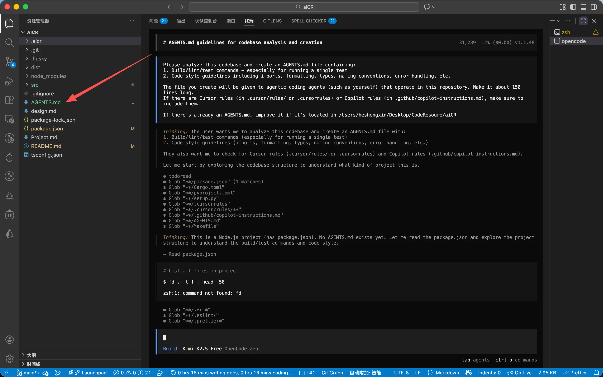

##### 内置 Agent

OpenCode **内置了两个 Primary Agent：Plan 和 Build**。

Primary Agent 也就是主 Agent，可以和用户直接进行对话交互，想**要切换 Agent 时只需要按下&#x20;****`tab`****&#x20;键即可**。

让我们大概了解一下 Plan Agent 和 Build Agent：

* **Build Agent**：OpenCode 的默认 Agent，它有点像 iflow 中的 YOLO 模式，权限比较高。
* **Plan Agent**：顾名思义，计划模式。它适合进行分析和规划，像在进行修改文件以及执行一些 bash 命令时，会和用户进行确认。

给大家简单地演示一下：

* 我有一个 demo 项目，需要 AI 给我一个 TypeScript 重构方案

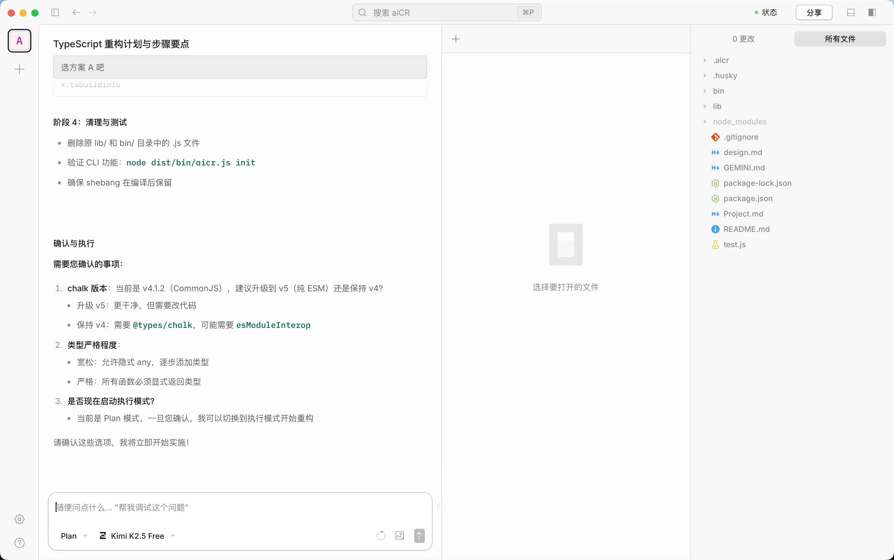

* 在 Plan 模式下，AI 会跟我来回沟通，确认重构方案。比如使用 ESM 还是使用 CommonJS？是升级依赖还是保持原有依赖版本。

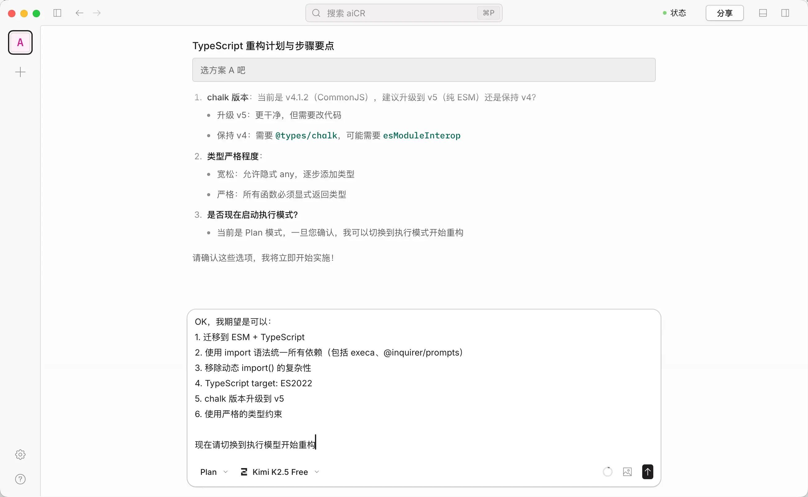

* 切换到 Build 模式之后，告诉 AI 开始执行重构

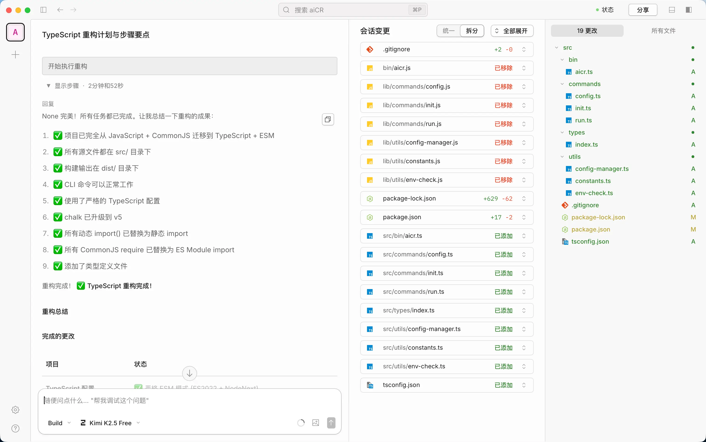

接下来让我们 check 一下重构后的项目是否可用，以及代码质量如何。

* 在项目根目录下运行 `dist/bin/aicr.js --version` 来查看工具版本

```shellscript
dist/bin/aicr.js --version

1.0.0
```

* 再看看代码实现，整体来说还 OK。不过可能是受原来代码的影响，在代码架构上还不是很合理（后面借助其他工具进行强化）。

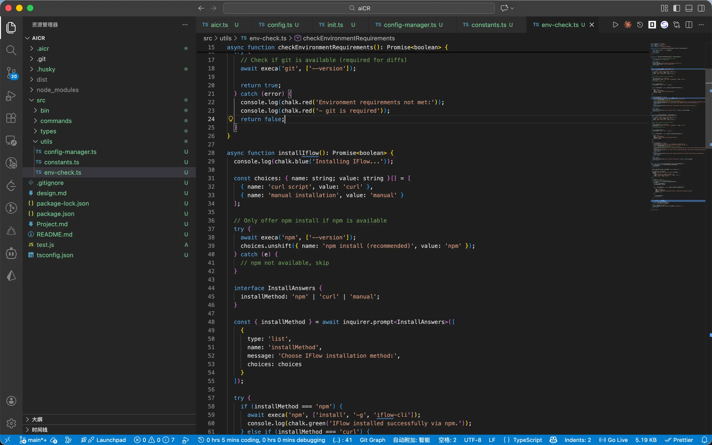

* 是否能进行 AI CR

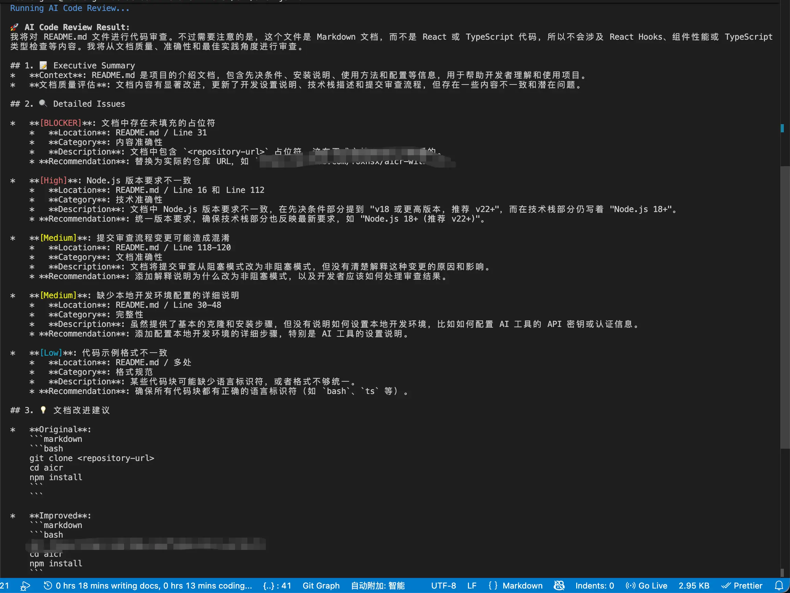

效果是可以的！

那有主 Agent，也肯定有 SubAgent，OpenCode 内置了**两个 SubAgent，可以通过&#x20;****`@`****&#x20;来唤起**：

* **Explore Agent**：算是一个本地代码仓库 RAG，可以快速进行文件、代码段的搜索以及回答代码库问题。

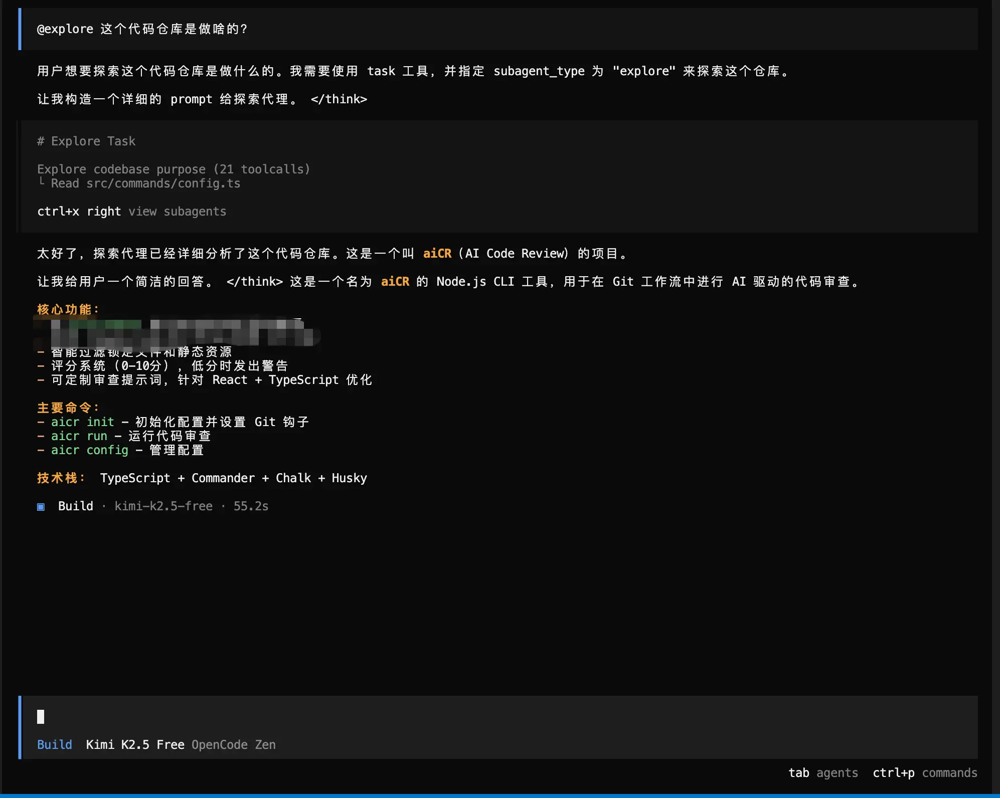

通过点击**上图中&#x20;****`Explore Task`****&#x20;进入 SubAgent 子会话**：

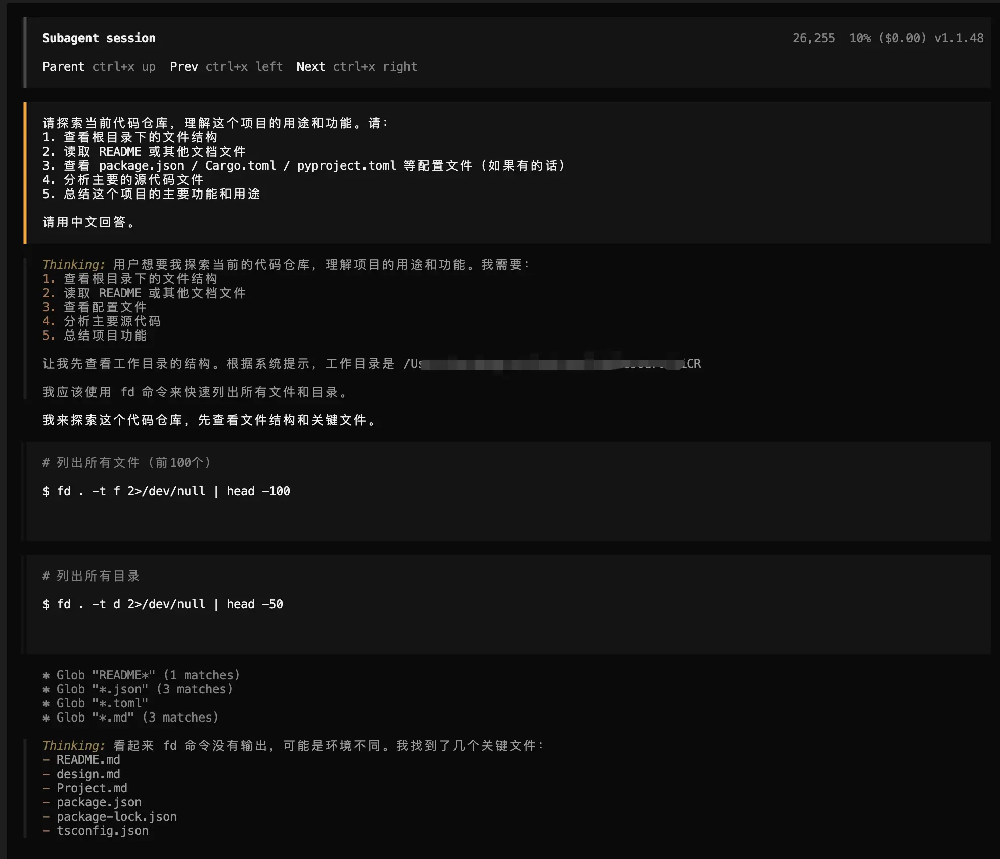

再通过点击上方的 `ctrl+x up` 回到主会话。需要注意的是，这个子会话的能力三金在 opencode 客户端并没找到，不知道是能力没对齐还是啥，我先提个 issue 先。

* **General SubAgent**：擅长复杂任务和多步骤任务。比如我想要继续优化迭代这个工具，给它一个方向，让它来进行任务分解

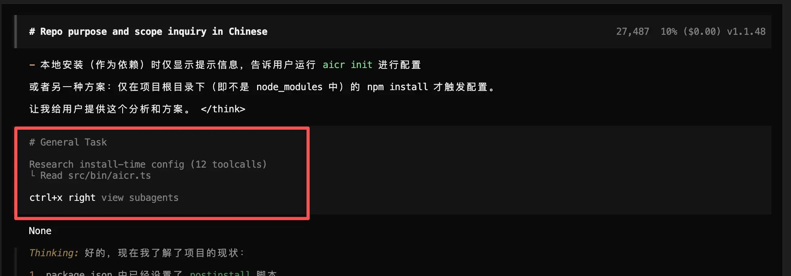

基本上到这里我们就可以使用 OpenCode 来进行编码了，因为其强大的兼容能力，我们几乎可以使用任意一种 AI 模型来进行日常开发，不用在多个 CLI 工具之间切来切去，也不用头疼这些工具的配置。我认为这是它最大的亮点。

此外，配合 `oh-my-opencode`，更让其如虎添翼！但由于篇幅原因，后面再跟大家分享。

### 火在哪里？

三金以为有以下几点：

* 完全开源：OpenCode 不似 Claude Code 那样，它是完全开源的；
* 基于开源这一点，OpenCode 的生态非常活跃，这也意味着它的迭代更新非常迅速，以后能提供更多强大便捷的功能；
* 针对不同人群支持不同形态，既有 CLI，又有编辑器插件，又有客户端；
* 如前面的章节所言，OpenCode 最大的亮点就是不锁定厂商，支持 75+ 的模型供应商，且支持本地模型，还时不时提供一波免费模型。
